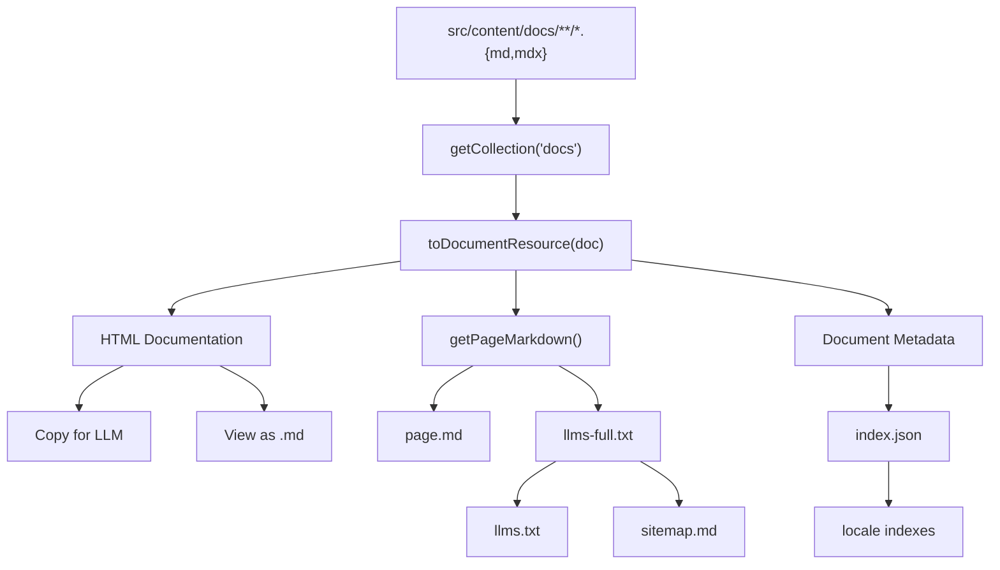
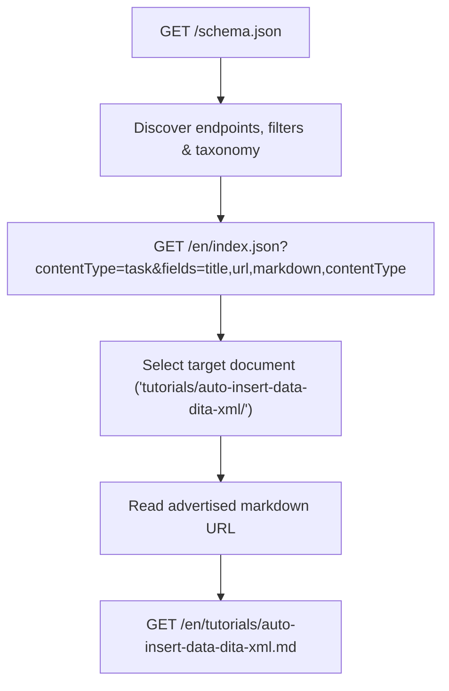

# Static Documentation API for LLMs and AI Agents

`docs.redaction-technique.org` provides a zero-runtime, edge-cached static API that exposes the entire technical writing documentation corpus for automated discovery, LLM ingestion, and pair-programming agents.

---

## 1. Architectural Overview

The core design principle is:
> **A single source of truth for documentation content and all its LLM representations.**



All endpoints are statically pre-rendered during `astro build` into `dist/client/`. They require zero server-side databases or lambda functions and are served directly from the Vercel CDN edge.

---

## 2. Endpoint Inventory & URL Conventions

### A. Root & Global Discovery Endpoints

| Route | Content-Type | Purpose |
| ----- | ------------ | ------- |
| `/llms.txt` | `text/plain; charset=utf-8` | Concise LLM table of contents conforming to the [llms.txt](https://llmstxt.org/) standard |
| `/llms-full.txt` | `text/plain; charset=utf-8` | Consolidated bilingual documentation corpus (EN + FR) |
| `/llms-full-en.txt` | `text/plain; charset=utf-8` | Consolidated English documentation corpus |
| `/llms-full-fr.txt` | `text/plain; charset=utf-8` | Consolidated French documentation corpus |
| `/index.json` | `application/json; charset=utf-8` | Global machine-readable document index and endpoint registry |
| `/schema.json` | `application/json; charset=utf-8` | Standalone machine-readable schema and self-describing taxonomy |
| `/sitemap.md` | `text/markdown; charset=utf-8` | Global human- and agent-readable Markdown sitemap |

### B. English Locale Endpoints (`/en/`)

| Route | Content-Type | Purpose |
| ----- | ------------ | ------- |
| `/en/index.json` | `application/json; charset=utf-8` | English machine-readable document index (74 docs) |
| `/en/sitemap.md` | `text/markdown; charset=utf-8` | Hierarchical English Markdown sitemap grouped by section |
| `/en/llms-full.txt` | `text/plain; charset=utf-8` | Complete English documentation corpus (alias to `/llms-full-en.txt`) |
| `/en.md` | `text/markdown; charset=utf-8` | Clean Markdown representation of the English homepage |
| `/en/<slug>.md` | `text/markdown; charset=utf-8` | Clean Markdown representation of each English documentation page |

### C. French Locale Endpoints (`/fr/`)

| Route | Content-Type | Purpose |
| ----- | ------------ | ------- |
| `/fr/index.json` | `application/json; charset=utf-8` | French machine-readable document index (74 docs) |
| `/fr/sitemap.md` | `text/markdown; charset=utf-8` | Hierarchical French Markdown sitemap grouped by section |
| `/fr/llms-full.txt` | `text/plain; charset=utf-8` | Complete French documentation corpus (alias to `/llms-full-fr.txt`) |
| `/fr.md` | `text/markdown; charset=utf-8` | Clean Markdown representation of the French homepage |
| `/fr/<slug>.md` | `text/markdown; charset=utf-8` | Clean Markdown representation of each French documentation page |

---

## 3. Machine-Readable JSON Format & Query Filtering

Each document resource is structured according to the canonical `DocumentResource` schema:

```json
{
  "title": "About this blog",
  "description": "A technical writing blog specializing in DITA XML, docs-as-code...",
  "url": "https://docs.redaction-technique.org/en/about-this-blog/",
  "markdown": "https://docs.redaction-technique.org/en/about-this-blog.md",
  "locale": "en",
  "pageType": "utility",
  "contentType": null,
  "wordCount": 780,
  "headings": [
    { "level": 2, "text": "Free your information from its silos", "slug": "free-your-information-from-its-silos" },
    { "level": 2, "text": "This blog's sources are managed under Git", "slug": "this-blogs-sources-are-managed-under-git" }
  ],
  "keywords": ["dita-xml", "docs-as-code"],
  "tags": ["dita-xml", "docs-as-code"]
}
```

The locale indexes (`/en/index.json` and `/fr/index.json`) expose:
```json
{
  "version": "1.0",
  "site": "https://docs.redaction-technique.org",
  "locale": "en",
  "count": 74,
  "filters": {
    "contentType": ["concept", "task", "reference"],
    "pageType": ["topic", "index", "landing", "overview", "utility"]
  },
  "taxonomy": {
    "contentType": {
      "description": "Primary information type and reader intent of substantive documentation.",
      "values": ["concept", "task", "reference"],
      "items": {
        "concept": { "label": "Concept", "description": "..." },
        "task": { "label": "Task", "description": "..." },
        "reference": { "label": "Reference", "description": "..." }
      }
    },
    "pageType": {
      "description": "Structural role of the page within the documentation site.",
      "values": ["topic", "index", "landing", "overview", "utility"],
      "items": {
        "topic": { "label": "Topic", "description": "..." },
        "index": { "label": "Index", "description": "..." },
        "landing": { "label": "Landing page", "description": "..." },
        "overview": { "label": "Overview", "description": "..." },
        "utility": { "label": "Utility", "description": "..." }
      }
    }
  },
  "documents": [ ... ]
}
```

### Supported Query Filters & Parameters
- `?contentType=concept | task | reference` — Filter by canonical information type
- `?pageType=topic | index | landing | overview | utility` — Filter by structural page role
- `?lang=en | fr` — Filter by language (global index)
- `?fields=title,url,markdown,contentType,...` — Select specific document properties to minimize payload and token usage
- `?page=1&limit=20` — Deterministic, bounded pagination (preserves stable section sort order)
- Combined: `?lang=en&contentType=task&page=1&limit=5&fields=title,url,markdown,contentType`

Invalid parameter values or out-of-bounds pages return `HTTP 400` with clear allowed parameter lists or bounds descriptions.

### Dedicated Schema & Capability Discovery (`/schema.json`)
A standalone static endpoint (`/schema.json`) returns the complete API contract without the document catalog:
- Canonical classification taxonomy (`taxonomy.contentType` and `taxonomy.pageType`)
- Global endpoint registry (`endpoints`)
- Stable retrieval model (`retrieval.identifier` and `retrieval.representations`)
- Complete query parameter definitions and allowed values (`queryParameters`)
- Machine-readable document property schema (`document.properties`)

---

## 4. Quick Start: Discover → Filter → Select → Retrieve

The canonical retrieval pipeline follows four distinct steps:



### Ready-to-Use `curl` Examples

```bash
# 1. Discover API capabilities & taxonomy
curl https://docs.redaction-technique.org/schema.json

# 2. Query task topics
curl 'https://docs.redaction-technique.org/en/index.json?contentType=task'

# 3. Project fields to optimize token usage
curl 'https://docs.redaction-technique.org/en/index.json?contentType=task&fields=title,url,markdown,contentType'

# 4. Fetch the advertised Markdown mirror
curl https://docs.redaction-technique.org/en/tutorials/auto-insert-data-dita-xml.md

# 5. Paginate through results
curl 'https://docs.redaction-technique.org/en/index.json?contentType=task&page=1&limit=10'
```

### Minimal JavaScript Consumer Example

```javascript
// 1. Discover capabilities from public contract
const schema = await fetch('https://docs.redaction-technique.org/schema.json')
  .then((res) => res.json());

// 2. Discover English index endpoint
const enIndexUrl = schema.endpoints.en.index;

// 3. Query task documents with projected fields
const params = new URLSearchParams({
  contentType: 'task',
  fields: 'title,url,markdown,contentType',
});
const index = await fetch(`${enIndexUrl}?${params}`)
  .then((res) => res.json());

// 4. Select target document
const doc = index.documents.find((d) =>
  d.url.includes('auto-insert-data-dita-xml')
);

// 5. Fetch clean Markdown representation
const markdown = await fetch(doc.markdown)
  .then((res) => res.text());

console.log(`Fetched "${doc.title}" (${markdown.length} bytes)`);
```

### Interactive Documentation Explorer

An interactive, in-browser Documentation Explorer is embedded directly within the Documentation API page ([`/en/about-the-api/`](https://docs.redaction-technique.org/en/about-the-api/) and [`/fr/about-the-api/`](https://docs.redaction-technique.org/fr/about-the-api/)):
- **Real-time search**: Instant client-side search across titles, descriptions, headings, and tags without server-side dependencies.
- **Canonical taxonomy filtering**: Filter by information type (`concept`, `task`, `reference`), structural page role (`topic`, `index`, `landing`, `overview`, `utility`), and language locale (`en`, `fr`).
- **Dual-retrieval model**: Every card provides direct links to the rendered HTML documentation and the pre-rendered Markdown mirror.
- **One-click clipboard actions**: Copy Markdown URLs or generate equivalent public API query URLs (`Copy API query`) on demand.
- **Shareable state**: Filter and search queries are synchronized via URL parameters (`?q=...&contentType=...&pageType=...&lang=...`).

---

## 5. API Stability Principles and Contract Guarantees

The documentation API is treated as stable documentation infrastructure:

1. **Canonical `url` is the stable identifier**: The canonical `url` serves as the unique, deterministic, build-stable identifier for every document.
2. **Direct Markdown representation**: The advertised `markdown` property always provides the direct, unmodified Markdown mirror, guaranteed byte-for-byte identical to `llms-full.txt`.
3. **Backward compatibility**: Existing unparameterized responses (`/index.json`, `/en/index.json`, `/fr/index.json`) remain stable.
4. **Canonical taxonomy**: Classification taxonomy (`contentType` and `pageType`) is validated strictly against canonical definitions.
5. **Contract testing & synchronized schema**: All endpoint routes, parameters, and taxonomy definitions are kept synchronized with `/schema.json` and verified by independent black-box contract tests (`tests/api-contract.test.mjs`).

---

## 6. Role of `llms.txt`

The `/llms.txt` file acts as the primary navigational entry point for AI models and search systems.
- Conforms strictly to the [llms.txt](https://llmstxt.org/) specification.
- Exposes quick links to the machine-readable indexes, Markdown sitemaps, and full corpus files.
- Provides a curated, section-organized table of contents with brief one-line descriptions and canonical URLs.
- Contains zero heavy body text, ensuring fast token-efficient ingestion.

---

## 7. Role of `llms-full.txt` & Language Variants

When an agent needs to read or embed the entire corpus without making dozens of individual HTTP requests:
- `/llms-full.txt`: Consolidated file containing all 148 documentation pages (74 English + 74 French).
- `/en/llms-full.txt` / `/llms-full-en.txt`: English-only corpus (74 pages).
- `/fr/llms-full.txt` / `/llms-full-fr.txt`: French-only corpus (74 pages).

### Document Boundary Format & Pipeline Identity
Every document in `llms-full.txt` is enclosed in a standard separator:

```markdown
---

## Document: <Title>

Source: <HTML Canonical URL>
Markdown: <Markdown URL>

<Clean Markdown generated by getPageMarkdown()>
```

**Guaranteed Identity:** The content under `Markdown: <URL>\n\n` is byte-for-byte identical to the output of `getPageMarkdown(doc)` served at the individual `.md` endpoint. Automated test `tests/api-layer.test.mjs` verifies this invariant across 100% of documents on every build.

---

## 8. Relationship Between HTML, `.md`, and Client Actions

On every documentation page:
1. **HTML `<head>` Discovery:**
   ```html
   <link rel="alternate" type="text/markdown" title="Markdown representation for LLM" href="https://docs.redaction-technique.org/en/about-this-blog.md">
   <link rel="alternate" type="application/json" title="Machine-readable document index (JSON)" href="https://docs.redaction-technique.org/en/index.json">
   <link rel="alternate" type="text/plain" title="LLM documentation table of contents (llms.txt)" href="https://docs.redaction-technique.org/llms.txt">
   ```
2. **"Copy for LLM" Button:**
   - Pre-fetches the page's `.md` file on hover/focus (`{ once: true }`).
   - Writes the exact Markdown into `navigator.clipboard`.
   - Accessible live-region announcement and debounced feedback state.
3. **"View as Markdown" Link:**
   - Standard HTML `<a>` link pointing to `/<slug>.md`.
   - 100% operational with JavaScript disabled.

---

## 9. How to Add a New Documentation Page

No manual updates to endpoints, sitemaps, or JSON indexes are ever required:
1. Create a new `.md` or `.mdx` file inside `src/content/docs/en/` or `src/content/docs/fr/`.
2. Add title, description, and optional tags in the frontmatter:
   ```yaml
   ---
   title: "New Article Title"
   description: "Brief summary of article."
   tags: [dita-xml, automation]
   ---
   ```
3. Run `npm run build`:
   - Astro's Content Layer automatically indexes the new entry.
   - The `.md` endpoint is generated at `/en/<slug>.md`.
   - The article is categorized into its section in `/en/index.json`, `/en/sitemap.md`, `/llms.txt`, and `/llms-full.txt`.
   - HTML discovery tags and "Copy for LLM" actions are bound automatically.

---

## 10. HTTP Headers and Vercel Deployment

Configured via `vercel.json` and static Astro `APIRoute` headers:

```http
# .md files
Content-Type: text/markdown; charset=utf-8
X-Robots-Tag: noindex
Access-Control-Allow-Origin: *

# .json files
Content-Type: application/json; charset=utf-8
X-Robots-Tag: noindex
Access-Control-Allow-Origin: *

# llms *.txt files
Content-Type: text/plain; charset=utf-8
X-Robots-Tag: noindex
Access-Control-Allow-Origin: *
```
