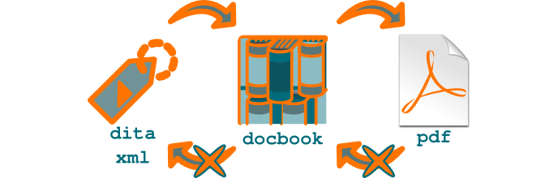

.. _docbook-ou-dita-xml:

DocBook ou DITA XML ?
=====================

Certaines entreprises ont parfois un contenu existant au format `DocBook
<http://www.oasis-open.org/docbook/>`_. Géré souvent par les acteurs les plus
techniques de la société, il coexiste la plupart du temps avec d'autres contenus
au format FrameMaker ou traitement de texte. S'il est décidé de fédérer tout le
contenu d'entreprise sous un seul format, il semble naturel de capitaliser les
efforts fournis sur la chaîne de création et de publication **DocBook** et de
sélectionner ce format. C'est pourtant se priver des gains de productivité
spectaculaires offerts par `DITA XML
<http://en.wikipedia.org/wiki/Darwin_Information_Typing_Architecture>`_.

Il est facile de générer du **DocBook** à partir de DITA XML. DITA Open Toolkit
propose par défaut ce format cible, au même titre que le PDF ou le
HTML. L'opération inverse ne peut pas être totalement automatisée. Pourquoi ?

.. figure:: media/entropie.png

   Il n'est pas possible de migrer automatiquement des données de formats
   pauvres vers des format riches en information

Il n'est pas possible de migrer automatiquement des données de formats pauvres
vers des format riches en information (pour être aussi exact que possible, vous
pouvez enregistrer une image JPEG au format TIFF ; mais cette image aura une
qualité égale à celle de l'image JPEG, inférieure à la qualité habituelle des
images TIFF. En revanche, on ne peut à ma connaissance pas enregistrer une image
TIFF sous un format RAW).

Tout simplement parce que le contenu au format DITA XML contient plus
d'informations. Passer d'un format plus riche à un format plus pauvre en
information est une opération entropique qui peut facilement être
automatisée. Par exemple, générer un PDF à partir de DITA XML. Effectuer
l'opération inverse exige d'injecter de l'intelligence, opération que seul
l'être humain peut aujourd'hui effectuer.

Si votre contenu était une photo, nous pourrions faire l'analogie suivante :

+--------------------+---------------------------------------------------------+
|**Format de         |**Format de photo**                                      |
|contenu**           |                                                         |
+--------------------+---------------------------------------------------------+
|DITA XML            |`RAW                                                     |
|                    |<http://fr.wikipedia.org/wiki/RAW_(format_d%27image)>`_  |
|                    |(ce n'est bien sûr qu'une analogie, DITA XML étant un    |
|                    |standard, à la différence du format RAW).                |
|                    |                                                         |
+--------------------+---------------------------------------------------------+
|DocBook             |`TIFF                                                    |
|                    |<http://fr.wikipedia.org/wiki/Tagged_Image_File_Format>`_|
|                    |                                                         |
+--------------------+---------------------------------------------------------+
|PDF                 |`JPEG <http://fr.wikipedia.org/wiki/Jpeg>`_              |
+--------------------+---------------------------------------------------------+

Le passage de RAW en TIFF et de TIFF en JPEG est destructif et ne peut se faire
en sens inverse.

   Le PDF est sémantiquement plus pauvre que DocBook, lui-même plus pauvre que
   DITA XML.

Le PDF est sémantiquement plus pauvre que DocBook, lui-même plus pauvre que DITA
XML (le PDF est cependant plus riche en informations de mise en page,
appliquées automatiquement à partir d'une feuille de style).

Si votre entreprise tient absolument à utiliser du **DocBook**, il est toujours
loisible de générer le contenu **DocBook** à partir d'un contenu source au
format DITA XML. À condition que le contenu source reste au format DITA XML
(c'est à dire, à condition qu'aucune modification apportée au contenu
**DocBook** ne soit sauvegardée) et que le format **DocBook** ne soit qu'une
étape de la génération des livrables, au même titre que le format FO, vous
bénéficiez ainsi des fonctionnalités avancées de réutilisation du contenu que
propose DITA XML.

L'effort de migration d'un format non structuré est certes un peu plus important
vers DITA XML que vers **DocBook**, puisque vous devez injecter plus
d'informations sémantiques. Vous devez également migrer le contenu **DocBook**
vers DITA XML, ce qui représente également un effort, quoique plus faible. Mais
votre contenu est immédiatement de meilleure qualité, car plus structuré. Et
vous pourrez rapidement cueillir tous les fruits de votre labeur, notamment si
une traduction de votre contenu dans une nouvelle langue est envisagée.

De manière générale, un professionnel a toujours intérêt à travailler sur le
format le plus riche, ne serait-ce que pour être pro-actif et anticiper sur les
nouveaux besoins.
