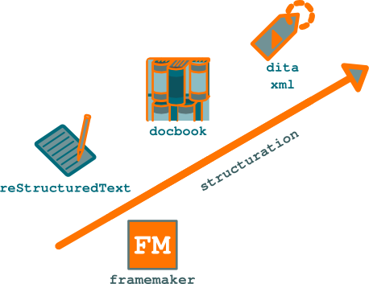

.. Copyright 2011-2014 Olivier Carrère
.. Cette œuvre est mise à disposition selon les termes de la licence Creative
.. Commons Attribution - Pas d'utilisation commerciale - Partage dans les mêmes
.. conditions 4.0 international.

.. review: text no, code no

.. _format-structure-dita-xml:

Format structuré DITA XML
=========================

Diminuer les coûts de production et de traduction, réduire les délais de mise
sur le marché (ou *time to market*) et améliorer la qualité de la
documentation. Voilà les défis que doit relever aujourd'hui le **rédacteur
technique**. L'un des meilleurs moyens d'y parvenir consiste à réduire le volume
source de la documentation et à mieux gérer le **contenu d'entreprise**.

   Formats de documentation technique : degrés de structuration

L'information que le **rédacteur technique** fournit au public *doit* être
redondante : l'entreprise doit présenter à chacun de ses publics toute
l'information dont il a besoin, sur le support qui lui est adapté. Pour prendre
l'exemple le plus simple, chaque support d'information doit mentionner les
coordonnées de la société. Mais jusqu'à 50 % de l'information disséminée par
l'entreprise est répétée.

En revanche, la redondance de l'information en interne engendre des coûts
supplémentaires, allonge les cycles de production et entraîne une baisse de
l'homogénéité, et donc de la qualité, du contenu. Il est donc primordial de
diminuer et de mieux partager le contenu source et d'en diminuer le volume. Le
**rédacteur technique** doit diviser l'information en briques autonomes uniques,
standardisées et génériques, pour pouvoir l'assembler à la demande. Il doit donc
utiliser des modules structurés de manière homogène qui peuvent être facilement
manipulés par des applications.

.. figure:: graphics/non-redondance.png

   Les sources de la documentation doivent être moins volumineuses que les
   livrables.

:abbr:`DITA (Darwin Information Typing Architecture)` est une architecture XML
de **rédaction structurée** destinée à la création de documents modulaires et à
la réutilisation du contenu. À partir d'une base commune de modules
d'information atomiques (pas au sens XPath) DITA XML, le **rédacteur technique**
peut fournir en temps réel toute l'information dont chaque utilisateur a besoin,
sur tout type de média, du support d'e-learning au document PDF ou papier, en
passant par le site Web.

DITA XML applique le principe de non-redondance des informations propre aux
bases de données normalisées. Cette architecture transpose à la documentation
technique la révolution introduite dans l'industrie par la standardisation : si
l'on peut construire des automobiles de modèles différents à partir d'un
ensemble de pièces identiques, de même, le **rédacteur technique** peut publier
des documents différents à partir d'un ensemble de briques d'information
standardisées.

.. toctree::
   :maxdepth: 2

   documentation-code-source-cas-concrets-utilisation-de-dita-xml.rst
   documentation-code-source-formats-structures-et-non-structures
   documentation-code-source-une-architecture-documentaire-trop-complexe
   documentation-code-source-du-document-a-la-base-documentaire-modulaire
   documentation-code-source-cas-concret-documentation-de-nufirewall
   documentation-code-source-didacticiels-dita-xml-xsl-fo
