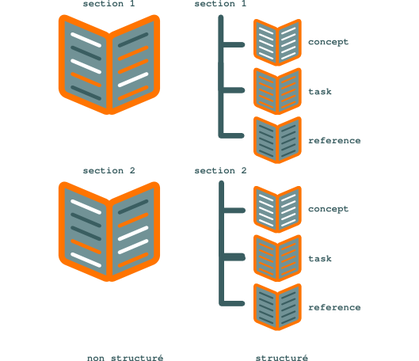

.. Copyright 2011-2014 Olivier Carrère
.. Cette œuvre est mise à disposition selon les termes de la licence Creative
.. Commons Attribution - Pas d'utilisation commerciale - Partage dans les mêmes
.. conditions 4.0 international.

.. review: text yes, no code

.. _formats-structures-et-non-structures:

Formats structurés et non structurés
====================================

Les **formats structurés** favorisent la création de documents minimalistes,
complets et cohérents. Ils permettent au **rédacteur technique** de se
concentrer sur le contenu et d'améliorer l'expérience utilisateur et
l'utilisabilité de la documentation technique.

Les informations contenues dans un document technique peuvent être catégorisées
selon leur sens. Par défaut, `DITA XML
<http://fr.wikipedia.org/wiki/Darwin_Information_Typing_Architecture>`_ propose
trois types de base :

+------------------------------+------------------------------+
|**Type sémantique**           |**Description**               |
+------------------------------+------------------------------+
|*concept*                     |Introduction ou présentation  |
|                              |d'un concept.                 |
+------------------------------+------------------------------+
|*task*                        |Procédure pas à pas,          |
|                              |séquentielle et numérotée,    |
|                              |destinée à réaliser une tâche.|
+------------------------------+------------------------------+
|*reference*                   |Informations de référence sur |
|                              |une liste d'éléments tels que |
|                              |des options d'un programme.   |
+------------------------------+------------------------------+

   Formats structurés et non structurés

Sous un format non structuré tel que le format traditionnel de
`FrameMaker <http://en.wikipedia.org/wiki/Adobe_FrameMaker>`_, rien ne
contraint le **rédacteur technique** à organiser l'information selon son sens. Si des
règles de rédaction rigoureuses ne sont pas scrupuleusement suivies,
l'information fournie à l'utilisateur risque d'être peu claire et difficile à
parcourir rapidement.

Avec des formats structurés tels que DITA XML, en revanche :

- le **rédacteur technique** se concentre sur le contenu,
- l'information est présentée à l'utilisateur selon une organisation cohérente
  et prévisible,
- l'accès à l'information est séquentiel et rapide,
- l'information peut facilement être réorganisée selon les besoins,
- l'utilisabilité du support d'information fourni est optimale.

Les types d'information de haut niveau tels que *task* sont divisés en types de
plus bas niveau, par exemple :

+------------------------------+------------------------------+
|**Type**                      |**Description**               |
+------------------------------+------------------------------+
|*prereq*                      |Liste de points obligatoires  |
|                              |préalables à la réalisation   |
|                              |d'une tâche.                  |
+------------------------------+------------------------------+
|*steps*                       |Série d'étapes de la          |
|                              |procédure.                    |
+------------------------------+------------------------------+
|*stepxmp*                     |Exemple de réalisation d'une  |
|                              |étape.                        |
+------------------------------+------------------------------+

Les règles syntaxiques interdisent au **rédacteur technique** de faire figurer
une procédure pas à pas dans une section d'un autre type que *task*.  Le
**rédacteur technique** dispose donc d'un véritable modèle de rédaction qui
l'aide à présenter des informations :

+--------------+---------------------------------------------------------------+
|*minimalistes*|selon le principe de design *less is more*, l'utilisateur ne   |
|              |dispose *que* de l'information dont il a besoin : une section  |
|              |*task*, par exemple, ne contient que des prérequis, une        |
|              |procédure et quelques autres éléments spécifiques ; toutes les |
|              |informations conceptuelles ou de référence sont placées dans   |
|              |des sections à part ;                                          |
+--------------+---------------------------------------------------------------+
|*complètes*   |l'utilisateur dispose de *toute* l'information dont il a besoin|
|              |; une section de type *task* sans procédure n'est pas une      |
|              |section DITA XML valide et ne pourra pas être publiée ; il est |
|              |même possible de mettre en œuvre un mécanisme vérifiant        |
|              |automatiquement avant publication la présence de blocs         |
|              |d'information facultatifs selon le schéma `XSD                 |
|              |<http://fr.wikipedia.org/wiki/XML_Schema>`_ DITA, mais que le  |
|              |**rédacteur technique** juge obligatoires, tels que le résultat|
|              |d'une procédure ;                                              |
+--------------+---------------------------------------------------------------+
|*cohérentes*  |les informations de même type sont présentées dans le même     |
|              |ordre et avec la même mise en page ; les blocs d'information   |
|              |identiques répétés à différents endroits, tels qu'une remarque,|
|              |sont issus d'une seule et même source et sont donc strictement |
|              |identiques.                                                    |
+--------------+---------------------------------------------------------------+

.. toctree::
   :maxdepth: 2

   documentation-code-source-docbook-ou-dita-xml
   documentation-code-source-migration-de-framemaker-vers-dita-xml
   documentation-code-source-migrer-de-framemaker-vers-dita-xml
