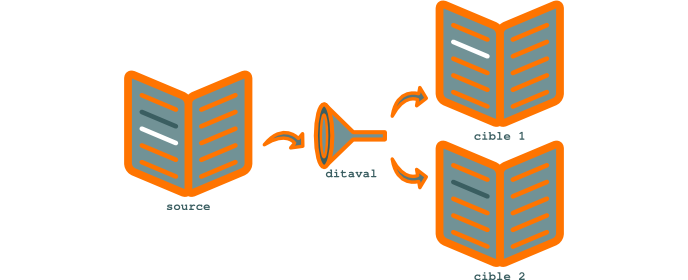

.. Copyright 2011-2014 Olivier Carrère
.. Cette œuvre est mise à disposition selon les termes de la licence Creative
.. Commons Attribution - Pas d'utilisation commerciale - Partage dans les mêmes
.. conditions 4.0 international.

.. review: text yes, code yes

.. _fournir-une-information-ciblee-avec-le-texte-conditionnel-ditaval:

Fournir une information ciblée avec le texte conditionnel ditaval
=================================================================

Un fichier `ditaval
<http://docs.oasis-open.org/dita/v1.2/os/spec/common/about-ditaval.html>`_
reprend le principe des lunettes que vous chaussez pour visualiser un film en 3D
: le verre gauche masque une moitié de l'image, le verre droit en masque l'autre
moitié. Mais seul le **rédacteur technique** dispose de lunettes 3D et a une
vision complète de l'information contenue dans le projet DITA XML.

Les destinataires de l'information disposent de lunettes
avec deux verres gauches ou deux verres droits. Ils ne voient donc qu'une partie
de l'information. Loin d'être lésés par cet état de fait, ils ont ainsi un
meilleur accès à l'information. Le profilage réalisé masque à chaque public les
informations dont ils n'ont *pas* besoin et qui ne seraient pour eux que du
bruit. Chaque audience bénéficie donc d'un meilleur accès à l'information qui la
concerne, selon le fameux concept minimaliste de *less is more*.

   Texte conditionnel avec DITA XML

Concrètement, le mécanisme **ditaval** est basé sur des opérateurs binaires :
vous marquez un bloc d'information avec un attribut et une valeur, puis incluez
ou excluez ce bloc dans le livrable en passant un opérande lors de la
compilation (le bloc est inclus par défaut si aucun opérande n'est
spécifié). C'est le principe du **texte conditionnel**.

Gâce à ce mécanisme, il n'est pas nécessaire de créer deux fichiers différents
lorsque leur contenu ne comporte que des variations mineures. C'est un outil de
plus destiné à réduire la redondance du contenu source.

Vous pouvez appliquer des clés de filtrage en série (condition *et*) en
indiquant plusieurs valeurs séparées par des espaces dans les attributs
*product*, *audience* ou autre.

.. rubric:: Exemple

Pour indiquer qu'une remarque est destinée à la fois à des électriciens et à des
utilisateurs avancés en voulant profiler l'information selon les publics
suivants :

- non électriciens,

- électriciens débutants,

- électriciens experts.

Vous pouvez utiliser la structure suivante :

.. code-block:: xml

   <step audience="electricians advanced">
     <cmd> Ramenez l'intensité sous la dose létale de 150mA. </cmd>
   </step>

.. attention::

   Une clé de filtrage mal positionnée peut entraîner une erreur de
   compilation. En effet, si le code non filtré est conforme au schéma XSD DITA,
   le code filtré peut ne pas l'être.

   .. rubric:: Exemple

   Le code suivant est correct avant filtrage :

   .. code-block:: xml

      <thead>
        <row product="a>
          <entry>Commande</entry>
          <entry>Description</entry>
        </row>
      </thead>

   Après filtrage, en revanche, on obtient le code suivant :

   .. code-block:: xml

      <thead>
      </thead>

   Or, selon le schéma XSD, les en-têtes de tableaux doivent contenir au moins
   une ligne:

   .. code-block:: xml

      <!ENTITY % thead.content "((%row;)+)>

   Ce code est donc incorrect et entraîne l'échec de la compilation.
