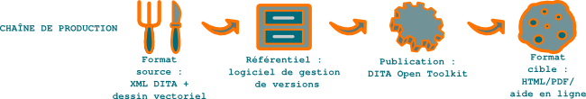

Guide de l'utilisateur : aidez vos clients, séduisez vos prospects
==================================================================

La documentation technique est surtout connue sous sa forme « **mode d'emploi**
», dont les traductions incertaines ont fait pester la plupart des possesseurs
d'aspirateurs. Rarement considérées comme des outils marketing, les **notices
techniques** sont pourtant les documents les plus consultés par les clients et
peuvent devenir des outils de **communication marketing** à part entière.

Parce qu'ils intégraient autant la dimension **avant-vente** que **service
après-vente**, j'ai vu des manuels d'utilisation utilisés avec succès comme
arguments de vente par des ingénieurs commerciaux. Autant dire qu'ils passent
vite dans ce cas du statut de simples **notices d'emploi** à celui plus
prestigieux de **guides de l'utilisateur**.

Autre public à qui on ne les destine pas en général, les journalistes peuvent
également y trouver des informations techniques et les prendre en compte dans
leurs tests des produits. Ils ne sont en revanche diffusés au grand public que
de manière exceptionnelle. Le niveau technique d'un guide de l'utilisateur
dépend de l'expertise de ce dernier, de l'utilisateur final à l'ingénieur. Mais
un bon guide est toujours le plus pragmatique et le moins technique possible.

.. figure:: media/1.png

   Définition du projet

Livrer une documentation sans réflexion préalable parce que c'est obligatoire
provoque beaucoup de frustration en interne et chez les clients. La
documentation est une valeur ajoutée du produit. Les journalistes ne s'y
trompent pas lors de leurs tests, par exemple :

La première configuration du produit s'avère relativement simple, la
documentation est claire. - L'informaticien n° 83 septembre 2010 - `EdenWall
NuFirewall, le pare-feu nouvelle génération
<http://www.linformaticien.com/tests/id/20068/categoryid/48/edenwall-nufirewall-le-pare-feu-nouvelle-generation.aspx>`_.

.. figure:: media/2.png

   Collecte de l'information

L'information est recueillie par l'analyse des spécifications du produit,
l'interview des développeurs et la manipulation directe du produit. Cerner puis
interviewer les différents publics cibles est un gage de qualité de la
documentation. Qui veut faire quoi avec le produit ? En répondant à ces deux
questions, il est (relativement) facile de répondre à la troisième : comment ?

.. figure:: media/3.png

   Création du contenu

Les guides doivent être *orientés tâche*, c'est-à-dire avant tout répondre à la
question *comment* par des procédures, avec juste ce qu'il faut d'explications
théoriques pour permettre à l'utilisateur de savoir exactement ce qu'il fait.

Selon le principe *less is more*, j'aime utiliser le moins de texte possible,
mais si vous avez été confronté à un mode d'emploi n'utilisant que le dessin,
vous savez combien le texte peut être précieux. À partir d'un bon schéma (c'est
à dire aussi simple que possible), la rédaction du texte coule de source et
l'utilisateur dispose d'une information claire et complète.

.. figure:: media/4.png

   Format source

Une documentation technique est un document hautement structuré. Il existe des
formats et des outils destinés à se concentrer sur le contenu et non sur la
forme. Bref, à ce que le **rédacteur technique** fasse son métier. Il y a certes
une courbe d'apprentissage avant de les maîtriser, mais le gain de productivité
qu'ils offrent est considérable.

.. figure:: media/versions

   Référentiel

Les sources (texte et images) peuvent être gérées par le système de gestion
`Subversion <http://fr.wikipedia.org/wiki/Apache_Subversion>`_. Un tel système
me semble indispensable à tout projet de documentation. Qui n'a pas connu le
syndrome du fichier qu'on ne peut plus ouvrir ou du projet qui ne compile plus à
la veille de la livraison ? Avec un gestionnaire de sources et quelques bonnes
pratiques, il est presque impossible que cela se produise. De plus, une équipe
peut travailler en même temps sur les mêmes projets et les mêmes fichiers (s'ils
ne sont pas binaires), ce qui décuple la productivité.

   Chaîne de publication

Ceci est une des chaînes de production possibles.

.. figure:: media/5.png

   Validation

*Ce que l'on conçoit bien s'énonce clairement, et les mots pour le dire arrivent
aisément.* - Boileau, L'Art poétique

Les schémas sont souvent vus comme un élément essentiel de la transmission d'une
information technique. Mais ils sont pour moi avant tout une étape primordiale
de la compréhension profonde de l'information par le rédacteur technique.Trop
souvent, les rédacteurs techniques hochent gravement de la tête quand un expert
leur explique un point ardu, puis reviennent avec un texte abscons… que l'expert
validera sans l'avoir lu et que le client ne comprendra pas ! Cela se traduira
par un coût quantifiable pour l'entreprise en termes de support technique et par
un coût caché en termes de satisfaction client et d'image.Il en va tout
autrement avec un schéma. En réalisant un schéma, le rédacteur met ses idées au
clair, et l'expert regarde ce qu'il valide.

.. figure:: media/6.png

   Format cible

Étant donné le volume et la fréquence de mise à jour des guides de
l'utilisateur, la mise en page doit être totalement automatisée.

.. figure:: media/7.png

   Livraison

La documentation produit est généralement fournie en PDF ou mise en ligne sur un
extranet en HTML. Elle peut également être fournie sous forme d'aide en ligne
ou, plus rarement, imprimée. Dans ce dernier cas, l'impression à la demande est
une bonne solution pour les petits tirages.
