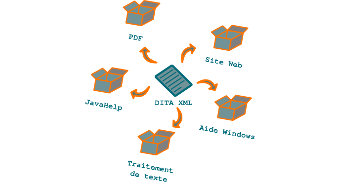

.. Copyright 2011-2014 Olivier Carrère
.. Cette œuvre est mise à disposition selon les termes de la licence Creative
.. Commons Attribution - Pas d'utilisation commerciale - Partage dans les mêmes
.. conditions 4.0 international.

.. _le-single-sourcing-un-format-source-plusieurs-formats-cibles:

Le single-sourcing : un format source, plusieurs formats cibles
===============================================================

Le **single-sourcing** est un sujet qui a longtemps divisé les **rédacteurs
techniques** : des supports de **rédaction technique** différents, tels qu'une
aide en ligne et un manuel imprimé, doivent-ils proposer un contenu radicalement
différent ou peuvent-ils être générés à partir du même contenu source ?

Les contraintes de productivité et la réduction des coûts aidant, le débat a été
tranché en faveur du *single-sourcing*. Le gain qualitatif, discutable, de
créer, maintenir et traduire une version source différente pour chaque version
cible est trop important.

   Un seul jeu d'informations, une multiplicité de formats de sortie

Si le **rédacteur technique** pratique le *single-sourcing*, il doit cependant
sélectionner en début de projet le paradigme sur lequel il se base : le livre ou
l'aide en ligne. Pendant longtemps, les outils proposés reposaient soit sur un
document de type livre (Word, ou FrameMaker, essentiellement) qui pouvait être
exporté au format d'aide en ligne, soit sur un fichier source (RTF) d'aide
Windows, pour générer un PDF. Une forte perte d'information de navigation
(index, références croisées, liens, etc.) intervenait souvent lors de
l'exportation.

DITA XML propose un modèle agnostique quant au format cible. Les fichiers
sources, bien que basés sur un modèle modulaire proche de celui de l'aide en
ligne, peuvent facilement être exportés sous forme de fichier PDF, d'aide en
ligne, de pages HTML liées ou autre, sans aucune perte d'information.
