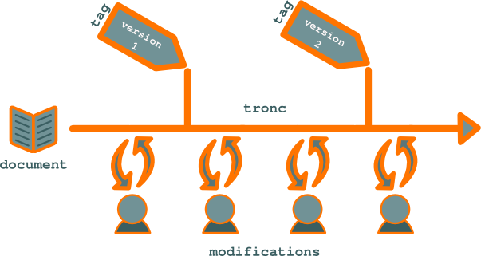

.. Copyright 2011-2014 Olivier Carrère
.. Cette œuvre est mise à disposition selon les termes de la licence Creative
.. Commons Attribution - Pas d'utilisation commerciale - Partage dans les mêmes
.. conditions 4.0 international.

.. code review: no code

.. _les-systemes-de-gestion-de-versions-rustiques-mais-fiables:

Les systèmes de gestion de versions - rustiques mais fiables
============================================================

Travailler sur des fichiers sources au format texte, et non binaire, est
l'occasion pour le |techwriter| de gérer son contenu comme les
développeurs gèrent leur code |_| : sous un système de gestion des sources tel que
Git, Subversion ou SourceSafe.

Ces systèmes |_| :

- favorisent le travail de groupe,

- suppriment les copies de fichiers en doublons et

- réduisent le risque de perte de données à presque zéro.

Sur des fichiers texte, et non binaires, un système de gestion de version offre des
fonctionnalités supérieures |_| :

- pas de risque de pertes de données en cas de défaillance du réseau [#]_,

- possibilités de travail *off-line* (déconnecté) poussées  [#]_,

- non-verrouillage des fichiers par les membres de l'équipe qui les ont ouverts.

- possibilité de restauration très fine et dans le temps (depuis le dernier
  dépôt du fichier sur le référentiel) et en termes de quantité de travail [#]_.

   Le système de gestion de versions conserve l'historique des modifications.

Des interfaces graphiques permettent d'utiliser directement sous les
gestionnaires de fichiers ces outils originellement conçus pour être utilisés en
ligne de commande. Cependant, le paradigme sur lequel ils reposent est parfois
difficile à appréhender pour les publics les moins technophiles [#]_.

Les systèmes de gestion des sources utilisent les concepts suivants |_| :

+--------+---------------------------------------------------------------------+
|Tronc   |Dépôt principal conservant toutes les versions des fichiers placées  |
|        |au cours du temps par le |techwriter| (ou plus                       |
|        |fréquemment, le développeur).                                        |
+--------+---------------------------------------------------------------------+
|Branche |Dépôt secondaire créé à partir de la version principale du code      |
|        |source.                                                              |
+--------+---------------------------------------------------------------------+
|Tag     |Instantané du tronc ou d'une branche à un instant *t*. Permet de     |
|        |figer facilement une version, par exemple, la version publiée, et de |
|        |créer une archive.                                                   |
+--------+---------------------------------------------------------------------+

Si l'on s'en donne la peine, il est également possible de mal utiliser les
systèmes de gestion de version et de perdre des données. Mais, en pratique, à
même niveau d'effort et de compétence, le risque de perdre de données est
nettement  moindre si le |techwriter| manipule des fichiers texte
sous un gestionnaire de version plutôt que des fichiers binaires sur un
répertoire partagé.

Les systèmes de gestion de code source ont une fiabilité éprouvée et gèrent des
millions de lignes de code. Tout comme les systèmes de fichiers (Ext4, Btrfs,
etc.) ils évoluent lentement, selon une politique conservatrice, et ne sont
proposés en production que lorsqu'ils ont été exhaustivement débogués. Si les
plus grands projets de développement informatique, tel que GNU/Linux, par
exemple, leur font confiance, pourquoi ne pas également leur confier la
**documentation technique** |_| ?

Un bémol cependant |_| : ces outils ne sont pas destinés spécifiquement au format
XML et effectuent des comparaisons ligne par ligne entre les fichiers, et non
pas nœud par nœud, ce qui multiplie inutilement les conflits entre les *commits*
ou les branches.

.. rubric:: Notes

.. [#] En cas d'incident réseau, l'utilisateur est averti que la transaction
       destinée à placer le fichier modifié sur le dépôt a échoué |_| ; il peut
       alors procéder à une nouvelle transaction, sa copie locale du fichier
       étant intacte.

.. [#] Surtout sous Git, conçu explicitement dans ce but.

.. [#] Les systèmes de gestion de version favorisent un dépôt fréquent de
       modifications atomiques.

.. [#] Même si Apple a contribué à en populariser certains aspects avec son
       application *Time machine*.

.. toctree::
   :hidden:

   documentation-code-source-utiliser-les-branches-des-systemes-de-gestion-de-sources

.. text review: yes
