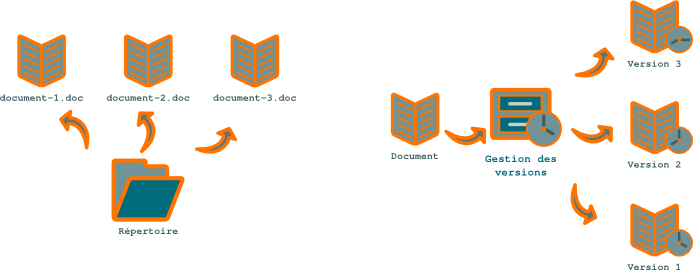

.. Copyright 2011-2014 Olivier Carrère
.. Cette œuvre est mise à disposition selon les termes de la licence Creative
.. Commons Attribution - Pas d'utilisation commerciale - Partage dans les mêmes
.. conditions 4.0 international.

.. _logiciel-de-gestion-de-versions:

Logiciel de gestion de versions
===============================

Les **logiciels de gestion de versions** tels que Subversion gèrent bien le
travail en groupe et les grappes de fichiers modulaires de type DITA et
conservent l'historique des modifications.

   Référentiel

Ils présentent cependant les inconvénients suivants :

- paradigme peu intuitif,

- non conçus pour les fichiers binaires.

Les logiciels de gestion de versions garantissent qu'aucun fichier ni élément
d'information ne peut être perdu. Ils sont particulièrement précieux en fin de
projet et permettent une phase de livraison sereine. Ils mettent fin au syndrome
des fichiers binaires corrompus ou du PDF qui ne compile plus le jour de la
livraison. Si certains formats sont relativement mal gérés par les logiciels de
gestion de versions (fichiers Illustrator ou Indesign, par exemple), ils doivent
cependant être tout de même placés sous un tel système. Pour éviter de se fâcher
avec l'administrateur système, on évitera simplement les « `*commits*
<http://fr.wikipedia.org/wiki/Commit/>`_ atomiques », qui risquent de faire
grossir démesurément la base de données ! Et si le graphiste est décidément
allergique à un tel système, malgré les interfaces graphiques disponibles, c'est
au chef de projet qu'il revient de procéder au *commit* des fichiers.

   Référentiel de rédaction technique : Subversion ou répertoire

Dans un répertoire, la gestion des versions d'un même document se fait par
création d'un nouveau fichier par version, ce qui présente des risques de perte
d'informations. Sous un logiciel de gestion de versions, elle se fait par
attribution d'un numéro de révision et application d'un libellé (*tag*).
