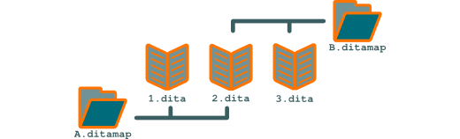
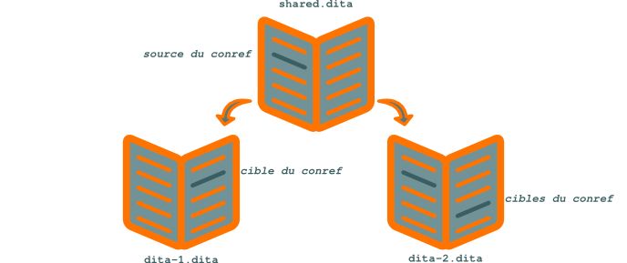

.. Copyright 2011-2014 Olivier Carrère
.. Cette œuvre est mise à disposition selon les termes de la licence Creative
.. Commons Attribution - Pas d'utilisation commerciale - Partage dans les mêmes
.. conditions 4.0 international.

.. code review: no code

.. _partager-des-blocs-information-atomiques-avec-les-conref:

Partager des blocs d'information atomiques avec les *conref*
============================================================

Lorsque le |techwriter| veut réutiliser des blocs d'information
|dita| plus petits qu'une section, il doit les partager au niveau des
fichiers de contenu *dita* et non dans les structures de table des matières
*ditamap*, grâce au mécanisme `conref`_.

Le principe des *conref* est simple |_| : lorsqu'un *conref* est mentionné au
niveau d'un nœud XML donné, tout le contenu du nœud cible est remplacé par le
contenu du nœud source.

   Partage de blocs d'information de granulométrie large entre les *ditamap*

Une différence notable entre le mécanisme des *conref* et le mécanisme XML des
`xinclude`_, c'est que le nœud source
doit être conforme au schéma XSD du fichier source *et* du fichier cible. Ce
formalisme rigoureux, s'il s'avère moins souple et oblige parfois à quelques
acrobaties, rend les *conref* beaucoup plus lisibles que les *xinclude* et favorise
leur utilisation.

   Partage de blocs d'information de granulométrie fine entre les sections |dita|

.. toctree::
   :hidden:

   documentation-code-source-centraliser-les-conref-dans-un-fichier-unique
   documentation-code-source-utiliser-le-noeud-xml-de-plus-bas-niveau
   documentation-code-source-prendre-en-compte-les-contraintes-de-traduction
   documentation-code-source-imbriquer-les-conref
   documentation-code-source-maximiser-utilisation-des-conref-pour-faire-baisser-les-couts
   documentation-code-source-proteger-les-informations-confidentielles

.. text review: yes
