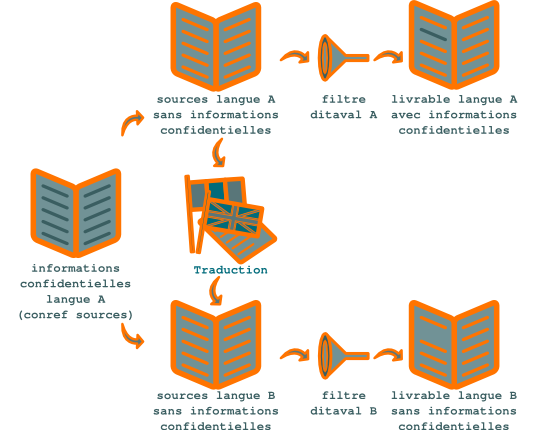

.. Copyright 2011-2014 Olivier Carrère
.. Cette œuvre est mise à disposition selon les termes de la licence Creative
.. Commons Attribution - Pas d'utilisation commerciale - Partage dans les mêmes
.. conditions 4.0 international.

.. code review: no code

.. _proteger-les-informations-confidentielles:

Protéger les informations confidentielles
=========================================

Le puissant mécanisme `conref
<http://docs.oasis-open.org/dita/v1.1/OS/archspec/conref.html>`_ de |dita|
se prête à d'autres applications que la réduction des coûts. Par exemple, le
|techwriter| peut masquer des informations dans le code source.

Voici un cas original d'utilisation des *conref* : imaginez que vous devez
faire traduire un fichier contenant des informations confidentielles qui ne
doivent pas figurer dans la version traduite et auxquelles le traducteur ne doit
pas avoir accès (une clause de confidentialité interdit aux clients de diffuser
l'information dont ils disposent).

Comment faire ? Le filtrage à l'aide du mécanisme *ditaval* est conçu pour
exclure des informations des livrables, non pour les masquer dans les fichiers
sources. Allez-vous devoir créer deux jeux de fichiers sources, certains
comportant les informations confidentielles, les autres non ? Adieu alors le
*single-sourcing* et la réutilisation du contenu qui vous ont fait choisir
|dita| !

   Masquer des informations confidentielles aux traducteurs

En plaçant le contenu confidentiel dans un fichier que vous appelez par exemple
:file:`confidentiel.dita` et en plaçant des *conref* assortis d'une clé de
filtrage dans le fichier à traduire, vous avez résolu votre problème : le
traducteur ne traduira que le texte non confidentiel, et le livrable généré dans
la langue cible ne contiendra pas le texte confidentiel, noté comme conditionnel
et exclu explicitement par le fichier *ditaval* passé en argument lors de
la compilation.

.. text review: yes
