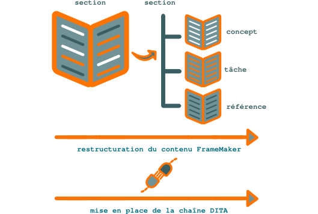

.. Copyright 2011-2014 Olivier Carrère
.. Cette œuvre est mise à disposition selon les termes de la licence Creative
.. Commons Attribution - Pas d'utilisation commerciale - Partage dans les mêmes
.. conditions 4.0 international.

.. review: text yes, no code

.. _restructuration-du-contenu-framemaker:

Restructuration du contenu FrameMaker
=====================================

La partie automatisée d'une migration de `FrameMaker
<http://en.wikipedia.org/wiki/Adobe_FrameMaker>`_ vers `DITA XML
<http://fr.wikipedia.org/wiki/Darwin_Information_Typing_Architecture>`_ consiste
à appliquer une table de conversion entre les styles **FrameMaker** et les
structures **DITA XML**.

Un important travail de restructuration du document FrameMaker doit cependant
être effectué en amont :

- restructuration de l'information selon les trois catégories *concept*,
  *tâche* et *référence*,

- suppression des *overrides* (propriétés de texte appliquées manuellement et
  écrasant les styles ; ce genre d'hérésie est, sinon impossible, du moins très
  limité sous un format structuré),

- harmonisation et simplification des styles FrameMaker pour les limiter et les
  faire correspondre aux balises DITA XML qui seront utilisées (par exemple, un
  style *note_important* vers la balise <note type="important> ; il faut donc au
  préalable analyser le contenu existant et décider quel ensemble de balises
  sera utilisé parmi les centaines de balises proposées par DITA XML : il est
  en effet fortement déconseillé de les utiliser toutes).

   Restructuration du contenu  FrameMaker et mise en place de la chaîne DITA XML

Ce travail d'harmonisation peut se faire en parallèle avec la mise à jour et la
publication du document FrameMaker. La qualité de ce document n'en sera que
meilleure.  En même temps que cette réorganisation du contenu, vous pouvez mettre en place
la chaîne complète de création, gestion et publication DITA XML sur un
échantillon de votre contenu :

- mise en place des outils,

- réalisation des feuilles de style des différents formats de sortie,

- formation des **rédacteurs techniques**, graphistes et traducteurs,

- formation et sensibilisation des autres acteurs de l'entreprise.

Ce n'est qu'une fois que sa chaîne est fiable et acceptée, voire attendue
par les autres acteurs de l'entreprise, que le **rédacteur
technique** peut envisager la migration.

Si vos documents sont disponibles en plusieurs langues, vous devez modifier les
fichiers FrameMaker et effectuer la migration pour chaque langue. Si un projet
de traduction dans une nouvelle langue se profile, mieux vaut effectuer la migration avant
!
