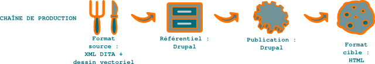

Site web : convainquez tous vos publics, du décideur à l'expert
===============================================================

La communication numérique, incontournable, ne doit pas faire oublier le
**print**. La combinaison bien pensée des deux est un très bon moyen d'affirmer
sa crédibilité. L'existence d'un support physique renforce en effet la confiance
dans la pérennité et le sérieux de l'entreprise. Segmenter son site selon ses
différents publics en garantit la visibilité. Avec le développement du **web
sémantique**, il sera bientôt plus facile de valoriser tout le contenu
d'entreprise sous un **format structuré**.

Aucune entreprise ne peut aujourd'hui se passer d'un site web, mais celui-ci
doit être très bien conçu. Le contenu doit être clairement organisé du plus
simple au plus complexe. Un site web permet dans l'absolu de toucher tous les
publics de la société. Il est cependant préférable de hiérarchiser les
différents publics, puis de structurer le site en conséquence, voire de créer un
site différent pour chaque public. Un public peut également être jugé non
rentable pour l'entreprise ; le site peut alors faire l'impasse dessus.

.. rubric:: Définition du projet

Le site web fédère potentiellement toutes les informations de la société,
qu'elles soient techniques, humaines ou financières, destinées au grand public
ou aux partenaires. La mise en place d'un comité de rédaction pour hiérarchiser
et articuler convenablement l'information s'impose donc. Le risque est sinon de
publier un site pauvre en informations ou donnant une impression de fouillis.
Il faut prendre en compte dès le début du projet :

- la structuration,

- la création du contenu,

- le graphisme (illustrations et feuille de style),

- le référencement.

.. rubric:: Collecte de l'information

Il peut être tentant de donner à chaque département les droits d'écriture sous
le CMS. Mais cela nuirait gravement à l'homogénéité du site. Le **rédacteur
technique** doit donc systématiquement écrire ou réécrire tout contenu destiné à
être publié en ligne.

.. rubric:: Création du contenu

La lecture à l'écran suppose un style spécifique. Dans le cas d'un site web, il
faut en outre prendre en compte les contraintes de SEO pour le référencement.

Influence du *print* sur le web
-------------------------------

Les contraintes rédactionnelles sur le web sont fortes - et passionnantes pour
le **rédacteur technique**. Mais le référencement naturel et le SEO ne devraient
pas aboutir à un style bâclé. Pourquoi jeter aux orties des siècles de culture
papier lorsque l'on passe à un support électronique ? Rien de tel pour procurer
une lecture agréable aux internautes que de relire sur papier les textes avant
leur publication. Les erreurs d'orthographe, de syntaxe, de style, mais
également de typographie sauteront alors aux yeux. Lue à l'écran, votre prose
donnera une impression de grand professionnalisme. Bref, si dans une première
version d'un article, il faut écrire pour les moteurs de recherche, dans la
dernière, il faut polir pour les internautes.

   Chaîne de publication

Ceci est une des chaînes de production possibles. On peut également gérer les
versions sous un outil de gestion de contenu d'entreprise tel qu'`Alfresco
href="http://www.alfresco.com/fr/>`_ ou fédérer tout le contenu sous le format
structuré XML `DITA <http://dita.xml.org/>`_ et un logiciel de gestion de
versions de type `Subversion <http://fr.wikipedia.org/wiki/Apache_Subversion>`_.

.. rubric:: Format source

Il est hors de question de taper directement le texte sous le CMS ! Le contenu
peut parfaitement être créé sous un traitement de texte. Je préfère cependant
créer et mettre à jour les données d'un site dans des fichiers XML DITA gérés
sous un gestionnaire de sources tel que Subversion ou Git. Cela me garantit
notamment de conserver un historique complet des modifications du site.

.. rubric:: Validation

Un workflow doit être mis en place pour éviter tout incident : non publication
d'une information, publication d'une information erronée ou confidentielle, etc.

.. rubric:: Format cible

Un CMS tel que `Drupal <http://drupalfr.org/>`_ ou `Joomla
<http://www.joomla.fr/>>`_ est l'outil idéal pour faire vivre le site (ce site
est sous Drupal). Le contenu est simplement collé à partir des fichiers sources…
procédé que je trouve archaïque !

Un bémol : puisque l'information est placée dans une base de données, pourquoi
les CMS ne prennent-ils en charge que des formats faiblement structurés tels que
le HTML ou la syntaxe wiki ou pire, s'orientent-ils vers des interfaces wysiwyg,
dont le rendu final est incertain ? Ne peuvent-ils gérer directement des formats
XML tels que `DocBook <http://www.docbook.org/>`_ ou `DITA <
href="http://dita.xml.org/>`_ ? Un projet intéressant d'interface entre le
format DITA et Joomla semble avoir été abandonné. J'aurais personnellement bien
aimé centraliser tout le rédactionnel sous un même référent, c'est dommage.

Cela pourrait heureusement bientôt changer avec le développement du web
sémantique. Bien que les données structurées de `Schema.org <
href="http://schema.org/>`_ balayent un champ sémantique beaucoup plus vaste que
les schémas DocBook ou DITA, volontairement limités à la documentation
technique, le rapprochement des deux logiques est très prometteur et les
passerelles seront plus faciles à mettre en place.  Si la sécurité du site est
un point critique, il est toujours possible d'en publier régulièrement une
version statique à l'aide d'outils tels que *wget* et *cron*. Il faut bien sûr
procéder à des sauvegardes régulières de la base de données.

.. rubric:: Livraison

La livraison d'informations sur un site web consiste à cocher la case *Publié
sous le CMS. Le timing des publications est un aspect très important. Il faut à
tout prix éviter les fuites !
