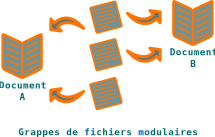

.. Copyright 2011-2017 Olivier Carrère
.. Cette œuvre est mise à disposition selon les termes de la licence Creative
.. Commons Attribution - Pas d'utilisation commerciale - Partage dans les mêmes
.. conditions 4.0 international.

.. code review: no code

.. _documents-monolithiques-ou-modulaires:

Documents monolithiques ou modulaires
=====================================

.. sidebar:: :awesome:`fa-bullhorn`

   Le format source peut reposer sur des fichiers monolithiques ou sur des
   grappes de fichiers modulaires.

Les fichiers monolithiques (par exemple |ms-word|, |libreoffice| ou |fm|)
centralisent tout le contenu dans un seul fichier, facile à manier, mais qui
limite le partage du contenu ; le risque de disposer d'informations incohérentes
ou en doublon est alors important.

   *Format source de rédaction technique monolithique*

Les grappes de fichiers modulaires (par exemple |dita|)
agrègent le contenu de multiples fichiers, ce qui favorise le partage et la
réutilisation de blocs de contenu. Un tel système est difficile à mettre en
place au niveau de toute l'entreprise, mais devrait être la norme pour une
équipe de |techwriting|.

   *Format source de rédaction technique modulaire*

Certains traitements de texte proposent de gérer des documents modulaires, mais
ils le font mal.  Inversement, un document |db| ou |dita|, par exemple, peut
être monolithique, mais perd alors de sa souplesse.

.. toctree::

   qu-est-ce-qu-un-module-d-information

.. text review: yes
