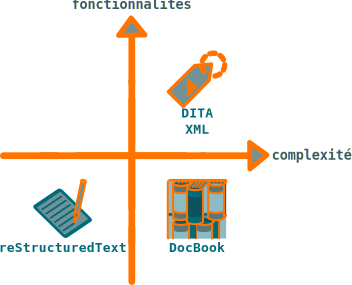

.. Copyright 2011-2017 Olivier Carrère
.. Cette œuvre est mise à disposition selon les termes de la licence Creative
.. Commons Attribution - Pas d'utilisation commerciale - Partage dans les mêmes
.. conditions 4.0 international.

.. code review: no code

Formats sources
---------------

Ce |site| est disponible en trois formats, basés sur la
version 1.1 [#]_. Ces formats présentent des niveaux de fonctionnalités et de
complexité différents.

   *Niveau de fonctionnalités et de complexité des formats texte*

reStructuredText
   `reStructuredText`_ est un langage de balisage léger de type Wiki ou Markdown
   qui, combiné au générateur de documentation Sphinx, offre un bon niveau de
   fonctionnalités.

DITA XML
   `DITA XML`_ est une architecture documentaire XML sémantique et modulaire
   complexe qui offre des gains de productivité importants grâce à une forte
   réutilisation du contenu.

DocBook
   `DocBook`_ est un langage de balisage XML sémantique qui offre un rapport
   fonctionnalités/complexité aujourd'hui peu intéressant.

.. [#] Seule la version |rst|, à partir de laquelle cette version
       HTML est créée, est maintenue.

.. text review: yes
