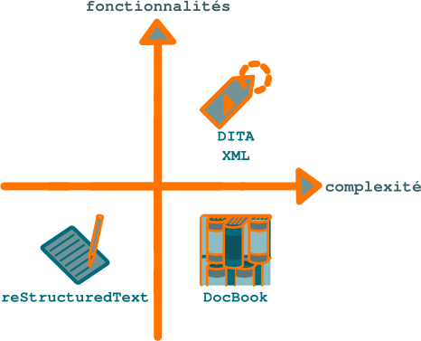

.. Copyright 2011-2014 Olivier Carrère
.. Cette œuvre est mise à disposition selon les termes de la licence Creative
.. Commons Attribution - Pas d'utilisation commerciale - Partage dans les mêmes
.. conditions 4.0 international.

.. code review: no code

Ne lisez pas ce site… `forkez-le sur GitHub ! <https://github.com/olivier-carrere/redaction-technique.org/>`_
=============================================================================================================

Ce site présente comment gérer la documentation technique comme le code
source, à partir de fichiers sources en format texte.

Il est disponible en trois versions [#]_ :

+---------------------+----------------------------------------------------+
|Version              |Description                                         |
+=====================+====================================================+
|`reStructuredText`_  |Langage de balisage léger de type Wiki ou Markdown. |
+---------------------+----------------------------------------------------+
|`DITA XML`_          |Architecture documentaire XML sémantique.           |
+---------------------+----------------------------------------------------+
|`DocBook`_           |Langage de balisage XML sémantique.                 |
+---------------------+----------------------------------------------------+

.. _reStructuredText: https://github.com/olivier-carrere/redaction-technique.org/tree/master
.. _DITA XML: https://github.com/olivier-carrere/redaction-technique.org/tree/DITA_XML
.. _DocBook: https://github.com/olivier-carrere/redaction-technique.org/tree/DocBook

Ces formats présentent des niveaux de fonctionnalités et de complexité
différents.

   Niveau de fonctionnalités et de complexité des formats texte

reStructuredText
   Format simple qui offre un bon niveau de fonctionnalités.
DITA XML
   Format complexe qui offre des gains de productivité importants
   grâce à une forte réutilisation du contenu.
DocBook
   Format qui offre un rapport fonctionnalités/complexité peu intéressant.

Toutes les versions de ce site sont gérées sous le logiciel de gestion de
versions décentralisé `Git <http://www.git-scm.com/>`_.

Ce site est conçu et réalisé par un rédacteur technique (carrereo *at*
gmail.com) spécialisé dans l'informatique. Il est publié sous licence Creative
Commons.  Vous pouvez le cloner, le forker, proposer des *patchs*, ou… le lire,
dans le format que vous souhaitez, après l'avoir compilé en PDF, EPUB ou autre
avec *Python Sphinx*.

Puisqu'il traite des processus et des formats de rédaction technique, son
contenu est cependant moins pertinent que son historique et que ses branches
*Git*. Pour tirer le meilleur parti des formats texte, il faut en effet gérer
ses sources sous un logiciel de gestion de versions tel que *Git* ou
*Subversion*. Les modifications de contenu peuvent alors être :

- regroupées par lots cohérents,
- liées à un ticket de logiciel de suivi de problèmes tel que *Bugzilla* ou
  *Trac*,
- validées par des pairs,
- partagées entre différentes versions du projet de documentation,
- annulées en une seule opération, etc.

.. [#] Seule la version *reStructuredText*, à partir de laquelle cette version
       HTML est créée, est maintenue.

.. toctree::
   :hidden:

   documentation-code-source-diminuer-les-couts-ameliorer-la-satisfaction-client
   documentation-code-source-redaction-technique-un-processus-industriel
   documentation-code-source-format-structure-dita-xml

.. text review: yes
