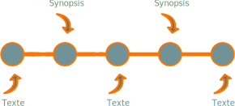

.. Copyright 2011-2018 Olivier Carrère
.. Cette œuvre est mise à disposition selon les termes de la licence Creative
.. Commons Attribution - Pas d'utilisation commerciale - Partage dans les mêmes
.. conditions 4.0 international.

.. code review: no code

.. _organiser-son-historique-avec-git-rebase:

Organiser son historique avec Git rebase
========================================

.. sidebar:: :awesome:`fa-bullhorn`

   Git est d'un abord déroutant. Ses *workflows* s'appliquent à du contenu
   plutôt qu'à des fichiers. Résultat : le travail de groupe et la gestion de
   différentes versions concurrentes d'un même contenu deviennent beaucoup
   plus simples.

Git effectue des *commits* atomiques : il applique des lots de modifications sur
un contenu souvent réparti sur plusieurs fichiers, au lieu de gérer
des *fichiers* proprement dits. Il nous invite à raisonner par lots de tâches sur
un contenu et non par fichier.

Ce fonctionnement peut sembler peu intuitif si l'on a l'habitude de travailler
fichier par fichier et non tâche par tâche. Mais une fois que l'on a adapté ses
habitudes de travail à ce *workflow*, on s'aperçoit :

- que l'on dispose d'un historique beaucoup plus facilement exploitable,
- qu'il est beaucoup plus facile de gérer des versions concurrentes d'un même
  contenu dans des branches de développement parallèles.

Imaginons que vous ayez identifié deux types de modifications majeurs à apporter
à votre contenu :

- les synopsis d'un programme en ligne de commande,
- les corrections grammaticales du texte.

Si votre contenu est réparti dans un ensemble de fichiers modulaires, vous
pourriez décider d'apporter en même temps les deux types de modifications dans
chaque fichier un à un. Pour répartir le travail sur un groupe de rédacteurs
techniques, il vous suffit d'allouer à chacun un lot de fichiers.

Ce *workflow* n'est pas le plus adapté à Git. Si vous utilisez ce système
de gestion de versions, il est préférable de diviser le travail en deux lots de
tâches, que l'on appelera *synopsis* et *texte*, appliqués concurremment
sur tous les fichiers.

Les contraintes de production vous obligeront souvent à scinder ces deux lots de
tâches en sous-lots, que vous serez obligé de faire alterner.

Vous *committez* chaque sous-lot à chaque fois qu'il est achevé. Votre historique
de *commit* ressemble alors au schéma suivant :

   *Historique Git*

Lorsque vous placerez vos *commits* sur le dépôt central, certains *commits*
représenteront une étape intermédiaire de l'une des tâches. Votre historique et
vos branches seront donc plus difficiles à exploiter. D'autant plus que les
tâches inachevées alternent. Pour en récupérer une seule, il faudra donc choisir
soigneusement les *commits* *via* la commande *git cherry-pick*.

Heureusement, Git vous permet de réorganiser facilement vos *commits* avant de
les partager. Lancez la commande *git rebase -i HEAD~5* pour réorganiser les
*commits*, de la version en cours aux cinq précédentes, par exemple.

.. attention::

   La commande *rebase* est potentiellement destructive ; veillez à sauvegarder
   votre espace de travail, répertoire *.git* compris, avant de l'exécuter, sous
   risque de perdre des données ; vous pouvez également créer une branche de
   sauvegarde provisoire.

Vous pouvez alors réécrire l'histoire pour proposer à vos collaborateurs un
*commit* pour chaque tâche réalisée en son entier, comme sur le schéma suivant :

.. figure:: graphics/git-rebase-commits-2.svg

   *Historique Git*

Les *commits* ont tout d'abord été regroupés par type sur la *flèche du temps*
de Git, puis fusionnés.

.. note::

   Si vous avez effectué simultanément les deux tâches sur un ou plusieurs
   fichiers, pas de panique : grâce à la commande *git add -p* vous pouvez répartir
   vos modifications imbriquées sur les *commits* idoines. Lorsque vous lancez *git
   status*, vous vous apercevez alors que vos fichiers sont à la fois prêts et non
   prêts à être *commités* : il y a deux états des fichiers, chaque état représentant
   un stade partiel de votre travail et la somme des deux représentant la totalité
   des modifications que vous avez apportées.

Évidemment, vous n'avez plus accès aux *commits* intermédiaires, mais c'est ce que
vous souhaitiez : chaque *commit* unique représente un état cohérent de votre
contenu.

Ce *workflow* facilite également le travail d'équipe : vous pouvez confier ces
tâches à deux membres différents de votre équipe, chacun travaillant dans son
espace local. Les modifications du premier sont ensuite fusionnées avec celles
du second dans son espace local *via* des *patches*. Enfin, les *commits* sont
refactorisés avant de les placer sur le dépôt central.

.. important::

   Moins vous réorganiserez vos *commits* (surtout
   chronologiquement), plus le risque de devoir corriger manuellement des conflits
   sera faible. Autrement dit, *git rebase* ne doit pas être une excuse pour ne pas
   planifier rationnellement son travail.

.. text review: yes
