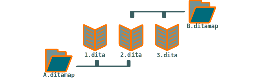

.. Copyright 2011-2018 Olivier Carrère
.. Cette œuvre est mise à disposition selon les termes de la licence Creative
.. Commons Attribution - Pas d'utilisation commerciale - Partage dans les mêmes
.. conditions 4.0 international.

.. code review: no code

.. _partager-des-blocs-information-atomiques-avec-les-conref:

Partager des blocs d'information atomiques avec les *conref*
============================================================

.. sidebar:: :awesome:`fa-bullhorn`

   Lorsque le rédacteur technique veut réutiliser des blocs d'information DITA XML plus
   petits qu'une section, il doit les partager au niveau des fichiers de
   contenu *dita* et non dans les structures de table des matières *ditamap*,
   grâce au mécanisme [conref](http://docs.oasis-open.org/dita/v1.1/OS/archspec/conref.html.

Le principe des *conref* est simple : lorsqu'un *conref* est mentionné au
niveau d'un nœud XML donné, tout le contenu du nœud cible est remplacé par le
contenu du nœud source.

   *Partage de blocs d'information de granulométrie large entre les* ditamap

Une différence notable entre le mécanisme des *conref* et le mécanisme XML des
[xinclude](http://en.wikipedia.org/wiki/XInclude, c'est que le nœud source
doit être conforme au schéma XSD du fichier source *et* du fichier cible. Ce
formalisme rigoureux, s'il s'avère moins souple et oblige parfois à quelques
acrobaties, rend les *conref* beaucoup plus lisibles que les *xinclude* et favorise
leur utilisation.

.. figure:: graphics/conref.svg

   *Partage de blocs d'information de granulométrie fine entre les sections DITA XML*

.. toctree::
   :hidden:

   centraliser-les-conref-dans-un-fichier-unique
   utiliser-le-noeud-xml-de-plus-bas-niveau
   prendre-en-compte-les-contraintes-de-traduction
   imbriquer-les-conref
   maximiser-utilisation-des-conref-pour-faire-baisser-les-couts
   proteger-les-informations-confidentielles

.. text review: yes
