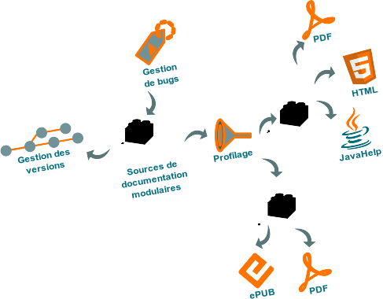

Ce blog est conçu et réalisé par un rédacteur technique spécialisé dans
l'informatique.

Puisqu'il traite des processus et des formats de rédaction technique,
son contenu est cependant moins pertinent que son historique et que ses
branches
[Git](https://github.com/olivier-carrere/redaction-technique.org/).

Il traite des formats, des outils et des tâches suivants :
reStructuredText, DITA XML, [scripts
Bash](https://github.com/olivier-carrere/redaction-technique.org/tree/master/scripts),
awk, sed, expressions rationnelles, Python, gestion de versions, Git,
compilation,
[Makefile](https://github.com/olivier-carrere/redaction-technique.org/commits/master/Makefile),
Ant, XSLT, mise en page, HTML,
[CSS](https://github.com/olivier-carrere/redaction-technique.org/tree/master/_static),
PDF, LaTeX, XSL-FO.

## Libérez vos informations de leurs silos

Des solutions souples et fiables libèrent vos informations des silos
d'information cloisonnés où elles sont emprisonnées et sous-exploitées.
Oubliez MS Word ou FrameMaker pour passer de la maintenance de la
documentation à la gestion du cycle de vie des projets documentaires
modulaires !

### Intégrer la documentation aux processus de développement

La documentation fait partie du logiciel. Fournie avec le produit, elle
doit :

-   sortir en même temps,
-   suivre les mêmes cycles de vie, et
-   faire l'objet des mêmes processus de production et de contrôle
    qualité.

Elle doit répondre idéalement aux critères suivants :

-   pas de *vendor lock-in* (indépendance du format et de l'éditeur de
    contenu),
-   chaînes de publication libres et gratuites,
-   mise en page totalement automatisée.

Il y a quelques années encore, les seuls outils permettant de fournir
des livrables de qualité au format PDF ou HTML reposaient sur des
formats binaires et propriétaires qui s'intégraient mal aux systèmes de
gestion de versions des équipes de développement.

Résultat : réalisée à part, la documentation technique répondait
difficilement aux mêmes exigences de qualité et de délai de mise sur le
marché que les produits.

DocBook, puis DITA XML et reStructuredText ont changé la donne : ces
formats texte peuvent être modifiés avec tout type de programme, du
simple éditeur de texte à l'Integrated Development Environment
graphique, et s'intègrent parfaitement sous Subversion, Git ou tout
autre système de gestion de versions.

### Les sources de ce blog sont gérées sous Git

Ce blog a été initialement développé sous WordPress. L'impossibilité
d'effectuer sous ce Content Management System des modifications
transverses ou d'avoir un suivi précis du cycle de vie du contenu a
entraîné une migration vers le format de balisage léger
reStructuredText.

Toutes les versions de ce blog sont gérées sous le logiciel de gestion
de versions décentralisé [Git](http://www.git-scm.com). Les
modifications de contenu, de structure ou de mise en page peuvent
désormais être :

-   regroupées par lots cohérents,
-   liées à un ticket de logiciel de suivi de problèmes tel que
    *Bugzilla* ou *Trac*,
-   validées par des pairs,
-   partagées entre différentes versions du projet de documentation,
-   annulées en une seule opération, etc.

### Formats sources

Ce blog est disponible en trois formats, basés sur la version 1.1. Ces
formats présentent des niveaux de fonctionnalités et de complexité
différents.

| Format         | Description                                                                                                                                                                    |
|----------------|--------------------------------------------------------------------------------------------------------------------------------------------------------------------------------|
| reStructuredText | [reStructuredText](https://github.com/olivier-carrere/redaction-technique.org/tree/master) est un langage de balisage léger de type Wiki ou Markdown qui, combiné au générateur de documentation Sphinx, offre un bon niveau de fonctionnalités. |
| DITA XML       | [DITA XML](https://github.com/olivier-carrere/redaction-technique.org/tree/DITA_XML) est une architecture documentaire XML sémantique et modulaire complexe qui offre des gains de productivité importants grâce à une forte réutilisation du contenu. |
| DocBook        | [DocBook](https://github.com/olivier-carrere/redaction-technique.org/tree/DocBook) est un langage de balisage XML sémantique qui offre un rapport fonctionnalités/complexité aujourd'hui peu intéressant. |

### Formats cibles

Vous pouvez compiler ce blog avec *Python Sphinx* aux formats :

-   [PDF](),
-   [EPUB](),
-   HTML.

Ces différentes versions sont générées à partir des mêmes sources
exactement. Elles présentent cependant de légères variations, mises en
œuvre par un mécanisme de texte conditionnel. Par exemple, le terme
suivant varie selon le format cible :

| Format cible | Terme               |
|--------------|---------------------|
| PDF          | document            |
| EPUB         | livre électronique  |
| HTML         | site                |

