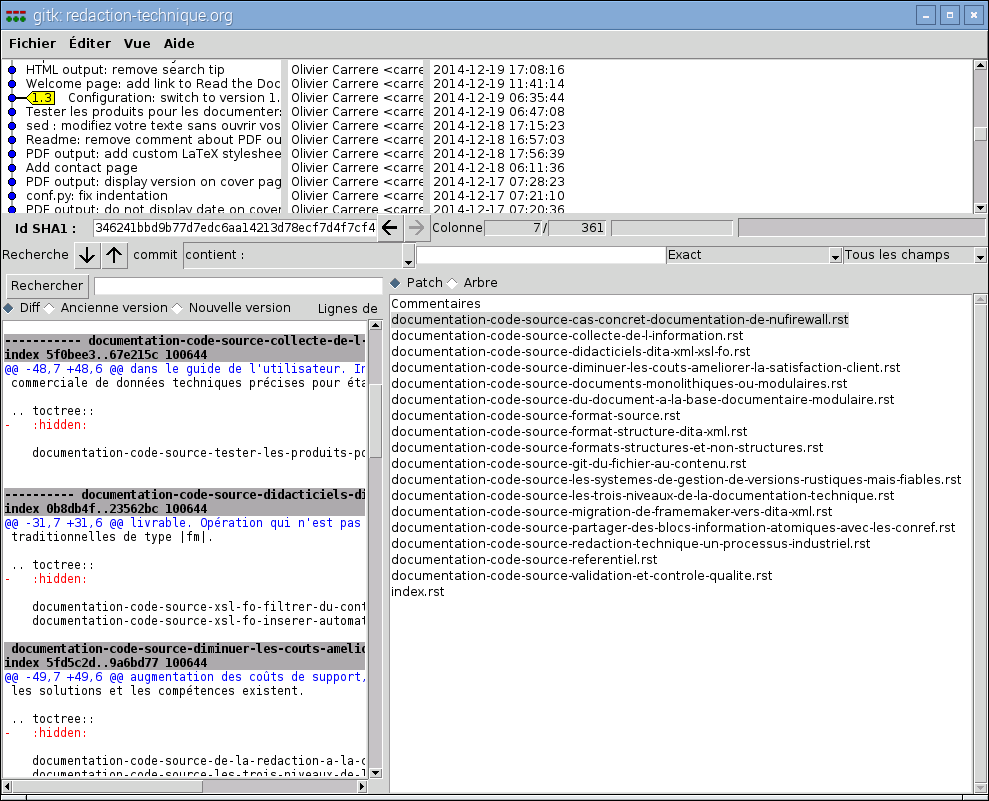

Faut-il une débauche de puissance pour générer une documentation
professionnelle ? Avec son unique giga-octet de mémoire vive et son
processeur de *smartphone*, le semble se positionner comme une bonne
station bureautique des années 2000... À l\'usage, il s\'avère pourtant
qu\'une unité centrale d\'une quarantaine d\'euros suffit largement pour
créer, gérer et générer une documentation aux formats PDF, HTML, ou
autre.

:::: note
::: title
Note
:::

Les buts de ce billet sont de :

-   Présenter un et utiliser des ressources minimales pour créer, gérer
    et publier une documentation professionnelle. La plupart des
    opérations se déroulent donc en mode texte, sous Linux. Si les
    solutions présentées ici fonctionnent également en mode graphique
    sous Windows, elles ne sont peut-être pas disponibles sous *Windows
    10 IoT*, destiné au .
-   Présenter un scénario d\'utilisation aussi simple que possible,
    parfois au détriment de l\'élégance technique.
::::

## Configurez le

**Prérequis**

-   Carte micro-SD de 16 Go classe 10 (de préférence).
-   Connexion Internet filaire ou Wi-Fi.

1.  Installez la distribution Linux Raspbian sur votre *via* [NOOBS]().

2.  Sélectionnez `Menu`{.interpreted-text role="guilabel"} ‣
    `Preferences`{.interpreted-text role="guilabel"} ‣
    `Raspberry Pi Configuration`{.interpreted-text role="guilabel"}.

    La boîte de dialogue `Raspberry Pi Configuration`{.interpreted-text
    role="guilabel"} apparaît.

3.  Sélectionnez l\'onglet `Localisation`{.interpreted-text
    role="guilabel"}.

4.  Cliquez sur `Set Locale`{.interpreted-text role="guilabel"},
    sélectionnez les options suivantes, puis cliquez sur
    `OK`{.interpreted-text role="guilabel"} :

      -----------------------------------------
      Option               Valeur
      -------------------- --------------------
      Language             fr (French)

      Country              FR (France)

      Character Set        UTF-8
      -----------------------------------------

5.  Cliquez sur `Set Keyboard`{.interpreted-text role="guilabel"},
    sélectionnez les valeurs correspondant à votre clavier, puis cliquez
    sur `OK`{.interpreted-text role="guilabel"}.

6.  Cliquez sur `OK`{.interpreted-text role="guilabel"} dans la boîte de
    dialogue `Raspberry Pi Configuration`{.interpreted-text
    role="guilabel"}.

7.  Sélectionnez `Menu`{.interpreted-text role="guilabel"} ‣
    `Accessories`{.interpreted-text role="guilabel"} ‣
    `Terminal`{.interpreted-text role="guilabel"}.

8.  Mettez à jour le système :

    ``` console
    $  sudo aptitude update && sudo aptitude safe-upgrade -y
    ```

    Le temps de lire un épisode du *Surfer d\'argent*, et le système est
    mis à jour.

9.  Sélectionnez `Menu`{.interpreted-text role="guilabel"} ‣
    `Shutdown`{.interpreted-text role="guilabel"} ‣
    `Reboot`{.interpreted-text role="guilabel"}.

    Le redémarre.

## Installez les logiciels nécessaires à la gestion de ce

1.  Sélectionnez `Menu`{.interpreted-text role="guilabel"} \>
    `Accessoires`{.interpreted-text role="guilabel"} \>
    `LXTerminal`{.interpreted-text role="guilabel"}.

2.  Installez les paquets logiciels suivants :

    ``` console
    $ sudo aptitude install -y calibre emacs gitk inkscape python3-sphinx texlive-full
    ```

    Le temps de lire cinq ou six épisodes de *The Amazing Spider-Man*,
    et les logiciels suivants sont installés :

      -----------------------------------------------------------------------
      Logiciel      Description
      ------------- ---------------------------------------------------------
      Calibre       Gestionnaire de livres numériques

      Emacs         Environnement de développement intégré.

      Gitk          Navigateur d\'historique du logiciel de gestion de
                    versions décentralisé.

      Inkscape      Logiciel de dessin vectoriel.

      Python Sphinx Générateur de documentation basé sur le format
                    reStructuredText.

      Texlive       Environnement LaTeX complet pour la génération du au
                    format PDF.
      -----------------------------------------------------------------------

3.  Libérez de l\'espace disque :

    ``` console
    $ sudo aptitude clean
    ```

## Récupérez les sources de ce

1.  Clonez le dépôt des sources de ce  :

    ``` console
    $ git clone https://github.com/olivier-carrere/redaction-technique.org.git
    ```

2.  Placez-vous dans le répertoire des sources de ce  :

    ``` console
    $ cd redaction-technique.org
    ```

## Créez et modifiez le texte

1.  Modifiez un fichier source modulaire de ce  :
    -   à l\'aide d\'un éditeur de texte :

        ``` console
        $ leafpad *coin-du-geek.rst &
        ```

    -   ou à l\'aide d\'un environnement de développement :

        ``` console
        $ emacs *coin-du-geek.rst &
        ```

    -   ou à l\'aide d\'un éditeur en ligne, par exemple :

        ``` console
        $ sed -i "s/répertoire/dossier/g;" *.rst
        ```

## Créez et modifiez les schémas

1.  Modifiez un fichier source des images de ce  :
    -   à l\'aide d\'un logiciel de dessin vectoriel :

        ``` console
        $ inkscape graphics/modulaire-texte-monolithique-binaire.svg &
        ```

    -   ou à l\'aide d\'un éditeur en ligne :

        ``` console
        $ sed -i "s/docbook/XML/g;" graphics/*.svg
        ```

## Gérez les versions de votre documentation

1.  *Commitez* votre lot de modifications sous  :

    ``` console
    $ git config --global user.email "votre email"
    $ git config --global user.name "votre nom"
    $ git add *.rst
    $ git commit -m "Mon lot de modifications de texte"
    $ git add graphics/*.svg
    $ git commit -m "Mon lot de modifications sur les images"
    ```

2.  Affichez l\'historique des modifications des sources de ce  :

    ``` console
    $ gitk &
    ```

    Ô surprise, vous avez sous les yeux, mais oui, une  ! C\'est
    tellement beau, qu\'on va faire une photo :

    

    *Un* commit *atomique s\'étendant sur une bonne quinzaine de
    fichiers*

:::: note
::: title
Note
:::

-   Vos modifications sont purement locales et ne sont pas appliquées
    sur le dépot distant .
-   Si vos modifications apportent une réelle valeur ajoutée à ce
    (correction de coquille, ajout d\'information ou autre), n\'hésitez
    pas à me la soumettre sous forme de patch ou *via* votre compte .
-   n\'est probablement pas hébergé sur un cluster de . Rien n\'empêche
    cependant d\'héberger un dépôt distant sur un connecté au réseau et
    d\'y accéder par connexion sécurisée .
::::

## Générez votre documentation

1.  Revenez dans le terminal, puis récupérez la dernière version
    *taguée* de ce  :

    ``` console
    $ git checkout $(git describe --tags $(git rev-list --tags --max-count=1))
    ```

    :::: note
    ::: title
    Note
    :::

    Oui, je sais, cette commande ne correspond pas exactement à la
    définition de *simple* donnée par le Larousse...
    ::::

2.  Générez la dernière version *taguée* de ce aux format PDF, HTML et
    EPUB :

    ``` console
    $ make all
    ```

3.  Affichez le au format PDF :

    ``` console
    $ xpdf _build/latex/redaction-techniqueorg.pdf &
    ```

4.  Affichez le au format HTML :

    ``` console
    $ epiphany _build/html/index.html &
    ```

5.  Affichez le au format EPUB :

    ``` console
    $  ebook-viewer _build/epub/redaction-techniqueorg.epub &
    ```

Et voilà. En quelques minutes, vous avez :

-   Appliqué des règles de texte conditionnel à des sources communes
    selon le format de publication. Ce contenu est par exemple appelé
    *livre électronique* dans la version EPUB, *document* dans la
    version PDF et encore autrement dans la version HTML.

-   Généré dans trois formats différents une documentation d\'une
    soixantaine de pages comprenant une quarantaine de schémas.

    :::: note
    ::: title
    Note
    :::

    -   Le fichier `Makefile`{.interpreted-text role="file"} est assez
        brut de décoffrage et le temps de compilation peut facilement
        être optimisé.
    -   Nous pourrions mettre en place une solution complète de texte
        conditionnel avec opérateurs booléens et tout et tout grâce au
        moteur de *templating* [Jinja]().
    -   Les observateurs remarqueront que la version HTML du version 1.5
        ne comporte pas de table des matières dans la colonne de droite.
        C\'est qu\'en effet, cette version n\'embarque pas le patch
        *1032292*. Je vous laisse chercher dans l\'historique ... voire
        créer une branche et le *cherry-picker* !
    ::::

Le est donc une plateforme de documentation tout à fait crédible... à
condition de se passer, ou presque, d\'interface graphique !

Le prochain test consistera à générer la version de ce .

Le prochain prochain test consistera à générer ce sur un *smartphone* en
installant une distribution [Linux sur Android]().
