Accélérer sa saisie avec le mode Predictive pour Emacs
======================================================

Ce **didacticiel mode Predictive pour Emacs** (en construction) est destiné à
vous guider dans la mise en place et l'utilisation du mode Emacs d'**aide à la
rédaction** et d'**autocomplétion des mots** anglais et français Predictive dans
un environnement GNU/Linux (en l'occurrence, Debian).

#. En tant qu'utilisateur *root*, installez make et texinfo :

   .. code-block:: console

      aptitude install make texinfo

#. Téléchargez
   `Predictive <http://www.dr-qubit.org/emacs.php#predictive-download>`_.

#. Décompressez l'archive Predictive :

   .. code-block:: console

      $ tar xzvf predictive-0.23.13.tar.gz

#. Placez-vous dans le répertoire :file:`predictive` :

   .. code-block:: console

      cd predictive

#. Compilez *predictive* :

   .. code-block:: console

      make

#. Installez *predictive* :

   .. code-block:: console

      make install

#. Insérez le code suivant dans le fichier :file:`.emacs` :

   .. code-block:: lisp

      ;; predictive install location
           (add-to-list 'load-path "~/.emacs.d/predictive/")
           ;; dictionary locations
           (add-to-list 'load-path "~/.emacs.d/predictive/latex/")
           (add-to-list 'load-path "~/.emacs.d/predictive/texinfo/")
           (add-to-list 'load-path "~/.emacs.d/predictive/html/")
           ;; load predictive package
           (require 'predictive)

#. Lancez Emacs, puis appuyez sur Alt+X et entrez :

   .. code-block:: lisp

      predictive-mode
Afficher un index dans un PDF (mais pas sous DITA Open Toolkit)
===============================================================

Tout n'est pas parfait sous `http://dita-ot.sourceforge.net/1.6/>DITA
Open Toolkit`, le moteur de publication libre DITA XML. Vous avez
méticuleusement inséré vos entrées d'index dans vos fichiers de contenu
DITA XML. Vous générez une sortie PDF et l'index n'apparaît pas. Un message
d'erreur de la compilation vous indique que, hélas, FOP ne supporte actuellement
pas la génération des index.

Face à cette situation, vous avez quatre solutions :

- attendre que FOP supporte les index ; sans date de disponibilité, ce choix
  sera difficile à faire accepter par votre direction (point à éclaircir :
  FOP génère un index en PDF à partir d'un format source DocBook) ;

- abandonner DITA XML ; avouez que ce serait dommage de renoncer aux formidables
  gains de productivité que permet ce format ;

- renoncer à afficher l'index dans le PDF ; les arguments en faveur d'un tel
  choix ont un certain poids : les index sont difficiles à maintenir et offre un
  surplus d'utilisabilité discutable dans un document qui ne sera consulté que
  marginalement sous forme imprimée ;

- abandonner DITA Open Toolkit et se tourner vers une solution propriétaire ;
  les logiciels non open-source, XMetal, par exemple, on souvent recours au
  moteur de publication XEP de RenderX qui lui, supporte parfaitement les index.

Le problème de l'index n'est donc pas un obstacle à l'adoption de DITA XML. Si
votre support final est un document imprimé, les solutions existent. S'il s'agit
d'un format électronique, l'absence d'un index est largement compensée par la
fonction de recherche en plein texte.
Animation Flash : partez à l'assaut du grand public
===================================================

Une **animation Flash** diffusée sur le web est un moyen efficace de promouvoir
un produit **grand public**.

Une animation est généralement destinée au grand public, ne serait-ce que pour
en amortir le coût, relativement élevé.

.. rubric:: Définition du projet

Une animation est un projet relativement onéreux. Il faut donc être sûr de ses
objectifs avant d'initier un tel projet. D'autant plus qu'une animation mal
conçue peut brouiller l'image de l'entreprise.

Souvent, les animations se trouvent en apparence au degré zéro du contenu
technique. Non pas parce qu'elles seraient par nature incapables de véhiculer un
message technique, mais parce qu'on les destine au grand public. Si leur contenu
est faiblement technique, il n'en reste pas moins que leur concepteur doit
parfaitement maîtriser l'aspect technique du sujet dont il traite. Ainsi, pour
une suite d'applications vocales de téléphonie, j'ai choisi de définir un
personnage de *cartoon* pour chaque élément de la suite. L'utilisateur était mis
en scène sous la forme d'un détective privé se déplaçant à moto - ce qui
insistait sur l'aspect « mains libres » de la solution.

.. rubric:: Collecte de l'information

Le *brief* permet de définir le public et les objectifs de l'animation.

.. rubric:: Création du contenu

Le style change du tout au tout sur un support audio-visuel. Il s'agit là
d'accrocher, de séduire et de faire passer un message marketing. De **rédacteur
technique**, il faut donc devenir dialoguiste. C'est donc le moment de jeter aux
orties l'exactitude technique, voire, selon la cible, le strict respect de la
syntaxe !

.. rubric:: Réalisation d'un film d'entreprise

Ceci est une des chaînes de production possibles.

.. rubric:: Format source

Pour le scénario, un traitement de texte est largement suffisant. Aussi courte
qu'elle soit, l'animation exige que soient respectées les règles d'écriture des
scénarios. Le scénario est ainsi la base du dialogue entre le scénariste et le
graphiste. À raison d'une minute par page, cela permet également de connaître à
l'avance la durée de l'animation (par exemple, 17 minutes pour les 17 pages A4
que représente ce `scénario
<http://www.inlibroveritas.net/lire/oeuvre19278.html#page_1>`). De plus,
modifier le scénario avant la réalisation de l'animation est chose facile ; cela
devient pratiquement impossible après publication.  L'ébauche des personnages et
le storyboard demandent un crayon et un papier (et du talent).

.. rubric:: Validation

Chaque étape de la réalisation (personnages, scénario, dialogue, storyboard)
doit être soigneusement validée par toutes les personnes concernées. Le
storyboard est la dernière étape avant l'envolée des coûts de production.

.. rubric:: Format cible

Flash est évidemment le format le plus courant, en attendant la généralisation
du HTML5 et du SVG.

.. rubric:: Livraison

Si l'animation a du succès, ce qui est tout de même le but, les serveurs doivent
être dimensionnés pour supporter la charge. À défaut, il est toujours possible
de publier l'animation sur un site de streaming.
Appauvrissement volontaire du discours
======================================

À l'inverse du style littéraire classique, le style **minimaliste** en rédaction
technique cherche à appauvrir volontairement le discours et notamment à faire la
chasse aux synonymes, utiles uniquement dans les index ou pour le référencement
naturel des pages web.

Abandonner l'écriture narrative amène à concevoir des phrases courtes, à la
structure syntaxique élémentaire et à éviter le recours aux synonymes. Ce style
pauvre littérairement assure que le **rédacteur technique** est compris de son
public, qui recherche de l'information factuelle, pas de la poésie (les grands
poètes et prosateurs du XXe, Prévert, Cendrars, avaient d'ailleurs
épousé la modernité en recourant à un style volontairement limité dans ses
moyens).

+---------------------------+--------------------------------------------------+
|Suppression des fioritures |Pour qui aime écrire, rédiger dans un style       |
|                           |dépouillé en se limitant aux informations utiles  |
|                           |revient à s'imposer un carcan. Cependant, le      |
|                           |**rédacteur technique** n'écrit pas pour son      |
|                           |plaisir, mais pour aider l'utilisateur. Le plaisir|
|                           |de la belle prose est d'ailleurs compensé par le  |
|                           |défi stylistique sans cesse renouvelé d'exprimer  |
|                           |avec le moins de mots possible une idée univoque. |
|                           |                                                  |
|                           |L'impératif, le style direct, et l'absence de     |
|                           |formules de politesse sont donc à proscrire. La   |
|                           |politesse consiste ici à ne pas faire perdre son  |
|                           |temps au lecteur. Ne pas alléger son texte serait |
|                           |un peu comme installer des marteaux brise vitre   |
|                           |emballés dans leur boîte et du papier-cadeau.     |
|                           |                                                  |
|                           |Les introductions inutiles, les transitions et les|
|                           |digressions n'ont pas leur place dans une         |
|                           |documentation technique. Les introductions de     |
|                           |tâches intitulées par exemple *Créer un fichier*  |
|                           |et qui ont pour tout contenu *Pour créer un       |
|                           |fichier, suivez la procédure ci-dessous* ne sont  |
|                           |pas de l'information il s'agit de bruit qui       |
|                           |perturbe la bonne réception de l'information utile|
|                           |; après le titre d'une tâche doivent donc suivre  |
|                           |soit des prérequis, soit directement la première  |
|                           |étape de la procédure.                            |
+---------------------------+--------------------------------------------------+
|Réduction du champ         |Le **rédacteur technique** doit oublier ses       |
|sémantique                 |rédactions scolaires et faire une chasse sans     |
|                           |merci aux synonymes en effet la principale qualité|
|                           |de la langue du **rédacteur technique** est son   |
|                           |univocité, ou absence d'ambiguïté.                |
+---------------------------+--------------------------------------------------+
Base de données SQL
===================

Dans le cas d'un CMS de type Drupal, Joomla ou WordPress, le référentiel est une
base de données SQL. Il conserve un historique, mais uniquement article par
article et ne permet pas la recherche et le remplacement de texte à travers tout
le contenu. Cela peut justifier le choix de gérer le contenu sous-jacent du CMS
sous forme de fichiers texte.
Cas concret : documentation de NuFirewall
=========================================

La documentation de `NuFirewall
<http://linuxfr.org/news/nufirewall-le-pare-feu-libre-sans-prise-de-t%C3%AAte>`_,
qui a été perçue par la presse comme `un point fort du produit
<http://www.linformaticien.com/tests/id/20068/categoryid/48/edenwall-nufirewall-le-pare-feu-nouvelle-generation.aspx>`_,
a été réalisée sous DITA.

Si je n'avais pas utilisé un format qui favorise au maximum la réutilisation de
l'information, je n'aurais pas autant pu me consacrer à l'essentiel : le
contenu.
Cas concrets d'utilisation de DITA XML
======================================

L'utilisation quotidienne du **format de rédaction structurée** DITA XML sur des
projets multilingues en tant que **rédacteur technique** m'a amené à développer
certaines solutions et astuces que je vous livre ici. Tout retour d'expérience
est le bienvenu !
Centraliser les conref dans un fichier unique
=============================================

Pour favoriser l'utilisation des `conref
<http://docs.oasis-open.org/dita/v1.1/OS/archspec/conref.html>`_ au sein d'une
équipe de **rédacteurs techniques**, et également pour simplifier la maintenance
des *conref*, il s'avère très efficace de centraliser tous les *conref* dans un
fichier DITA dédié.

Il est *a priori* plus simple, pour réutiliser un contenu d'un fichier **DITA
XML** existant, de pointer vers ce contenu sans l'extraire de son contexte
d'origine. Cependant, un des grands principes de la réutilisation du contenu est
de décontextualiser le contenu. Il est donc à terme beaucoup plus efficace pour
le **rédacteur technique** d'extraire le contenu réutilisé de son fichier
d'origine et de le placer dans un fichier ne contenant que des sources de
**conref**. Il est en effet beaucoup plus facile de placer tous les éléments
sources dans un référentiel unique que de devoir chercher les différentes
sources dans une multitude de fichiers.

.. figure:: media/conref-non-centralises.png

   Gérer les *conref* de manière décentralisée est peu efficace

Les *conref* sont en effet résolus à la compilation même si les fichiers
contenant les valeurs sources ne sont pas référencés dans le fichier
:file:`ditamap` permettant de générer le livrable (ce qui veut dire également
que les fichiers contenant les valeurs sources des *conref* peuvent se trouver
dans un répertoire de niveau supérieur à celui du *ditamap*).

.. figure:: media/conref.png

   Bonne gestion des *conref

Les fichiers de contenu référencés dans des structures *ditamap* ne contiennent
donc que des *conref* cibles, et un fichier central fédère tous les *conref*
sources ; il contient éventuellement également quelques références internes à
des *conref* cibles.

Ce fichier central doit être de même type (*task*, *concept*, *reference*, etc.)
que les fichiers de contenu, ou du moins du type *composite*, qui accepte tous
types de structures DITA XML.Pour des raisons d'organisation, je trouve
personnellement efficace de créer un fichier central par type de *topic* DITA
XML, et donc de même type, pour partager les informations propres à chaque
type. Je réserve le type *composite* à un fichier central " fourre-tout "
contenant des informations partagées entre différents types de *topics*.

Tous les *conref* sources d'un fichier donné doivent avoir un ID unique dans ce
fichier ; veillez à utiliser des noms explicites pour les humains, vos fichiers
*dita* contenant des *conref* cibles deviendront sinon rapidement illisibles !
Collecte de l'information
=========================

Le **rédacteur technique** collecte l'information auprès de différentes sources,
internes et externes à l'entreprise.

Une fois le projet de rédaction technique clairement défini, le **rédacteur
technique** collecte toute l'information disponible :

- spécifications du produit, Intranet, pages `Trac
  <http://trac.edgewall.org/>`_…,

-  interview du service R&D,

-  manipulation du produit,

-  interview du service marketing,

-  interview de clients,

-  analyse de la concurrence,

-  lecture de la presse spécialisée.

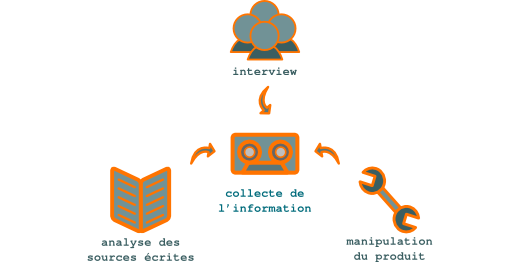

   Collecte de l'information

Les informations doivent être recoupées pour minimiser le risque de transmettre
des informations erronées ou plus à jour. Le rédacteur technique doit se livrer
à un véritable travail d'enquête. En se mettant à la place de l'utilisateur, il
vérifie chaque information et fait le tri entre les données pertinentes et
celles qui ne seront que du bruit perturbant le message.

Premier utilisateur des solutions développées par la société, le rédacteur
technique a le rôle du *candide* qui remet chaque aspect de l'information à
transmettre dans son contexte. Il peut par exemple décider, contre l'avis de la
direction technique, de passer sous silence des informations très techniques
dans le guide de l'utilisateur. Inversement, il pourra étayer une brochure
commerciale de données techniques précises pour étayer le discours marketing.
Concept DITA XML
================

Les sections **concept** permettent au **rédacteur technique** de présenter une
introduction des sections *task* ou *reference*.

Exemple de structure d'un *concept* :

.. aafig::

                +-title
                |
      concept--shortdesc
                |
                +-conbody
Création du contenu
===================

Le **rédacteur technique** crée le contenu du projet de **rédaction technique**
dans un dialogue constant avec les différents acteurs de la société : services
R&D, marketing. Il prend en compte en amont les différentes contraintes liées au
cycle de vie des supports de rédaction technique.

En particulier, le **rédacteur technique** a soin de :

- faire valider le contenu à ses interlocuteurs afin d'apporter les
  modifications nécessaires aussi tôt que possible ; ceci garantit que le
  résultat sera conforme au projet initialement défini,

- minimiser le volume de texte et d'images sources afin de réduire les coûts de
  production, de maintenance et de traduction,

- prendre en compte dès le début du projet les contraintes
  d'internationalisation.
Créer des documents différents à partir des mêmes sources DITA XML (texte conditionnel)
=======================================================================================

DITA XML offre un mécanisme de **texte conditionnel**. Ce mécanisme favorise la
réutilisation du contenu source et évite la redondance des informations. Ce
didacticiel aidera le **rédacteur technique** à utiliser ce mécanisme en
quelques minutes.

.. rubric:: Prérequis

- Vous avez installé DITA Open Toolkit dans le répertoire DITA-OT1.5.4 sous
  GNU/Linux ou Windows.

#. Collez le code suivant dans un fichier et enregistrez ce dernier sous le nom
   de :file:`texte-conditionnel.dita` dans le répertoire :file:`DITA-OT1.5.4`:

   .. code-block:: xml

      <?xml version="1.0" encoding="utf-8"?>
      <!DOCTYPE topic PUBLIC "-//OASIS//DTD DITA 1.2 Topic//EN" "../../dtd/technicalContent/dtd/topic.dtd>
      <topic id="exemple-topic" xml:lang="fr-fr>
      <title>Utilisation du texte conditionnel
      <body>
      <hazardstatement>
      <messagepanel audience="electriciens>
      <typeofhazard>
      Danger pour les électriciens
      </typeofhazard>
      <consequence>
      Risque d'électrocution
      </consequence>
      <howtoavoid>
      Ne touchez pas les fils électriques.
      </howtoavoid>
      </messagepanel>
      <messagepanel audience="plombiers>
      <typeofhazard>
      Danger pour les plombiers
      </typeofhazard>
      <consequence>
      Risque de noyade
      </consequence>
      <howtoavoid>
      Ne plongez pas dans la piscine.
      </howtoavoid>
      </messagepanel>
      </hazardstatement>
      
 Tout contenu placé entre balises ne comportant pas de valeur
      <i>audience</i> exclue dans un fichier <i>.ditaval</i> est publié dans les
      documents destinés aux plombiers et aux électriciens.  

      </body>
      </topic>

   .. note::

      Ce code contient des balises DITA contenant des valeurs *audience*
      différentes: nous allons exclure le contenu d'une de ces deux balises lors
      de la génération du fichier cible en utilisant la clé *audience*.

#. Collez le code suivant dans un fichier et enregistrez ce dernier sous le nom
   de :file:`texte-conditionnel.ditamap` dans le répertoire
   :file:`DITA-OT1.5.4`:

   .. code-block:: xml

      <?xml version="1.0" encoding="utf-8"?>
      <!DOCTYPE bookmap PUBLIC "-//OASIS//DTD DITA BookMap//EN" "dtd/bookmap/dtd/bookmap.dtd>
      <bookmap id="texte-conditionnel>
      <booktitle>
      <mainbooktitle>
      Exemple de texte conditionnel
      </mainbooktitle>
      </booktitle>
      <chapter href="texte-conditionnel.dita"/>
      </bookmap>

#. Collez le code suivant dans un fichier et enregistrez ce dernier sous le nom
   de :file:`electriciens.ditaval` dans le répertoire :file:`DITA-OT1.5.4`:

   .. code-block:: xml

      <?xml version="1.0" encoding="UTF-8"?>
      <val>
      <prop att="audience" val="electriciens" action="include"/>
      <prop att="audience" val="plombiers" action="exclude"/>
      </val>

#. Collez le code suivant dans un fichier et enregistrez ce dernier sous le nom
   de :file:`plombiers.ditaval` dans le répertoire :file:`DITA-OT1.5.4`:

   .. code-block:: xml

      <?xml version="1.0" encoding="UTF-8"?>
      <val>
      <prop att="audience" val="electriciens" action="exclude"/>
      <prop att="audience" val="plombiers" action="include"/>
      </val>

#. Ouvrez un terminal et entrez la commande suivante dans le répertoire
   :file:`DITA-OT1.5.4`:

   .. code-block:: xml

      $ java -jar lib/dost.jar /i:texte-conditionnel.ditamap \
      /filter:electriciens.ditaval /outdir:. /transtype:pdf2

   Ouvrez le fichier :file:`texte-conditionnel.pdf` ; il contient des
   informations destinées:

   - aux plombiers et aux électriciens,
   - uniquement aux électriciens.

#. Ouvrez un terminal et entrez la commande suivante dans le répertoire
  :file:`DITA-OT1.5.4`:

  .. code-block:: console

     $ java -jar lib/dost.jar /i:texte-conditionnel.ditamap \
     /filter:plombiers.ditaval /outdir:. /transtype:pdf2

   Ouvrez le fichier :file:`texte-conditionnel.pdf` ; il contient des
   informations destinées:

  - aux plombiers et aux électriciens,
  - uniquement aux plombiers.
Définition du projet
====================

Un projet de **rédaction technique** apporte une valeur ajoutée aux produits et
aide l'entreprise à mieux commercialiser son offre sur son marché. Mais, comme
pour les projets de R&D ou de marketing, la définition du projet permet d'en
**estimer le budget** et les retombées.

Communiquer des informations techniques sans savoir à qui ni dans quel but est
un effort vain. Avant d'initier un projet de **rédaction technique et
marketing**, il est indispensable de clairement le définir. Il convient
notamment de déterminer :

+------------------------------+------------------------------+
|son objectif                  |augmenter la notoriété de     |
|                              |l'entreprise, accroître sa    |
|                              |couverture médias, amener les |
|                              |prospects à prendre contact   |
|                              |avec la société, réduire les  |
|                              |coûts de support technique…   |
+------------------------------+------------------------------+
|sa cible                      |grand public, journalistes,   |
|                              |prospects, clients…           |
+------------------------------+------------------------------+
|sa forme                      |livre blanc, mode d'emploi ou |
|                              |guide de l'utilisateur,       |
|                              |brochure et flyer, site web,  |
|                              |magazine d'entreprise, print  |
|                              |ou online…                    |
+------------------------------+------------------------------+
|sa langue                     |                              |
+------------------------------+------------------------------+
|son mode de diffusion         |                              |
+------------------------------+------------------------------+

L'analyse des résultats du projet donne ensuite de précieux renseignements pour
améliorer encore l'impact des projets suivants.
De la modularisation au partage de l'information
================================================

Indépendamment du choix des outils, le modèle de l'aide en ligne se base sur des
**briques d'information** dont la structure est identique. Il est donc plus
facile de réorganiser l'information au fur et à mesure de l'ajout, de la
suppression ou de la modification de briques, ou pour cibler des besoins
spécifiques.

De plus, une fois l'information divisée en briques de structure homogène, il
devient beaucoup plus facile de la réutiliser :

- si un seul fichier contient tout un livre, la répétition d'une partie de
  contenu doit se faire par duplication (copier-coller) ; la mise à jour ou la
  traduction de cette brique devient donc fastidieuse et est une source
  d'erreurs importante ;

- si un document est une agrégation de fichiers autonomes, la répétition dans le
  document final d'une partie de contenu se fait par insertion de liens vers un
  fichier unique ; la mise à jour ou la traduction de cette partie de contenu ne
  doit donc être effectuée qu'une seule fois, ce qui diminue les coûts et
  améliore la qualité.
De la rédaction à la communication technique
============================================

Le but de la **communication technique** est de transformer les prospects en
clients satisfaits. Le **rédacteur technique** fournit au marché l'information
dont il a besoin pour sélectionner, évaluer et utiliser une solution de haute
technologie. Au sein de l'entreprise, il est l'interface entre les services R&D
et marketing. À l'extérieur, il crée le dialogue entre l'entreprise et ses
différents publics.

La **communication technique** est souvent réduite à la **rédaction
technique**. La rédaction technique est destinée à fournir la documentation des
produits, et intervient en aval de la vente. La communication technique
intervient dès l'amont du processus de vente et accompagne le produit tout au
long de son cycle de vie. Destinée autant au grand public, aux journalistes et
aux prospects qu'aux clients, elle dépasse et englobe la rédaction technique,
destinée uniquement aux utilisateurs.

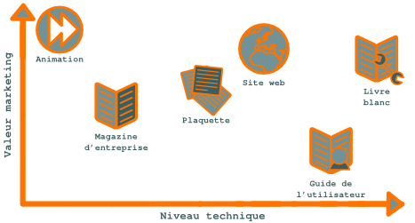

   Supports de rédaction marketing et technique

La communication technique a pour but de montrer l'adéquation d'un produit aux
besoins de sa cible. Elle recourt pour cela à différents supports, plus ou moins
adaptés au niveau d'expertise de son public et à son statut par rapport à
l'entreprise (grand public, journalistes, prospects, clients…). Le **rédacteur
technique** doit adapter son message à chaque public. Utilisant toutes les
ressources de la communication (rédaction, illustrations, films, animations…) il
prend constamment en compte la dimension marketing. Pour augmenter les ventes,
tout support de communication doit être un outil marketing.

Valoriser un contenu signifie :

- produire un contenu de qualité adapté à sa cible,
- conserver tout le contenu produit, dans ses différentes versions,
- réutiliser ou recycler à bon escient le contenu produit.

Mais peut-on être à la fois logique et créatif ? C'est nécessaire dans les
domaines de la composition musicale, de l'architecture et du développement
informatique. C'est également le cas pour un rédacteur technique.

Ceci nécessite :

- une étude de l'adéquation entre les besoins du public et les moyens de
  l'entreprise,
- une bonne capacité de création et de rédaction,
- une gestion de projet rigoureuse,
- un processus industriel de production et de valorisation du contenu.

Ce site présente quelques exemples de supports de communication technique, leur
intérêt marketing, leur adéquation au public et les modalités de leur
valorisation.

Laisser la place à la créativité

Je vais faire ici l'éloge du jeu. Si chacun *s'amuse* à faire ce qu'il fait, sa
passion se transmet directement à son public. C'est une des grandes leçons du
mouvement du logiciel libre et de l'esprit *hacker* : comme `dit Benjamin
Bayart :
<http://www.atlantico.fr/decryptage/anonymous-gamins-bricoleurs-etat-megaupload-hackers-attaque-cyberespace-benjamin-bayart-273658.html>`_

*Un hacker, c'est avant tout un bricoleur, même pas forcément génial, qui
utilise les choses pour ce qu'elles sont, et pas pour ce qu'elles paraissent.*

De même en communication technique : on envisage de faire un livre blanc ? Je
vais en faire un outil marketing de premier plan. On projette de réaliser un
journal ? Je vais y placer une rubrique expert traitant des utilisations
avancées des produits.

Malgré tout l'intérêt que présente la planification, il est utile de lancer des
projets non planifiés pour laisser place à la créativité. Tout dépend des
ressources de l'entreprise, bien entendu, mais laisser une petite portion de
temps et de budget à l'imprévu donne une chance supplémentaire de se démarquer
de la concurrence. C'est d'ailleurs ce qu'a bien compris Google, chez qui les
développeurs peuvent consacrer 20 % de leur temps à des projets personnels. Ce
qui vaut pour l'ingénierie vaut également pour la communication. Ce site s'est
d'ailleurs construit sans plan préétabli.
Des schémas, mais pas de captures d'écran
=========================================

Une application puriste du **minimaliste** en rédaction technique pourrait
bannir totalement toute image. S'il faut les exclure des procédures pas à pas,
les schémas peuvent cependant grandement faciliter la compréhension de
concepts. Une bonne image ne vaut pas mieux qu'un long discours, elle complète
un bon discours. Une mauvaise image le brouille.

+------------------------+-----------------------------------------------------+
|Pas de capture d'écran  |Les captures d'écran sont difficiles à maintenir et  |
|                        |apportent plus de bruit que d'information utile pour |
|                        |donner du *feedback* à l'utilisateur et lui indiquer |
|                        |qu'il est toujours sur les rails de la procédure, il |
|                        |est plus simple et efficace d'indiquer le nom de la  |
|                        |fenêtre qui apparaît plutôt que d'en faire une copie |
|                        |d'écran ; de plus, les copies d'écran doivent être   |
|                        |prohibées dans une aide en ligne, l'utilisateur      |
|                        |risquant de cliquer dessus en la prenant pour        |
|                        |l'interface du logiciel et non pour son image.       |
+------------------------+-----------------------------------------------------+
|Schémas                 |Les schémas apportent une information utile, tout    |
|                        |d'abord parce qu'il ne peuvent pas être ambigus, à la|
|                        |différence d'une phrase ampoulée (la langue est par  |
|                        |nature ambiguë ; il suffit de traduire une dizaine de|
|                        |fois une phrase pour obtenir deux sens très          |
|                        |différents). Les schémas ne doivent figurer que dans |
|                        |des sections de description de concepts.             |
+------------------------+-----------------------------------------------------+
Didacticiels DITA XML et XSL-FO
===============================

Les **didacticiels** suivants aideront le **rédacteur technique** à mettre en
place et à utiliser une chaîne de création et de publication `DITA XML <
href="http://dita.xml.org/>` libre.

DITA XML est le langage de rédaction structurée qui permet de créer des
documents sans se soucier de leur aspect final sur différents supports. XSL-FO
est le langage qui permet de réorganiser et filtrer le contenu XML et de lui
appliquer une mise en page à l'aide d'une feuille de style.

Un ensemble de fichiers DITA contient tout le contenu relatif par exemple à un
produit. Différentes feuilles de style XSL-FO permettront de publier ce contenu
en PDF, en HTML ou sous un autre format en appliquant des transformations
complexes. Le résumé de chaque section du document final pourra par exemple
apparaître dans la version HTML et non dans la version PDF.

De même, si un produit doit être fourni en marque blanche à différents clients,
une mise en page totalement différente peu être appliquée à sa documentation en
spécifiant simplement un autre jeu de feuilles de style lors de la génération du
livrable. Opération qui n'est pas envisageable en pratique avec des solutions
traditionnelles de type FrameMaker.
Documentation technique : diminuer les coûts, améliorer la satisfaction client
==============================================================================

La **documentation technique**, c'est comme une ampoule: une ampoule basse
consommation demande un investissement plus important en début de cycle de vie,
mais a rapidement un coût plus faible.

Comme une ampoule basse consommation, un processus de **rédaction technique**
industriel diminue les coûts. Il réduit également le *time to market*. À coût
initial légèrement supérieur ou égal, il améliore également la qualité.

+-------------------------+------------------------------------------------+
|Coût moindre             |- moins de volume à créer                       |
|                         |                                                |
|                         |- suppression des mises à jour répétitives      |
|                         |                                                |
|                         |- moins de mots à traduire                      |
+-------------------------+------------------------------------------------+
|*Time to market* réduit  |- réutilisation maximale du contenu             |
|                         |                                                |
|                         |- risque zéro de perte de données               |
+-------------------------+------------------------------------------------+
|Qualité améliorée        |- briques d'information facilement optimisables |
|                         |                                                |
|                         |- cohérence parfaite du contenu d'entreprise    |
+-------------------------+------------------------------------------------+

Une documentation industrielle repose sur:

- un **format documentaire modulaire**,
- un format de **rédaction structurée**,
- une **chaîne de production et de publication documentaire** fiable.

Si la chaîne de création et de publication choisie repose sur des logiciels
*open-source*, le coût de mise en place et d'apprentissage peut même être
compensé par l'économie sur les licences de logiciels.  En tout état de cause,
de trop nombreuses sociétés de haute technologie ont industrialisé leurs
processus métier, mais laissent en friche la création, la gestion et la
publication de leur contenu d'entreprise. Les coûts cachés (rédaction par des
ingénieurs et non par un **rédacteur technique** compétent, mauvaise
exploitation du capital immatériel, diminution de la satisfaction client,
augmentation des coûts de support, etc.) peuvent être considérables. Pourtant,
les solutions et les compétences existent.
DITA Open Toolkit : afficher les références croisées dans les PDF
=================================================================

Les **références croisées** sont un élément important d'une **documentation
technique** bien structurée. Elles permettent à l'utilisateur de naviguer
facilement dans les briques d'information et sont un élément crucial de
l'utilisabilité du document final. **DITA Open Toolkit** les gère très bien, à
condition d'effectuer quelques réglages.

Vous avez placé des balises *related-links* correctement formatées dans vos
fichiers de contenu DITA, ou mieux, une `reltable
<http://docs.oasis-open.org/dita/v1.0/langspec/reltable.html>`_ dans votre
structure de table des matières ditamap (la *reltable* permet de
décontextualiser votre contenu et donc de mieux le réutiliser). Vous lancez
votre commande de génération du PDF et, mauvaise surprise, aucune section *Voir
aussi* (pour des raisons de « décontextualisation », et pour se donner la
possibilité de réutiliser le contenu ailleurs, les références croisées ne sont
pas placées dans le corps du texte, mais en fin de section, dans une rubrique
dédiée) n'apparaît dans le fichier cible ! Vous essayez alors de générer une
version HTML de votre contenu et là, votre section *Voir aussi* est bien
présente. **DITA Open Toolkit** ne supporterait-il pas les références croisées
dans les PDF?

Fort heureusement, non. Par défaut (allez savoir pourquoi), les **références
croisées** ne sont pas générées dans les PDF par **DITA Open Toolkit**. Pour les
afficher, attribuez la valeur *no* la variable *disableRelatedLinks* du fichier
:file:`demo/fo/build_template.xml`. Si vous utilisez ant, il vous faudra
également passer le paramètre *args.fo.include.rellinks=all* comme suit :

.. code-block:: console

   $ ant -Dargs.input=samples/sequence.ditamap -Doutput.dir=out/ \
   -Dtranstype=pdf2 -Dargs.fo.include.rellinks=all

C'est ce genre de petits détails qui rebutent les novices et il est fort dommage
que cette valeur ne soit pas la valeur par défaut. Note à moi-même :* faire un
rapport de bug courtois auprès des développeurs de ce merveilleux outil.
DITA Open Toolkit
=================

Le logiciel libre sous licence Apache 2.0 et Common Public License 1.0 DITA Open
Toolkit transforme les *maps* et les *topics* DITA en livrables (PDF, RTF, HTML,
Javahelp, etc.).

Initialement développé par IBM, il est actuellement maintenu par une `équipe de
bénévoles <http://dita-ot.sourceforge.net/who_we_are.html>`_. Il repose sur
Java, Ant, et XSL (XSLT/XPath/XSL-FO) et tourne sous GNU/Linux et Windows. Les
développeurs peuvent créer des plugins pour effectuer de nouvelles
transformations (telles que DocBook2DITA pour convertir du contenu Docbook en
DITA) ou créer des spécialisations (telles que APIRef, spécialisation pour la
documentation des logiciels).
DITA XML
========

Les **formats structurés** **DocBook** et **DITA XML** sont spécialement conçus
pour la **communication technique**. Le second pousse plus loin la structuration
et la modularisation du contenu d'entreprise.

Je préfère `DITA XML <http://dita.xml.org/>`_ à `DocBook
<http://www.docbook.org/>`_, car ce format pousse plus loin la structuration de
l'information. L'utilisation d'un fichier à part pour organiser hiérarchiquement
les modules d'information est également un avantage décisif. Utiliser DITA XML
m'a permis de fortement réduire le volume de texte source et de publier
indifféremment au format PDF ou HTML . Pour minimiser le risque d'erreurs, j'ai
réalisé un script bash de publication personnalisé pour n'utiliser qu'un fichier
:file:`ditamap` afin d'avoir la même structure de table des matières pour les
versions française et anglaise.  Une mise en page simple et élégante en PDF est
obtenue directement grâce à la chaîne de publication sous licence libre `DITA
Open Toolkit <http://dita-ot.sourceforge.net/>`_. Pour obtenir une mise en page
plus complexe, en revanche, le plus simple est d'importer les fichiers sous
FrameMaker et de profiter de son puissant moteur d'impression, ou d'utiliser une
chaîne de production propriétaire. La modification des feuilles de style de DITA
Open Toolkit est en effet complexe, car non documentée.
DocBook ou DITA XML ?
=====================

Certaines entreprises ont parfois un contenu existant au format `DocBook
<http://www.oasis-open.org/docbook/>`_. Géré souvent par les acteurs les plus
techniques de la société, il coexiste la plupart du temps avec d'autres contenus
au format FrameMaker ou traitement de texte. S'il est décidé de fédérer tout le
contenu d'entreprise sous un seul format, il semble naturel de capitaliser les
efforts fournis sur la chaîne de création et de publication **DocBook** et de
sélectionner ce format. C'est pourtant se priver des gains de productivité
spectaculaires offerts par `DITA XML
<http://en.wikipedia.org/wiki/Darwin_Information_Typing_Architecture>`_.

Il est facile de générer du **DocBook** à partir de DITA XML. DITA Open Toolkit
propose par défaut ce format cible, au même titre que le PDF ou le
HTML. L'opération inverse ne peut pas être totalement automatisée. Pourquoi ?

.. figure:: media/entropie.png

   Il n'est pas possible de migrer automatiquement des données de formats
   pauvres vers des format riches en information

Il n'est pas possible de migrer automatiquement des données de formats pauvres
vers des format riches en information (pour être aussi exact que possible, vous
pouvez enregistrer une image JPEG au format TIFF ; mais cette image aura une
qualité égale à celle de l'image JPEG, inférieure à la qualité habituelle des
images TIFF. En revanche, on ne peut à ma connaissance pas enregistrer une image
TIFF sous un format RAW).

Tout simplement parce que le contenu au format DITA XML contient plus
d'informations. Passer d'un format plus riche à un format plus pauvre en
information est une opération entropique qui peut facilement être
automatisée. Par exemple, générer un PDF à partir de DITA XML. Effectuer
l'opération inverse exige d'injecter de l'intelligence, opération que seul
l'être humain peut aujourd'hui effectuer.

Si votre contenu était une photo, nous pourrions faire l'analogie suivante :

+--------------------+---------------------------------------------------------+
|**Format de         |**Format de photo**                                      |
|contenu**           |                                                         |
+--------------------+---------------------------------------------------------+
|DITA XML            |`RAW                                                     |
|                    |<http://fr.wikipedia.org/wiki/RAW_(format_d%27image)>`_  |
|                    |(ce n'est bien sûr qu'une analogie, DITA XML étant un    |
|                    |standard, à la différence du format RAW).                |
|                    |                                                         |
+--------------------+---------------------------------------------------------+
|DocBook             |`TIFF                                                    |
|                    |<http://fr.wikipedia.org/wiki/Tagged_Image_File_Format>`_|
|                    |                                                         |
+--------------------+---------------------------------------------------------+
|PDF                 |`JPEG <http://fr.wikipedia.org/wiki/Jpeg>`_              |
+--------------------+---------------------------------------------------------+

Le passage de RAW en TIFF et de TIFF en JPEG est destructif et ne peut se faire
en sens inverse.

.. figure:: media/entropie-dita-docbook.png

   Le PDF est sémantiquement plus pauvre que DocBook, lui-même plus pauvre que
   DITA XML.

Le PDF est sémantiquement plus pauvre que DocBook, lui-même plus pauvre que DITA
XML (le PDF est cependant plus riche en informations de mise en page,
appliquées automatiquement à partir d'une feuille de style).

Si votre entreprise tient absolument à utiliser du **DocBook**, il est toujours
loisible de générer le contenu **DocBook** à partir d'un contenu source au
format DITA XML. À condition que le contenu source reste au format DITA XML
(c'est à dire, à condition qu'aucune modification apportée au contenu
**DocBook** ne soit sauvegardée) et que le format **DocBook** ne soit qu'une
étape de la génération des livrables, au même titre que le format FO, vous
bénéficiez ainsi des fonctionnalités avancées de réutilisation du contenu que
propose DITA XML.

L'effort de migration d'un format non structuré est certes un peu plus important
vers DITA XML que vers **DocBook**, puisque vous devez injecter plus
d'informations sémantiques. Vous devez également migrer le contenu **DocBook**
vers DITA XML, ce qui représente également un effort, quoique plus faible. Mais
votre contenu est immédiatement de meilleure qualité, car plus structuré. Et
vous pourrez rapidement cueillir tous les fruits de votre labeur, notamment si
une traduction de votre contenu dans une nouvelle langue est envisagée.

De manière générale, un professionnel a toujours intérêt à travailler sur le
format le plus riche, ne serait-ce que pour être pro-actif et anticiper sur les
nouveaux besoins.
Documents monolithiques ou modulaires
=====================================

Le format source peut reposer sur des **fichiers monolithiques** ou sur des
**grappes de fichiers modulaires**.

Les **fichiers monolithiques** (par exemple Word, LibreOffice ou Framemaker)
centralisent tout le contenu dans un seul fichier, facile à manier, mais qui
limite le partage du contenu ; le risque de disposer d'informations incohérentes
ou en doublon est alors important.

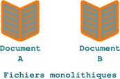

   Format source de rédaction technique monolithique

Les **grappes de fichiers modulaires** (par exemple `DITA XML
<http://dita.xml.org/>`_ ou `DocBook <http://www.docbook.org/>`_)
agrègent le contenu de multiples fichiers, ce qui favorise le partage et la
réutilisation de blocs de contenu. Un tel système est difficile à mettre en
place au niveau de toute l'entreprise, mais devrait être la norme pour une
équipe de **rédaction technique**.

.. figure:: media/grappe.png

   Format source de rédaction technique modulaire

Certains traitements de texte proposent de gérer des documents modulaires, mais
ils le font mal.  Inversement, un document DocBook ou DITA, par exemple, peut
être monolithique, mais perd alors de sa souplesse.
Du document à la base documentaire modulaire
============================================

Le modèle du livre est encore prédominant pour créer et gérer
l'information. Mais le **contenu d'entreprise** est souvent disséminé dans de
nombreux documents, sous des formats hétérogènes. Ceci se traduit par des
doublons, des incohérences, un coût de mise à jour et de traduction élevé, et
des retards de livraison. Le **rédacteur technique** dispose cependant d'autres
modèles, plus efficaces.

Le format de **rédaction structurée** `http://dita.xml.org/>DITA XML` propose de
passer du modèle du livre à celui du de la **base documentaire modulaire**. Le
contenu d'entreprise repose sur des briques uniques, qui peuvent être assemblées
dynamiquement, à la demande, pour produire des documents sous différents formats
cibles.

.. figure:: media/documentation-modulaire.png

   Une documentation modulaire offre une souplesse inégalée

Le volume de contenu source est minimisé, ce qui diminue les coûts de création,
mise à jour et traduction du contenu d'entreprise. De plus, le **rédacteur
technique** peut gérer les processus de rédaction, validation et traduction
module par module. Les *workflows* peuvent ainsi être parallélisés, ce qui
réduit les délais de mise sur le marché.

Les fichiers DITA XML peuvent en outre être aisément centralisés sous un
référentiel unique, tel qu'un ECM (système de gestion de contenu) ou un VCS
(logiciel de gestion de versions). Le capital immatériel de la société est ainsi
préservé.
Exemple d'animation Flash
=========================

Créée en 2001, cette **animation** avait pour but de promouvoir auprès du grand
public une suite d'applications de téléphonie vocale: agenda, transfert des
appels, lecture des emails, etc.

 En relation avec les équipes marketing et le graphiste, trois personnages ont
 été définis, qui représentaient chacun un module de la suite. Restait ensuite à
 les mettre en scène dans une situation où ils auraient un rôle
 actif. S'agissant d'applications nomades, le choix d'un utilisateur se
 déplaçant à moto s'imposait presque de lui-même. En faire un détective privé
 permettait de construire une histoire courte et ludique. Les phases de création
 de scénario, dialogue, storyboard se devaient d'être soigneusement respectées
 pour éviter tout dérapage budgétaire et obtenir la qualité finale souhaitée.

Cette animation a été réalisée en trois semaines, de la définition des
personnages à la publication, en passant par la réalisation de l'animation et
l'enregistrement des dialogues. Rétrospectivement, je lui reprocherais
aujourd'hui d'être un peu trop longue. Notamment le générique, inutile à mon
sens.

<iframe src="http://www.redaction-technique.org/media/netvoice.html"
height="400" width="520></iframe>

Cet exemple d'animation Flash est publié avec l'aimable autorisation de la
société Netvoice Telecom. Conception, scénario, dialogue et suivi de projet par
l'auteur de ce site. Dessin et animation par `Stoon <http://stoon.net/>`_.
Exemple : documentations d'une version libre et propriétaire d'un même logiciel
===============================================================================

Grâce au **texte conditionnel** le **rédacteur technique**, s'il utilise un
format de rédaction structurée, peut produire deux documents différents à partir
des mêmes fichiers source.

Vous avez réalisé la documentation d'un logiciel distribué sous licence
propriétaire lorsqu'il est décidé de sortir une version open-source de ce
produit. La version open-source présentant des différences avec la version
propriétaire, il faut réaliser une documentation distincte.

Grâce à la définition de deux publics, l'un *open-source*, et l'autre non
*open-source*, vous pouvez marquer les différentes parties uniquement destinées
à chacun de ces deux publics :

-  au niveau des *maps* des différents documents. Exemple :

   .. code-block:: xml

      <backmatter>
        <notices href="fr_FR/topics/notices.dita>
          <topicref href="fr_FR/topics/cc-simple.dita" audience="ose"/>
          <topicref href="fr_FR/topics/creative-commons.dita" audience="ose"/>
          <topicref href="fr_FR/topics/trademarks.dita"/>
        </notices>
      </backmatter>

-  au niveau de chaque fichier de contenu DITA. Exemple :

   .. code-block:: xml

      <step>
        <cmd audience="ose>
          Onglet
          <menucascade>
            <uicontrol conref="shared.dita#shared/system"/>
            <uicontrol conref="shared.dita#shared/routednetworks"/>
            <uicontrol conref="shared.dita#shared/add"/>
          </menucascade>
        </cmd>
        <choices audience="non-ose>
          <choice>
            <ph conref="shared.dita#shared/appliance"/>onglet
            <menucascade>
              <uicontrol conref="shared.dita#shared/system"/>
              <uicontrol conref="shared.dita#shared/routednetworks"/>
              <uicontrol conref="shared.dita#shared/add"/>
            </menucascade>
          </choice>
          <choice>
            <ph conref="shared.dita#shared/appliance"/>menu
            <menucascade>
              <uicontrol conref="shared.dita#shared/master-server"/>
              <uicontrol conref="shared.dita#shared/system"/>
              <uicontrol conref="shared.dita#shared/routednetworks"/>
              <uicontrol conref="shared.dita#shared/add"/>
            </menucascade>
          </choice>
        </choices>
      </step>

Il faut ensuite créer un fichier :file:`.ditaval` par version. Exemple :

- :file:`ose.ditaval`

  .. code-block:: xml

     <?xml version="1.0" encoding="UTF-8"?>
     <val>
       <prop att="audience" val="ose" action="include"/>
       <prop att="audience" val="non-ose" action="exclude"/>
     </val>

-  :file:`non-ose.ditaval`

   .. code-block:: xml

      <?xml version="1.0" encoding="UTF-8"?>
      <val>
        <prop att="audience" val="ose" action="exclude"/>
        <prop att="audience" val="non-ose" action="include"/>
      </val>

Lors de la génération des fichiers cibles avec DITA Open Toolkit, il suffit
alors de passer le paramètre :

- :file:`/filter:ose.ditaval:file:` pour exclure les sections destinées
  uniquement à la version propriétaire, ou

- :file:`/filter:non-ose.ditaval` pour exclure les sections destinées uniquement
  à la version open-source.

La valeur par défaut est *include*.
Faciliter le travail de groupe avec Subversion, cron et Emacs
=============================================================

Les systèmes de gestion de code source tels que Subversion ou **Git** gèrent
très bien les **modifications concurrentes** d'un même fichier. À condition que
le **rédacteur technique** suive de bonnes pratiques, qui peuvent facilement
être automatisées sous GNU/Linux.

Si deux **rédacteurs techniques** modifient la copie locale d'un même fichier
géré par un dépôt Subversion, leurs modifications sont fusionnées lorsqu'ils
mettent à jour leur copie locale (update) et la copie du dépôt (commit).  S'ils
ne se sont pas coordonnés et qu'ils ont modifié une ou plusieurs lignes
identiques (qui ont le même numéro de ligne dans le fichier) du fichier,
cependant, un conflit surgit et l'un des deux doit renoncer à son travail.

Ce genre de situation peut être facilement évité par les méthodes suivantes :

- coordination de l'équipe,

- mise à jour fréquente des copies locales et distantes.

Si la première méthode repose sur des règles de travail de groupe et une bonne
ambiance d'équipe, la seconde peut facilement être automatisée. Voici comment
procéder sous Debian GNU/Linux :

#. Modifiez la **crontab** comme suit à l'aide de la commande *crontab -e* :

  .. code-block:: xml

     * * * * * svn up <chemin absolu du dépôt Subversion>

Cette instruction effectue une mise à jour de la copie locale du répertoire de
travail toutes les minutes. Vous pouvez évidemment adopter un rythme moins
frénétique si cela ralentit votre ordinateur (ou si votre ordinateur vous spamme
avec des messages du démon *cron*).

#. Insérez la ligne suivante dans votre fichier *.emacs* :

   .. code-block:: lisp

      (global-auto-revert-mode t)

   Cette instruction met à jour la copie des fichiers chargés en mémoire vive
   sous Emacs si le fichier à partir duquel cette copie a été lue (la copie
   locale) a été modifié extérieurement à Emacs (éventuellement par une mise à
   jour automatique). Si vous avez modifié la copie chargée en mémoire vive sans
   enregistrer vos modifications, cette dernière n'est pas modifiée. Elle le
   sera lors de la prochaine séquence :

   a. enregistrement de la copie en mémoire vive (écrasement de la copie locale
      par la version modifiée sous Emacs),

   #. mise à jour automatique de la copie locale (écrasement de la copie locale
      par une version plus récente du dépôt Subversion),

   #. fusion des modifications sur la copie locale,

   #. mise à jour de la copie en mémoire vive (relecture par Emacs du fichier
      comportant les modifications fusionnées).

Le **rédacteur technique** peut alors continuer à travailler sur la version la
plus à jour possible du fichier.

À condition d'enregistrer fréquemment votre travail, les modifications
éventuellement apportées aux fichiers par les autres membres de l'équipe sont
ainsi fusionnées au fur et à mesure avec les vôtres. Les conflits entre deux
modifications deviennent alors extrêmement rares.
Faire sauter les goulets d'étranglement avec les branches
=========================================================

Les branches permettent de facilement effectuer plusieurs tâches non liées en
parallèle :

Imaginons le scénario de travail suivant :

- On vous demande de migrer une section d'un document à un autre.
- Vous envoyez votre proposition pour validation.
- La validation se fait attendre et vous devez avancer sur d'autres parties des
  documents.

Comment faire sauter ce goulot d'étranglement ? C'est (relativement) simple :

#. Par défaut, vous travaillez sur la branche *master*. Votre espace de travail
   contient des modifications que vous ne souhaitez pas committer avant
   validation.
#. Créez une nouvelle branche : *git checkout -b ma-branche*.
#. Committez vos modifications sur la nouvelle branche : *git add mes-fichiers*,
   *git commit -m "mon message de commit"*.
#. Vous repassez sur la branche master *git checkout master* et passez à votre
   deuxième tâche.  5a. Si votre première tâche n'est pas validée, vous repassez
   sur la branche provisoire : *git checkout ma-branche* et faites un nouveau
   commit (que vous pourrez fusionner avec le ou les précédents après
   validation).
#. Lorsque vous recevez la validation de la première tâche, vous mettez votre
   travail en cours de côté : *git stash*.
#. Vous fusionnez la branche provisoire avec la branche master : *git merge
   ma-branche*.
#. Vous récupérez votre travail en cours : *git stash pop*.

Si vous n'avez pas besoin d'effectuer deux lots de tâches en parallèle, vous
pouvez sans problème travailler dans votre espace local. Si vous devez revenir
sur vos modifications, appellez la commande git reset --hard HEAD pour écraser
vos fichiers du répertoire local par ceux du dépôt distant.
Fichiers binaires ou texte
==========================

Les formats sources sont des formats **binaires** ou** texte**.

+------------+-----------------------------------------------------------------+
|Les         |si on les ouvre avec un éditeur de texte de type *notepad*, tout |
|**formats   |ce que l'on voit est une suite de caractères hiéroglyphiques. Il |
|binaires**  |n'est donc la plupart du temps possible de les modifier qu'avec  |
|sont «      |un seul logiciel.                                                |
|opaques » : |                                                                 |
+------------+-----------------------------------------------------------------+
|Les         |si on les ouvre avec un éditeur de texte, on voit du texte et des|
|**formats   |balises. Il est donc possible de les modifier avec différents    |
|texte** sont|logiciels et de leur appliquer de puissantes opérations de       |
|«           |traitement par lot en ligne de commande, sans même les ouvrir, et|
|transparents|d'utiliser de puissantes `expressions rationnelles               |
|» :         |<http://fr.wikipedia.org/wiki/Expression_rationnelle>`_.         |
+------------+-----------------------------------------------------------------+
Format cible
============

Le format cible (dans le cas d'une photo, le format cible est le format `JPEG
<http://fr.wikipedia.org/wiki/Jpeg>`_, qui est utilisé pour l'affichage Web ou
l'impression et sur lequel les modifications ne peuvent être annulées une fois
fermé le logiciel de retouches) d'un support de **rédaction technique** est
celui sous lequel l'audience du message y accédera. Il est différent de celui
sous lequel le **rédacteur technique** crée le contenu. Le **single-sourcing**
permet de générer plusieurs livrables à des formats différents à partir d'un
même format source.

À partir des fichiers sources validés, les livrables selon l'une des méthodes
suivantes :

+------------------------------+-------------------------------------------+
|**Méthode**                   |**Exemple**                                |
+------------------------------+-------------------------------------------+
|Totalement automatique        |Livre blanc du format                      |
|                              |structuré `DITA                            |
|                              |<http://dita.xml.org/>`_ au                |
|                              |format cible PDF *via* DITA                |
|                              |Open Toolkit.                              |
+------------------------------+-------------------------------------------+
|Semi-automatique              |Contenu au format DITA exporté en HTML puis|
|                              |collé sous un CMS (ceci est automatisable  |
|                              |par un script ; le CMS Drupal propose      |
|                              |également un module `DITA integration for  |
|                              |Drupal <http://drupal.org/project/dita>`_).|
+------------------------------+-------------------------------------------+
|Manuelle                      |Plaquette marketing au format traitement de|
|                              |texte ou DITA mise en page sous Indesign,  |
|                              |exportée en PDF, puis imprimée) ; selon la |
|                              |fréquence de publication du document final,|
|                              |des filtres d'import XML peuvent également |
|                              |être mis en place.                         |
+------------------------------+-------------------------------------------+

Plus le processus est automatisé, évidemment, plus le risque d'erreur est faible
et plus la publication et la mise à jour sont aisées.  L'automatisation facilite
également le *single-sourcing*, qui consiste à générer plusieurs livrables à des
formats cibles différents à partir d'un même format source. Un projet au format
DITA XML peut ainsi être livré sous forme de fichier PDF, d'aide compilée
Windows, d'aide JavaHelp, de site en HTML, etc. Le XML offre en ce domaine des
possibilités quasi illimitées.
Formats et outils
=================

Lorsqu'une entreprise décide d'industrialiser la **rédaction technique**, elle
se pose d'emblée la question des outils. Or, plutôt que les outils, ce sont les
formats sous-jacents qui sont le point essentiel.

La plupart des éditeurs, afin de disposer d'un marché captif obligé de
régulièrement payer des mises à jour de leurs produits, ont en effet développé
des formats propriétaires que seuls leurs logiciels sont à même de modifier. Un
fichier Word ou un fichier FrameMaker ne peuvent ainsi être modifiés que *via*
les outils éponymes. Choisir un tel format risque donc de limiter les choix
ultérieurs de l'entreprise et de se révéler coûteux : il faut une licence par
utilisateur, qu'il soit **rédacteur technique**, contributeur occasionnel ou
traducteur.

.. figure:: media/format-standard.png

   Un format standard laisse le choix de l'outil

Si l'on réfléchit en termes de formats, en revanche, il est possible de mettre
en place des solutions évolutives. Un format ouvert tel que `OpenDocument
<http://fr.wikipedia.org/wiki/OpenDocument>`_ ou `DITA XML
<http://fr.wikipedia.org/wiki/Darwin_Information_Typing_Architecture>`_, par
exemple (seul le second étant un format industriel de rédaction technique),
n'est pas lié à un outil donné. Il est donc possible de le modifier et de le
manipuler à l'aide de différents logiciels. Les formats structurés de type
DocBook et DITA XML liés à un schéma XSD normalisée peuvent notamment être
facilement gérés, de la création à la publication, à l'aide de toute une
panoplie d'outils, de l'éditeur de texte libre à la suite logicielle
propriétaire et graphique.
Format source
=============

Le contenu d'un projet de **rédaction technique** est créé dans un **format
source**, différent du format des livrables, le format cible. Pour reprendre une
image fréquemment utilisée en développement logiciel, le format source est la
recette de cuisine, le format cible, le plat. En photographie, le format source
est le format `RAW <http://fr.wikipedia.org/wiki/RAW_(format_d%27image)>`_, qui
est généré par l'appareil photo, et sur lequel les photographes professionnels
préféreront apporter les retouches, et le format cible, le format JPEG.

Les traitements de texte nous ont déshabitués à distinguer le fond de la
forme. Mais confondre les deux entraîne beaucoup d'erreurs et de perte de temps.

En effet, le document présenté à l'utilisateur présente deux aspects
fondamentaux :

- le contenu,

- la mise en page.

Au cours du développement d'une documentation technique, ces deux aspects
doivent être clairement distincts. Ils peuvent être pris en charge par deux
intervenants différents :

- le **rédacteur technique**,

- le graphiste (si le **rédacteur technique** met lui-même en page ses
  documents, il change de rôle lorsqu'il effectue cette opération).

Lorsque la mise en page a une importance équivalente à celle du contenu, ou
lorsqu'elle doit être variée, comme dans le cas d'une brochure commerciale, la
rédaction et la mise en page s'opèrent sous des outils différents :

- éditeur de texte,

- logiciel de PAO, par exemple InDesign ou Scribus.

Lorsque la mise en page a une importance moindre que celle du contenu, ou
lorsqu'elle doit être homogène, comme dans le cas d'une **documentation
technique**, la rédaction et la mise en page s'opèrent sur :

+------------------------------+------------------------------+
|les mêmes fichiers            |par exemple, des fichiers     |
|                              |FrameMaker, ou,               |
+------------------------------+------------------------------+
|des fichiers différents       |par exemple, des fichiers de  |
|                              |contenu XML et une feuille de |
|                              |style XSL.                    |
+------------------------------+------------------------------+

Dans un fichier FrameMaker, la séparation du fond et de la forme est élevée mais
pas totale : le contenu et la mise en page sont placés dans le même
fichier. FrameMaker applique une maquette de page homogène à tout un fichier,
mais autorise l'ajout manuel d'éléments de mise en page. La même maquette peut
être dupliquée pour tout le document, ou une maquette différente peut être
utilisée pour chaque fichier qui compose ce dernier.

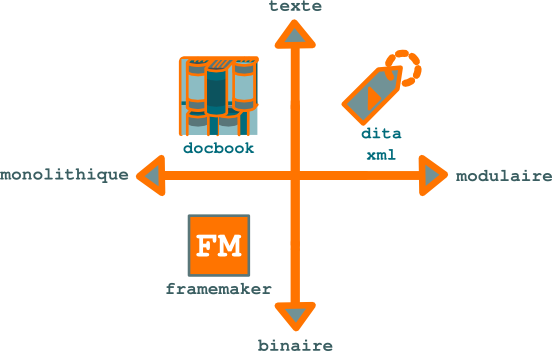

   Formats sources : degré de modularité et format

Les formats sources peuvent être classés selon leur degré de modularité et leur
format de fichier.

Les formats XML structurés DocBook et DITA appliquent une maquette de page
homogène à tout un document, et n'autorisent pas l'ajout manuel d'éléments de
mise en page (ou très peu : dans les fichiers de contenu, il est seulement
possible de mettre du texte en gras ou en italique, pas d'en changer la police,
le corps ou la couleur), ni l'application de maquettes différentes aux
différents fichiers qui composent le document.

+--------------------+--------------------+--------------------+
|**Format**          |**Application d'une |**Possibilité de    |
|                    |mise en page        |mise en page        |
|                    |homogène**          |manuelle**          |
+--------------------+--------------------+--------------------+
|MS Word             |Non                 |Oui                 |
+--------------------+--------------------+--------------------+
|FrameMaker          |Oui                 |Oui                 |
+--------------------+--------------------+--------------------+
|DITA XML            |Oui                 |Non                 |
+--------------------+--------------------+--------------------+

Si contenu et mise en page sont intimement liés, comme sous un traitement de
texte, il est difficile de modifier le contenu sans perturber la mise en
page. Résultat : à chaque publication d'une nouvelle version d'une documentation
technique, l'équipe de **rédaction technique** passe de longues heures à
corriger les erreurs de mise en page générées par le logiciel. Le phénomène est
moindre sous FrameMaker mais reste important. Il est nul avec les formats **XML
DITA** et **DocBook** (les seules erreurs qui peuvent se produire sont des
erreurs de compilation dues à une syntaxe XML erronée ; ces erreurs sont
facilement rectifiables).

Les fichiers sources d'une documentation technique sont au format :

- binaire ou,

- texte.

Ce format est également :

- WYSIWYG ou,

- structuré.

Enfin, ce format est :

- modulaire ou,

- monolithique.

Ce dernier aspect détermine la manière dont le format gère le single-sourcing :

- selon une logique *livre vers aide en ligne* ou,

- selon une logique *aide en ligne vers livre*.

Les formats disponibles peuvent donc être classés selon une matrice
tridimensionnelle.

+---------------+---------------+---------------+---------------+
|**Format**     |**Texte**      |**Structuré**  |**Modulaire**  |
+---------------+---------------+---------------+---------------+
|FrameMaker     |Non            |Non            |Non            |
+---------------+---------------+---------------+---------------+
|DocBook        |Oui            |Oui            |Non            |
+---------------+---------------+---------------+---------------+
|DITA XML       |Oui            |Oui            |Oui            |
+---------------+---------------+---------------+---------------+

FrameMaker et DocBook ne sont pas pleinement modulaires, car les plus petits
éléments d'information manipulables ne sont pas génériques : ils contiennent des
informations telles que la structure de table des matières ou les références
croisées qui ne sont valables que dans un nombre limité de contextes.
Formats structurés et non structurés
====================================

Les **formats structurés** favorisent la création de documents minimalistes,
complets et cohérents. Ils permettent au **rédacteur technique** de se
concentrer sur le contenu et d'améliorer l'expérience utilisateur et
l'utilisabilité de la documentation technique.

Les informations contenues dans un document technique peuvent être catégorisées
selon leur sens. Par défaut, `DITA XML
<http://fr.wikipedia.org/wiki/Darwin_Information_Typing_Architecture>`_ propose
trois types de base :

+------------------------------+------------------------------+
|**Type sémantique**           |**Description**               |
+------------------------------+------------------------------+
|*concept*                     |Introduction ou présentation  |
|                              |d'un concept.                 |
+------------------------------+------------------------------+
|*task*                        |Procédure pas à pas,          |
|                              |séquentielle et numérotée,    |
|                              |destinée à réaliser une tâche.|
+------------------------------+------------------------------+
|*reference*                   |Informations de référence sur |
|                              |une liste d'éléments tels que |
|                              |des options d'un programme.   |
+------------------------------+------------------------------+

.. figure:: media/structured.png

   Formats structurés et non structurés

Sous un format non structuré tel que le format traditionnel de
`FrameMaker <http://en.wikipedia.org/wiki/Adobe_FrameMaker>`_, rien ne
contraint le **rédacteur technique** à organiser l'information son sens. Si des
règles de rédaction rigoureuses ne sont pas scrupuleusement suivies,
l'information fournie à l'utilisateur risque d'être peu claire et difficile à
parcourir rapidement.

Avec des formats structurés tels que DITA XML, en revanche :

- le **rédacteur technique** se concentre sur le contenu,
- l'information est présentée à l'utilisateur selon une organisation cohérente
  et prévisible,
- l'accès à l'information est séquentiel et rapide,
- l'information peut facilement être réorganisée selon les besoins,
- l'utilisabilité du support d'information fourni est optimale.

Les types d'information de haut niveau tels que *task* sont divisés en types de
plus bas niveau, par exemple :

+------------------------------+------------------------------+
|**Type**                      |**Description**               |
+------------------------------+------------------------------+
|*prereq*                      |Liste de points obligatoires  |
|                              |préalables à la réalisation   |
|                              |d'une tâche.                  |
+------------------------------+------------------------------+
|*steps*                       |Série d'étapes de la          |
|                              |procédure.                    |
+------------------------------+------------------------------+
|*stepxmp*                     |Exemple de réalisation d'une  |
|                              |étape.                        |
+------------------------------+------------------------------+

Les règles syntaxiques interdisent au **rédacteur technique** de faire figurer
une procédure pas à pas dans une section d'un autre type que *task*.  Le
**rédacteur technique** dispose donc d'un véritable modèle de rédaction qui
l'aide à présenter des informations :

+--------------+---------------------------------------------------------------+
|*minimalistes*|selon le principe de design `less is more`_, l'utilisateur ne  |
|              |dispose *que* de l'information dont il a besoin : une section  |
|              |*task*, par exemple, ne contient que des prérequis, une        |
|              |procédure et quelques autres éléments spécifiques ; toutes les |
|              |informations conceptuelles ou de référence sont placées dans   |
|              |des sections à part ;                                          |
+--------------+---------------------------------------------------------------+
|*complètes*   |l'utilisateur dispose de *toute* l'information dont il a besoin|
|              |; une section de type *task* sans procédure n'est pas une      |
|              |section DITA XML valide et ne pourra pas être publiée ; il est |
|              |même possible de mettre en œuvre un mécanisme vérifiant        |
|              |automatiquement avant publication la présence de blocs         |
|              |d'information facultatifs selon la `XSD                        |
|              |<http://fr.wikipedia.org/wiki/Document_Type_Definition>`_ DITA,|
|              |mais que le **rédacteur technique** juge obligatoires, tels que|
|              |le résultat d'une procédure ;                                  |
+--------------+---------------------------------------------------------------+
|*cohérentes*  |les informations de même type sont présentées dans le même     |
|              |ordre et avec la même mise en page ; les blocs d'information   |
|              |identiques répétés à différents endroits, tels qu'une remarque,|
|              |sont issus d'une seule et même source et sont donc strictement |
|              |identiques.                                                    |
+--------------+---------------------------------------------------------------+
Formats structurés et non structurés
====================================

Les informations contenues dans un document technique peuvent être catégorisées
selon un nombre limité de types. Par défaut, DITA XML en propose 3 de base :

- *concept* : introduction ou présentation d'un concept,

- *task* : procédure pas à pas pour effectuer une tâche,

- *reference* : informations de référence sur une liste d'éléments telles que
  des options d'un programme en ligne de commande.

Dans un format non structuré tel que le format traditionnel de FrameMaker, rien
ne contraint le **rédacteur technique** à organiser l'information selon leur
type. Si des règles rigoureuses de rédaction ne sont pas scrupuleusement
suivies, les modules d'information fournis à l'utilisateur risque de mélanger
des informations de tous types.

Avec des formats structurés tels que DITA XML, en revanche :

- le **rédacteur technique** se concentre sur le contenu,

- l'information est présentée à l'utilisateur selon une organisation cohérente,

- l'accès séquentiel à l'information est favorisé,

- l'information peut facilement être réorganisée selon les besoins,

- l'utilisabilité du support d'information fourni est améliorée.

Un type d'information de haut niveau tel que *task* est divisé en types de plus
bas niveau tels que :

- *prereq* : liste de prérequis à la réalisation d'une tâche,

- *steps* : la liste des étapes de la procédure,

- *stepxmp* : exemple de réalisation d'une étape.

D'autre part, il est impossible de faire figurer une procédure pas à pas dans
une section d'un autre type que *task*.

Le **rédacteur technique** dispose donc d'un véritable modèle de rédaction qui
l'aide à présenter des informations :

- *minimalistes* : l'utilisateur ne dispose que de l'information dont il a
  besoin toutes les informations contextuelles d'une tâche, par exemple, sont
  placées dans une seule section, ce qui permet de les synthétiser ;

- *complètes* : l'utilisateur dispose de toute l'information dont il a besoin,
  le **rédacteur technique** prenant l'habitude de compléter toutes les
  rubriques du modèle d'information qui lui est fourni ;

- *cohérentes* : les informations de même type sont présentées dans le même
  ordre et avec la même mise en pages.
Formats structurés
==================

Les **formats structurés** **XML** dits **WYSIWYM** (*what you see is what you
mean*) permettent de mieux valoriser le contenu d'entreprise.

Les traitements texte ne sont pas des outils de rédaction technique
professionnels. Les utiliser s'assimile à faire du transport routier avec des
Twingo : ce n'est juste pas fait pour ça. Autant le dire tout de suite, je suis
d'un avis totalement contraire à celui de cet auteur : `Replacing FrameMaker
with OpenOffice.org Writer
<http://techwhirl.com/articles/replacing-framemaker-with-openoffice-org-writer>`_.

Openoffice.org ou LibreOffice tiennent peut être la comparaison avec Word, mais
cela s'arrête là. Lorsqu'il m'a fallu reprendre une base importante de guides
rédigés sous Openoffice.org, j'ai tout de suite planifié une migration vers
DocBook. J'ai ensuite accéléré fortement la migration après que la table des
matières de l'un des guides avait complètement « explosé en vol ». Donc, si
certains traitements de texte supportent la comparaison avec FrameMaker sur le
papier, il en va tout autrement sur le terrain.

Cependant, si Framemaker est un outil fiable et reconnu, je lui reproche
d'utiliser des formats de fichiers binaires. Le contenu n'est donc pas
accessible par des outils en ligne de commande tels que grep ou sed, ou des
scripts Perl. Or, comme ces outils sont puissants ! Avez-vous par exemple essayé
de remplacer sous un traitement de texte ou sous FrameMaker la chaîne de
caractères « 2 Go » par « 3 Go » *uniquement* dans les sections contenant le
terme « mémoire vive » ?  Je privilégie donc fortement des formats tels que
`LaTeX <http://www.latex-project.org/>`_, `DocBook
<href="http://www.docbook.org/>`_ ou `DITA <http://dita.xml.org/>`_, ces deux
formats XML présentant l'avantage d'avoir été conçus spécifiquement pour la
rédaction technique et d'être relativement simples.  Voici présentés
succinctement les avantages des formats XML sur les formats binaires :

+--------------------+--------------------+--------------------+
|                    |Format binaire      |Format XML          |
+--------------------+--------------------+--------------------+
|Gestion des versions|Par nom de fichier  |Par tag dans le     |
|                    |                    |système de gestion  |
|                    |                    |de versions         |
+--------------------+--------------------+--------------------+
|Stockage            |Dans des répertoires|Dans le système de  |
|                    |                    |gestion de versions |
+--------------------+--------------------+--------------------+
|Sauvegarde          |Non planifiée       |Centralisée et      |
|                    |                    |planifiée           |
+--------------------+--------------------+--------------------+
|Risque de doublons  |Important           |Quasi nul           |
+--------------------+--------------------+--------------------+
|Éditeurs            |Unique : un document|Multiples : un      |
|                    |réalisé sous        |fichier DITA peut   |
|                    |Framemaker ne peut  |être modifié sous   |
|                    |être modifié que    |une interface       |
|                    |sous cet outil.     |graphique ou en mode|
|                    |                    |texte, sous un outil|
|                    |                    |libre ou            |
|                    |                    |propriétaire.       |
+--------------------+--------------------+--------------------+
|Utilisation d'outils|Impossible          |Aisée               |
|en ligne de commande|                    |                    |
+--------------------+--------------------+--------------------+
|Risque de perte de  |Important           |Quasi nul           |
|fichiers            |                    |                    |
+--------------------+--------------------+--------------------+
|Travail de groupe   |Très limité         |Aisé                |
+--------------------+--------------------+--------------------+
|Mise en page        |Partiellement       |Totalement          |
|                    |manuelle            |automatisée         |
+--------------------+--------------------+--------------------+
|Gestion des images  |Souvent insérées aux|Externes. Les images|
|                    |fichiers            |peuvent donc être   |
|                    |                    |traitées à part,    |
|                    |                    |notamment par lot   |
|                    |                    |avec des programmes |
|                    |                    |tels que            |
|                    |                    |ImageMagick.        |
+--------------------+--------------------+--------------------+
|Format              |Monolithique        |Modulaire. Ceci     |
|                    |                    |facilite le travail |
|                    |                    |de groupe et la     |
|                    |                    |parallélisation des |
|                    |                    |processus, notamment|
|                    |                    |de la traduction.   |
+--------------------+--------------------+--------------------+
|Format de livraison |Souvent limité au   |Multiformats (PDF,  |
|                    |PDF                 |HTML, etc.)         |
+--------------------+--------------------+--------------------+
|Traçabilité des     |Faible              |Totale              |
|modifications       |                    |                    |
+--------------------+--------------------+--------------------+

Le principal reproche que j'adresserais à DITA (et LaTeX), c'est leur nom, qui
ne se prête pas à des recherches Google, disons… sereines…
Format structuré DITA XML
=========================

Diminuer les coûts de production et de traduction, réduire les délais de mise
sur le marché (ou *time to market*) et améliorer la qualité de la
documentation. Voilà les défis que doit relever aujourd'hui le **rédacteur
technique**. L'un des meilleurs moyens d'y parvenir consiste à réduire le volume
source de la documentation et à mieux gérer le **contenu d'entreprise**.

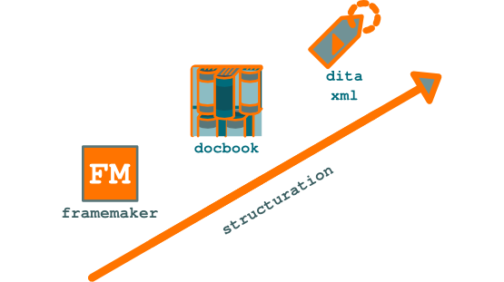

   Formats de documentation technique : degrés de structuration

L'information que le **rédacteur technique** fournit au public *doit* être
redondante : l'entreprise doit présenter à chacun de ses publics toute
l'information dont il a besoin, sur le support qui lui est adapté. Pour prendre
l'exemple le plus simple, chaque support d'information doit mentionner les
coordonnées de la société. Mais jusqu'à 50 % de l'information disséminée par
l'entreprise est répétée.

En revanche, la redondance de l'information en interne engendre des coûts
supplémentaires, allonge les cycles de production et entraîne une baisse de
l'homogénéité, et donc de la qualité, du contenu. Il est donc primordial de
diminuer et de mieux partager le contenu source et d'en diminuer le volume. Le
**rédacteur technique** doit diviser l'information en briques autonomes uniques,
standardisées et génériques, pour pouvoir l'assembler à la demande. Il doit donc
utiliser des modules structurés de manière homogène qui peuvent être facilement
manipulés par des applications.

   Les sources de la documentation doivent être moins volumineuses que les
   livrables.

:abbr:`DITA (Darwin Information Typing Architecture)`, est une architecture XML
de **rédaction structurée** destinée à la création de documents modulaires et à
la réutilisation du contenu. À partir d'une base commune de modules
d'information atomiques (pas au sens XPath) DITA XML, le **rédacteur technique**
peut fournir en temps réel toute l'information dont chaque utilisateur a besoin,
sur tout type de média, du support d'e-learning au document PDF ou papier, en
passant par le site Web.

DITA XML applique le principe de non-redondance des informations propre aux
bases de données normalisées. Cette architecture transpose à la documentation
technique la révolution introduite dans l'industrie par la standardisation : si
l'on peut construire des automobiles de modèles différents à partir d'un
ensemble de pièces identiques, de même, le **rédacteur technique** peut publier
des documents différents à partir d'un ensemble de briques d'information
standardisées.
Fournir une information ciblée avec le texte conditionnel ditaval
=================================================================

Un fichier `ditaval
<http://docs.oasis-open.org/dita/v1.2/os/spec/common/about-ditaval.html>`_
reprend le principe des lunettes que vous chaussez pour visualiser un film en 3D
: le verre gauche masque une moitié de l'image, le verre droit en masque l'autre
moitié. Mais seul le **rédacteur technique** dispose de lunettes 3D et a une
vision complète de l'information contenue dans le projet DITA XML.

Les lunettes fournies aux destinataires de l'information disposent de lunettes
avec deux verres gauches ou deux verres droits. Ils ne voient donc qu'une partie
de l'information. Loin d'être lésés par cet état de fait, ils ont ainsi un
meilleur accès à l'information. Le profilage réalisé masque à chaque public les
informations dont ils n'ont *pas* besoin et qui ne seraient pour eux que du
bruit. Chaque audience bénéficie donc d'un meilleur accès à l'information qui la
concerne, selon le fameux concept minimaliste de " less is more ".

.. figure:: media/ditaval.png

   Texte conditionnel avec DITA XML

Concrètement, le mécanisme **ditaval** est basé sur des opérateurs binaires :
vous marquez un bloc d'information avec un attribut et une valeur, puis incluez
ou excluez ce bloc dans le livrable en passant un opérande lors de la
compilation (le bloc est inclus par défaut si aucun opérande n'est
spécifié). C'est le principe du **texte conditionnel**.

Gâce à ce mécanisme, il n'est pas nécessaire de créer deux fichiers différents
lorsque leur contenu ne comporte que des variations mineures. C'est un outil de
plus destiné à réduire la redondance du contenu source.

Vous pouvez appliquer des clés de filtrage en série (condition *et*) en
indiquant plusieurs valeurs séparées par des espaces dans les attributs
*product*, *audience* ou autre.

.. rubric:: Exemple

Pour indiquer qu'une remarque est destinée à la fois à des électriciens et à des
utilisateurs avancés en voulant profiler l'information selon les publics
suivants :

- non électriciens,

- électriciens débutants,

- électriciens experts.

Vous pouvez utiliser la structure suivante :

.. code-block:: xml

   <step audience="electricians advanced">
   <cmd> Ramenez l'intensité sous la dose létale de 150mA. </cmd>
   </step>

Attention cependant : une clé de filtrage mal positionnée peut entraîner une
erreur de compilation. En effet, si le code non filtré est conforme au schéma
XSD DITA, le code filtré peut ne pas l'être.

Par exemple, le code suivant est correct avant filtrage :

.. code-block:: xml

   <thead>
     <row product="a>
       <entry>Commande</entry>
       <entry>Description</entry>
     </row>
   </thead>

Après filtrage, en revanche, on obtient le code suivant :

.. code-block:: xml

   <thead>
   </thead>

Or, selon le schéma XSD, les en-têtes de tableaux doivent contenir au moins une
ligne:

.. code-block:: xml

   <!ENTITY % thead.content     "((%row;)+)>

Ce code est donc incorrect et entraîne l'échec de la compilation.
Générer un PDF avec DITA Open Toolkit sous GNU/Linux
====================================================

Ce **didacticiel `DITA XML <http://dita.xml.org/>`_** est destiné à vous guider
dans la mise en place et l'utilisation de la chaîne de publication **DITA Open
Toolkit** dans un environnement GNU/Linux (Ubuntu ou Debian).

.. rubric:: Prérequis

- Ubuntu ou Debian sur une machine physique ou virtuelle avec le mot de passe
  administrateur,

- connexion Internet.

#. Ouvrez un terminal, collez-y la suite de commandes suivante et appuyez sur
   entrée:

   .. code-block:: console

      cd && \
      wget http://downloads.sourceforge.net/project/dita-ot/DITA-OT%20Stable%20Release/DITA%20Open%20Toolkit%201.5.4/DITA-OT1.5.4_full_easy_install_bin.tar.gz && \
      tar xzvf DITA-OT1.5.4_full_easy_install_bin.tar.gz && \
      wget http://www.redaction-technique.org/media/dita-env.txt && \
      workingdirectory=`pwd | sed "s/\//slash/g;>`_ && \
      perl -pi -e "s/personal-dita-home/$workingdirectory/g;" dita-env.txt && \
      perl -pi -e "s/slash/\//g;" dita-env.txt && \
      cp .bashrc .bashrc.bak && \
      cat .bashrc | sed '$a\' > .bashrc.tmp && \
      mv .bashrc.tmp .bashrc && \
      cat dita-env.txt >> .bashrc && \
      exit

   Cette suite de commandes:

   - se place dans le répertoire racine de votre compte utilisateur,
   - télécharge l'archive Dita Open Toolkit,
   - décompresse l'archive Dita Open Toolkit,
   - télécharge le fichier contenant les variables d'environnement de Dita Open
     Toolkit,
   - écrit le répertoire racine de votre compte utilisateur dans le fichier
     contenant les variables d'environnement de Dita Open Toolkit,
   - crée une sauvegarde du fichier .bashrc (.bashrc.bak),
   - ajoute les les variables d'environnement de Dita Open Toolkit
     personnalisées au fichier .bashrc,
   - ferme le terminal en cours.

#. Ouvrez un nouveau terminal pour prendre en compte les modifications du
   fichier :file:`.bashrc`, puis collez la commande suivante:

   .. code-block:: console

      sudo apt-get install openjdk-6-jre ant

   et entrez le mot de passe administrateur. Appuyez sur entrée à l'invite
   *Voulez-vous continuer ? [O/n/?]*.

   .. note::

      Si vous n'êtes pas *sudoer* sous Debian, entrez *su -* ; cette commande
      ouvre un terminal sous le compte administrateur (*root*).

   Cette suite de commandes installe Openjdk 6 et Apache Ant.

#. Collez la commande suivante:

   .. code-block:: console

      cd DITA-OT1.5.4

   Cette commande se place dans le répertoire :file:`DITA-OT1.5.4`.

#. Collez la commande suivante:

   .. code-block:: console

      $ java -jar lib/dost.jar /i:samples/taskbook.ditamap /outdir:. /transtype:pdf2

   Cette commande génère un fichier PDF à partir d'un projet DITA XML d'exemple.

Félicitations, vous avez compilé votre premier projet DITA XML ! Vous trouverez
le fichier cible taskbook.pdf dans le répertoire :file:`DITA-OT1.5.4`. Vous
pouvez maintenant compiler d'autres projets en ignorant les étapes 1 et 2.  Si
plusieurs versions de Java sont installées et qu'une erreur se produit, ouvrez
un terminal administrateur et sélectionnez la version OpenJDK 6:

.. code-block:: console

   # update-alternatives --config java

   Sélection Chemin Priorité État
   ------------------------------
   * 0 /usr/lib/jvm/java-6-openjdk-i386/jre/bin/java 1061 mode automatique

Vous pouvez indiquer pour l'option *transtype* une des valeurs suivantes:

+------------------------------+------------------------------+
|**Valeur**                    |**Format cible**              |
+------------------------------+------------------------------+
|xhtml                         |xhtml                         |
+------------------------------+------------------------------+
|eclipsehelp                   |Aide Eclipse                  |
+------------------------------+------------------------------+
|eclipsecontent                |Contenu Eclipse               |
+------------------------------+------------------------------+
|javahelp                      |Aide Javahelp                 |
+------------------------------+------------------------------+
|htmlhelp                      |Aide compilée Windows         |
+------------------------------+------------------------------+
|pdf2                          |PDF                           |
+------------------------------+------------------------------+
|troff                         |troff                         |
+------------------------------+------------------------------+
|docbook                       |DocBook                       |
+------------------------------+------------------------------+
|wordrtf                       |Microsoft RTF                 |
+------------------------------+------------------------------+
Générer un PDF avec DITA Open Toolkit (Windows)
===============================================

Ce **didacticiel `DITA XML <http://dita.xml.org/>` est destiné à vous guider
dans la mise en place et l'utilisation de la chaîne de publication **DITA Open
Toolkit** dans un environnement Windows (testé sur Windows XP).

.. rubric:: Prérequis

- Connexion Internet

#.  Téléchargez `Java <href="http://java.com/fr/download/manual.jsp?locale=fr>`,
    puis lancez le programme d'installation.

#.  Téléchargez `DITA Open Toolkit 1.5.4
    <http://sourceforge.net/projects/dita-ot/files/DITA-OT Stable Release/DITA
    Open Toolkit 1.5.4/DITA-OT1.5.4_full_easy_install_bin.zip/download>` sur le
    bureau, puis décompressez DITA-OT1.5.4_full_easy_install_bin.zip.

#.  Sélectionnez Exécuter dans le menu Démarrer, collez la commande suivante,
    puis appuyez sur Entrée :

    .. code-block:: console

       cmd

    Un terminal apparaît.

#. Collez la commande suivante dans le terminal :

   .. code-block:: console

      cd Bureau\DITA-OT1.5.4_full_easy_install_bin\DITA-OT1.5.4

#. Collez la commande suivante :

   .. code-block:: xml

      startcmd.bat

   Un nouveau terminal apparaît.

#. Collez la commande suivante dans le nouveau terminal :

   .. code-block:: console

      $ java -jar lib/dost.jar /i:samples/taskbook.ditamap \
      /outdir:. /transtype:pdf2

   Cette commande génère un fichier PDF à partir d'un projet DITA XML d'exemple.

   Félicitations, vous avez compilé votre premier projet DITA XML ! Vous
   trouverez le fichier cible taskbook.pdf dans le répertoire
   :file:`Bureau\DITA-OT1.5.4_full_easy_install_bin\DITA-OT1.5.4`. Vous pouvez
   maintenant compiler d'autres projets en ignorant les étapes 1 et 2.
Gérer les projets de documentation multilingues DITA XML
========================================================

`http://dita.xml.org/>**DITA XML**` est un formidable format pour gérer les
**projets de documentation**. Pour les projets multilingues, cependant, le
**rédacteur technique** doit créer un fichier *.ditamap*, qui contient la
structure de table des matières des documents, par version. Ceci entraîne un
risque d'erreurs et d'incohérences. Heureusement, une méthodologie appropriée et
un script d'automatisation destiné à la chaîne de publication **DITA Open
Toolkit** remédient à ce problème.

Méthodologie de gestion des projets de documentation multilingues DITA XML :

#.  Le fichier :file:`.ditamap` ne doit pas comporter de section *navtitle*, qui
    contient un titre en toutes lettres, au lieu d'extraire le titre de la
    section DITA correspondante, et est donc propre à chaque langue.

#.  Dès le début de votre projet DITA, placez les fichiers de contenu
    :file:`.dita` dans un sous-répertoire spécifique à la langue dans laquelle
    il est initialement rédigé.

    Par exemple :

    -               product
    -                   en_US
    -                       images
    -                       tasks
    -                       topics
              et non :

    -               product
    -                   images
    -                   tasks
    -                   topics

#.  Remplacez dans le fichier *.ditamap* toutes les occurrences du nom du
    répertoire propre à la langue par une chaîne unique provisoire.

    Par exemple, utilisez la chaîne *@language-code@* :

    .. code-block:: xml

       <topicref href="@language-code@/topics/managing-rights.dita"/>

    et non :

    .. code-block:: xml

       <topicref href="en_US/topics/managing-rights.dita"/>

#.  Pour générer les fichiers cibles, vous pouvez maintenant :

    a. modifier dans le fichier :file:`demo/fo/build.xml` le paramètre
       default.locale,

    #. remplacer dans le fichier :file:`.ditamap` la variable de langue par le
       nom du répertoire de langue,

    #.  modifier le paramètre de langue (xml:lang) dans le fichier
        :file:`.ditamap` et dans les fichiers de contenu DITA,

    #.  pour les fichiers cibles PDF, modifier les dimensions de page (A4 ou US
        letter, par exemple) selon la langue,

    #.  générer les fichiers cibles,

    #.  rétablir les valeurs initiales dans les fichiers sources.

Heureusement, un script Bash (GNU/Linux) simple permet d'automatiser cela. Ce
script suppose que :

- vous avez installé DITA Open Toolkit,
- votre projet DITA XML ne comporte qu'un fichier :file:`.ditamap`,
- vos fichiers de contenu DITA ont l'extension :file:`.dita`,
- les noms des répertoires des versions linguistiques correspondent aux codes de
  langues supportés par Dita Open Toolkit (:file:`fr_FR` ou :file:`en_US`, par
  exemple),
- vos fichiers de contenu DITA se trouvent dans des sous-répertoires des
  répertoires des versions linguistiques (par exemple, dans :file:`fr_FR/tasks/`
  et :file:`fr_FR/topics/`).

Les valeurs supportées pour la dimension des pages PDF sont fr_FR (A4) et en_US
(US letter).  Ce script peut être bien entendu facilement adapté, ou inspirer un
nouveau script.

.. warning::

   Ce script est fourni sans garantie. Avant toute exécution de ce script,
   effectuez une sauvegarde de l'ensemble de votre projet DITA, fichiers de
   configuration inclus (par exemple sous un système de gestion de
   versions). Assurez-vous de pouvoir restaurer facilement le projet dans son
   intégralité en cas d'erreur ou de comportement inattendu.

Pour utiliser ce script :

#.  Téléchargez le
    `http://www.redaction-technique.org/media/dita2target.sh>script de
    génération multilingue DITA XML` dans le répertoire contenant le fichier
    :file:`.ditamap` du projet.

#.  Dans un terminal, placez-vous dans ce répertoire, puis entrez :

    .. code-block:: console

       $ sudo chmod +x dita2target.sh

#.  Dans le terminal, entrez :

    .. code-block:: console

    $ mkdir out

    pour créer le répertoire qui contiendra les fichiers cibles.

#.  Entrez :

    .. code-block:: console

       $ ./dita2target.sh <fichier ditamap>  <nom du répertoire de langue> <format cible>

    pour générer les fichiers cibles.

    L'argument *format cible* accepte les valeurs gérées par DITA Open Toolkit.

.. rubric:: Exemple

.. code-block:: console

   ./dita2target.sh firewall.ditamap  en_US pdf2

Le fichier PDF :file:`firewall.pdf` est alors généré dans le répertoire
:file:`out` (spécifié *en dur* dans le script).
Gérer son contenu DITA XML avec ou sans CMS ?
=============================================

L'architecture `DITA XML <http://dita.xml.org/>`_ ne propose pas de
mécanisme de **workflow documentaire** natif. Les workflows sont pourtant un
élément important d'un processus efficace de gestion du **cycle de vie du
contenu**.

Les CMS gèrent également les métadonnées, ce qui permet une recherche plus
efficace de l'information existante et les rétroliens (le **rédacteur
technique** peut ainsi voir où un élément d'information est inclus ; lors de la
mise à jour de cet élément, il peut alors juger si l'élément modifié sera
toujours valable dans les différents contextes).

La plupart des entreprises sont réticentes à mettre en place un CMS, outils
dédiés aux workflows. Elles ont d'ailleurs parfois connu des échecs de mise en
place de telles solutions part le passé.

De plus, l'un des grands avantages de DITA XML, c'est de s'intégrer directement
dans le système d'information en place. Chez les éditeurs de logiciels,
notamment, rien de plus facile que de venir se greffer sur le système de gestion
des sources en place, qu'il s'agisse de Git (il est possible, quoiqu'un peu
complexe, de mettre en place des workflows sous Git *via* des branches), de
Subversion ou de SourceSafe. À budget quasi nul. Raison de plus pour ne pas
investir du temps et de l'argent dans un CMS.  Les gains de productivité
spectaculaires reportés par certaines entreprises suite à la mise en place d'un
CMS DITA XML ont cependant de quoi faire réfléchir. Ainsi, Epson America a pu
réutiliser jusqu'à 90 % du contenu existant sur de nouveaux projets.

Si l'on opte pour un CMS, celui-ci doit clairement supporter DITA : on ne gère
pas un jeu de briques d'information comme un document monolithique. Adieu donc
SharePoint ou Alfresco, il faut se tourner vers des solutions dédiées telles que
`Componize <http://www.componize.com/>`_ ou `DocZone <http://www.doczone.com>`_.

Quel que soit le choix initial, il est possible à tout instant de changer de
stratégie, sans remettre en cause l'existant. L'architecture DITA XML n'est en
effet liée à aucun référentiel particulier. Rien n'interdit donc de commencer à
gérer ses projets sans CMS, puis d'avoir recours à une telle solution si les
bénéfices de ce choix deviennent manifeste.
Git : du fichier au contenu
===========================

Vous êtes habitué à manipuler des fichiers ? Git vous invite à penser
autrement. Avantage : vous avez une maîtrise beaucoup plus grande de votre
contenu.

Qu'est-ce qu'un fichier ? Pour vous, un contenu, image, texte, feuille de calcul
ou autre, identifié par un nom. Pour votre système d'exploitation, une suite de
bits sur le disque dur à laquelle sont associés un nom de fichier et un chemin
de répertoires.  Si vous souhaitez gérer les différentes versions de vos
fichiers sous Git, vous allez au-devant de maintes difficultés. Si vous pensez
plutôt en termes de contenu, tout devient beaucoup plus simple.

Si vous donnez un fichier à Git, il le scinde directement en deux choses :

- un contenu (suite de bits, ou *blob*),
- un arbre (lien entre le nom de fichier et le contenu).

Il le stocke ensuite dans l'une des deux zones suivantes :

- l'index (zone temporaire),
- la base de données d'objets (zone persistante).

Lorsque vous ajoutez un fichier (*git add fichier*) :

- l'arbre est placé dans l'index,
- le contenu est placé dans la base d'objets.

Lorsque vous commitez un fichier (*git commit*) :

- l'arbre est placé dans la base d'objets.

Git ne compare jamais deux fichiers entre eux. Il compare leur résumé, qui est
un nombre unique calculé à partir de leur contenu. Si le résumé de deux fichiers
est identique, le contenu de ces fichiers est indentique (au bit près).

L'historique de votre projet n'est pas forcément linéaire : vous pouvez lui
faire suivre plusieurs routes parallèles, les branches.

Vous ne pouvez créer des branches qu'à partir d'un commit. Il faut voir les
commits comme des ronds-points (la route étant l'historique de votre projet) à
partir desquels vous pouvez, si vous le souhaitez, prendre une autre direction
dans votre projet.

Si vous créez une branche, disons *test*, alors que des modifications de votre
espace de travail ne sont pas commitées dans votre branche master, les
modifications que vous effectuerez s'appliqueront aux fichiers non commités de
votre espace de travail. Si vous faites une erreur, vous ne pourrez pas
retrouver le statu quo ante de vos fichiers en revenant à la branche master.

Si vous voulez enregistrer votre travail au fil de l'eau afin de pouvoir revenir
à tout moment à un état antérieur, il vous faut donc committer régulièrement et
sauvegarder votre espace de travail, répertoire *.git* y compris, par exemple
*via* rsync. Lorsque vous déciderez de partager votre travail, vous pourrez
déplacer, fusionner ou supprimer vos commits avant de les envoyer sous forme de
patchs ou de les déposer sur un dépôt central.
Guide de l'utilisateur : aidez vos clients, séduisez vos prospects
==================================================================

La documentation technique est surtout connue sous sa forme « **mode d'emploi**
», dont les traductions incertaines ont fait pester la plupart des possesseurs
d'aspirateurs. Rarement considérées comme des outils marketing, les **notices
techniques** sont pourtant les documents les plus consultés par les clients et
peuvent devenir des outils de **communication marketing** à part entière.

Parce qu'ils intégraient autant la dimension **avant-vente** que **service
après-vente**, j'ai vu des manuels d'utilisation utilisés avec succès comme
arguments de vente par des ingénieurs commerciaux. Autant dire qu'ils passent
vite dans ce cas du statut de simples **notices d'emploi** à celui plus
prestigieux de **guides de l'utilisateur**.

Autre public à qui on ne les destine pas en général, les journalistes peuvent
également y trouver des informations techniques et les prendre en compte dans
leurs tests des produits. Ils ne sont en revanche diffusés au grand public que
de manière exceptionnelle. Le niveau technique d'un guide de l'utilisateur
dépend de l'expertise de ce dernier, de l'utilisateur final à l'ingénieur. Mais
un bon guide est toujours le plus pragmatique et le moins technique possible.

.. figure:: media/1.png

   Définition du projet

Livrer une documentation sans réflexion préalable parce que c'est obligatoire
provoque beaucoup de frustration en interne et chez les clients. La
documentation est une valeur ajoutée du produit. Les journalistes ne s'y
trompent pas lors de leurs tests, par exemple :

La première configuration du produit s'avère relativement simple, la
documentation est claire. - L'informaticien n° 83 septembre 2010 - `EdenWall
NuFirewall, le pare-feu nouvelle génération
<http://www.linformaticien.com/tests/id/20068/categoryid/48/edenwall-nufirewall-le-pare-feu-nouvelle-generation.aspx>`_.

.. figure:: media/2.png

   Collecte de l'information

L'information est recueillie par l'analyse des spécifications du produit,
l'interview des développeurs et la manipulation directe du produit. Cerner puis
interviewer les différents publics cibles est un gage de qualité de la
documentation. Qui veut faire quoi avec le produit ? En répondant à ces deux
questions, il est (relativement) facile de répondre à la troisième : comment ?

.. figure:: media/3.png

   Création du contenu

Les guides doivent être *orientés tâche*, c'est-à-dire avant tout répondre à la
question *comment* par des procédures, avec juste ce qu'il faut d'explications
théoriques pour permettre à l'utilisateur de savoir exactement ce qu'il fait.

Selon le principe *less is more*, j'aime utiliser le moins de texte possible,
mais si vous avez été confronté à un mode d'emploi n'utilisant que le dessin,
vous savez combien le texte peut être précieux. À partir d'un bon schéma (c'est
à dire aussi simple que possible), la rédaction du texte coule de source et
l'utilisateur dispose d'une information claire et complète.

.. figure:: media/4.png

   Format source

Une documentation technique est un document hautement structuré. Il existe des
formats et des outils destinés à se concentrer sur le contenu et non sur la
forme. Bref, à ce que le **rédacteur technique** fasse son métier. Il y a certes
une courbe d'apprentissage avant de les maîtriser, mais le gain de productivité
qu'ils offrent est considérable.

.. figure:: media/versions

   Référentiel

Les sources (texte et images) peuvent être gérées par le système de gestion
`Subversion <http://fr.wikipedia.org/wiki/Apache_Subversion>`_. Un tel système
me semble indispensable à tout projet de documentation. Qui n'a pas connu le
syndrome du fichier qu'on ne peut plus ouvrir ou du projet qui ne compile plus à
la veille de la livraison ? Avec un gestionnaire de sources et quelques bonnes
pratiques, il est presque impossible que cela se produise. De plus, une équipe
peut travailler en même temps sur les mêmes projets et les mêmes fichiers (s'ils
ne sont pas binaires), ce qui décuple la productivité.

.. figure:: media/processus-guide.png

   Chaîne de publication

Ceci est une des chaînes de production possibles.

.. figure:: media/5.png

   Validation

*Ce que l'on conçoit bien s'énonce clairement, et les mots pour le dire arrivent
aisément.* - Boileau, L'Art poétique

Les schémas sont souvent vus comme un élément essentiel de la transmission d'une
information technique. Mais ils sont pour moi avant tout une étape primordiale
de la compréhension profonde de l'information par le rédacteur technique.Trop
souvent, les rédacteurs techniques hochent gravement de la tête quand un expert
leur explique un point ardu, puis reviennent avec un texte abscons… que l'expert
validera sans l'avoir lu et que le client ne comprendra pas ! Cela se traduira
par un coût quantifiable pour l'entreprise en termes de support technique et par
un coût caché en termes de satisfaction client et d'image.Il en va tout
autrement avec un schéma. En réalisant un schéma, le rédacteur met ses idées au
clair, et l'expert regarde ce qu'il valide.

.. figure:: media/6.png

   Format cible

Étant donné le volume et la fréquence de mise à jour des guides de
l'utilisateur, la mise en page doit être totalement automatisée.

.. figure:: media/7.png

   Livraison

La documentation produit est généralement fournie en PDF ou mise en ligne sur un
extranet en HTML. Elle peut également être fournie sous forme d'aide en ligne
ou, plus rarement, imprimée. Dans ce dernier cas, l'impression à la demande est
une bonne solution pour les petits tirages.
Imbriquer les conref
====================

Pour des raisons de facilité de mise à jour et de maintenance du contenu **DITA
XML**, le **rédacteur technique** doit limiter l'effet *poupée russe* et ne pas
trop imbriquer les `conref
<http://docs.oasis-open.org/dita/v1.1/OS/archspec/conref.html>`_. Un seul niveau
d'imbrication (un *conref* imbriqué dans un autre) me semble le seuil au-delà
duquel le contenu peut vite devenir ingérable.

Dans l'exemple ci-dessous, le *conref* source *see-admin-guide* contient le
**conref** cible *admin-guide-title*:

.. code-block:: xml

   
Pour de plus amples informations, voir le <ph
   conref="shared.dita/admin-guide-title"/>.

Ce niveau de complexité est gérable. Mais si le *conref* source
*admin-guide-title* contient lui même un *conref* cible, le code **DITA XML**
devient un vrai plat de spaghettis (sans compter les risques de référence
circulaire). Les *conref* peuvent théoriquement être combinés à l'infini, mais
les problèmes pratiques que cela engendre peuvent également être infinis!

.. figure:: media/imbriquer-conref.png

   Imbriquer les *conref* sur plusieurs niveaux : puissant, mais dangereux !

Pour résumer la situation:

- Il est tout à fait possible d'imbriquer plusieurs *conref* sources. Le seul
  effet de bord négatif porte sur la lisibilité du fichier contenant les
  *conref*.
- L'imbrication de *conref* sources et cibles est possible mais rapidement
  ingérable.
- Il est impossible d'imbriquer des *conref* cibles: le contenu du *conref* du
  niveau supérieur écrasera les valeurs des *conref* du niveau inférieur.
Les balises sont sémantiques
============================

DITA XML est un cousin du HTML qui aurait appris la linguistique : au lieu de
s'arrêter à fournir aux navigateurs un moyen d'afficher de jolies pages Web, il
oblige également le **rédacteur technique** à correctement étiquetter les
éléments d'information qu'il utilise. Résultat : le texte devient une véritable
base de données qui peut être interrogée pour fournir à la demande tous types de
documents.

DITA XML est un langage à balises: un fichier DITA comporte un ensemble de texte
et de balises délimitées par les signes < et >. (Si vous voulez entrer ces
signes en tant que tels, il vous faudra d'ailleurs les remplacer par < et >,
respectivement ; pour entrer &, il vous faudra entrer &amp;.) Le texte est
compris entre une balise ouvrante de type <balise> et une balise fermante de
type </balise>. Ainsi : <balise>texte</balise>.  Tout texte entré hors d'une
balise ouvrante et fermante est incorrect et produit un fichier non valide.  Les
balises sont imbriquées comme des poupées gigognes, selon le principe
d'arborescence du XML.  Affichez le code source d'une page HTML, vous verrez
d'ailleurs le même mélange de texte et de balises. Normal, le HTML est lui-même
un dérivé du XML. Différence notable cependant : le HTML ne doit pas être
conforme à un schéma XSD . Un schéma XSD fournit un ensemble de règles pour
l'ordonancement des balises. Ainsi, sous DITA, une section de type *task* doit
absolument comporter une balise <steps> Le HTML, en revanche, autorise des
hérésies telles que placer un chapitre de niveau 3 immédiatement sous un
chapitre de niveau (avouons qu'au niveau organisation de l'information, on fait
mieux…) De plus, le HTML n'est pas sémantique : peut importe pour lui que
fichier Les balises sont sémantiques.
Les CMS : le workflow en prime, mais une fiabilité à tester
===========================================================

Les :abbr:`CMS (Content Management Systems)`, ainsi dénommés pour des raisons
purement marketing, mais dont la fonction se comprend mieux avec l'acronyme GED,
système de gestion électronique de documents) apportent des notions de
**workflow** et de gestion des liens qui s'avèrent précieuses lorsque l'on gère
des documents modulaires.

S'ils utilisent des formats monolithiques tels que FrameMaker, les **rédacteurs
techniques** peuvent utiliser des CMS tels que ; SharePoint, Alfresco ou
consorts pour :

#. télécharger sur leur disque dur une copie locale des fichiers partagés,

#. effectuer leurs modifications sur la copie locale,

#. déposer la copie modifiée sur le dépôt central.

Cette solution est plus satisfaisante, ne serait-ce que parce que la fréquence à
laquelle les fichiers transitent sur le réseau est bien moindre (à chaque dépôt
du fichier sur le CMS, et non à chaque enregistrement de son travail par le
**rédacteur technique**). Il est cependant toujours nécessaire de verrouiller
les fichiers en cours de modification, ce dont se charge le CMS.

Originellement destinés aux documents monolithiques, de nombreux CMS prennent
aujourd'hui en compte la modularisation des documentations techniques. Des
solutions telles que DocZone ou Componize, cette dernière bâtie sur Alfresco,
sont par exemple explicitement destinées à gérer des documentations modulaires
basées sur l'architecture XML DITA.

Mais comment croire que ces solutions, qui sont fréquemment disponibles sous de
nouvelles versions, marketing oblige, sont toutes d'une fiabilité optimale ?

J'aurais quelques scrupules, et quelques inquiétudes, sur le fait de leur
confier entièrement la gestion et l'archivage des fichiers sources de la
documentation. Une sélection rigoureuse de la solution s'impose, associée à une
procédure de sauvegarde et de restauration éprouvée.
Le single-sourcing : un format source, plusieurs formats cibles
===============================================================

Le **single-sourcing** est un sujet qui a longtemps divisé les **rédacteurs
techniques** : des supports de **rédaction technique** différents, tels qu'une
aide en ligne et un manuel imprimé, doivent-ils proposer un contenu radicalement
différent ou peuvent-ils être générés à partir du même contenu source ?

Les contraintes de productivité et la réduction des coûts aidant, le débat a été
tranché en faveur du *single-sourcing*. Le gain qualitatif, discutable, de
créer, maintenir et traduire une version source différente pour chaque version
cible est trop important.

.. figure:: media/single-sourcing.png

   Un seul jeu d'informations, une multiplicité de formats de sortie

Si le **rédacteur technique** pratique le *single-sourcing*, il doit cependant
sélectionner en début de projet le paradigme sur lequel il se base : le livre ou
l'aide en ligne. Pendant longtemps, les outils proposés reposaient soit sur un
document de type livre (Word, ou FrameMaker, essentiellement) qui pouvait être
exporté au format d'aide en ligne, soit sur un fichier source (RTF) d'aide
Windows, pour générer un PDF. Une forte perte d'information de navigation
(index, références croisées, liens, etc.) intervenait souvent lors de
l'exportation.

DITA XML propose un modèle agnostique quant au format cible. Les fichiers
sources, bien que basés sur un modèle modulaire proche de celui de l'aide en
ligne, peuvent facilement être exportés sous forme de fichier PDF, d'aide en
ligne, de pages HTML liées ou autre, sans aucune perte d'information.
Les répertoires réseau partagés - peu adaptés au travail de groupe
==================================================================

Les fichiers partagés par une équipe de **rédaction technique** sont souvent
stockés dans un répertoire partagé sur le réseau.

Les **rédacteurs techniques** travaillent directement sur les fichiers partagés,
ce qui pose les problèmes suivants :

- risque de pertes de données en cas de défaillance du réseau,

- possibilités de travail off-line (déconnecté) limitées,

- verrouillage des fichiers par les membres de l'équipe qui les ont ouverts.

Même fréquemment sauvegardés, les répertoires ne sont pas un référentiel sûr
pour les données : la granulométrie de la sauvegarde est le répertoire, sa
fréquence n'est souvent que quotidienne. En cas de perte de données, la
restauration se fait répertoire par répertoire, et non fichier par fichier et
porte sur des versions dont l'ancienneté dépend de l'administrateur système, et
non du **rédacteur technique**. Fouiller dans les archives est une opération
fastidieuse qui peut elle-même être source d'erreurs : en l'absence d'une
comparaison fiable et aisée entre plusieurs versions des fichiers, le
**rédacteur technique** peut facilement supprimer des modifications qu'il aurait
souhaité conserver en voulant en restaurer d'autres.

Copier un fichier du réseau pour le modifier sur son disque dur personnel, puis
écraser la version du réseau par la version locale est une opération des plus
périlleuses :

- les membres de l'équipe ne sont pas informés du fait qu'un autre membre
  modifie ou non le même fichier en même temps qu'eux ; l'un des **rédacteurs
  techniques</> devra alors renoncer à toutes ses modifications ;

- lors d'une copie manuelle des fichiers, que ce soit *via* un gestionnaire de
  fichiers graphique ou en ligne de commande, le **rédacteur technique</> peut
  facilement écraser la version la plus récente par la plus ancienne (on
  préférera alors avoir recours à un logiciel de synchronisation de fichiers
  tels que `rsync <http://rsync.samba.org/>`_ ou `Unison
  <http://www.cis.upenn.edu/~bcpierce/unison/>`_ (ce dernier étant plus adapté à
  la synchronisation bidirectionnelle) en ligne de commande sous GNU/Linux ou
  Windows, ou à un équivalent graphique, tel `SyncToy
  <http://www.microsoft.com/en-us/download/details.aspx?id=15155>`_. Cependant,
  ce type de logiciels se base sur la date de dernière modification des
  fichiers. Lorsque l'on met à jour ou publie un livre FrameMaker, notamment,
  ceci peut créer des conflits entre fichiers, FrameMaker enregistrant dans ces
  cas tous les fichiers du livre, même si leur contenu n'a pas été modifié).
Les systèmes de gestion de versions - rustiques mais fiables
============================================================

Travailler sur des fichiers sources au format texte, et non binaire, est
l'occasion pour le **rédacteur technique** de gérer son contenu comme les
développeurs gèrent leur code : sous un système de gestion des sources tel que
Git, Subversion ou SourceSafe.

Ces systèmes :

- favorisent le travail de groupe,

- suppriment les copies de fichiers en doublons et

- réduisent le risque de perte de données à presque zéro.

Sur des fichiers texte, un système de gestion de version offre des
fonctionnalités supérieures :

- pas de risque de pertes de données en cas de défaillance du réseau (en cas
  d'incident réseau, l'utilisateur est averti que la transaction destinée à
  placer le fichier modifié sur le dépôt a échoué ; il peut alors procéder à une
  nouvelle transaction, sa copie locale du fichier étant intacte),

- possibilités de travail off-line (déconnecté) poussées (surtout sous Git,
  conçu explicitement dans ce but),

- non-verrouillage des fichiers par les membres de l'équipe qui les ont ouverts.

- possibilité de restauration très fine et dans le temps (depuis le dernier
  dépôt du fichier sur le référentiel) et en quantité de travail (les systèmes
  de gestion de version favorisent un dépôt fréquent de modifications
  atomiques).

.. figure:: media/versioning-system.png

   Le système de gestion de versions conserve l'historique des modifications.

Des interfaces graphiques permettent d'utiliser directement sous les
gestionnaires de fichiers ces outils originellement conçus pour être utilisés en
ligne de commande. Cependant, le paradigme sur lequel ils reposent est parfois
difficile à appréhender pour les publics les moins technophiles (même si Apple a
contribué à en populariser certains aspects avec son application *Time
machine*).

+--------+---------------------------------------------------------------------+
|Tronc   |Dépôt principal conservant toutes les versions des fichiers placées  |
|        |au cours du temps par le **rédacteur technique** (ou plus            |
|        |fréquemment, le développeur).                                        |
+--------+---------------------------------------------------------------------+
|Branche |Dépôt secondaire créé lors d'un *fork* de la version principale du   |
|        |code source. Dans le cas de la **documentation technique**, il est   |
|        |rare de créer un fork. Le **rédacteur technique** peut en effet      |
|        |souvent créer plusieurs documents différents à partir du même code   |
|        |source en appliquant des mécanismes de texte conditionnel. Une       |
|        |branche provisoire peut cependant servir à la création d'un tag : en |
|        |générant la documentation à partir de cette branche exclusivement, le|
|        |**rédacteur technique** s'assure qu'il pourra regénérer totalement   |
|        |une version archivée, si besoin est (la branche de publication       |
|        |embarquera les fichiers de contenu, les images, les feuilles de style|
|        |et les éventuels scripts de publication).                            |
+--------+---------------------------------------------------------------------+
|Tag     |Instantané du trunk ou d'une branche à un instant t. Permet de figer |
|        |facilement une version, par exemple, la version publiée, et de créer |
|        |une archive. Un tag ne peut pas être modifié ni supprimé             |
|        |accidentellement. Ce n'est bien sûr pas une version gravée dans le   |
|        |marbre, mais peut-être ce qui s'en rapproche le plus dans le monde   |
|        |immatériel et évanescent de l'informatique.                          |
+--------+---------------------------------------------------------------------+

Si l'on s'en donne la peine, il est également possible de mal utiliser les
systèmes de gestion de version et de perdre des données. Mais, en pratique, à
même niveau d'effort et de compétence, le risque de perdre de données est
nettement  moindre si le **rédacteur technique** manipule des fichiers texte
sous un gestionnaire de version plutôt que des fichiers binaires sur un
répertoire partagé.

Les systèmes de gestion de code source ont une fiabilité éprouvée et gèrent des
millions de lignes de code. Tout comme les systèmes de fichiers (Ext4, Btrfs,
etc.) ils évoluent lentement, selon une politique conservatrice, et ne sont
proposés en production que lorsqu'ils ont été exhaustivement débogués. Si les
plus grands projets de développement informatique, tel que GNU/Linux, par
exemple, leur font confiance, pourquoi ne pas également leur confier la
**documentation technique** ?

Un bémol cependant : ces outils ne sont pas destinés spécifiquement au format
XML et effectuent des comparaisons ligne par ligne entre les fichiers, et non
pas nœud par nœud, ce qui multiplie inutilement les conflits entre les *commits*
ou les branches.
Les topics, modules d'information de base DITA
==============================================

Les `topics <http://docs.oasis-open.org/dita/v1.0/archspec/topicover.html>`_
sont les plus petites unités d'information autonomes gérées par **DITA
XML**. Chaque **topic** a un titre et un corps de texte. Il ne traite que d'un
seul sujet. Il appartient donc au **rédacteur technique** de se baser sur la
modularité proposée par DITA XML pour bien structurer l'information.

Les **topics** sont sémantiquement typés. Il existe idéalement un type de
*topic* par type d'information. DITA XML propose par défaut des *topics* adaptés
à la documentation des logiciels (description de concepts et de tâches, liste de
commandes, etc.), mais de nouveaux types de *topics* peuvent être créés pour
répondre à d'autres besoins.

Les *topics* sont une des différences principales entre **DITA XML** et
**DocBook**, qui ne propose pas de typologie des briques d'information.

Les *topics* sont généralement stockés *à plat* dans des répertoires divisés par
type de *topic*. Ils sont organisés hiérarchiquement dans des fichiers
*.ditamap* et peuvent être partagés entre différents documents. Les titres des
modules ne sont pas affectés d'un niveau de titre. La structure des modules
étant parfaitement homogène, un module peut avoir un niveau 3 dans un document
donné, et un niveau 1 dans un autre document, sans qu'il y ait besoin de
modifier en quoi que ce soit les *topics*.

Les unités d'information atomiques (pas au sens XPath) telles que des remarques,
des paragraphes, voire des phrases ou des segments de phrase, qui ne peuvent pas
être munis d'un titre, ne forment pas des *topics*. Elles peuvent être cependant
partagées *via* le mécanisme *conref*, similaire au mécanisme *Xinclude* proposé
par DocBook.
Les trois niveaux de la documentation technique
===============================================

Si l'on compare la **documentation technique** à un jardin, on peut la
classifier selon les niveaux suivants :

+-------------------+----------------------------------------------------------+
|**Niveau**         |**Description**                                           |
+-------------------+----------------------------------------------------------+
|Friche             |- Pas d'utilisation de processus documentaire             |
|                   |                                                          |
|                   |- Création de la documentation par des équipes non dédiées|
|                   |                                                          |
|                   |- Utilisation de formats non adaptés ou utilisation       |
|                   |incohérente de formats adaptés                            |
+-------------------+----------------------------------------------------------+
|Jardin à l'anglaise|- Utilisation de processus documentaires fiables          |
|                   |                                                          |
|                   |- Création de la documentation par des équipes dédiées    |
|                   |                                                          |
|                   |- Utilisation cohérente de formats adaptés, mais non      |
|                   |structurés                                                |
+-------------------+----------------------------------------------------------+
|Jardin à la        |- Utilisation de processus documentaires fiables          |
|française          |                                                          |
|                   |- Création de la documentation par des équipes dédiées    |
|                   |                                                          |
|                   |- Utilisation cohérente de formats structurés             |
+-------------------+----------------------------------------------------------+

Les formats non adaptés à la **rédaction technique** sont par exemple les
formats de traitement de texte, qui ne dissocient pas suffisamment la mise en
page du contenu.

Les formats adaptés sont les formats de type FrameMaker, qui dissocient
(relativement) la mise en page du contenu, mais ne sont pas sémantiques.

Les formats structurés sont les formats sémantiques de type DocBook ou DITA XML.

Le stade du jardin à l'anglaise est déjà très satisfaisant et garantit qu'une
information de qualité est fournie à l'utilisateur. Celui du jardin à la
française permet en outre à l'entreprise de mieux maîtriser son contenu et de
réduire les coûts de production.

À elle seule, la présence d'une des trois composantes (processus, équipe dédiée
et format adapté) ne peut garantir un résultat satisfaisant. Confiez par exemple
des outils permettant de générer du contenu au format DITA XML à des
collaborateurs dont la **communication technique** n'est pas le métier ou sans
mettre en place de processus de gestion du cycle de vie de la documentation
technique, et vous courez à la catastrophe. Seule la présence conjointe de ces
trois éléments fournira un résultat optimal.
Livraison
=========

Le **rédacteur technique** livre le document à son destinataire de la manière
appropriée :

-  animation publiée sur un site de streaming,

- plaquette distribuée dans les salons ou laissée en clientèle par les
  ingénieurs commerciaux,

-  journaux envoyés aux clients,

-  site Internet mis à jour,

-  document mis en ligne en PDF ou distribué sous forme de guide imprimé…
Livre blanc : mettez le contenu technique au service de votre communication marketing
=====================================================================================

Un **livre blanc** est un très bon exemple de mariage réussi entre la
**communication marketing** et le **contenu technique**. Si ce dernier assoit
l'expertise de la société dans son domaine, le style rédactionnel du livre blanc
peut également toucher un public de prospects plus large que sa cible initiale.

Un livre blanc délivre un contenu de haut niveau technique. Son impact marketing
est très fort, mais ne touche généralement qu'une portion seulement de la cible
du produit. Très utile pour affirmer l'expertise de la société auprès des
prospects, et notamment des utilisateurs de solutions concurrentes, le livre
blanc fidélise les clients. Il peut amener les journalistes traitant du même
sujet à citer le produit ou l'entreprise dans leurs articles. Il touche peu le
grand public, à l'exception des étudiants.

.. figure:: media/1.png

   Définition du projet

Il est important de bien cibler le public et la problématique. Un livre blanc ne
doit pas être trop généraliste.

.. figure:: media/2.png

   Collecte de l'information

Avant toute chose, le **rédacteur technique** doit avoir un expert sous la
main. Un livre blanc vaut avant tout par son contenu. La collecte de
l'information se déroule donc principalement en entretien face à face.

.. figure:: media/3.png

   Création du contenu

Si la plupart des livres blancs adoptent un ton très factuel, pourquoi ne pas
renforcer leur impact marketing en dérogeant à la règle, par exemple avec un ton
humoristique ? À condition bien entendu de présenter un extrait à la direction
générale avant de tout rédiger dans ce style. Il s'agit en tout cas de rendre la
forme la plus attrayante possible sans rien sacrifier de l'exactitude technique.

.. figure:: media/processus-blanc.png

   Chaîne de publication

Ceci est une des chaînes de production possibles.

.. figure:: media/4.png

   Format source

La mise en page d'un livre blanc est simple, car le contenu est factuel. Les
formats utilisés pour la documentation des produits conviennent donc
parfaitement (DITA, DocBook, FrameMaker, etc.).

.. figure:: media/5.png

   Validation

Le mieux, après validation par l'expert, est de faire lire le document à un
client, idéalement, ou à défaut, à un collaborateur de profil aussi proche que
possible du public visé.

.. figure:: media/6.png

   Format cible

Si les sources sont au format DocBook, LaTeX, DITA ou FrameMaker, la mise en
page consiste juste à appliquer le bon style. Puisque le livre blanc est un
puissant outil de communication qui doit établir fermement la réputation
d'expertise de la société, une mise en page non suffisamment claire dessert le
propos. La lisibilité prime et le style doit être agréable.

.. figure:: media/7.png

   Livraison

Le livre blanc peut être imprimé ou publié en PDF, voire en HTML.
Logiciel de gestion de versions
===============================

Les **logiciels de gestion de versions** tels que Subversion gèrent bien le
travail en groupe et les grappes de fichiers modulaires de type DITA et
conservent l'historique des modifications.

.. figure:: media/version.png

   Référentiel

Ils présentent cependant les inconvénients suivants :

- paradigme peu intuitif,

- non conçus pour les fichiers binaires.

Les logiciels de gestion de versions garantissent qu'aucun fichier ni élément
d'information ne peut être perdu. Ils sont particulièrement précieux en fin de
projet et permettent une phase de livraison sereine. Ils mettent fin au syndrome
des fichiers binaires corrompus ou du PDF qui ne compile plus le jour de la
livraison. Si certains formats sont relativement mal gérés par les logiciels de
gestion de versions (fichiers Illustrator ou Indesign, par exemple), ils doivent
cependant être tout de même placés sous un tel système. Pour éviter de se fâcher
avec l'administrateur système, on évitera simplement les « `*commits*
<http://fr.wikipedia.org/wiki/Commit/>`_ atomiques », qui risquent de faire
grossir démesurément la base de données ! Et si le graphiste est décidément
allergique à un tel système, malgré les interfaces graphiques disponibles, c'est
au chef de projet qu'il revient de procéder au *commit* des fichiers.

.. figure:: media/repertoire-subversion.png

   Référentiel de rédaction technique : Subversion ou répertoire

Dans un répertoire, la gestion des versions d'un même document se fait par
création d'un nouveau fichier par version, ce qui présente des risques de perte
d'informations. Sous un logiciel de gestion de versions, elle se fait par
attribution d'un numéro de révision et application d'un libellé (*tag*).
Logiciels de gestion de versions
================================

Les **logiciels de gestion de versions** tels que Subversion gèrent bien le
travail en groupe et les grappes de fichiers modulaires de type DITA et
conservent l'historique des modifications.

.. figure:: media/version.png

   Référentiel de rédaction technique : Subversion ou Git

Ils présentent cependant les inconvénients suivants :

- paradigme peu intuitif,

- non conçus pour les fichiers binaires.

Les logiciels de gestion de versions garantissent qu'aucun fichier ni élément
d'information ne peut être perdu. Ils sont particulièrement précieux en fin de
projet et permettent une phase de livraison sereine. Ils mettent fin au syndrome
des fichiers binaires corrompus ou du PDF qui ne compile plus le jour de la
livraison. Si certains formats sont relativement mal gérés par les logiciels de
gestion de versions (fichiers Illustrator ou Indesign, par exemple), ils doivent
cependant être tout de même placés sous un tel système. Pour éviter de se fâcher
avec l'administrateur système, on évitera simplement les « `commits
<http://fr.wikipedia.org/wiki/Commit>`_ atomiques », qui risquent de faire
grossir démesurément la base de données ! Et si le graphiste est décidément
allergique à un tel système, malgré les interfaces graphiques disponibles, c'est
au chef de projet qu'il revient de procéder au *commit* des fichiers.

.. figure:: media/repertoire-subversion.png

   Référentiel de rédaction technique : Subversion ou répertoire

Dans un répertoire, la gestion des versions d'un même document se fait par
création d'un nouveau fichier par version, ce qui présente des risques de perte
d'informations. Sous un logiciel de gestion de versions, elle se fait par
attribution d'un numéro de révision et application d'un libellé (*tag*).
Magazine d'entreprise : fidélisez vos clients et augmentez votre couverture médias
==================================================================================

Un **magazine d'entreprise** renforce le lien entre les clients et la société. À
cause d'un coût de production élevé, il n'est utile que si le portefeuille de
clients est suffisamment étoffé ou le produit suffisamment onéreux !

Étant donné sa diffusion restreinte, le magazine n'est qu'un appoint des autres
outils de communication. Destiné prioritairement aux clients, le magazine
externe peut également être distribué aux prospects, mais touchera peu le grand
public. Si son contenu est suffisamment objectif, il peut fournir de la matière
aux journalistes.

.. figure:: media/1.png

   Définition du projet

La périodicité des parutions doit être bien pensée afin de pouvoir être tenue !
Fixer une parution trop fréquente peut amener à faire du remplissage, ce qui
lasse vite les lecteurs.

Le choix du support doit également se faire en amont : si la convivialité du
support papier est la raison première de lancer un magazine, des applications
iPad, iPhone ou Android peuvent également être du meilleur effet, pour un coût
potentiellement moindre (selon le tirage de la version papier).

La maquette doit être réalisée en tout premier et ne pas varier (seulement
évoluer si besoin) d'une parution à l'autre. Le **rédacteur technique** doit
découper le contenu en rubriques claires situées au même endroit d'une parution
à l'autre pour fidéliser le lecteur.

.. figure:: media/2.png

   Collecte de l'information

La collecte de l'information doit s'effectuer en interne aussi bien qu'en
externe. Lors de l'interview d'un client, il ne faut pas passer les critiques
éventuelles à l'égard du produit ou de l'entreprise… à condition qu'une réponse
rapide puisse y être apportée !

Pour les illustrations, les photos des banques d'images manquent à mon avis
d'intérêt. Je sais qu'elles sont utilisées par les versions web de grands
organes de presse, mais raison de plus pour ne pas y avoir recours. Si vous
n'essayez pas de faire mieux qu'eux, vous ne pourrez faire que beaucoup moins
bien. Demandez plutôt des photos au service de communication des sociétés dont
parlent vos articles. Vous pouvez également faire intervenir un photographe
externe ou, si vous avez un bon niveau en photo amateur (ce que j'espère, la
**rédaction technique** ne se limitant pas à l'écrit !), effectuer vous-même des
prises de vue chez vos clients ; cela vous permettra en outre de mieux connaître
leur activité.

.. figure:: media/3.png

   Création du contenu

S'agissant d'un magazine, il faut évidemment adopter un ton factuel, tout en
soignant le style, en particulier les titres.

Les informations recueillies devront faire l'objet d'un profond *rewriting* afin
de donner un style homogène et vivant à la publication.

.. figure:: media/processus-journal.png

   Chaîne de publication

Ceci est une des chaînes de production possibles. On peut également fédérer tout
le contenu sous le format structuré XML `DITA <http://dita.xml.org/>`_ et un
logiciel de gestion de versions de type `Subversion
href="http://fr.wikipedia.org/wiki/Apache_Subversion>`_.

.. figure:: media/4.png

   Format source

Un traitement de texte peut suffire pour les fichiers sources, mais rien
n'interdit d'utiliser des formats d'abord plus complexes, mais qui deviennent
beaucoup plus simples lorsqu'on les maîtrise (DITA, DocBook, etc.).

.. figure:: media/5.png

   Validation

Les articles doivent non seulement être validés en interne, mais aussi auprès
des personnes interviewées à l'extérieur ou à l'intérieur de l'entreprise. Il
est en effet hors de question de déformer les propos recueillis lors d'un
entretien. La direction de la communication ou la direction générale doit
ensuite donner son feu vert. La signature du bon à tirer ne doit intervenir
qu'après une relecture approfondie par plusieurs personnes étrangères au projet.

.. figure:: media/6.png

   Format cible

Un outil de PAO tel que Indesign ou Scribus est indispensable. Le traitement de
texte ne permet pas des compositions élaborées et doit être réservé aux lettres
internes.

.. figure:: media/7.png

   Livraison

Les fichiers PDF générés par le logiciel de PAO sont fournis à un imprimeur. Les
exemplaires sont ensuite distribués par la poste.

Une version PDF avec des images en basse définition n'est pas la bonne solution
pour élargir la diffusion du magazine, restreinte au nombre d'exemplaires
tirés. Il vaut mieux envisager dès le début du projet des applications pour
tablet PC ou smartphones.
Maximiser l'utilisation des conref pour faire baisser les coûts
===============================================================

Recourir aux `conref
<http://docs.oasis-open.org/dita/v1.1/OS/archspec/conref.html>`_ est le meilleur
moyen dont dispose le **rédacteur technique** pour faire baisser
spectaculairement les coûts et les délais de publication de son contenu **DITA
XML**, surtout pour les **documents multilingues**.

De par la nature des informations qu'elles contiennent, les sections de type
**task** ont un taux plus élevé de réutilisation du contenu que celles de type
**concept** ou **reference**.

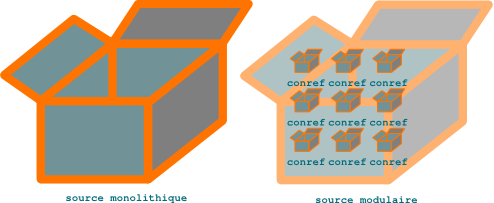

   Les *conref* modularisent de petits blocs d'information

Comme dans l'exemple ci-dessous, il n'est pas rare d'obtenir rapidement des
fichiers dont la seule valeur unique est le titre, le reste du contenu,
*pourtant unique* (car il assemble de manière unique des blocs d'information non
uniques), étant généré par des *conref* :

.. code-block:: xml

   <?xml version="1.0" encoding="utf-8"?>
   <!DOCTYPE task PUBLIC "-//OASIS//DTD DITA 1.2 Task//EN" "../../dtd/technicalContent/dtd/task.dtd">
   <task id="display-trends" xml:lang="fr-fr">
   <title>Afficher les tendances</title>
   <taskbody>
   <context audience="basic">
   <note type="restriction" audience="advanced">
   <ul>
   <li>
   <ph conref="shared.dita/ip-control"/>
   </li>
   </ul>
   <ph conref="../../shared/shared.dita/see-user-guide" audience="no-user-guide"/>
   </note>
   </context>
   <steps>
   <step>
   <cmd audience="basic">
   <menucascade>
   <uicontrol conref="shared.dita/logs"/>
   </menucascade>
   </cmd>
   <choices audience="advanced">
   <choice>
   <ph conref="shared.dita/physical-appliance"/>
   <menucascade>
   <uicontrol conref="shared.dita/logs"/>
   </menucascade>
   </choice>
   <choice>
   <ph conref="shared.dita/virtual-appliance"/>
   <menucascade>
   <uicontrol conref="shared.dita/server"/>
   <uicontrol conref="shared.dita/logs"/>
   </menucascade>
   </choice>
   </choices>
   </step>
   <step>
   <cmd>
   <menucascade>
   <uicontrol conref="shared.dita/all"/>
   <uicontrol conref="shared.dita/editfile"/>
   </menucascade>
   </cmd>
   <info>
   <ul conref="shared.dita/drill-down">
   <li/>
   </ul>
   <note conref="shared.dita/randomnames"/>
   </info>
   </step>
   </steps>
   </taskbody>
   </task>

Seul le texte en noir doit être traduit. Traduire ce type de fichier de contenu
**DITA XML** consiste donc à traduire uniquement le titre de la section et
l'intégralité des *conref* sources. Lorsqu'il traduit un ensemble d'unités
d'information placées en vrac dans un fichier, le traducteur manque cependant
cruellement de contexte. Le créateur du contenu initial doit donc lui fournir
une assistance constante. La méthode la plus efficace consiste à faire
travailler le traducteur en régie. Avantage supplémentaire: il pourra ainsi
interroger non seulement le rédacteur technique, mais également les concepteurs
du produit.

Ne croyez pas qu'il s'agit là d'une contrainte spécifiquement induite par la
modularisation poussée du contenu. Pour avoir fait une école de traduction
reposant sur le principe simple mais efficace du " triangle du sens " (le
traducteur doit comprendre le texte source pour le reformuler dans le texte
cible et non transcrire une suite de mots d'une langue à l'autre) et avoir
pratiqué la traduction technique durant plusieurs années, je peux vous affirmer
que tout projet de traduction réussi repose sur une collaboration efficace entre
concepteurs, rédacteurs et traducteurs.

Il est également possible de factoriser ainsi des éléments de structure, et non
de contenu, tels que des en-têtes de tableaux. Vous pouvez ainsi présenter des
informations de même type de manière homogène à moindre coût, c'est à dire sans
recourir à la `spécialisation
<http://en.wikipedia.org/wiki/Darwin_Information_Typing_Architecture#Specialization>`_.
Migration de FrameMaker vers DITA XML
=====================================

Migrer de FrameMaker vers `DITA XML <http://dita.xml.org/>`_, ce n'est pas comme
enregistrer un document Word au format LibreOffice (LibreOffice propose une
fonction d'enregistrement au format DocBook, mais il faut reconnaître à ses
concepteurs une bonne dose d'humour ; disons que le XML qu'elle produit peut
servir de base à la création d'une version DocBook, avec beaucoup d'efforts…
sauf à maintenir deux versions du même contenu, le processus de migration de
LibreOffice vers DocBook exige donc un arrêt temporaire des livraisons des
nouvelles versions de la documentation ; il doit donc être soigneusement
planifié). Aucun processus automatique ne permet de migrer un document non
structuré vers un **format structuré**. Dans le pire des cas, selon la qualité
de votre document de départ, cela peut s'apparenter à transformer une friche en
jardin à la française. Mais une migration bien planifiée permet de passer au
nouveau format sans perturber le rythme des livraisons.

Pour filer la métaphore, si l'on se fixe pour but de convertir un marécage en
parterre du château de Versailles, il convient de passer par l'étape du jardin à
l'anglaise - soit un endroit certes non rigoureusement architecturé, mais très
agréable à vivre. Bonne nouvelle : si le **rédacteur technique** a utilisé de
manière cohérente un jeu de styles limité et organisé rationnellement son
contenu FrameMaker, il est déjà certainement très proche de ce stade.

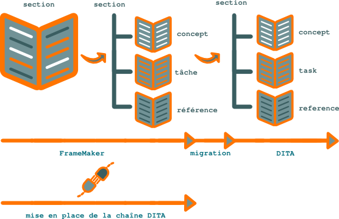

   Migration de FrameMaker vers DITA XML

D'ailleurs, si, pour une raison quelconque, votre projet de migration devait
s'arrêter là, les **rédacteurs techniques**, l'entreprise et les utilisateurs y
auraient déjà beaucoup gagné, respectivement en :

- facilité de mise à jour,

- cohérence et rapidité de publication des nouvelles versions,

- facilité d'accès à l'information.
Migrer de FrameMaker vers DITA XML
==================================

Le but de cette procédure est de :

- **migrer** son contenu **FrameMaker** vers **DITA XML** sans se plonger dans
  les arcanes des **EDD FrameMaker** (ce qui peut être justifié pour des petits
  projets),

- gérer la documentation technique au format DITA XML sans utiliser **FrameMaker
  structuré**.

#. Restructurez le contenu et les styles de vos fichiers de contenu FrameMaker
   selon les concepts DITA XML.

#. Créez un document FrameMaker vide et importez-y tous les styles existant dans
   les fichiers à migrer.

#. Appliquez tous les styles disponibles à des paragraphes vides du document
   FrameMaker vide.

#. Enregistrez le document FrameMaker vide sous le nom :file:`styles.fm`.

#. Ouvrez **FrameMaker structuré 11** et créez un nouveau fichier DITA de type
   *topic*.

#. Choisissez **StructureTools > Exporter le catalogue d'éléments en tant
   qu'EDD** et sauvegardez la nouvelle EDD sous le nom
   :file:`DITA-topic-edd.fm`.

#. Ouvrez le fichier *styles.fm*, puis choisissez **Fichier > Importer les
   définitions d'éléments** et importez les définitions d'éléments à partir de
   :file:`DITA-topic-edd.fm`.

#. Répétez les trois étapes ci-dessus pour les autres types de topics DITA
   (task, reference, etc.), en modifiant les noms de fichiers comme il se doit.

#. Ouvrez le fichier :file:`styles.fm`, puis choisissez **StructureTools >
   Générer le tableau de conversion**.

#. Modifiez le fichier de conversion et faites correspondre chaque style
   FrameMaker à une balise DITA XML.

#. Enregistrez le tableau de conversion sous le nom
   :file:`DITA2FM-conversion-table.fm`.

#. Ouvrez un fichier de contenu FrameMaker sous FrameMaker structuré 11 et
   choisissez **StructureTools > Utilitaires > Structurer le document en
   cours**.

#. Sélectionnez *DITA2FM-conversion-table.fm* et cliquez sur **Ajouter
   structure**.

#. Enregistrez le fichier de contenu FrameMaker au format XML sans sélectionner
   d'application.

#. Ouvrez le fichier XML généré sous un éditeur DITA XML et corrigez la syntaxe
   DITA. Certains aspects de cette étape sont scriptables, mais il faut
   également procéder à des opérations manuelles de restructuration du
   contenu. Il vous faudra notamment placer à la main les références croisées,
   de préférence dans une *reltable*.

Vous pouvez par exemple utiliser des scripts Perl de type :

.. warning::

   Ne lancez ce type de scripts que sur une copie de vos fichiers et non sur les
   fichiers originaux.

.. code-block:: xml

   #!/usr/bin/perl
   open(INPUT,"<$ARGV[0]") or die;
   @input_array=<INPUT>;
   close(INPUT);
   $input_scalar=join("",@input_array);
   # substitution
   $input_scalar =~ s#\<body>(.|\n)*?</body>##ig;
   open(OUTPUT,>$ARGV[0]") or die;
   print(OUTPUT $input_scalar);
   close(OUTPUT);

pour générer les éléments permettant de construire un fichier ditamap.

Vous pouvez également utiliser le module Perl `XML::Twig
<http://www.xmltwig.org/xmltwig/>`_ ou modulariser facilement le contenu à
l'aide des ciseaux XML `xml_split
<http://search.cpan.org/dist/XML-Twig/tools/xml_split/xml_split>`_.

Ou ce "one-liner" bash pour renommer les fichiers dita d'après leur titre :

.. code-block:: console

   ack "<title>" *.dita| sed "s# #_#g;" | tr '[:upper:]' '[:lower:]' | \
   sed -E "s#(.*.dita)#mv \1#g;" | \
   sed -E "s#\.dita.*<title>(.*)</title>#.dita \1.dita#g;"
Minimalisme - moins, c'est plus
===============================

Si le principe KISS dérive de l'ingénierie, le principe de **minimalisme**
provient lui de l'architecture. L'architecte
`http://fr.wikipedia.org/wiki/Ludwig_Mies_van_der_Rohe>Mies van der Rohe`, en
réaction contre l'ornementation, a posé le principe que la beauté architecturale
repose uniquement sur le fonctionnel (il formalisait ainsi les principes déjà
posés par Élie Faure dans son *Histoire de l'art*) et posait la célèbre formule
*Less is more*. Appliqué à la **documentation technique**, le **minimalisme**
garantit que l'utilisateur dispose à tout moment de toute l'information dont il
a besoin, mais uniquement de cette information. Pour revenir aux concepts des
ingénieurs, appliquer le **minimalisme** revient à augmenter le rapport
signal/bruit de la documentation.

Ce principe se met en pratique à différents niveaux de la **documentation
technique** (je livre ici ma mise en œuvre du **minimalisme**, qui n'est ni la
plus puriste, ni la seule possible. Cet article est d'autre part en cours de
construction) :

- filtrage des informations,

- style rédactionnel,

- modularisation du contenu,

- hiérarchisation des éléments d'information,

- utilisation des images.

La manière la plus simple de procéder consiste pour le **rédacteur technique** à
se demander à tout instant : l'utilisateur a-t-il vraiment besoin de cette
information ? En communication orale, la redondance et la reformulation sont
importants : l'auditeur ne peut être attentif à l'orateur 100 % du temps et n'a
pas la possibilité de réécouter un élément d'information qu'il aura mal
compris. Dans le cadre d'un document écrit, le lecteur a tout loisir de relire
un passage. Une formulation univoque, avec une définition précise des termes
utilisés, garantit la compréhension de l'information.

Un document écrit nécessite cependant une certaine redondance de l'information :
un avertissement relatif à un risque d'erreur intervenant lors de la réalisation
de différentes tâches doit par exemple être présent dans chaque procédure
correspondante. En effet, chaque procédure doit faire l'objet d'un module
d'information autonome, qui fournit l'information nécessaire à la réalisation de
la tâche, qu'il soit fourni seul ou accompagné d'autres modules. D'autre part,
même si le module d'information est présenté en compagnie d'autres modules
contenant le même avertissement, le **rédacteur technique** doit faciliter
l'appréhension de l'information par l'utilisateur et lui éviter les aller-retour
trop fréquents entre modules d'information.

Qu'on ne s'y trompe pas : exprimer plus d'idées en moins de mots demande un
effort supplémentaire. Le **rédacteur technique** aura souvent intérêt à faire
réduire sa prose sur le feu. Une bonne documentation ne se juge pas au nombre de
pages, ou alors en raison inverse du nombre de pages (les éditeurs de livres
techniques ont souvent tendance à augmenter artificiellement le nombre de pages
de leurs ouvrages par des captures d'écran ou des redites inutiles ; il en
résulte des documents à faible signal/bruit dont le public achève rarement la
lecture, preuve encore qu'il est difficile de confondre quantité et qualité) !

Le **rédacteur technique** peut également appréhender la rédaction minimaliste
au cours de formations spécifiques. Il peut enfin utiliser le format structuré
DITA XML, qui met en œuvre les principes du **minimalisme** et lui donne un
véritable modèle de rédaction **minimaliste**.

Comme vous l'aurez remarqué, cet article ne respecte pas les principes du
**minimalisme**. C'est qu'en effet, s'ils sont particulièrement adaptés à la
**rédaction technique**, ils ne sont guère appréciés des moteurs de recherche et
entre en conflit avec les techniques de référencement naturel, ou SEO (où la
recherche par indexation est remplacée par la recherche en plein texte). On
atteint là d'ailleurs la limite du **single-sourcing** : un contenu parfaitement
structuré pour une diffusion de type *push* garde totalement son efficacité quel
que soit le support ; mais il est beaucoup moins accessible dans le cadre d'une
diffusion de type *pull*. D'autre part, cet article n'est pas un module de
documentation technique.
Modularisation du contenu
=========================

Un bon roman policier a une structure inverse d'une documentation technique
**minimaliste** : l'information principale y est donnée à la fin de l'ouvrage et
le lecteur, avant d'y accéder, doit assimiler un grand nombre d'informations
secondaires dont la plupart sont destinées à l'égarer. Un roman policier, comme
un tunnel, ne fournit qu'une voie d'accès à sa destination.

Une documentation technique **minimaliste** doit au contraire donner à
l'utilisateur le moyen de décider à quelles informations il choisit
d'accéder. L'information doit donc être découpée en modules autonomes, liés aux
modules connexes, et organisés de manière à donner à l'utilisateur le moyen le
plus court d'accéder à l'information dont il a besoin. Une documentation
technique **minimaliste** est donc bâtie selon le modèle du rhizome.

+--------------------+-----------------------------------------+
|Typologie de        |Les informations techniques fournies à   |
|l'information       |l'utilisateur sont de trois types        |
|                    |principaux :                             |
|                    |                                         |
|                    |- présentation des concepts relatifs à un|
|                    |  produit,                               |
|                    |                                         |
|                    |- description des procédures pas à pas   |
|                    |  destinées à réaliser une tâche,        |
|                    |                                         |
|                    |- présentation d'informations de         |
|                    |  référence.                             |
|                    |                                         |
|                    |Ces types d'information ne doivent pas   |
|                    |être placés en vrac dans une même        |
|                    |section, mais figurer chacun dans une    |
|                    |section distincte. En effet, chaque type |
|                    |d'information répond à un besoin         |
|                    |distinct. Pour simplifier, on peut les   |
|                    |associer chacun à un public différent :  |
+--------------------+--------------------+--------------------+
|                    |Décideur            |Concepts            |
+--------------------+--------------------+--------------------+
|                    |Opérateur           |Tâches              |
+--------------------+--------------------+--------------------+
|                    |Expert              |Référence           |
+--------------------+--------------------+--------------------+
|                    |Il va de soi que cette catégorisation est|
|                    |schématique et qu'une seule et même      |
|                    |personne peut tour à tour assumer chacun |
|                    |de ces rôles. Mais à chaque différente   |
|                    |casquette qu'elle revêtira, cette        |
|                    |personne pourra accéder directement à    |
|                    |l'information qui la concerne. Le        |
|                    |**rédacteur technique** pourra d'ailleurs|
|                    |lui fournir tous les types d'information |
|                    |dans un seul document, ou fournir trois  |
|                    |documents différents, contenant chacun un|
|                    |seul type d'information.                 |
+--------------------+-----------------------------------------+
|Un paragraphe par   |Si, emporté par sa plume, le **rédacteur |
|idée                |technique** met deux idées dans le même  |
|                    |paragraphe, un coup de ciseau en appuyant|
|                    |sur la touche entrée, ou l'insertion de  |
|                    |balises 
 et 
 et voilà ce premier  |
|                    |principe respecté : en effet, un lecteur |
|                    |pressé aura la fâcheuse habitude de ne   |
|                    |lire que le début des paragraphes - au   |
|                    |risque de rater une information précieuse|
|                    |- mais dans ce cas la faute en incombe au|
|                    |**rédacteur technique*.                  |
+--------------------+-----------------------------------------+
|Une idée par        |Lorsque le **rédacteur technique** a     |
|paragraphe          |terminé une première version d'un module |
|                    |de contenu, il doit porter un regard     |
|                    |critique sur son travail et bannir tout  |
|                    |paragraphe ou toute phrase ne véhiculant |
|                    |pas d'information ; le langage est en    |
|                    |effet un médium très plastique et l'être |
|                    |humain a une tendance naturelle à la     |
|                    |redondance ; le **rédacteur technique**  |
|                    |doit avoir le même souci d'économie que  |
|                    |les développeurs de logiciels et utiliser|
|                    |aussi peu de mots et des mots aussi      |
|                    |précis que possible, pour transmettre un |
|                    |message utile.                           |
+--------------------+-----------------------------------------+
Organisation à la demande du contenu
====================================

Les briques d'information peuvent être assemblées à la demande dans des
structures de table des matières externes, les *ditamap*.

L'organisation de l'information sous `DITA XML <http://dita.xml.org/>`_ n'est
pas figée. Les briques peuvent être organisées dans différentes structures
hiérarchiques, selon l'évolution des besoins. Si le **rédacteur technique** a
pris soin de construire des briques d'information atomiques et génériques, il
peut, à l'instar d'un constructeur automobile proposant sans cesse de nouveaux
modèles par assemblage d'éléments standardisés, proposer par exemple :

+------------------------------+------------------------------+
|**Type de document**          |**Contenu**                   |
+------------------------------+------------------------------+
|Guide de l'utilisateur        |Thèmes systématiquement       |
|                              |organisés en concept et tâche.|
+------------------------------+------------------------------+
|Document de présentation      |Concepts                      |
+------------------------------+------------------------------+
|Quikstart                     |Procédures pas à pas.         |
+------------------------------+------------------------------+
|Manuel de référence           |Informations de référence.    |
+------------------------------+------------------------------+

Pour ce faire, le **rédacteur technique** prendra soin de placer les éléments
liés à un contexte particulier dans les structures *ditamap* et non dans les
fichiers de contenu DITA XML. En particulier, les références croisées doivent
être indiquées dans une *reltable* placée dans le *ditamap* : si le document A
doit renvoyer au document B dans la *ditamap*, il doit pouvoir être également
utilisé sans modification dans la *ditamap* 2 où le document B n'est pas inclus.

L'organisation des répertoires de travail doit également permettre l'utilisation
de liens relatifs, notamment vers les images, qui ne seront jamais cassés.
Organiser son historique avec Git rebase
========================================

Git est d'un abord déroutant. Ses *workflows* s'appliquent à du contenu plutôt
qu'à des fichiers. Résultat: le travail de groupe et la gestion de différentes
versions concurrentes d'un même contenu deviennent beaucoup plus simples.

Git effectue des *commits* atomiques: il applique des lots de modifications sur
un contenu souvent réparti sur plusieurs fichiers, ou dépôt, au lieu de gérer
des fichiers proprement dits. Il nous invite à raisonner par lots de tâches sur
un contenu et non par fichier.

Ce fonctionnement peut sembler peu intuitif si l'on a l'habitude de travailler
fichier par fichier et non tâche par tâche. Mais une fois que l'on a adapté ses
habitudes de travail à son *workflow*, on s'aperçoit que:

- l'on dispose d'un historique beaucoup plus facilement exploitable,
- qu'il est beaucoup plus facile de gérer des versions concurrentes d'un même
contenu dans des branches de développement parallèles.  Imaginons que vous ayez
identifié deux types de modifications majeurs à apporter à votre contenu:
- les synopsis d'un programme en ligne de commande,
- les corrections grammaticales du texte.

Si votre contenu est réparti dans un ensemble de fichiers modulaires, vous
pouvez décider d'apporter en même temps les deux types de modifications dans
chaque fichier un à un. Pour répartir le travail sur un groupe de rédacteurs
techniques, il vous suffit d'allouer à chacun un lot de fichiers.

Soyons clair: ce *workflow* n'est pas adapté à git. Si vous utilisez ce système
de gestion de versions, il est préférable de diviser le travail en deux lots de
tâches, que l'on appelera *synopsis* et *texte* de manière non simultanée, mais
sur tous les fichiers.

Les contraintes de production vous obligeront souvent à scinder ces deux lots de
tâches en sous-lots, que vous êtes obligé de faire alterner. Ces sous-lots
peuvent d'ailleurs représenter des sous-tâches ou des lots de fichiers.

Vous committez chaque sous-lot à chaque fois qu'il est achevé. Votre historique
de *commit* ressemble alors au schéma suivant:

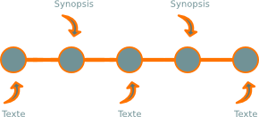

   Historique Git

Lorsque vous pousserez vos *commits* sur le dépôt central, certains *commits*
représenteront une étape intermédiaire de l'une des tâches. Votre historique et
vos branches seront donc plus difficiles à exploiter. D'autant plus que les
tâches inachevées alternent. Pour en récupérer une seule, il faudra donc choisir
soigneusement les commits *via* la commande *git cherry-pick*.

Heureusement, git vous permet de réorganiser facilement vos *commits* avant de
les partager. Lancez la commande *git rebase -i HEAD~5* pour réorganiser les
commits de la version en cours aux cinq précédentes, par exemple.

.. attention::

   La commande *rebase* est potentiellement destructive ; veillez à sauvegarder
   votre espace de travail, répertoire *.git* compris, avant de l'exécuter, sous
   risque de perdre des données.

Vous pouvez alors réécrire l'histoire pour proposer à vos collaborateurs un
*commit* pour chaque tâche réalisée en son entier, comme sur le schéma suivant:

.. figure:: media/git-rebase-commits-2.png

   Historique Git

Les commits ont tout d'abord été regroupés par type sur la «flèche du temps»
de Git, puis fusionnés.

Si vous avez effectué simultanément les deux tâches sur un ou plusieurs
fichiers, pas de panique: grâce à la commande *git add -p* vous pouvez répartir
vos modifications imbriquées sur les commits idoines. Lorsque vous lancez *git
status*, vous vous apercevez alors que vos fichiers sont à la fois prêts et non
prêts à être commités: il y a deux états des fichiers, chaque état représentant
un stade partiel de votre travail et la somme des deux représentant la totalité
des modifications que vous avez apportées.

Évidemment, vous n'avez plus accès aux commits intermédiaires, mais c'est ce que
vous souhaitiez : chaque commit unique représente un état cohérent de votre
contenu.

Ce workflow facilite également le travail d'équipe: vous pouvez confier ces
tâches à deux membres différents de votre équipe, chacun travaillant dans son
espace local. Les modifications du premier sont ensuite fusionnées avec celles
du second dans son espace local via des patches. Enfin, les *commits* sont
refactorisés avant de les pousser sur le dépôt central.

Attention, tout de même : moins vous réorganiserez vos commits (surtout
chronologiquement), plus le risque de devoir corriger manuellement des conflits
sera faible. Autrement dit, *git rebase* ne doit pas être une excuse pour ne pas
planifier rationnellement son travail.
Outil de gestion de contenu d'entreprise
========================================

Les **outils de gestion de contenu d'entreprise** tels qu'`Alfresco
<http://www.alfresco.com/fr/>`_ ou SharePoint gèrent bien le travail de groupe
sur des fichiers monolithiques et conservent l'historique des modifications.

.. figure:: media/contenu.png

   Référentiel

Ils présentent cependant les inconvénients suivants :

- pas de possibilité de travail de groupe sur le même fichier en même temps,

- non conçus pour les grappes de fichiers modulaires de type DITA.
Partager des blocs d'information atomiques avec les conref
==========================================================

Lorsque le **rédacteur technique** veut réutiliser des blocs d'information
**DITA XML** plus petits qu'une section, il doit les partager au niveau des
fichiers de contenu *dita* et non dans les structures de table des matières
**ditamap**, grâce au mécanisme `conref
<http://docs.oasis-open.org/dita/v1.1/OS/archspec/conref.html>`.

Le principe des **conref** est simple: lorsqu'un *conref* est mentionné au
niveau d'un nœud XML donné, tout le contenu du nœud cible est remplacé par le
contenu du nœud source.

.. figure:: media/ditamap.png

   Partage de blocs d'information de granulométrie large entre les ditamap

Une différence notable entre le mécanisme des *conref* et le mécanisme XML des
`xinclude <http://en.wikipedia.org/wiki/XInclude>`_, c'est que le nœud source
doit être conforme au schéma XSD du fichier source et du fichier cible. Ce
formalisme rigoureux, s'il s'avère moins souple et oblige parfois à quelques
acrobaties, rend les conref beaucoup plus lisibles que les xinclude et favorise
leur utilisation.

.. figure:: media/conref.png

   Partage de blocs d'information de granulométrie fine entre les sections DITA
Partager des unités d'informations atomiques avec les conref
============================================================

Le **rédacteur technique peut partager** des unités d'information trop petites
pour faire l'objet d'une section à part entière *via* le mécanisme des
**conref**, similaire au mécanisme *Xinclude* utilisé sous DocBook.

.. rubric:: Exemple

Un fichier de contenu contient la balise suivante :

.. code-block:: xml

   <uicontrol conref="shared.dita#shared/system"/>

À la différence du mécanisme des *Xinclude* utilisé sous DocBook, la valeur vers
laquelle pointe le *conref* doit se trouver dans un contexte conforme au
schéma XML. Par exemple, la valeur associée à l'exemple ci-dessus se trouve dans
un fichier *shared.dita* de type task :

.. code-block:: xml

   <?xml version="1.0" encoding="utf-8"?>
   <!DOCTYPE task PUBLIC "-//OASIS//DTD DITA 1.2 Task//EN" "../../dtd/technicalContent/dtd/task.dtd>
   <task id="shared" xml:lang="fr-fr>
     <title>Conref
     <taskbody>
       <steps>
      <step>
        <cmd>
          <menucascade>
         <uicontrol id="system>Système</uicontrol>
          </menucascade>
        </cmd>
      </step>
       </steps>
     </taskbody>
   </task>
Placer le maximum d'information dans la structure
=================================================

Pour améliorer la **qualité** de la documentation technique et en **diminuer les
coûts de production**, il est crucial de placer le maximum d'information dans la
structure et non dans le texte.

Par exemple, imaginons le contenu non structuré suivant :

Notez qu'il est important de mettre à jour votre firmware avant de procéder à
l'installation.

En recourant à un format de rédaction structuré tel que DITA XML, il est
possible de simplement dupliquer ce contenu, sans le structurer :

.. code-block:: xml

   
Notez qu'il est important de mettre à jour votre firmware avant de
   procéder à l'installation.

L'information pertinente sera cependant beaucoup plus accessible à son
destinataire si le contenu est restructuré comme suit :

.. code-block:: xml

   <prereq>
   <note type="important>Mettez à jour votre firmware.</note>
   </prereq>

Selon la feuille de style XSLT utilisée pour générer le PDF via XSL-FO (ou un
autre outil), le PDF affichera le contenu suivant :

.. code-block:: xml

   <b>Prérequis</b>
   <b>Important:</b> Mettez à jour votre firmware.

Au pris d'un effort de structuration plus important, on obtient donc un contenu
de meilleure qualité, qui réclame moins de rédaction et diminue les coûts de
traduction et de mise à jour.
Plaquette commerciale, brochure ou flyer : rendez votre technologie attrayante
==============================================================================

Outils de communication marketing classiques, les plaquettes commerciales,
brochures ou flyers souffrent d'une diffusion restreinte due à leur support
papier. Ils restent un must have qu'il faut diffuser de la main à la main. Ils
gagneront cependant à être accompagnés d'un document plus original (livre blanc,
document au ton humoristique…) pour ne pas se noyer dans le flot de leurs
concurrents.

Distribués avant tout aux prospects lors d'un rendez-vous commercial ou d'un
salon, ils donnent également aux journalistes les informations essentielles sur
les produits et la société. Ils intéresseront généralement peu les clients et ne
touchent quasiment pas le grand public.

.. figure:: media/1.png

   Définition du projet

La plaquette est l'aboutissement du positionnement marketing du produit. Le
projet ne doit donc être initié que lorsque cette démarche est terminée.  La
maquette des plaquettes doit être réalisée en tout premier, avec l'emplacement
des illustrations et le fameux faux texte ou « bolo bolo » *Lorem ipsum dolor
sit amet…* La maquette prime sur le texte. Le texte final doit respecter le
nombre de signes imposé par la maquette. De plus, la plaquette doit inciter le
lecteur à prendre contact avec l'entreprise pour obtenir des informations plus
précises. Il faut donc résister à la tentation de tout dire !

Une plaquette ne doit pas dépasser un A4 recto verso.

Elle comporte généralement plusieurs des éléments suivants :

+------------------------------+------------------------------+
|Titre                         |Le nom du produit.            |
+------------------------------+------------------------------+
|Chapô                         |Phrase résumant le bénéfice   |
|                              |client ; un bon test consiste |
|                              |à le faire lire à quelqu'un de|
|                              |votre entourage, différent de |
|                              |la cible : s'il comprend à    |
|                              |quoi sert le produit, c'est un|
|                              |bon chapô.                    |
+------------------------------+------------------------------+
|Exposé de la problématique    |Vous démontrez ici que vous   |
|                              |connaissez le métier de votre |
|                              |cible et les problèmes        |
|                              |auxquels elle est confrontée -|
|                              |et que le produit l'aidera à  |
|                              |résoudre.                     |
+------------------------------+------------------------------+
|Originalité du produit        |Pourquoi les solutions        |
|                              |existantes (sans les citer    |
|                              |s'il s'agit de solutions      |
|                              |commerciales) ne répondent pas|
|                              |précisément à la              |
|                              |problématique.                |
+------------------------------+------------------------------+
|Réponse du produit en termes  |C'est ici qu'il faut bien     |
|de fonctionnalités            |avoir étudié la concurrence   |
|                              |pour insister sur les points  |
|                              |forts de votre produit, et    |
|                              |passer sous silence ses points|
|                              |faibles ! Cela dit, un produit|
|                              |ne devrait pas présenter de   |
|                              |désavantages trop criants par |
|                              |rapport à la concurrence. Si  |
|                              |c'est le cas, c'est plutôt    |
|                              |qu'il est mal positionné. Le  |
|                              |service marketing doit alors  |
|                              |revoir son mix marketing. Un  |
|                              |traitement de texte ne peut   |
|                              |pas rivaliser avec des        |
|                              |logiciels de PAO, mais il n'a |
|                              |rien à faire sur ce           |
|                              |marché. Inversement, un       |
|                              |logiciel de PAO n'est pas un  |
|                              |outil bureautique.            |
+------------------------------+------------------------------+
|Témoignage client             |                              |
+------------------------------+------------------------------+
|Schéma, capture d'écran, photo|Je doute à ce niveau de       |
|                              |l'impact des photos           |
|                              |illustratives « bateau »      |
|                              |issues des banques d'images,  |
|                              |du genre jolies jeunes femmes |
|                              |et beaux jeunes gens devant un|
|                              |écran d'ordinateur : le but   |
|                              |n'est-il pas de se distinguer |
|                              |de la concurrence ?           |
+------------------------------+------------------------------+
|Aspects techniques            |Infrastructure nécessaire,    |
|                              |performance, etc. : il faut   |
|                              |harceler la R&D pour obtenir  |
|                              |des données chiffrées ;       |
|                              |inutile d'affirmer que le     |
|                              |produit présente un ROI       |
|                              |important et un TCO           |
|                              |particulièrement faible si    |
|                              |vous ne pouvez pas étayer ces |
|                              |affirmations.                 |
+------------------------------+------------------------------+
|Services associés au produit  |                              |
+------------------------------+------------------------------+
|Coordonnées de la société     |Ça peut paraître évident, mais|
|                              |j'ai déjà vu des plaquettes   |
|                              |mentionnant un mauvais numéro |
|                              |de téléphone ou omettant ce   |
|                              |dernier.                      |
+------------------------------+------------------------------+

La plaquette est un peu un exercice obligé et une structure trop originale peut
dérouter son public, qui y cherche des éléments de réponse relativement
précis. La différenciation se situe plus au niveau du contenu.

.. figure:: media/2.png

   Collecte de l'information

Le **rédacteur technique** doit collecter l'information autant auprès du
marketing que de l'équipe de développement. Il doit également se renseigner
précisément sur les besoins du marché.

.. figure:: media/3.png

   Création du contenu

Le style doit faire l'objet de toutes les attentions. Comment véhiculer un
message non ambigu de manière séduisante ? Désolé, je ne connais pas de recette
! Je reste cependant fidèle au principe KISS (Keep it Simple, Stupid), valable
autant en rédaction marketing qu'en ingénierie. Également, je me méfie comme de
la peste de la langue de bois et de la banalité. Le nombre de signes étant
réduit, il est pourtant facile de dire des choses intéressantes.

Influence du web sur le *print*
-------------------------------

Certes, vous ne verrez pas dans un proche avenir un robot de moteur de recherche
se promener dans les travées d'un salon professionnel. Il peut donc paraître à
première vue idiot de vouloir appliquer les méthodes de référencement naturel,
ou SEO, à, disons, une plaquette commerciale. Le titre de la plaquette ou du
*flyer* peut cependant bénéficier de ces méthodes. Dans un environnement
fortement concurrentiel où des dizaines de ses congénères essaient de capter
l'attention, ne gagnerait-il pas à reprendre les termes dans lesquels son public
formulerait spontanément son besoin sur un moteur de recherche ? De même pour le
*chapô*, qui doit immédiatement montrer l'adéquation de la solution proposée aux
besoins du prospect. Pour le corps du texte, cet apport semble plus discutable,
le style rédactionnel pouvant en pâtir. Pour une plaquette institutionnelle, en
tout cas, ces méthodes peuvent manquer de subtilité et un rédactionnel plus
élégant donnera une image plus prestigieuse de l'entreprise.

.. figure:: media/processus-plaquette.png

   Chaîne de publication

Ceci est une des chaînes de production possibles. On peut également fédérer tout
le contenu sous le format structuré XML `DITA <http://dita.xml.org/>`_ et un
logiciel de gestion de versions de type `Subversion
<http://fr.wikipedia.org/wiki/Apache_Subversion>`_.

.. figure:: media/4.png

   Format source

Le **rédacteur technique** doit penser ensemble le texte et les images dès le
début, bien que ces éléments soient par nature de format différent. Le texte
étant peu volumineux et devant faire de nombreux aller et retour avant la
validation finale peut être au format traitement de texte. Même si je préfère
rédiger au format DITA afin de conserver les différentes versions du texte sous
le logiciel de gestion de versions. Inkscape est d'autre part un très bon outil
pour réaliser des ébauches de schémas.

.. figure:: media/5.png

   Validation

D'abord validé par la direction technique, puis par la direction marketing, le
document doit absolument être validé par la direction technique puis faire
l'objet d'une relecture approfondie avant signature du bon à tirer.

.. figure:: media/6.png

   Format cible

Un outil de PAO est indispensable (Indesign, Scribus…). Il s'agit de penser en
termes de composition. Bien entendu, le traitement de texte est à proscrire : la
réalisation sera très pénible et le résultat donnera toujours un goût fâcheux
d'amateurisme.  Les schémas sont réalisés dans leur version finale par un
graphiste et le texte est importé sous le logiciel de PAO. Un PDF est ensuite
généré, validé, puis envoyé chez un imprimeur.

.. figure:: media/7.png

   Livraison

Les plaquettes sont fournies sous format imprimé. Le nombre d'exemplaires doit
être soigneusement évalué, toute réimpression coûtant cher.
Prendre en compte les contraintes de traduction
===============================================

L'unité d'information **DITA XML** la plus petite est le *nœud* que pour une
phrase complète ou un terme qui ne sera jamais traduit (par exemple, le nom de
la société ou d'un produit). De gros problèmes apparaissent sinon lors de la
traduction dans d'autres langues.

.. figure:: media/traduction-conref.png

   Les phrases se découpent différemment selon les langues

.. rubric:: Exemple

Si vous décidez de pousser la granulométrie au niveau du segment de phrase et
que vous définissez les **conref** suivants:

.. code-block:: xml

   <ph id="click">Click the</ph>

   <ph id="blue">blue</ph>

   <ph id="arrow">arrow</ph>

Vous pouvez maintenant utiliser le code suivant:

.. code-block:: xml

   
<ph conref="shared.dita/click"/> <ph conref="shared.dita/blue"/>
   <ph conref="shared.dita/arrow"/>.
Cliquez sur la</ph>

   <ph id="blue">bleue</ph>

   <ph id="arrow">flèche</ph>

Nous obtenons alors la phrase *Cliquez sur la bleue flèche.

Pour pallier ce problème, il faudrait réorganiser l'ordre des *conref* dans le
fichier **dita** traduit, ce qui est difficilement gérable et fait perdre tout
l'intérêt du mécanisme. Sans compter que des problèmes pires que ce cas d'école
peuvent conduire à complètement abandonner dans la langue cible les *conref*
utilisés dans la langue source (je n'ai pas d'exemple concret à offrir, ayant
toujours évité de tomber dans ce genre de travers.)
Principe de simplicité KISS
===========================

Le principe **KISS**, *Keep it simple stupid*, n'est pas spécifique à la
**rédaction technique**. Il s'agit d'un principe général d'ingénierie, qui
postule que tout objet matériel ou virtuel construit par l'homme est plus fiable
et plus facile à maintenir et à faire évoluer si sa complexité est
volontairement réduite. C'est le principe mis en exergue par antiphrase par les
Shadocks : *Pourquoi faire simple quand on peut faire compliqué* ?

C'est ce principe qui a prévalu à la conception des montres Swatch, dont le
cahier des charges stipulait qu'elles devaient embarquer deux fois moins de
pièces que leurs consœurs. Résultat : des montres moins chères, plus fiables et
disponibles en versions sans cesse renouvelées.

Ce qui a spectaculairement fonctionné pour des montres peut être appliqué avec
le même succès à la **documentation technique**. Quel que soit le format utilisé
(même si les formats qui distinguent le contenu de la mise en page sont dans
leur principe plus aptes à la mise en œuvre de la philosophie KISS), le
**rédacteur technique** peut tout aussi bien construire un document élégamment
architecturé qu'une usine à gaz. Avec `DITA XML <http://dita.xml.org/>`_, il lui
suffit de ne pas centraliser les *conref* ou de les imbriquer exagérément. Sous
FrameMaker, c'est encore plus simple, peu de garde-fous étant posés : la
multiplication des styles et des *overrides* peut rapidement rendre ingérable
n'importe quel document.

De même, dans la formulation de ses phrases, le **rédacteur technique** doit
toujours avoir le principe KISS à l'esprit. Il est facile de construire des
phrases alambiquées qui dénotent plus une mécompréhension du sujet qu'un
raffinement de l'écriture (ce genre de phrase est d'ailleurs souvent impossible
à traduire). Construire une phrase simple demande un effort de compréhension de
son sujet. La rédaction du contenu et son appréhension par son destinataire
deviennent alors aisées. C'est un aspect fondamental du métier de **rédacteur
technique**. Le **rédacteur technique** apporte ainsi une véritable valeur
ajoutée au produit qu'il documente. Si d'ailleurs ce produit n'est pas développé
selon le principe KISS, rédiger une **documentation technique** claire relève de
l'impossible !
Protéger les informations confidentielles
=========================================

Le puissant mécanisme `conref
<http://docs.oasis-open.org/dita/v1.1/OS/archspec/conref.html>`_ de **DITA XML**
se prête à d'autres applications que la réduction des coûts. Par exemple, le
**rédacteur technique** peut masquer des informations dans le code source.

Voici un cas original d'utilisation des **conref** : imaginez que vous devez
faire traduire un fichier contenant des informations confidentielles qui ne
doivent pas figurer dans la version traduite et auxquelles le traducteur ne doit
pas avoir accès (une clause de confidentialité interdit aux clients de diffuser
l'information dont ils disposent).

Comment faire ? Le filtrage à l'aide du mécanisme *ditaval* est conçu pour
exclure des informations des livrables, non pour les masquer dans les fichiers
sources. Allez-vous devoir créer deux jeux de fichiers sources, certains
comportant les informations confidentielles, les autres non ? Adieu alors le
*single-sourcing* et la réutilisation du contenu qui vous ont fait choisir
**DITA XML** !

.. figure:: media/confidentiel.png

   Masquer des informations confidentielles aux traducteurs

En plaçant le contenu confidentiel dans un fichier que vous appelez par exemple
:file:`confidentiel.dita` et en plaçant des *conref* assortis d'une clé de
filtrage dans le fichier à traduire, vous avez résolu votre problème : le
traducteur ne traduira que le texte non confidentiel, et le livrable généré dans
la langue cible ne contiendra pas le texte confidentiel, noté comme conditionnel
et exclu explicitement par le fichier :file:`ditaval` passé en argument lors de
la compilation.
Quel référentiel pour le travail de groupe ?
============================================

Le référentiel le plus fréquemment utilisé pour stocker des fichiers
informatiques est le dossier, ou répertoire. Si ce dépôt est parfaitement adapté
à la gestion de fichiers par un utilisateur unique sur son disque dur local, il
montre rapidement ses limites pour le travail de groupe.

Pour travailler sur un fichier, le **rédacteur technique** utilise un programme
qui lit le fichier sur son disque dur et en charge une copie en mémoire
vive. Les modifications s'effectuent sur cette copie. Lorsque le **rédacteur
technique** enregistre ses modifications, le programme écrase sur le disque dur
la version précédente du fichier. La version précédente est donc définitivement
supprimée, sauf si le programme a créé une copie de sauvegarde ou si le
**rédacteur technique** a utilisé la fonction *Enregistrer sous*, et non
*Enregistrer*, pour créer une nouvelle version du fichier. Dans le premier cas,
il n'existe que deux versions du fichier à un instant donné : la version n et la
version n-1. Dans le second cas, le **rédacteur technique** peut créer autant de
versions qu'il le souhaite, par exemple en plaçant le suffixe  -1, -2, etc. au
nom du fichier.

Les programmes ne gèrent cependant pas la modification concurrente d'un même
fichier par plusieurs **rédacteurs techniques**. Dans le cas d'un fichier
disponible sur un disque réseau, imaginons qu'Arsène et Louise ouvrent la même
version de ce fichier sous un éditeur de texte. Chacun apporte des modifications
différentes dans sa copie chargée en mémoire vive, puis enregistre son
travail. Arsène enregistre tout d'abord ses modifications, puis Louise. À la
prochaine ouverture du fichier, seules les modifications de Louise figureront
dans le fichier.

Pour éviter ce genre de situation, de nombreux programmes verrouillent les
fichiers ouverts. Ils ne sont donc disponibles qu'en lecture tant que
l'utilisateur qui les modifie en a une copie en mémoire vive (c'est-à-dire, tant
qu'il ne l'a pas fermé). Il n'est donc pas possible avec ce système de
travailler à plusieurs sur le même fichier et d'effectuer par exemple des
modifications transverses par lot, comme modifier le chemin de toutes les
images.

Si le programme utilisé ne verrouille pas les fichiers ouverts, une coordination
de tous les instants doit s'instaurer entre les membres de l'équipe.
Qu'est-ce qu'un module d'information ?
======================================

Le système modulaire le plus connu au monde est certainement celui des briques
Lego. Adapté à la **documentation technique**, le principe des modules permet
d'améliorer la qualité des manuels techniques et la productivité du **rédacteur
technique**.

Mais suffit-il de convertir sa documentation de FrameMaker vers un format
structuré tel que DITA XML pour obtenir une documentation modulaire ?
Hélas, non. Si le contenu de départ mélange les informations de tout type
(concepts, procédures pas à pas, référence), il sera toujours possible de le
convertir au format DITA en ne respectant pas rigoureusement la sémantique
DITA. Voire en modifiant les feuilles de style XSLT ou en spécialisant les XSD
pour les rendre plus laxistes.

Or, si l'on obtient au final un document se basant sur des fichiers correpondant
chacun à un schéma XSD différent (*concept*, *task*, ou *reference*), on
n'obtient pas forcément ainsi une véritable documentation modulaire. En effet,
essayez de construire alors un document ne regroupant que les fichiers d'un seul
type : votre document aura toutes les chances d'être incomplet et incohérent.

Cette documentation n'est pas modulaire, car elle ne repose pas sur de
véritables modules d'information. Un module est un élément atomique complet et
cohérent qui peut être réutilisé dans différents contextes. Si vous avez divisé
votre document monolithique original en une multitude de fichiers, vous n'avez
pas encore créé de modules d'information. La seconde étape consiste à ré-écrire
chaque fichier (selon par exemple l'approche minimaliste) pour le rendre plus
générique et en faire un véritable module. Il faut évidemment adopter une
approche structuraliste et décider du contenu de chaque module dans la
perspective de l'**architecture documentaire** globale.  De même, des mentions
telles que *Voir la section suivante* devront être remplacées par des reférences
croisées. Idéalement, ces références croisées ne se situent pas dans les
fichiers de contenu proprement dit sous la forme :

.. code-block:: xml

   <related-links> <link href="content.dita#content"/> </related-links>

mais dans une section *reltable* propre à chaque fichier :file:`ditamap`.

Les modules sont ainsi parfaitement décontextualisés, et les informations de
structure telles que les références croisées sont placés dans des fichiers ne
comportant pas de contenu textuel.
Rédaction structurée
====================

À la différence d'autres systèmes de composition de documents, tels que les
traitements de texte ou les logiciels de PAO, DITA, comme DocBook, est un format
de **rédaction structurée**. Il se concentre sur la **sémantique** du contenu
plutôt que sur la mise en page. Le fond plutôt que la forme.

Supposons que vous vouliez mettre en gras les mots qui correspondent à une
option de l'interface graphique dans le PDF fourni aux utilisateurs :

- sous un traitement de texte, vous mettez ce mot en gras,

- en HTML, vous incluez ce mot entre balises <strong> et </strong>,

- sous DITA, vous incluez ce mot entre balises <uicontrol> et </uicontrol> ;
  c'est une feuille de style qui applique le corps gras au texte cible.

Même si d'autres éléments, par exemple, des options de ligne de commande,
apparaissent en gras dans le document cible, ils sont différenciés dans les
fichiers source.

.. rubric:: Avantages

- vous pouvez aisément changer la mise en forme des options de l'interface dans
  un nombre illimité de documents,

- si d'autres éléments sont en gras, leur mise en forme peut facilement être
  modifiée, et celle des options de l'interface rester inchangée,

- vous pouvez facilement extraire toutes les options de l'interface à partir
  d'un nombre illimité de documents, par un simple *grep* par exemple.
Rédaction technique : un processus industriel
=============================================

La rédaction technique repose sur des processus rationnels. Trop souvent vue
sous sa forme **rédaction technique**, et par là associée à un fort aspect
littéraire, elle est trop souvent laissée à l'improvisation et à l'inspiration
du **rédacteur technique**. Le **rédacteur technique**, comme les autres
intervenants de l'entreprise, doit répondre à ses objectifs de manière
prévisible et reproductible.

Ce processus repose sur une méthodologie rigoureuse et une chaîne de production.

.. figure:: media/processus.png

   Processus de rédaction technique

Pour créer et valoriser un contenu à forte valeur ajoutée pour l'entreprise, le
**rédacteur technique** dialogue constamment non seulement avec tous les acteurs
internes de la société, mais aussi avec son écosystème : partenaires,
journalistes, utilisateurs, etc. Il fournit ainsi aux différents publics
l'information dont ils ont besoin. Ceci renforce l'image de marque de la
société, améliore la satisfaction client et facilite la perception des avantages
produit par les prospects.  Le rédacteur technique s'appuie sur une chaîne de
production aussi automatisée que possible. En mettant en place un processus
industriel et reproductible, il diminue les coûts de production et fournit un
niveau de qualité constant, adapté aux buts de l'entreprise.
Reference DITA XML
==================

Les sections **reference** permettent au **rédacteur technique** de présenter
des listes d'informations (commandes de langage de programmation, recettes de
cuisine, bibliographies, catalogues, etc.).

Exemple de structure d'une section *reference* :

.. aafig::

               +---title
               |
               |
      reference+
               |
               |          +---refsyn               +---proptypehd
               |          |                        |
               +---refbody+---properties---prophead+---propvaluehd
                          |                        |
                          +---section              +---propdeschd
Référentiel
===========

Le **contenu** est le capital immatériel de la société et doit être protégé
comme tel. Il peut être géré dans différents référentiels : répertoires, mais
aussi **outils de gestion de contenu d'entreprise** et **logiciels de gestion de
versions**.
Répertoires
===========

Les **répertoires** sont le mode de stockage le plus courant et ont pour eux
l'avantage d'offrir un paradigme connu de tous.

.. figure:: media/repertoire.png

   Référentiel de rédaction technique : répertoire

Ils présentent cependant les inconvénients suivants :

- pas de possibilité de travail de groupe sur le même fichier en même temps,

- risque d'écrasement ou de suppression de fichiers,

- pas d'historique des modifications des fichiers.
Restructuration du contenu FrameMaker
=====================================

La partie automatisée d'une migration de `FrameMaker
<http://en.wikipedia.org/wiki/Adobe_FrameMaker>`_ vers `DITA XML
<http://fr.wikipedia.org/wiki/Darwin_Information_Typing_Architecture>`_ consiste
à appliquer une table de conversion entre les styles **FrameMaker** et les
structures **DITA XML**.

Un important travail de restructuration du document FrameMaker doit cependant
être effectué en amont :

- restructuration de l'information selon les trois catégories *concept*,
*tâche* et *référence*,

- suppression des *overrides* (propriétés de texte appliquées manuellement et
  écrasant les styles) (à noter que ce genre d'hérésie est, sinon impossible, du
  moins très limité sous un format structuré),

- harmonisation et simplification des styles FrameMaker pour les limiter et les
  faire correspondre aux balises DITA XML qui seront utilisées (par exemple, un
  style *note_important* vers la balise <note type="important> ; il faut donc au
  préalable analyser le contenu existant et décider quel ensemble de balises
  sera utilisé parmi les centaines de balises proposées par DITA XML : il est
  effet fortement déconseillé de les utiliser toutes.

.. figure:: media/framemaker-restructure.png

   Restructuration du contenu  FrameMaker et mise en place de la chaîne DITA XML

Ce travail d'harmonisation peut se faire en parallèle avec la mise à jour et la
publication du document FrameMaker. La qualité de ce document n'en sera que
meilleure.  En même temps que cette réorganisation du contenu, mettez en place
la chaîne complète de création, gestion et publication DITA XML sur un
échantillon de votre contenu :

- mise en place des outils,

- réalisation des feuilles de style des différents formats de sortie,

- formation des **rédacteurs techniques**, graphistes et traducteurs,

- formation et sensibilisation des autres acteurs de l'entreprise.

Ce n'est qu'une fois que sa chaîne est fiable et acceptée, voire attendue avec
impatience par les autres acteurs de l'entreprise, que le **rédacteur
technique** peut envisager la migration.

Si vos documents sont disponibles en plusieurs langues, vous devez modifier les
fichiers FrameMaker et effectuer la migration pour chaque langue. Si un projet
de traduction dans une nouvelle langue se profile, effectuez la migration avant
!
sed : modifiez votre texte sans ouvrir vos fichiers
===================================================

Les clones d'Unix tels que GNU/Linux sont peu utilisés pour gérer la
documentation technique. Ceci est étrange si l'on songe à la pléthore d'outils
disponibles sous ces plateformes pour manipuler du texte dans tous les sens.
Prenons l'exemple du dialogue entre M. Jourdain et son maître de philosophie,
dans le *Bourgeois gentilhomme* de Molière :

MONSIEUR JOURDAIN : […] Je voudrais donc lui mettre dans un billet :
 &#8220;Belle marquise, vos beaux yeux me font mourir d'amour&#8221; ; mais je
 voudrais que cela fût mis d'une manière galante, que cela fût tourné
 gentiment.

[…]

MAÎTRE DE PHILOSOPHIE : On les peut mettre premièrement comme vous avez dit :
 Belle marquise, vos beaux yeux me font mourir d'amour. Ou bien : D'amour mourir
 me font, belle marquise, vos beaux yeux. Ou bien : Vos yeux beaux d'amour me
 font, belle marquise, mourir. Ou bien : Mourir vos beaux yeux, belle marquise,
 d'amour me font. Ou bien : Me font vos yeux beaux mourir, belle marquise,
 d'amour.

Commençons par afficher la phrase d'origine dans un terminal :

Belle marquise, vos beaux yeux me font mourir d'amour.

Il s'agit maintenant d'intervertir les mots de la phrase, pour en créer une
nouvelle. Pour une simple transposition, on pourrait juger plus facile
d'utiliser *awk*. *awk* ne gère en effet pas des lignes, mais des *champs* d'un
*enregistrement* (d'une ligne), délimités par défaut par des espaces. Autrement
dit, *awk* traite le texte comme une base de données. Il peut facilement
afficher toute la ligne, ou seulement un ou plusieurs champs, dans l'ordre
souhaité. Les champs sont indiqués sous la forme *$n*, où n indique la position
du champ dans la ligne, à partir de la gauche. Ainsi, *$1* indique le premier
champ, *$2* le dernier, etc. *$0* correspond à toute la ligne.  Nous allons donc
donner la déclaration d'amour de M. Jourdain en entrée d'un programme *awk
d'une ligne, grâce au symbole de redirection *pipeline* (|).

.. code-block:: console

   awk  '{print $9" "$8" "$6" "$7" "$1" "$2" "$3" "$4" "$5}'
   d'amour. mourir me font Belle marquise, vos beaux yeux

La sortie de la commande *echo* n'est pas affichée. Ce qui est affiché, c'est la
sortie du programme *awk*, dont la sortie de la commande *echo*, soit la
déclaration d'amour de M. Jourdain, était l'entrée.

La sortie finale ne correspond cependant pas à ce que l'on souhaitait.  Les
*champs* ne correspondent pas trait pour trait à des mots. Il faudrait donc
raffiner la commande *awk*.

Il est plus simple de se tourner vers *sed*. *sed* sélectionne dans des lignes
des ensembles de caractères cités littéralement, ou *via* des méta-caractères
dans des *expressions rationnelles* (ou *expressions régulières*). Un
méta-caractère connu des expressions rationnelles est le signe *, indiquant :
zéro ou un nombre indéfini de caractères.

*sed* gère également des *références arrières*, qui affichent à l'endroit où on
le souhaite la valeur correspondant à une expression littérale ou rationnelle
trouvée auparavant. Heureusement pour nous, la déclaration d'amour
de M. Jourdain contient exactement neuf mots, ce qui correspond au nombre
maximal de références arrières possibles.

sed "s#\(.*\) \(.*\), \(.*\) \(.*\) \(.*\) \(.*\) \(.*\) \(.*\) \(d'.*\)#\9 \8 \6 \7, \1 \2, \3 \4 \5#"
d'amour. mourir me font, Belle marquise, vos beaux yeux

Nous buttons sur le même problème : l'expression régulière .* ne correspond pas
à un mot, mais à une suite de caractères, ponctuation comprise. Il faut alors
utiliser la forme <.*>, qui correspond à un mot tel que ceux dont M. Jourdain se
sert pour faire de la prose.

\)#\9 \8 \6 \7, \1 \2, \3 \4 \5#"
Belle marquise, vos beaux yeux me font mourir d'amour.

Mais nous retrouvons la phrase d'origine intacte. C'est que *sed* n'a trouvé
aucun motif correspondant à l'expression régulière que nous lui avons indiquée,
car nous avons oublié d'utiliser les caractères d'échappement (barre oblique
inverse \) pour que les signes < et > ne soient pas interprétés
littéralement, mais comme des méta-caractères ayant une fonction spéciale :

\)#\9 \8 \6 \7, \1 \2, \3 \4 \5#"
d'amour mourir me font, Belle marquise, vos beaux yeux.

Nous pourrions également utiliser la forme [[:alpha:]]* qui fait gagner en
lisibilité, mais perdre en concision :

sed "s#\([[:alpha:]]*\) \([[:alpha:]]*\), \([[:alpha:]]*\) \([[:alpha:]]*\) \([[:alpha:]]*\) \([[:alpha:]]*\) \([[:alpha:]]*\) \([[:alpha:]]*\) \(d'[[:alpha:]]*\)#\9 \8 \6 \7, \1 \2, \3 \4 \5#"
d'amour mourir me font, Belle marquise, vos beaux yeux.

C'est mieux, mais nous avons un problème de capitalisation. Nous allons donc
utiliser les opérateurs /u et /l placés judicieusement.  Auparavant, nous allons
exporter des variables pour rendre le script plus concis et plus lisible :

.. code-block:: console

   $ export "$w $w, $w $w $w $w $w $w"

   \)#\u\9 \8 \6 \7, \l\1 \2, \3 \4 \5#"
   D'amour mourir me font, belle marquise, vos beaux yeux.

   Nous pouvons maintenant facilement redistribuer les références arrières pour
   obtenir toutes les variations du maître de philosophie :

   \)#\u\3 \5 \4 \9 \6 \7, \l\1 \2, \8#"
   Vos yeux beaux d'amour me font, belle marquise, mourir.

   \)#\u\8 \3 \4 \5, \l\1 \2, \9 \6 \7#"
   Mourir vos beaux yeux, belle marquise, d'amour me font.

   \)#\u\6 \7 \3 \5 \4 \8, \l\1 \2, \9#"
   Me font vos yeux beaux mourir, belle marquise, d'amour.

Molière et GNU/Linux
--------------------

Réécrivons le dialogue de M. Jourdain et de son maître de philosophie en style
*geek* :

MONSIEUR JOURDAIN : Je voudrais donc lui afficher sur la sortie standard :

Mais je voudrais que cela fût mis d'une manière galante, que cela fût tourné
gentiment.

MAÎTRE DE PHILOSOPHIE : On les peut mettre premièrement comme vous avez dit :

Ou bien :

.. code-block:: console

   $ echo $declaration

Ou bien :

.. code-block:: console

   $ export "$w $w, $w $w $w $w $w $w"
.. code-block:: console

   $ echo \
\)#\u\9 \8 \6 \7, \l\1 \2, \3 \4 \5#"

Ou bien :

\)#\u\3 \5 \4 \9 \6 \7, \l\1 \2, \8#"

Ou bien :

\)#\u\8 \3 \4 \5, \l\1 \2, \9 \6 \7#"

Ou bien :

\)#\u\6 \7 \3 \5 \4 \8, \l\1 \2, \9#"

Beaucoup d'efforts…
-------------------

Certes, beaucoup d'efforts pour pas grand-chose, me direz-vous. Mais imaginons
un fichier qui contienne 1000 phrases de la même structure :

Cher docteur, ces grands malheurs vous font pleurer d'amertume.
Petit garçon, cette bonne glace te fait saliver d'envie.
Vaste océan, la forte houle te fait tanguer d'ivresse.

Ceci est en l'occurrence peu probable, mais il est en revanche monnaie courante
de trouver dans la documentation technique des phrases de même structure, pour
des raisons d'homogénéité stylistique.  Pour effectuer nos tests sur un
échantillon, plaçons les trois phrases précédentes dans un fichier :

 > variations.txt

.. code-block:: console

   $ echo  variations.txt

.. code-block:: console

   $ echo  variations.txt

Plaçons les différentes commandes *sed* dans un script différent chacune :

 > moliere1.sed

.. code-block:: console

   $ echo  moliere2.sed

.. code-block:: console

   $ echo  moliere3.sed

.. code-block:: console

   $ echo  moliere4.sed

*sed* se souvient des expressions régulières utilisées précédemment, il est donc
inutile de les répéter dans le script.  Exécutons maintenant en boucle tous les
scripts *sed* sur toutes les lignes du fichier :

.. code-block:: console

   while read s; do echo "$s" | sed -f moliere$i.sed ; done < variations.txt
   done

   D'amertume pleurer vous font, cher docteur, ces grands malheurs.
   D'envie saliver te fait, petit garçon, cette bonne glace.
   D'ivresse tanguer te fait, vaste océan, la forte houle.
   Ces malheurs grands d'amertume vous font, cher docteur, pleurer.
   Cette glace bonne d'envie te fait, petit garçon, saliver.
   La houle forte d'ivresse te fait, vaste océan, tanguer.
   Pleurer ces grands malheurs, cher docteur, d'amertume vous font.
   Saliver cette bonne glace, petit garçon, d'envie te fait.
   Tanguer la forte houle, vaste océan, d'ivresse te fait.
   Vous font ces malheurs grands pleurer, cher docteur, d'amertume.
   Te fait cette glace bonne saliver, petit garçon, d'envie.
   Te fait la houle forte tanguer, vaste océan, d'ivresse.

Et voilà. En quelques instants, sans jamais ouvrir un seul fichier, nous
appliquons une suite d'opérations complexes sur un nombre indéfini de phrases de
même structure. Ce qui n'est pas possible sous un traitement de texte ou autre
outil muni d'une interface graphique, ou sur des fichiers binaires.
Séparation du format source et du format cible
==============================================

DITA pousse très loin la séparation du fond et de la forme. À partir du même
format source, de nombreux formats cibles peuvent être générés : PDF, XHTML,
HtmlHelp, troff, DocBook, etc.

Topic
=====

Les sections génériques **topic**, peu contraignantes sur le plan de la
structure, permettent au **rédacteur technique** de présenter des informations
générales.

Exemple de structure d'un *topic* :

.. aafig::

           +----+title
           |    +
           |    +----titlealts
           |    +----shortdesc
           |
           |          +-----------author
           |          |+----------source
           |          |+----------publisher
           |          |+----------copyright
      topic++--+prolog++----------critdates
           +          ++----------permissions
           |          |+----------metadata
           |          +-----------resourceid
           |
           |
           +----body
           |
           +----related-links
Site web : convainquez tous vos publics, du décideur à l'expert
===============================================================

La communication numérique, incontournable, ne doit pas faire oublier le
**print**. La combinaison bien pensée des deux est un très bon moyen d'affirmer
sa crédibilité. L'existence d'un support physique renforce en effet la confiance
dans la pérennité et le sérieux de l'entreprise. Segmenter son site selon ses
différents publics en garantit la visibilité. Avec le développement du **web
sémantique**, il sera bientôt plus facile de valoriser tout le contenu
d'entreprise sous un **format structuré**.

Aucune entreprise ne peut aujourd'hui se passer d'un site web, mais celui-ci
doit être très bien conçu. Le contenu doit être clairement organisé du plus
simple au plus complexe. Un site web permet dans l'absolu de toucher tous les
publics de la société. Il est cependant préférable de hiérarchiser les
différents publics, puis de structurer le site en conséquence, voire de créer un
site différent pour chaque public. Un public peut également être jugé non
rentable pour l'entreprise ; le site peut alors faire l'impasse dessus.

.. rubric:: Définition du projet

Le site web fédère potentiellement toutes les informations de la société,
qu'elles soient techniques, humaines ou financières, destinées au grand public
ou aux partenaires. La mise en place d'un comité de rédaction pour hiérarchiser
et articuler convenablement l'information s'impose donc. Le risque est sinon de
publier un site pauvre en informations ou donnant une impression de fouillis.
Il faut prendre en compte dès le début du projet :

- la structuration,

- la création du contenu,

- le graphisme (illustrations et feuille de style),

- le référencement.

.. rubric:: Collecte de l'information

Il peut être tentant de donner à chaque département les droits d'écriture sous
le CMS. Mais cela nuirait gravement à l'homogénéité du site. Le **rédacteur
technique** doit donc systématiquement écrire ou réécrire tout contenu destiné à
être publié en ligne.

.. rubric:: Création du contenu

La lecture à l'écran suppose un style spécifique. Dans le cas d'un site web, il
faut en outre prendre en compte les contraintes de SEO pour le référencement.

Influence du *print* sur le web
-------------------------------

Les contraintes rédactionnelles sur le web sont fortes - et passionnantes pour
le **rédacteur technique**. Mais le référencement naturel et le SEO ne devraient
pas aboutir à un style bâclé. Pourquoi jeter aux orties des siècles de culture
papier lorsque l'on passe à un support électronique ? Rien de tel pour procurer
une lecture agréable aux internautes que de relire sur papier les textes avant
leur publication. Les erreurs d'orthographe, de syntaxe, de style, mais
également de typographie sauteront alors aux yeux. Lue à l'écran, votre prose
donnera une impression de grand professionnalisme. Bref, si dans une première
version d'un article, il faut écrire pour les moteurs de recherche, dans la
dernière, il faut polir pour les internautes.

.. figure:: media/processus-web.png

   Chaîne de publication

Ceci est une des chaînes de production possibles. On peut également gérer les
versions sous un outil de gestion de contenu d'entreprise tel qu'`Alfresco
href="http://www.alfresco.com/fr/>`_ ou fédérer tout le contenu sous le format
structuré XML `DITA <http://dita.xml.org/>`_ et un logiciel de gestion de
versions de type `Subversion <http://fr.wikipedia.org/wiki/Apache_Subversion>`_.

.. rubric:: Format source

Il est hors de question de taper directement le texte sous le CMS ! Le contenu
peut parfaitement être créé sous un traitement de texte. Je préfère cependant
créer et mettre à jour les données d'un site dans des fichiers XML DITA gérés
sous un gestionnaire de sources tel que Subversion ou Git. Cela me garantit
notamment de conserver un historique complet des modifications du site.

.. rubric:: Validation

Un workflow doit être mis en place pour éviter tout incident : non publication
d'une information, publication d'une information erronée ou confidentielle, etc.

.. rubric:: Format cible

Un CMS tel que `Drupal <http://drupalfr.org/>`_ ou `Joomla
<http://www.joomla.fr/>>`_ est l'outil idéal pour faire vivre le site (ce site
est sous Drupal). Le contenu est simplement collé à partir des fichiers sources…
procédé que je trouve archaïque !

Un bémol : puisque l'information est placée dans une base de données, pourquoi
les CMS ne prennent-ils en charge que des formats faiblement structurés tels que
le HTML ou la syntaxe wiki ou pire, s'orientent-ils vers des interfaces wysiwyg,
dont le rendu final est incertain ? Ne peuvent-ils gérer directement des formats
XML tels que `DocBook <http://www.docbook.org/>`_ ou `DITA <
href="http://dita.xml.org/>`_ ? Un projet intéressant d'interface entre le
format DITA et Joomla semble avoir été abandonné. J'aurais personnellement bien
aimé centraliser tout le rédactionnel sous un même référent, c'est dommage.

Cela pourrait heureusement bientôt changer avec le développement du web
sémantique. Bien que les données structurées de `Schema.org <
href="http://schema.org/>`_ balayent un champ sémantique beaucoup plus vaste que
les schémas DocBook ou DITA, volontairement limités à la documentation
technique, le rapprochement des deux logiques est très prometteur et les
passerelles seront plus faciles à mettre en place.  Si la sécurité du site est
un point critique, il est toujours possible d'en publier régulièrement une
version statique à l'aide d'outils tels que *wget* et *cron*. Il faut bien sûr
procéder à des sauvegardes régulières de la base de données.

.. rubric:: Livraison

La livraison d'informations sur un site web consiste à cocher la case *Publié
sous le CMS. Le timing des publications est un aspect très important. Il faut à
tout prix éviter les fuites !
Spécialisation DITA XML
=======================

DITA est initialement conçue pour la documentation des logiciels, mais le
**rédacteur technique** peut créer de nouveaux **topics**, appelés
spécialisations, pour traiter d'un sujet spécifique, par exemple
l'aéronautique. Il suffit de spécifier les différences entre l'ancien et le
nouveau *topic*, la plupart des caractéristiques du nouveau *topic* étant
héritées de celui dont il dérive.
Structuration et hiérarchisation de l'information
=================================================

Les informations présentées à l'utilisateur ne sont pas toutes de même
importance. Un module d'information technique **minimaliste** doit bannir les
informations inutiles et hiérarchiser clairement les autres. Le **rédacteur
technique** doit fournir au lecteur des modules structurés en strates
d'information plus ou moins importantes. Dans un document exhaustif, le lecteur
a alors la liberté d'explorer chaque module à la profondeur qui lui
convient. Dans un document à but précis, tel qu'un quickstart, ce choix est fait
pour lui par le **rédacteur technique**.

Chaque module d'information d'une documentation technique **minimaliste** doit
être présenté selon une topologie de page claire et homogène. Selon leur degré
d'importance par rapport au sujet du module d'information, les informations
doivent être placées hors du module, ou mises en avant ou en arrière du corps du
texte. Elles ne doivent à aucun moment être noyées dans le texte. Le **rédacteur
technique** dispose pour ce faire d'outils sémantiques et de mise en page.

+---------------+--------------------------------------------------------------+
|Remarques      |Les remarques ou les avertissements doivent clairement se     |
|               |distinguer du corps de texte principal, par rapport auquel    |
|               |leur valeur n'est que relative ; si par exemple, le rédacteur |
|               |écrit *remarquez que* il doit, logiquement, créer une         |
|               |remarque, située en dehors du flux de texte principal ; le    |
|               |lecteur peut ainsi décider de ne pas lire une information     |
|               |secondaire indiquée comme simple remarque, et ne pourra pas   |
|               |manquer une information cruciale mise en exergue sous forme   |
|               |d'avertissement.                                              |
+---------------+--------------------------------------------------------------+
|Références     |Informations secondaires par nature, les références croisées  |
|croisées       |doivent être toutes placées dans une sous-section *Voir aussi*|
|               |du module d'information et non être éparpillées dans le corps |
|               |du texte. Le lecteur a ainsi un point de référence unique pour|
|               |les informations liées au module qu'il consulte. Cela facilite|
|               |aussi de fournir différentes vues du même module              |
|               |d'information, selon le support et les besoins. La section    |
|               |*Voir aussi* peut ainsi apparaître entièrement dans une       |
|               |**notice technique** au format PDF, sous forme d'un lien      |
|               |cliquable dans une page HTML ou être absente d'une fiche      |
|               |imprimée fournie sans les modules référencés.                 |
+---------------+--------------------------------------------------------------+
|Tableaux       |Les données tabulaires doivent être présentées sous forme de  |
|               |tableau ; ceci est certes une tautologie, mais ce principe    |
|               |n'est pas appliqué lorsque le **rédacteur technique** adopte  |
|               |un style narratif littéraire ; on retrouve alors des          |
|               |formulations de type "A et B, celui-ci étant égal à…, celui-là|
|               |étant égal à…" ; ce grand style est certes très appréciable   |
|               |dans un texte narratif, mais il n'est pas adapté à la         |
|               |rédaction technique, où l'important est de faciliter l'accè  s|
|               |rapide à des informations utiles dans un contexte précis, mais|
|               |qui dépend des circonstances dans lesquelles se trouve        |
|               |l'utilisateur lorsqu'il accède à l'information.  Les tableaux |
|               |imbriqués sont à éviter. S'il semble à un moment donné        |
|               |nécessaire de faire figurer un tableau dans un autre, le      |
|               |**rédacteur technique** doit restructurer son contenu, par    |
|               |exemple en créant une section par entrée du tableau principal.|
+---------------+--------------------------------------------------------------+
|Listes à puces |Les listes à puces sont le pendant en communication technique |
|               |de l'énumération en style narratif elles permettent cependant |
|               |un accès séquentiel rapide à un item précis. Une liste à      |
|               |puces dont les éléments comportent tous un séparateur tel que |
|               |le signe deux points ":" est en fait un tableau incorrectement|
|               |mis en page.                                                  |
+---------------+--------------------------------------------------------------+
|Listes         |Les listes numérotées sont à éviter, l'utilisateur risquant de|
|numérotées     |les confondre avec des étapes de procédure numérotées ; elles |
|               |sont cependant utiles, avec une typographie qui les distingue |
|               |clairement, pour les légendes de schémas, surtout si ces      |
|               |schémas présentent un flux d'actions séquentielles.           |
+---------------+--------------------------------------------------------------+
Structure de table des matières : map
=====================================

Une **map** (fichier **ditamap**) ne contient qu'une série de liens hiérarchisés
vers différents *topics* ou d'autres *maps*. Le **rédacteur technique** peut
donc facilement créer différents documents à partir des mêmes fichiers source.

Vous pouvez par exemple générer à partir de sources DITA :

- un manuel de référence présentant toutes les options possibles d'un programme
  de gestion de réseau,

- un guide de l'administrateur contenant une section présentant les options du
  programme qui ne concernent que les administrateurs réseau,

- un guide de maintenance contenant une section présentant les options qui ne
  concernent que les techniciens de maintenance.

Exemple de structure de *maps* (une *map* incluse dans une autre et deux *maps
différentes pointant vers les mêmes fichiers source pour générer des documents
distincts) :

.. aafig::

      ditamap-1                              ditamap-2
           |                                      |
           +--------topic-1                       |
           +--------topic-2                       |
           +--------ditamap-1-1                   |
           |             +--------task-1----------+
           |             +--------task-2 ---------+
           +--------task-3 -----------------------+
           +--------task-4 -----------------------+
           +--------reference-1
Table de conversion FrameMaker vers DITA XML
============================================

Lorsque les fichiers `FrameMaker
<http://en.wikipedia.org/wiki/Adobe_FrameMaker>`_ sont prêts pour la migration
et que la chaîne `DITA XML
<http://fr.wikipedia.org/wiki/Darwin_Information_Typing_Architecture>`_ est
parfaitement intégrée aux processus techniques et humains de la société, le
**rédacteur technique** peut appliquer la table de conversion (bien que ce
processus doive être rapide, je vous conseille de le faire juste après une
livraison d'une nouvelle version du document pour avoir la marge de temps
suffisante avant la livraison suivante, des petits ajustements étant toujours
nécessaires).

Vous devriez maintenant être à même d'archiver les fichiers FrameMaker, puis de
basculer totalement vers le format DITA XML.

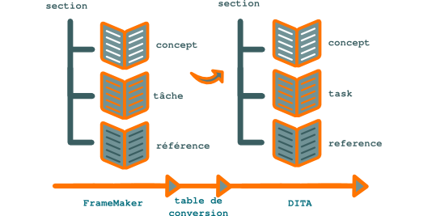

   Application d'une table de conversion de FrameMaker vers DITA XML

Appliquez bien sûr ce processus à un petit jeu de documents (j'appelle *jeu de
documents* tout ensemble d'information lié qui ne partage aucun contenu avec un
autre ensemble ; si par exemple le document A partage une section avec le
document B, le jeu de documents est A+B ; si vous dupliquez la section partagée
afin qu'elle ne soit plus commune à A et B, A et B deviennent des jeux
distincts), qui ne soit pas, si possible, d'une importance critique. Après ce
premier succès, vous pourrez appliquer le processus aux autres jeux de
documents.

Vous pouvez maintenant progressivement modulariser et partager votre contenu
dans le nouveau format afin de tirer parti au maximum de DITA XML. Vous pouvez
pendant cette phase continuer à publier de nouvelles versions du document ; la
publication devrait d'ailleurs être beaucoup plus simple que sous FrameMaker…
sauf si votre chaîne de création et de publication se base sur FrameMaker
structuré (mais, certes, le choix de FrameMaker structuré peut être motivé, ne
serait-ce que pour tirer parti de la qualité de son moteur d'impression).
Task DITA XML
=============

Les sections **task** permettent au **rédacteur technique** de présenter des
procédures pas à pas pour effectuer une tâche. Elles incluent des parties :

- contexte,

- prérequis,

- résultat,

- exemple,

- étapes suivantes.

Exemple de structure d'une *task* :

.. aafig::

           +----+title
           |    |
           |    +----titlealts
           |    +----shortdesc
           |                                               +---boolean
           +----prolog                                     |
           |            +-prereq          +hazardstatement +---data
           |            |                 |                |
           |            |-example      +---cmd+------------+---uicontrol
      task +----taskbody+              |  |                |
           |            |-context      |  +note            +---menucascade
           |            |              |                   |
           |            |-steps--step--+--choices          +---userinput
           |            |              |
           |            |-result       +--stepxmp
           |            |              |
           |            +-postreq      +--substeps
           |                           |
           +----related-links          +--info
Tester les produits pour les documenter
=======================================

Le **rédacteur technique** ne peut fournir une documentation utile aux clients
de l'entreprise s'il se contente de mettre en forme des informations glanées
auprès des différents acteurs de la société. Jouant le rôle de Candide, il est
le premier représentant des utilisateurs et se doit de tester les produits dans
des conditions proches des leurs.

Un conte chinois, mis en images par des artistes japonais tels qu'Hokusaï ou
Itchō, narre comment des aveugles se sont retrouvés confrontés à un
éléphant. Aucun d'entre eux, et pour cause, n'ayant une perception globale de
l'animal, chacun en eut une image différente : celui qui en tenait une patte le
prenait pour un arbre, celui qui en étreignait la trompe le confondait avec un
serpent, celui qui avait empoigné une défense l'identifiait à une lance, et
celui qui s'agrippait à une de ses oreilles croyait qu'il s'agissait d'un
éventail.

.. figure:: wp-content/uploads/2013/02/hanabusa-itcho.jpg

   Tester les produits pour les documenter

Le **rédacteur technique** qui demande aux différents intervenants de
l'entreprise à quoi sert le produit dont il doit créer la documentation et
comment il fonctionne se retrouve comme celui qui demande aux aveugles à quoi
ressemble un éléphant : pour la R&D, il s'agit de code élégamment rédigé,
pour le marketing, d'une offre à positionner face à la concurrence sur son
marché, pour le support technique, d'un exécutable dont il faut corriger les
bugs, etc.

Pour avoir une vision réaliste de l'objet qu'il est censé décrire, le
**rédacteur technique** doit donc l'appréhender par lui-même et se faire sa
propre opinion, qu'il pourra ensuite confronter à celle des autres acteurs de
l'entreprise.  Le **rédacteur technique** est un pragmatique qui s'intéresse à
la pratique, non à la théorie. Comme saint Thomas, il ne doit croire que ce
qu'il voit. S'il ne consulte que les développeurs, par exemple, il aura peu de
chance de pouvoir créer une documentation satisfaisante pour l'utilisateur :

- d'une part, les développeurs ont souvent une vision idéaliste du
  fonctionnement de leur produit, bien différente du comportement de ce dernier
  en conditions réelles d'utilisation,

- d'autre part, une déperdition d'information se produit nécessairement entre :

- ce que le développeur sait,

- ce que le développeur exprime,

- ce que le **rédacteur technique** comprend,

- ce que le **rédacteur technique** rédige,

- ce que l'utilisateur comprend.

Si le **rédacteur technique** teste réellement le comportement du produit dans
des conditions aussi proches que possible de celles rencontrées par
l'utilisateur, les trois premières causes de déperdition d'information sont
quasiment inexistantes. Pour réduire les deux dernières, il ne lui reste plus
qu'à filtrer, organiser et exprimer l'information qu'il a recueillie de manière
adaptée au média qui la véhiculera et aux connaissances techniques de son
destinataire.

Dans les faits, une telle demande peut sembler de prime abord incongrue en
interne et se heurter à la lourdeur de la mise en place d'une plateforme de
test. Ce n'est généralement qu'après les premiers retours clients ou les tests
produits dans la presse que les différents interlocuteurs comprennent pleinement
l'apport de cette démarche. C'est souvent seulement à partir de ce moment là que
la rédaction technique gagne ses lettres de noblesse. Et que la documentation
technique n'est plus seulement vue comme un mal nécessaire, mais comme une
véritable valeur ajoutée.
Tests de non-régression
=======================

Le simple fait de générer une documentation technique à deux instants différents
peut entraîner des différences entre les deux versions publiées d'une
**documentation technique** : des modifications peuvent avoir été apportées aux
fichiers sources ou l'outil de publication peut avoir un comportement différent.

Il convient donc de procéder à des tests de non-régression de la documentation
technique. Le plus simple est de comparer les deux versions du document à l'aide
d'un outil dédié et de vérifier que les différences correspondent bien à des
évolutions souhaitées. Cet aspect important ne peut cette fois pas être pris en
charge par un système de workflow ou de tickets. Il s'agit d'un contrôle qualité
placé sous la responsabilité du **rédacteur technique**.

Une comparaison automatique sera cependant difficile à mettre en œuvre si de
multiples modifications de détail ont été apportées entre les deux versions. Si
une restructuration de la hiérarchie de table de matières est intervenue, il
faudra procéder à une comparaison section par section, plus fastidieuse.

Si le document est disponible en plusieurs langues, les tests de non-régression
doivent être reproduits indépendamment pour chaque langue.
Texte conditionnel
==================

Le **texte conditionnel** permet au **rédacteur technique** de filtrer des
éléments d'information lors de la génération des fichiers cibles. Vous pouvez
ainsi produire des versions différentes d'un même document selon le public.

DITA propose l'utilisation des marqueurs sémantiques suivants :

- *audience* : les différents publics à qui est destiné l'information, par
  exemple les utilisateurs finaux ou les ingénieurs système,

- *platform* : la plateforme ou l'environnement du produit dont traite le
  document, par exemple le système d'exploitation ou la plateforme matérielle,

- *product* : par exemple le nom du produit ou sa version,

- *rev* : le niveau de révision (par exemple, un paragraphe peut avoir
  l'attribut de révision 1.1) ; ce marqueur est surtout intéressant si l'on ne
  crée pas de *tag* des versions de la documentation sous un système de gestion
  de versions,

- *props* : un marqueur générique  qui peut être spécialisé,

- *otherprops* : ce que vous voulez !

Ces marqueurs peuvent bien entendu servir à d'autres fins telles que la
recherche ou l'indexation. Ils peuvent être utilisés au niveau des *topics* ou
des *maps*.  Le code source qui contient des marqueurs doit être valide avant
exclusion d'une des valeurs. Par exemple, le code suivant est incorrect :

.. code-block:: xml

      <step>
        <cmd audience="ose>
         Cliquez sur <uicontrol>Salut</uicontrol>.
        </cmd>
        <cmd audience="non-ose>
         Cliquez sur <uicontrol>Bonjour</uicontrol>.
        </cmd>
        <info>
        Information commune aux deux publics
        </info>
      </step>

En effet, même s'il correspond après filtrage à un code qui serait conforme au
schéma *task*, qui n'accepte qu'une seule balise <cmd> par balise <step>, il en
contient deux avant traitement.

Il faut donc utiliser le code suivant :

.. code-block:: xml

      <step audience="ose>
        <cmd>
         Cliquez sur <uicontrol>Salut</uicontrol>.
        </cmd>
        <info>
        Information commune aux deux publics
        </info>
      </step>
      <step>
        <cmd audience="non-ose>
         Cliquez sur <uicontrol>Bonjour</uicontrol>.
        </cmd>
        <info        Information commune aux deux publics
        Information commune aux deux publics
        </info>
      </step>

quitte à partager la section info par le mécanisme des *conref* :

.. code-block:: xml

      <step audience="ose>
        <cmd>
         Cliquez sur <uicontrol>Salut</uicontrol>.
        </cmd>
        <info conref="shared.dita#shared/system>
        </info>
      </step>
      <step>
        <cmd audience="non-ose>
         Cliquez sur <uicontrol>Bonjour</uicontrol>.
        </cmd>
        <info conref="shared.dita#shared/system>
        </info>
      </step>

Les blocs d'information traités par les *conref* sont donc en moyenne plus
grands que ceux gérés par les Xinclude. Leur utilisation demande plus de
réflexion, voire d'acrobaties, dans la structuration des informations.
Traduction
==========

Les contraintes de traduction doivent être prises en compte en amont du
processus rédactionnel. Elles ont des implications autant sur le style
rédactionnel que sur l'organisation du référentiel.

Il n'y a pas de recette miracle : la livraison d'informations dans plusieurs
langues demande un suivi constant. Mais la prise en compte des contraintes en
amont et l'utilisation d'une méthodologie appropriée permettent d'améliorer la
qualité et de diminuer les coûts et les délais de livraison des versions
multilingues. La traduction doit être intégrée au *workflow* documentaire. Il
faut également faire communiquer avec les traducteurs les différents acteurs :
**rédacteurs techniques**, mais également ingénieurs, experts et concepteurs.

Si la documentation repose sur un ensemble de modules, la traduction peut se
faire en parallèle de la rédaction, ce qui réduit les délais de livraison.

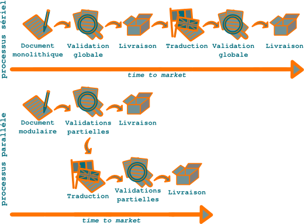

   Parallèlisation de la rédaction et de la traduction

En ce qui concerne le référentiel des fichiers sources, vaut-il mieux placer les
répertoires de langue en amont ou en aval des répertoires de projets
documentaires ? Autrement dit, vaut-il mieux adopter la structure suivante :

-             english
-                  produit 1
-                  produit 2
-             francais
-                  produit 1
-                  produit 2

ou la suivante :

-             produit 1
-                  english
-                  francais
-             produit 2
-                  english
-                  francais

La structure suivante est à prohiber, car elle introduit une asymétrie entre les
projets :

-             english
-                  produit 1
-                  produit 2
-             francais
-                  produit 1
-                  produit 2

Dans la plupart des cas, il est préférable de placer la distinction entre les
langues le plus en amont possible. Pour reprendre une terminologie utilisée dans
le développement logiciel, créer une traduction d'un ensemble d'informations
équivaut à créer une *branche* de cet ensemble. Comme il est plus facile de
manipuler une branche par sa racine que par ses ramifications, à l'usage, il est
beaucoup plus facile de manipuler des répertoires complets, ne serait-ce que
pour les fournir aux traducteurs, qu'un ensemble de sous-répertoires.

Une fois la traduction réalisée, les modifications apportées à la version source
ou à la version traduite ne peuvent être appliquées automatiquement à l'autre
version. Pour continuer dans la terminologie du monde logiciel, la nouvelle
branche est un *fork* : il devient impossible d'appliquer automatiquement à
l'une les modifications apportées à l'autre. Pour fournir les mêmes informations
dans les différentes langues, il est donc crucial de suivre efficacement les
mises à jour de la version d'origine.
Typologie de haut niveau de l'information
=========================================

`DITA XML <http://dita.xml.org/>`_ propose au **rédacteur technique** une
typologie de haut niveau qui est une véritable aide à la structuration du
contenu.

S'il crée un nouveau document au format FrameMaker, DocBook ou traitement de
texte, le **rédacteur technique** se trouve face à une page blanche. Selon sa
rigueur professionnelle, l'information transmise à l'utilisateur oscillera entre
les deux pôles suivants :

+------------------------------+------------------------------+
|Organisation rationnelle      |L'utilisateur dispose d'un    |
|                              |accès séquentiel rapide et    |
|                              |aisé à l'information dont il a|
|                              |besoin.                       |
+------------------------------+------------------------------+
|Magma informatif              |L'utilisateur doit lire       |
|                              |intégralement toute une       |
|                              |section, voire le document en |
|                              |sa totalité pour espérer      |
|                              |trouver des renseignements    |
|                              |utiles.                       |
+------------------------------+------------------------------+

Lorsqu'il crée un document DITA XML, en revanche, le **rédacteur technique**
doit d'emblée choisir le modèle (dans la pratique, un schéma XSD) qui correspond
au type d'information qu'il veut présenter. De base, DITA XML propose les types
d'information suivants (DITA XML propose trois types d'information de base,
tandis que, de mémoire, la méthode Information Mapping en propose sept) :

+------------------------------+------------------------------+
|**Type d'information**        |**Description**               |
+------------------------------+------------------------------+
|Concept                       |Texte généraliste du type     |
|                              |introduction ou présentation. |
+------------------------------+------------------------------+
|Task                          |Procédure pas à pas destinée à|
|                              |réaliser une tâche.           |
+------------------------------+------------------------------+
|Reference                     |Information de référence du   |
|                              |type explication de paramètres|
|                              |de commandes.                 |
+------------------------------+------------------------------+

Chacune de ces catégories de haut niveau propose un jeu de balises de plus bas
niveau qui lui est propre.  Si le **rédacteur technique** rédige un document
technique, ce qui est assez probable, il y a toutes les chances pour que
l'information qu'il a collectée et qu'il doit organiser fasse partie de l'un de
ces trois catégories (s'il s'avère qu'il a réellement besoin d'une autre
catégorie, il peut la créer *via* une spécialisation).  Cette division en types
d'information oblige donc d'entrée de jeu le **rédacteur technique** à
structurer l'information. L'utilisateur y gagne en facilité et rapidité d'accès
à l'information et en utilisabilité globale de la **documentation technique*
Typologie de l'information DITA XML
===================================

Les **topics** DITA XML sont typés selon l'information qu'ils contiennent :
description, procédure pas à pas, etc.

La sémantique DITA est donc à plusieurs niveaux :

- termes (option d'interface graphique, adresse postale, etc.),

- paragraphes (prérequis, étape de procédure, etc.),

- modules d'information (*topics*, *concepts*, *tasks*).

DITA invite à choisir un schéma différent pour chaque type d'information. Les
procédures doivent être rédigées sous un schéma de type *task* et ne peuvent pas
être associées à un schéma *topic*, par exemple, ce dernier n'acceptant pas les
balises de procédures pas à pas <step>.  DITA est donc une aide à la
structuration des documents. Si je commence une rubrique de type *concept* et
que de fil en aiguille j'en viens à rédiger une procédure pas à pas, le
garde-fou du schéma XML m'oblige à créer une section *task distincte. Je peux
alors présenter l'information de manière plus claire pour son destinataire puis,
par exemple, publier par la suite :

- un guide PDF ne contenant que les concepts du produit comme introduction à son
  utilisation,

- une aide en ligne ne contenant que les procédures de réalisation de tâches
  spécifiques.
Une architecture documentaire trop complexe ?
=============================================

DITA XML est une architecture documentaire plus complexe, mais moins compliquée
que d'autres. Des solutions permettent en outre de gérer plus simplement cette
complexité.

DITA XML permet des gains de productivité importants par la réduction du volume
source que le **rédacteur technique** crée, traduit et maintient. Ce gain de
productivité se fait au prix d'une plus grande complexité.

Si les projets DITA XML sont plus complexes, ils sont cependant moins compliqués
que des projets reposant sur des formats plus traditionnels de type
FrameMaker. En effet, DITA XML est une architecture rationnelle. Le **rédacteur
technique** se trouve donc face à un comportement prédictible des outils qu'il
utilise, loin des trucs et astuces destinés à contourner les bugs ou les
fonctionnements erratiques des outils plus lourds.

Le tableau suivant présente les différents niveaux de complexité et les
solutions qui permettent au **rédacteur technique** de les maîtriser plus
facilement :

+------------------------------+------------------------------+
|**Complexité**                |**Solution**                  |
+------------------------------+------------------------------+
|Syntaxe DITA XML              |IDE tel que XMetal ou nXML    |
+------------------------------+------------------------------+
|Gestion des relations entre   |CMS dédié tel que Componize ou|
|des briques d'information     |DocZone                       |
|atomiques                     |                              |
+------------------------------+------------------------------+
|Syntaxe de la feuille de style|Logiciel graphique de création|
|XSLT                          |de feuilles de style          |
+------------------------------+------------------------------+

Pour une petite équipe de **rédaction technique**, l'écueil principal sera la
nécessité de mettre en œuvre la charte graphique de l'entreprise, selon son
degré de sophistication. Les autres aspects peuvent être gérés sans outil
spécialisé, avec une bonne communication et une série de bonnes pratiques.

Je laisse le dernier mot au consultant `Julio Vazquez
<http://www.linkedin.com/groups/Does-anyone-know-opensource-project-162465.S.74267379?trk=group_search_item_list-0-b-ttl&goback=.gna_162465>`_
:

DITA est en fait d'une remarquable simplicité. La vraie complexité consiste à
amener les **rédacteurs techniques** à envisager le contenu sous un autre
angle. Ils doivent cesser de produire des récits narratifs pour concevoir des
modules d'information autonomes. DITA est plus qu'un langage XML : c'est une
méthode de rédaction.*
Un format adapté aux entreprises de toutes tailles
==================================================

On `lit parfois
<http://www.oreillynet.com/xml/blog/2008/05/dita_docbook_and_the_art_of_th.html>`_
que **DITA** est plutôt réservée aux grandes entreprises et DocBook aux
petites. La réutilisation du contenu étant aujourd'hui un enjeu stratégique pour
toutes les entreprises, je pense au contraire que DITA est aussi bien adaptée
aux TPE et PME qu'aux grands groupes. Pour avoir appris les deux formats tout
seul, par la pratique, je peux témoigner que DITA n'est pas plus compliquée que
DocBook.
Un index est-il utile dans un PDF ?
===================================

À l'heure des documents dématérialisés, un index est-il un élément indispensable
d'une bonne **documentation technique** ?

La recherche en plein texte semble avoir détrôné l'index. Les **notices
techniques** ne sont plus qu'exceptionnellement fournies aux clients sous forme
papier. Ce drôle d'objet qu'est le PDF, format d'échange entre un format source
non destiné aux clients et une version imprimée qui ne l'est que de manière
marginale, est entré dans les mœurs. La séquence de touches *Ctrl+F* est un
réflexe plus naturel aujourd'hui pour qui recherche une information.

Un texte destiné au Web recourra à une grande dispersion terminologique pour
accroître sa visibilité sur les moteurs de recherche. L'emploi des synonymes est
de rigueur pour donner au lecteur potentiel plusieurs chemins d'accès à la
source d'information qui peut l'intéresser. Les moteurs de recherche ont rendu
l'index caduc.

Si la documentation technique utilise une terminologie cohérente, l'efficacité
de la recherche en plein texte est réduite : si le **rédacteur technique*
a utilisé uniquement le terme *répertoire*, le lecteur qui recherche le mot
*dossier* passera à côté de l'information qu'il recherche.

L'index, s'il est bien réalisé, a alors toute son utilité. Seul problème :
créer un bon index demande un effort important en toute fin de projet, juste
avant l'heure de la livraison. Et fournir un mauvais index n'a aucun intérêt ni
pour le client, ni pour l'entreprise.

Un index est donc paradoxalement plus utile pour une bonne documentation que
pour une mauvaise (du moins, une documentation dont la terminologie n'est pas
cohérente). Mais son rapport coût/utilité est faible. C'est un luxe que
l'entreprise peut rarement s'offrir, mais certainement pas le premier aspect
qualitatif qu'il faut améliorer. Un index est la cerise sur le gâteau d'une
documentation technique - le plus important reste le gâteau.
Un langage à balises
====================

`DITA XML <http://dita.xml.org/>`_ est un langage à balises : le **rédacteur
technique** structure l'information dans des fichiers sources sans mise en page,
similaires aux fichiers sources de code informatique. L'utilisateur reçoit un
document cible, par exemple un fichier PDF, où les balises sont remplacées par
une mise en forme typographique.

Si votre entreprise fournit à ses clients une documentation technique au format
Word (ce qui est une mauvaise idée, sauf si cela est expressément demandé par
vos clients), le **rédacteur technique** et l'utilisateur disposent des mêmes
supports d'information (il n'y a pas de différenciation entre le fichier source
et le fichier cible). Ce qui semble a priori la solution la plus simple s'avère
cependant peu efficace en termes de productivité de l'équipe de **rédaction
technique** et de structuration de l'information.

Avec un format XML tel que DITA, le **rédacteur technique** et le lecteur
disposent de supports largement différents :

+--------------------+---------------------------------------------------------+
|**Public**          |**Description**                                          |
+--------------------+---------------------------------------------------------+
|Rédacteur technique |Le **rédacteur technique** manipule des fichiers sources |
|                    |; il utilise les balises pour construire le document en  |
|                    |marquant les éléments d'information qu'il crée ou        |
|                    |réutilise. Les balises sont imbriquées comme des poupées |
|                    |russes organisées selon une syntaxe rigoureuse. Le       |
|                    |fichier source n'est pas au format WYSIWYG : la mise en  |
|                    |page sera appliquée lors de la transformation des        |
|                    |fichiers sources en fichiers cibles (autrement dit, lors |
|                    |de la génération des livrables). Tout au plus, certains  |
|                    |logiciels graphiques tels XMetal, Oxygen ou FrameMaker   |
|                    |structuré proposent-ils le format WYSIWYM (what you see  |
|                    |is what you mean), où les balises sont remplacées à      |
|                    |l'écran par une mise en forme générique, différente de   |
|                    |l'aspect final du document. Je trouve cependant que l'un |
|                    |des intérêts d'avoir recours à un langage à balises est  |
|                    |de voir exactement ce que l'on fait en manipulant        |
|                    |soi-même les balises sans en déléguer l'interprétation à |
|                    |un logiciel graphique.                                   |
+--------------------+---------------------------------------------------------+
|Utilisateur         |Seul le contenu est présenté au lecteur dans le fichier  |
|                    |cible ; le texte marqué par des balises dans les fichiers|
|                    |sources a une mise en valeur typographique dont le sens  |
|                    |est explicité dans la section *Conventions               |
|                    |typographiques* du document final.                       |
+--------------------+---------------------------------------------------------+

Un fichier source DITA XML mélange du texte et des balises, délimitées par les
signes < et > (si vous voulez entrer ces signes en tant que tels, il faut les
remplacer par &lt; et &gt;, respectivement ; pour entrer &, saisissez &amp;. Si
ce genre d'exercice vous rebute, tournez-vous vers un éditeur `WYSIWYM
<http://en.wikipedia.org/wiki/WYSIWYM>`_). Le texte proprement dit est encapsulé
dans un jeu de balises ouvrantes de type <balise> et de balises fermantes de
type </balise> selon le schéma <balise>texte</balise>. Tout texte entré hors
d'une balise ouvrante et fermante est incorrect et produit un fichier non
valide.
Un référentiel unique ?
=======================

Idéalement, tout le contenu peut être placé sous un référentiel unique, par
exemple le logiciel de gestion de versions `Git
<http://fr.wikipedia.org/wiki/Git>`_. Ceci en maximise la réutilisation,
la cohérence et la qualité. S'il est en DITA XML ou en DocBook, par exemple, on
peut exploiter au mieux les capacités de *single-sourcing* de ces formats pour
le publier sous la forme appropriée.

Le contenu devient un réseau de modules d'information ; il faut alors gérer les
relations au sein de ce réseau, notamment lors des mises à jour.

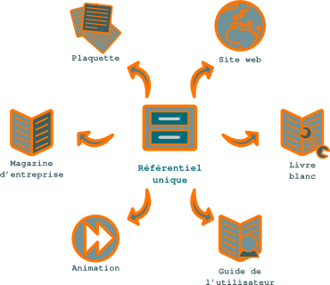

   Référentiel

En pratique, il semble que rares sont les entreprises qui ont franchi ce pas. Il
est vrai que tant que les formats structurés ne seront pas enseignés dans le
secondaire, il paraît utopique de vouloir y convertir tous les acteurs de la
société, surtout si le turn-over y est important.
Utiliser l'IDE nXML pour DITA XML
=================================

Le **mode nXML** propose de valider en temps réel les documents XML DocBook,
XHTML ou autres. Plus la peine de connaître le schéma XML par cœur: votre
éditeur de texte vous propose l'**autocomplétion des balises XML** selon le
contexte. Il ne supporte cependant pas DITA XML par défaut. Ce didacticiel vous
permettra d'utiliser ce mode Emacs pour DITA XML.

.. rubric:: Prérequis

- Emacs

- La structure de répertoires de votre projet de documentation DITA XML doit
  être la suivante:

  -               répertoire de langue
  -                   concepts
  -                   faq
  -                   reference
  -                   tasks
  -                   topics

où <répertoire de langue> a la valeur en_US, ou fr_FR, etc.

- Les instructions de ligne de commande sont conçues pour GNU/Linux; elles
  doivent être adaptées pour être utilisées dans un autre environnement.

#.  Effectuez une sauvegarde de l'ensemble de votre projet de documentation
    DITA XML.
#.  Ouvrez un terminal et collez la suite de commandes suivante:

    .. code-block:: xml

       cd && \
       wget http://www.thaiopensource.com/download/nxml-mode-20041004.tar.gz && \
       tar xzvf nxml-mode-20041004.tar.gz && \
       wget http://www.redaction-technique.org/media/nxml-mode-environmment.txt && \
       cp .emacs .emacs.bak && \
       cat .emacs | sed '$a\' > .emacs.tmp && \
       mv .emacs.tmp .emacs && \
       cat nxml-mode-environmment.txt >> .emacs && \
       rm  nxml-mode-environmment.txt

    .. note::

       Si un message vous avertit que le fichier .emacs n'existe pas, collez les
       commandes suivantes, puis recommencez l'opération:

    .. code-block:: console

       $ cd && touch .emacs

    Cette suite de commandes:

    - télécharge et décompresse le mode nXML,
    - crée une copie de sauvegarde du fichier .emacs (.emacs.bak),
    - écrit les variables d'environnement du mode nXML dans le fichier .emacs.

#.  Téléchargez `http://www.redaction-technique.org/media/rnc.tar.gz>l'archive
    des schémas RelaxNG pour DITA XML` dans le répertoire racine de votre
          projet de documentation DITA XML.

#.  Placez-vous dans le répertoire racine de votre projet de documentation DITA
    XML, puis collez la commande suivante:

    .. code-block:: console

       $ tar xzvf rnc.tar.gz

    Cette commande crée un répertoire *rnc* de même niveau que le <répertoire de
    langue>.

#.  Téléchargez `l'archive des fichiers schemas.xml
    <http://www.redaction-technique.org/media/schemas.redaction-technique.org.tar.gz>`
    dans le répertoire racine de votre projet de documentation DITA XML, puis
    collez la suite de commandes ci-dessous en remplaçant <répertoire de langue>
    par la valeur appropriée, en_US, ou fr_FR, par exemple. Répétez cette étape
    pour tous vos répertoires de langue.

    .. code-block:: xml

       $ tar xzvf schemas.redaction-technique.org.tar.gz && \
       cd <répertoire de langue> && \
       cp ../schemas.redaction-technique.org/concepts/schemas.xml concepts/ && \
       cp ../schemas.redaction-technique.org/faq/schemas.xml faq/ && \
       cp ../schemas.redaction-technique.org/reference/schemas.xml reference/ && \
       cp ../schemas.redaction-technique.org/tasks/schemas.xml tasks/ && \
       cp ../schemas.redaction-technique.org/tasks/schemas.xml tasks/ && \
       cp ../schemas.redaction-technique.org/topics/schemas.xml topics/ && \
       rm -rf ../schemas.redaction-technique.org/

    Vos répertoires de langue doivent maintenant comporter les fichiers
    :file:`schemas.xml` appropriés:

    -               fr_FR
    -                   concepts
    -                       schemas.xml
    -                   concepts
    -                       schemas.xml
    -                   faq
    -                       schemas.xml
    -                   reference
    -                       schemas.xml
    -                   tasks
    -                       schemas.xml
    -                   topics
    -                       schemas.xml

#.  Ouvrez un fichier de contenu DITA XML (:file:`.dita`) avec Emacs.  La
    syntaxe DITA XML apparaît en couleurs. Les endroits où le schéma n'est pas
    respecté sont soulignés en rouge.

#.  Pour insérer une nouvelle balise entrez <, puis appuyez sur Ctrl+Entrée.  La
    liste des balises possibles apparaît.

#.  Sélectionnez une balise, puis appuyez sur Entrée. Appuyez sur Ctrl+Entrée
    pour afficher la liste des attributs autorisés.

#.  Pour insérer une balise fermante après du texte, entrez </, puis appuyez sur
    Ctrl+Entrée.
Utiliser le nœud XML de plus bas niveau
=======================================

Le **rédacteur technique** doit utiliser comme source du `conref
<http://docs.oasis-open.org/dita/v1.1/OS/archspec/conref.html>`_ le nœud **DITA
XML** de plus bas niveau contenant l'information à partager.

Le but des **conref** étant de gérer des blocs d'information de faibles
dimensions, il est logique de les manipuler au niveau de la plus petite
structure XML encapsulant l'information, même si cette structure, pour être
compatible avec le schéma XSD de la section **DITA XML** où elle intervient,
doit elle-même être incluse dans des structures XML plus grandes.

.. figure:: media/conref-bas-niveau.png

   Placement du *conref* sur le nœud XML de plus bas niveau

Vous voulez par exemple réutiliser la phrase *Cliquez sur OK.* Vous ne pouvez
cependant pas indiquer dans le fichier contenant les *conref* sources uniquement
le code suivant:

.. code-block:: xml

  <cmd>Cliquez sur OK.</cmd>

Pour être conforme au schéma XSD, votre code doit au moins être structuré comme
suit:

.. code-block:: xml

   <?xml version="1.0" encoding="utf-8"?>
   <!DOCTYPE task PUBLIC "-//OASIS//DTD DITA 1.2 Task//EN" "../../dtd/technicalContent/dtd/task.dtd">
   <task id="shared" xml:lang="fr-fr">
   <title>Conref source</title>
   <taskbody>
   <steps>
   <step>
   <cmd>
   Cliquez sur OK.
   </cmd>
   </step>
   </steps>
   </taskbody>

Il s'agit maintenant de placer un ID sur une structure XML afin de pouvoir
réutiliser le contenu de cette structure. En l'occurrence, c'est une étape
unique comprenant une commande unique que vous souhaitez réutiliser.

Il est alors préférable d'utiliser la syntaxe suivante:

.. code-block:: xml

   <step>
   <cmd id="click-ok">
   Cliquez sur OK.
   </cmd>
   </step>

plutôt que la suivante:

.. code-block:: xml

   <step id="click-ok">
   <cmd>
   Cliquez sur OK.
   </cmd>
   </step>

En effet, dans le premier cas, vous pourrez utiliser le *conref* même si le nœud
supérieur (<step>) contient d'autres nœuds que <step> (par exemple <info>).

.. figure:: media/conref-haut-niveau.png

   Placement du *conref* sur le nœud XML de plus haut niveau

Dans le 2e cas, tout le contenu du nœud <step> sera remplacé par la
valeur du *conref* source. Par exemple, dans le cas suivant, tout le contenu du
nœud sera absent des livrables:

.. code-block:: xml

   <step id="click-ok">
   <cmd/>
   <info>
   Si vous ne savez pas lire, c'est le bouton vert.
   </info>
   </step>
Utiliser les branches des systèmes de gestion de sources
========================================================

Les CMS (ou systèmes de gestion de sources) proposent de créer des branches d'un
projet : si à un moment donné, un projet se divise en deux projets
incompatibles, une branche est créée à partir du projet principal. Le
**rédacteur technique** peut ainsi gérer les différentes traductions de la
documentation technique.

Le système des branches peut servir en théorie à gérer :

- les différentes traductions d'une documentation technique,

- les différentes variations d'une même  documentation technique.

En pratique, cependant, il vaut mieux gérer les déclinaisons d'une   même
documentation à l'aide des mécanismes de partage de sections et de filtrage de
texte conditionnel des outils de documentation.

D'autre part, le système de gestion des branches est plus ou moins adapté à la
gestion des traductions selon le gestionnaire de sources que l'on utilise.

La principale différence entre les CMS (ou systèmes de gestion de sources) Git
et Subversion, c'est leur manière de gérer les branches. Créer une branche sous
Subversion revient à dupliquer un répertoire. Les fichiers des deux répertoires
évoluent ensuite séparément. Sous Git, en revanche, la création de branche se
fait sans duplication de données. Sur un même répertoire local, une commande
permet de changer de branche.

Créer une traduction d'une documentation consiste à *forker*, soit créer une
branche, le document initial. Si l'on utilise Git se pose alors le choix entre :

- copier le répertoire de la langue source,

- créer une branche sur le répertoire de la langue source.

La solution de la branche permet en théorie d'effectuer du *Cherry picking* et
d'appliquer facilement à toutes les langues cibles des modifications affectant
uniquement le code XML du projet.

Par exemple, une modification de

.. code-block:: xml

   <image href="../images/filter.png" placement="break"/>

en

.. code-block:: xml

   <image href="../images/filter.png" placement="break" scalefit="yes"/>

de la version anglaise de la documentation peut facilement être appliquée aux
versions chinoise, française, allemande ou autre si elle a fait l'objet d'un
*commit* distinct.  En pratique, cependant, cette opération peut s'avérer
délicate et n'être réellement utile que si l'on doit gérer un grand nombre de
différentes versions linguistiques.  En tout cas, la solution des branches
autorise de telles opérations, non celle des répertoires. Elle est cependant
plus difficile à appréhender et à utiliser par l'équipe de **rédaction
technique**.
Validation et contrôle qualité
==============================

Un support de **rédaction technique** doit être soumis à un **contrôle qualité**
rigoureux avant d'être communiqué à ses différentes cibles.

Le contenu doit être validé avant livraison. Cela paraît évident, mais cela
demande de bien impliquer en amont les personnes chargées de la
validation. Idéalement, la phase de validation se déroule en parallèle de la
phase de création : plus les modifications interviennent tôt, moins elles sont
coûteuses. Un outil de gestion de contenu d'entreprise tel qu'`>Alfresco
<http://www.alfresco.com/fr/>`_ peut sembler intéressant afin de mettre en place
des *workflows*, sur le papier du moins. Dans les faits, une telle solution peut
s'avérer lourde. Elle est de plus peu compatible avec certains formats sources
basés sur des documents modulaires et non monolithiques et avec les logiciels de
gestion de versions (le projet `Componize <http://www.componize.com>`_ se
propose cependant de gérer des projets DITA sous Alfresco). Il reste cependant
impératif de mettre en place des étapes de validation tout au long du projet.
Associés à un système de gestion de versions, les outils de comparaison sont
très utiles pour valider les mises à jour. Une version « taguée » d'un projet
DITA XML et la version en cours peuvent par exemple être exportées au format
RTF, puis comparées sous un traitement de texte. Cela est bien moins fastidieux
qu'une relecture comparée. Comparer les modules d'information directement sous
le système de gestion de versions n'est pas suffisant, car ils ne sont que les «
briques » du document final.
Workflow de création et validation
==================================

Un processus de création et de mise à jour de la documentation technique qui
repose sur la mémoire des acteurs humains est peu fiable. Un **rédacteur
technique** peut être fatigué, souffrant, en congés, oublier des données
lorsqu'il est saturé d'informations ou avoir quitté la société. L'information
entre deux personnes peut également mal circuler ou être mal comprise. C'est
pour pallier ces faiblesses que l'homme a créé des outils. En revanche, il est
créatif, à l'inverse des machines.

Face à cet état de fait, il convient de mettre un système de gestion de
l'information relative à l'évolution de la documentation qui soit tolérant à
l'erreur humaine. Il faut donc soit :

- mettre en œuvre des workflows sous un CMS,

- utiliser le système de gestion de tickets utilisés pour la gestion des
  nouvelles fonctionnalités du produit documenté (par exemple, Trac) :

- création d'un ticket par un développeur,

- mise en œuvre du ticket par un rédacteur technique,

- fermeture du ticket par le créateur du ticket,

- publication de la documentation lorsque tous les tickets critiques sont
  fermés.

Les fonctions principales d'un CMS sont les suivantes :

- gestion des métadonnées,

- workflows,

- traçabilité,

Quel qu'il soit, le système de suivi doit offrir une visibilité et une
traçabilité totales des modifications apportées à la documentation technique
(quoi, qui, quand) (sur le plan de la traçabilité, un système de gestion des
versions n'est pas suffisant, car il est très difficile d'obtenir une vue
synthétique de l'évolution d'un document lorsque des modifications atomiques ont
été apportées à un grand nombre de petits fichiers).

Ce système doit être unique et exhaustif : il doit centraliser toutes les
demandes de modification de la documentation technique.

Si le document est disponible en plusieurs langues, chaque ticket doit être
dupliqué pour chaque langue ou, dans le cas d'un CMS, à chaque langue doit
correspondre un workflow distinct.
Workflow
========

Un processus de création et de mise à jour de la documentation technique qui
repose sur la mémoire des acteurs humains est peu fiable. Il faut soit :

- mettre en œuvre des workflows sous un CMS,

- utiliser le système de gestion de tickets utilisés pour la gestion des
  nouvelles fonctionnalités du produit (par exemple, Trac) :

- création d'un ticket par un développeur,

- mise en œuvre du ticket par un rédacteur technique,

- fermeture du ticket par le créateur du ticket,

- publication de la documentation lorsque tous les tickets critiques sont
  fermés.
XSL-FO : filtrer du contenu selon des conditions « sauf » et « ou »
===================================================================

Imaginons que vous vouliez filtrer les nœuds enfants de la balise DITA XML
<example> et afficher tout son contenu à l'exception du titre (situé entre les
balises <title>).

Vous pouvez recourir alors à la syntaxe suivante :
.. code-block:: xslt

   <xsl:template match="*[contains(@class,' topic/example ')]">
       <fo:block>
         <xsl:apply-templates select="*[not(name()='title')]" />
       </fo:block>
      </xsl:template>

Cette commande sélectionne tous les nœuds enfants du nœud <example>, à
l'exception du nœud <title>. Cependant, le nœud <example> accepte le texte entré
directement, sans être encapsulé dans des balises. Cette commande ne fera alors
pas apparaître ce contenu.

Supposons que le code source d'un de vos fichiers DITA soit le suivant :

.. code-block:: xml

        <example>
          <title>
            XSL-FO

          Voici mon exemple de chemin XPATH :
          <codeblock>
            ancestor-or-self
          </codeblock>
          Texte non encapsulé situé après un nœud enfant.
        </example>

Le fichier PDF affichera l'exemple structuré comme suit :

.. code-block:: xslt

   ancestor-or-self

Le titre de l'exemple n'est pas affiché, ce qui correspond au résultat souhaité,
mais le contenu non encapsulé dans des balises n'apparaît pas, ce qui est un
effet de bord indésirable. Pour sélectionner ce contenu, il faut sélectionner
les nœuds textuels avec la syntaxe text(). Il est alors tentant d'utiliser la
syntaxe suivante :

.. code-block:: xslt

   <xsl:template match="*[contains(@class,' topic/example ')]">
   <fo:block>
   <xsl:apply-templates select="text()" />
   <xsl:apply-templates select="*[not(name()='title')]" />
   </fo:block>
   </xsl:template>

Cependant, tous les éléments texte non encapsulés dans des balises enfant de la
balise <example> seront placés en tête de l'exemple, avant les éléments
encapsulés, même s'ils sont placés après dans le fichier source DITA.

Le fichier PDF affichera l'exemple structuré comme suit :

Voici mon exemple de chemin XPATH :Texte non encapsulé situé après un nœud
enfant.

.. code-block:: xslt

   ancestor-or-self

Il faut alors utiliser la syntaxe *pipe* (condition booléenne *ou*) pour
modifier le chemin `XPATH <http://fr.wikipedia.org/wiki/XPath>`_ comme suit :

.. code-block:: xslt

   <xsl:apply-templates select="text()|*[not(name()='title')]" />

Le résultat final sera :

.. code-block:: xslt

   <xsl:template match="*[contains(@class,' topic/example ')]">
   <fo:block>
   <xsl:apply-templates select="text()|*[not(name()='title')]" />
   </fo:block>
   </xsl:template>

Le fichier PDF affichera l'exemple structuré comme suit :

Voici mon exemple de chemin XPATH :

.. code-block:: xslt

   ancestor-or-self

Texte non encapsulé situé après un nœud enfant.
XSL-FO : insérer automatiquement un titre pour les exemples
===========================================================

Par défaut, **DITA Open Toolkit** n'insère pas automatiquement dans les fichiers
PDF le texte *Exemple :* devant le titre d'un exemple contenu entre balises DITA
XML <example>. La syntaxe `XSL-FO <http://fr.wikipedia.org/wiki/XSL-FO>`_
offre cependant cette possibilité.

Supposons que le code source d'un de vos fichiers DITA soit le suivant :

.. code-block:: xml

    <example>
      <title>
        XSL-FO
      </title>
      Voici mon exemple de chemin XPATH :
      <codeblock>
        ancestor-or-self
      </codeblock>
    </example>

Vous souhaitez que le fichier PDF généré affiche l'exemple structuré comme
suit :

.. rubric:: Exemple : XSL-FO

Voici mon exemple de chemin XPATH :

.. code-block:: xslt

   ancestor-or-self

Et que si l'exemple ne contient pas de titre, il soit structuré comme suit :

.. rubric:: Exemple :

Voici mon exemple de chemin XPATH :

.. code-block:: xslt

   ancestor-or-self

Par défaut, cependant, ce contenu sera structuré comme suit dans le PDF par DITA
Open Toolkit :

.. rubric:: XSL-FO

Voici mon exemple de chemin XPATH :

.. code-block:: xslt

   ancestor-or-self

Il est toujours possible d'entrer le texte entre les balises <example>, mais
XSL-FO offre une manière de procéder plus élégante et structurée.

Insérer automatiquement une variable de texte avant le titre des exemples
-------------------------------------------------------------------------

#. Remplacez dans la feuille de style
   :file:`plugins/org.dita.pdf2/xsl/fo/commons.xsl` (sous DITA Open Toolkit
   1.7.)  le template suivant :

   .. code-block:: xslt

      <xsl:template match="*[contains(@class,' topic/example ')]/*[contains(@class,' topic/title ')]>
          <fo:block xsl:use-attribute-sets="example.title>
              <xsl:call-template name="commonattributes"/>
              <xsl:apply-templates/>
          </fo:block>
      </xsl:template>

   par le code suivant :

   .. code-block:: xslt

      <xsl:template match="*[contains(@class,' topic/example ')]>
         <fo:block xsl:use-attribute-sets="example.title>
                       <xsl:call-template name="insertVariable>
             <xsl:with-param name="theVariableID" select="'my-example-text'"/>
           </xsl:call-template>
                 <xsl:apply-templates select="title"/>
         </fo:block>
         <fo:block>
           <xsl:apply-templates select="*[not(contains(@class, ' topic/title '))]|text()|processing-instruction()"/>
         </fo:block>
       </xsl:template>

#. Définissez dans les fichiers contenant les variables de langue, tels que
   :file:`plugins/org.dita.pdf2/cfg/common/vars/fr.xml`, les variables de texte
   à insérer automatiquement, par exemple :

   .. code-block:: xslt

      <variable id="my-example-text>Exemple :</variable>

Pour obtenir un comportement homogène, vous devez désactiver le traitement
spécifique pour les exemples des types de *topics* spécifiques (*task*,
notamment).
XSL-FO : insérer du texte à partir des fichiers DITA ou des fichiers de variables
=================================================================================

Le contenu inséré par **DITA Open Toolkit** dans les documents peut provenir
soit des fichiers de contenu DITA XML, :file:`.dita` ou :file:`.ditamap`, soit
des fichiers de variables **DITA Open Toolkit**. Dans le premier cas, un
filtrage de texte conditionnel peut être appliqué aux valeurs insérées, dans le
second, une traduction peut être fournie, selon la langue du document final.

Les fichiers de variable du répertoire
:file:`plugins/org.dita.pdf2/cfg/common/vars/`, tels que :file:`en.xml`,
contiennent des variables texte qui sont automatiquement insérées dans les
documents générés *via* **DITA Open Toolkit**. Par exemple, la variable

.. code-block:: xml

   <variable id="Warning>Warning</variable>

insère le texte *Warning* avant le contenu des balises DITA.

.. code-block:: xml

   <note type="warning>.

Le rédacteur technique peut bien entendu créer de nouvelles variables, par
exemple :

.. code-block:: xml

   <variable id="my-variable>My text</variable>.

Il peut ensuite l'insérer dans les feuilles de styles XSL-FO avec la syntaxe

.. code-block:: xml

   <xsl:with-param name="theVariableID" select="'my-variable'"/>

Il peut ensuite créer une version différente pour chaque langue de la variable
dans les fichiers appropriés, par exemple, dans *fr.xml* pour la version
française :

.. code-block:: xml

   <variable id="my-variable>Mon texte</variable>

Cependant, le rédacteur technique ne peut pas placer de clé de filtrage sur ces
variables, ce qui interdit de leur appliquer le mécanisme de texte conditionnel
*ditaval*. Ainsi, si le rédacteur technique veut appliquer différentes valeurs à
un texte automatiquement inséré dans les fichiers livrables, il doit utiliser
une valeur contenue dans les fichiers *.ditamap* ou *.dita* (il est toujours
possible de modifier à la main ou *via* un script une valeur contenue dans un
fichier de variables, mais l'on sort alors du *workflow* *DITA Open Toolkit*, ce
qui peut être source d'erreurs ou d'oublis). Par exemple, pour insérer
automatiquement le nom d'un produit dans les pieds de page d'un document PDF, il
est préférable de placer le nom du produit dans une balise DITA, par exemple :

.. code-block:: xml

   <mainbooktitle>Mon produit</mainbooktitle>

Il suffit ensuite d'appeler cette valeur dans le flux **XSL-FO** approprié, ici

.. code-block:: xml

   <fo:static-content flow-name="odd-body-footer>

à l'aide de la bonne syntaxe, ici

.. code-block:: xml

   <xsl:apply-templates select="$map//*[contains(@class,' bookmap/mainbooktitle ')][1]"/>.

Si le rédacteur technique pose ensuite des clés de filtrage, par exemple :

.. code-block:: xml

   <mainbooktitle><ph product="A>Mon produit A</ph>
   <ph product="B>Mon produit B</ph></mainbooktitle>

il peut par la suite utiliser un fichier *ditaval* pour la compilation et
n'afficher ainsi qu'une valeur dans le PDF, ici *Mon produit A* ou *Mon produit
B*.
