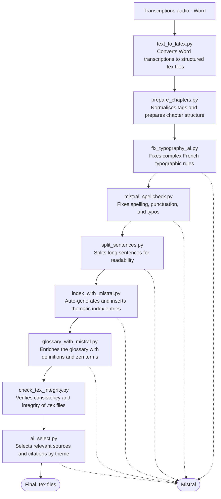
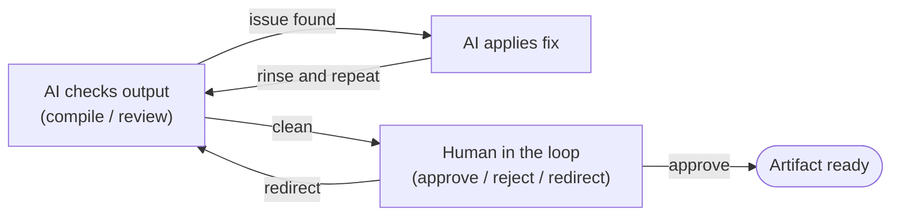

## Two ways to use AI on a writing project

The easy way is to bolt AI onto the end of a workflow: paste finished text into a chat interface, ask for a polish pass, copy the output back. That's a useful tool. It's not a pipeline.

A pipeline is something else. It's AI as a **structural component** — a step in an automated sequence, called programmatically, with defined inputs and verifiable outputs, whose results feed into the next step rather than landing in a human clipboard.

This project chose the second approach deliberately, and documented it openly inside the book itself: model names, pipeline steps, known failures. Transparency isn't a footnote; it's part of the design.

## Two models, two jobs

Assigning both models the same tasks would be a waste of what each does well. The split here was deliberate:

**Mistral Large 3** handles the repetitive, structural work:
- Glossary generation
- Index tagging and merging
- Cross-chapter consistency checks
- Chapter-difficulty classification
- Ornament placement
- A pass that flags AI-generated phrasing

Mistral was the natural choice for a French-language corpus: as a French model, it handles the language natively rather than by translation. The tasks it's assigned are well-defined, repeatable, and verifiable — exactly the kind of work where a fast, accurate model on structured input pays off.

**Claude Sonnet 4.6** handles the open-ended work:
- Generating and fixing LaTeX
- Solving typographic problems
- Assisting the Spanish translation

Open-ended LaTeX generation requires reasoning about packages, about package interactions, about what is idiomatic versus merely valid. Claude handles this class of problem well. The tradeoff — that its LaTeX output frequently didn't compile on the first attempt — is addressed in [the reliability vs. latency post](https://redaction-technique.org/blog/reliability-vs-latency-claude-cli).

## The nine-step pipeline

Six of the nine steps call Mistral. The sequence runs in order; each step's output is the next step's input:

Steps 1 and 2 are deterministic transforms — Word to LaTeX, then structural normalisation. Steps 3 through 9 are where AI enters. Steps 3, 4, 5, 6, 7, and 9 call Mistral. Step 8 is a rule-based integrity check. Claude operates outside this pipeline, at the LaTeX build stage.

## What makes it a loop rather than a one-shot

The pipeline produces `.tex` sources. Those sources feed the LaTeX build. The LaTeX build may fail or produce output that needs correction. AI output feeds back into the sources, which are re-checked on the next pass.

The machine drafts and flags. The human decides and commits — and sometimes decides the draft isn't worth keeping. Direction travels through the loop; the human isn't absent, they're elevated: reviewing and steering rather than executing.

## What this requires of the human in the loop

Embedding AI structurally doesn't reduce the cognitive load on the human; it changes where that load sits. You need enough domain knowledge to evaluate the output — to notice when Mistral's spellcheck introduced a correct-looking word that changed a meaning, or when Claude's LaTeX compiles but implements the wrong thing.

The [sentence-splitting failure](https://redaction-technique.org/blog/when-ai-fails-sentence-splitting) is the clearest example: the output was grammatically valid and looked clean. Recognising that it had lost the spoken cadence required knowing what the spoken cadence was supposed to feel like — which required having read the teacher's talks carefully enough to have an opinion.

AI in a loop amplifies judgment. It doesn't substitute for it.
