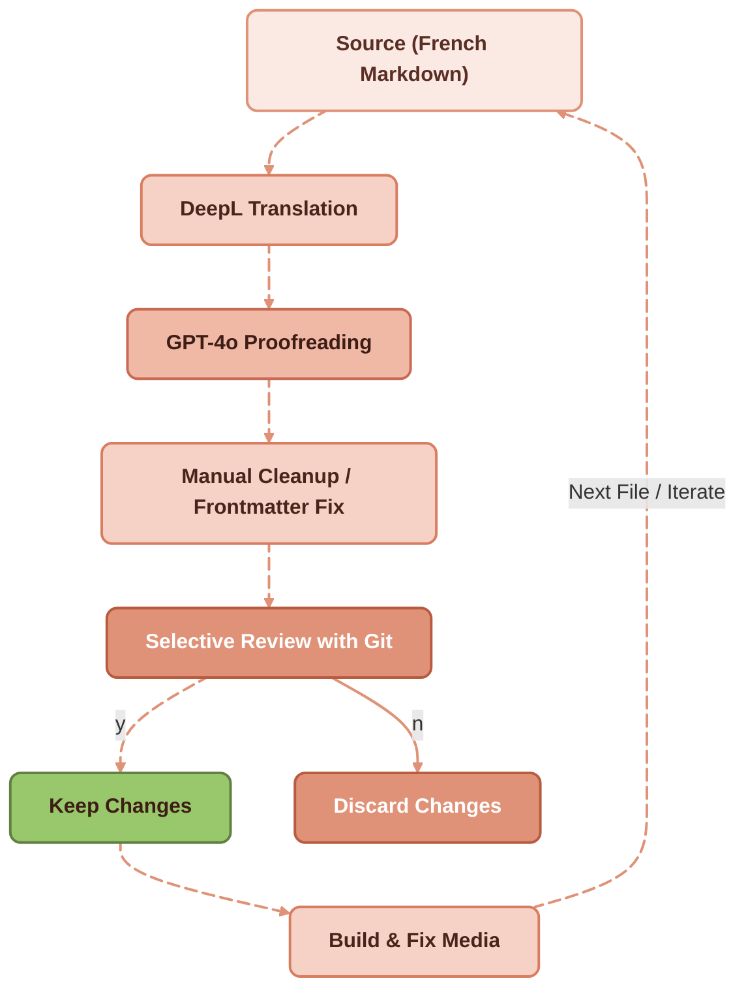
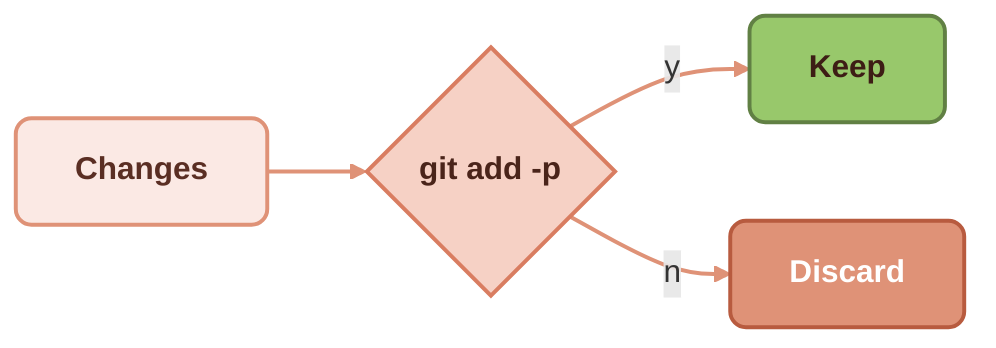

Translating large sets of legacy documentation is always a challenge. Professional human translation ensures quality, but it is time-consuming and costly—especially when dealing with dozens or even hundreds of [Markdown files](/blog/dita-xml-to-markdown-lightweight-information-typing), diagrams, and embedded metadata.




For my [Redaction Technique legacy website](https://docs.redaction-technique.org/), I set up an **AI-based iterative workflow** that automates much of the heavy lifting while still leaving space for human refinement.


Like most efficient processes, it relies on iteration: a loop that combines different AI tools to enable steady, incremental publishing. Human intervention remains critical at every stage—guiding the process, correcting errors, and keeping the results on track. The final step is a thorough human correction, which you can sometimes defer for legacy or non-critical content until analytics confirm that the material is worth the extra investment.

## Automatic translation with DeepL


The first step is to generate raw English translations of all French Markdown files. To do this, write a simple Python script that:

* Scans the current directory for **.md** files.
* Sends the content to the [DeepL API](https://www.deepl.com/docs-api) for translation (French → English).
* Saves the output as a new file with the suffix **-en.md**.

This produces usable English content quickly, but the results often contain **broken Markdown tables**, **mismatched frontmatter**, or literal translations that sound clumsy.

## Manual cleanup of broken Markdown after DeepL translation

Before moving on, fix structural issues in the translated Markdown:

* Broken tables.
* Incorrect Astro frontmatter.
* Small formatting quirks.

This ensures the files build into the website without errors.

## AI Proofreading with GPT-4o


DeepL produces decent raw translations, but the style often needs polishing. To automate this, create another Python script that sends the translated file to **GPT-4o** with a strict editing prompt:

<blockquote>
You are an expert technical writing editor. The text is about technical writing, DITA, and structured authoring. Fix inconsistencies, unprofessional style, and poor French-to-English translations. Keep Markdown formatting intact. Return only the corrected text, without explanations.
</blockquote>

To stay in control, have the script process **one file at a time** and then stop. This makes it easier to review and cherry-pick changes.

## Selective review with Git


Review edits selectively with:

```bash
$ git add -p
```

Git shows each change **hunk by hunk** and lets you decide whether to stage it (**y** = yes, **n** = no). You can split hunks with **s**, edit them manually with **e**, or quit anytime with **q**.



This workflow is ideal when a file contains unrelated edits—such as AI-generated suggestions—because it gives you full control over what goes into your commit history. Storing content in [plain files rather than a database](/blog/manage-content-in-files-not-databases) makes this kind of granular review straightforward.

<div style="background-color:#2e2e2e; color:#ffffff; font-family: monospace; font-size: 0.75em; padding: 1em; white-space: pre-wrap; border-radius: 8px;">
  <span style="color:#df9277;">diff --git a/communication-technique.md b/communication-technique.md</span>
  index d5b0c9b8..7a5632af 100644
  <span style="color:#98C86B;">+++ b/communication-technique.md</span>
  <span style="color:#efb9a6;">--- a/communication-technique.md</span>
  <span style="color:#b26655;">@@ -1,31 +1,30 @@</span>
  <span style="color:#98C86B;">+The goal of technical communication is to <span style="color:#2e2e2e; background-color:#98C86B;">convert</span> prospects into</span>
  <span style="color:#efb9a6;">-The goal of technical communication is to <span style="color:#2e2e2e; background-color:#e6a28c;">turn </span> prospects into</span>
  satisfied customers. The technical writer provides the market with
  (1/1) Stage this hunk [y,n,q,a,d,s,e,p,?]?
</div>

Stage the changes you want, commit them with:

```bash
$ git commit -m "commit message"
```

Then discard the rest with:

```bash
$ git reset --hard
```

## Build the Astro site and fix translated media

When the text is ready, build the site locally to catch any remaining errors. Common fixes include:

* Adjusting translated image filenames.
* Copying SVG diagrams from **fr/** into a new **en/** folder.
* Translating diagrams manually in **Inkscape** and updating file paths.

## Iterating through the full documentation set

The process is iterative:

1. Run the proofreading script on the next Markdown file.
2. Select changes via **git add -p**.
3. Rebuild and adjust assets.

Repeat until the full documentation set is translated.

This workflow isn’t a replacement for professional translation, but it’s **“good enough” for legacy content** where perfect nuance is less critical. For high-visibility or customer-facing material, plan on a final round of **human proofreading**.

With this pipeline, you can **translate and modernize a large corpus of technical documentation efficiently**—combining the strengths of DeepL, GPT, and a bit of manual oversight. For a broader AI-driven approach to working with large content archives, see [transforming a corpus of 7,000 pages into living knowledge](/blog/transforming-corpus-ai-living-knowledge).

## External sources

- [DeepL API for raw machine translation](https://www.deepl.com/docs-api)
- [OpenAI/GPT-4o for the proofreading pass](https://platform.openai.com/docs)
- [git add -p for hunk-by-hunk selective review](https://git-scm.com/docs/git-add)
