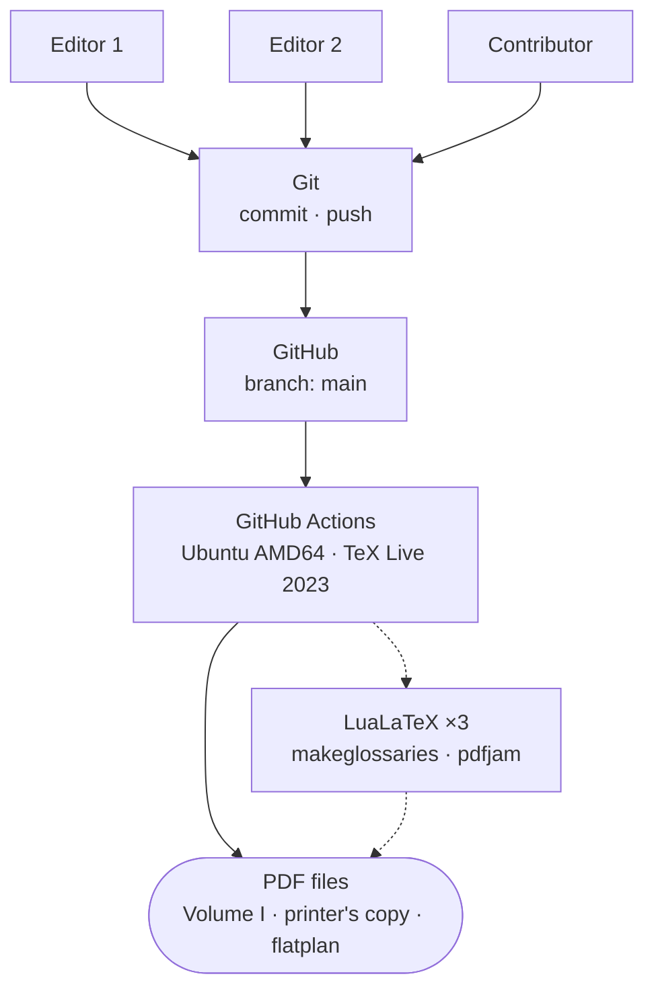
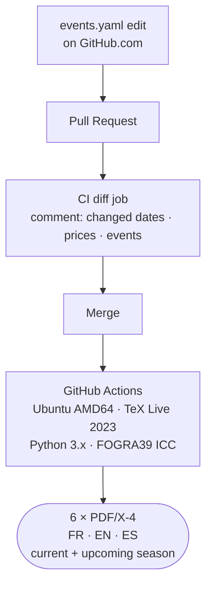

## The problem CI solves for print

A local build has a fundamental problem: it runs on a machine with a specific toolchain, a specific configuration, and accumulated state from previous builds. Two contributors with different TeX Live versions can produce PDFs that differ in hyphenation, line breaks, and page counts — without any source change, without any error, without anyone knowing until the files are compared side by side.

For a press-ready PDF, that ambiguity is not acceptable. The print shop receives one file. It should be the file — the artifact produced by a known, stable environment from a specific source commit — not whichever contributor happened to run the last build on their local machine.

CI solves this by defining the canonical build environment explicitly and running it on every relevant commit. The contributors' local environments are for editing and iteration. The CI environment produces the artifact.

Two print projects implement this principle, at different scales and with different pipeline complexity. The pattern is the same.

## The books pipeline: three contributors, one TeX Live version

A three-volume edition of a teacher's recorded talks. Three contributors — editors, not developers — pushing changes to a shared Git repository. Every push to `main` triggers a GitHub Actions workflow on a fresh Ubuntu runner pinned to TeX Live 2023.

The contributors push source changes. CI produces a reproducible PDF from a clean environment. The colophon of every built copy records the Git commit hash, the build hostname, the OS version, and the LuaTeX version — closing the traceability loop between the artifact and the environment that produced it.

TeX Live is pinned to 2023 because LaTeX rendering is not fully stable across versions: hyphenation tables change, font metric handling changes, paragraph-breaking is adjusted between releases. These changes shift line breaks, which shift page counts. Pinning the toolchain means every build — local or CI, now or six months later — uses the same rendering rules. The PDF that emerges from the Actions runner is the same PDF that `make` would produce on any machine with the same TeX Live 2023 installation.

## The planning poster pipeline: a YAML edit triggers six PDFs

An annual two-page A3 planning poster in three languages. The workflow surface is different: non-technical community members edit `events.yaml` directly in the GitHub browser editor, open a Pull Request, and merge when the diff looks right. The CI pipeline handles the rest.

The build is more involved than the books pipeline. Before LaTeX runs, a Python script converts all source images from RGB to CMYK using the FOGRA39 ICC profile. Then the generator (`gen_calendar.py`) reads five YAML files, optionally fetches live retreat dates from the community website, and produces the LaTeX fragments. Two LuaLaTeX passes follow. Then `preflight.py` runs six checks against the compiled PDF.

The output is six press-ready PDF/X-4 files: French, English, and Spanish editions of the current and upcoming seasons. All six emerge from a single merge.

The CI workflow structure:

The diff comment — posted automatically on every push to the PR — is what makes the workflow accessible to non-technical contributors. They don't need to understand YAML syntax deeply; they need to verify that the changes in the comment match what they intended to change. Date moved, price updated, director name corrected: all visible as structured before/after values before anything is merged.

## What both pipelines share

**A pinned toolchain.** Both use TeX Live 2023 on Ubuntu AMD64 via a specific Docker image tag. Pinning is what makes "same source → same output" a guarantee rather than an approximation. See [reproducing CI locally with Docker](https://redaction-technique.org/blog/reproducing-ci-locally-docker-texlive) for how to run the exact CI environment on a local machine.

**Determinism as a design goal.** The CI build produces the canonical artifact. Local builds are for iteration. When the two diverge — because a local environment has drifted, or a new dependency was added locally but not to the CI spec — the CI build is authoritative.

**Traceability in the artifact.** Both pipelines embed build provenance in the output: the books pipeline records the commit hash, OS, and LuaTeX version in the colophon; the planning poster pipeline's PDF/X-4 OutputIntent and XMP metadata record the build parameters. A print shop or a collaborator holding the file can establish exactly what produced it.

**Free on public repositories.** GitHub Actions has no minute cap on public repositories. Both pipelines run at zero cost. The one gotcha: if a spending limit above $0 is set with an invalid payment method, GitHub holds builds even on public repos. The fix is to set the spending limit to $0 (meaning "never charge me") and clear the invalid payment method. Free Actions resumes immediately.

## The broader point

A CI pipeline for a print artifact is not exotic tooling applied to the wrong domain. It's the same practice software teams apply to compiled binaries and Docker images — because a print artifact has the same problem as any other compiled output: the artifact is a function of source and environment, and both need to be pinned to make the output reproducible.

For a document that goes to press once, the local build is probably sufficient. For a document that recurs annually, involves multiple contributors, or needs to be reproduced at any future point from the same source, CI is how you make "rebuild it exactly" a trivial operation rather than an archaeology project.
