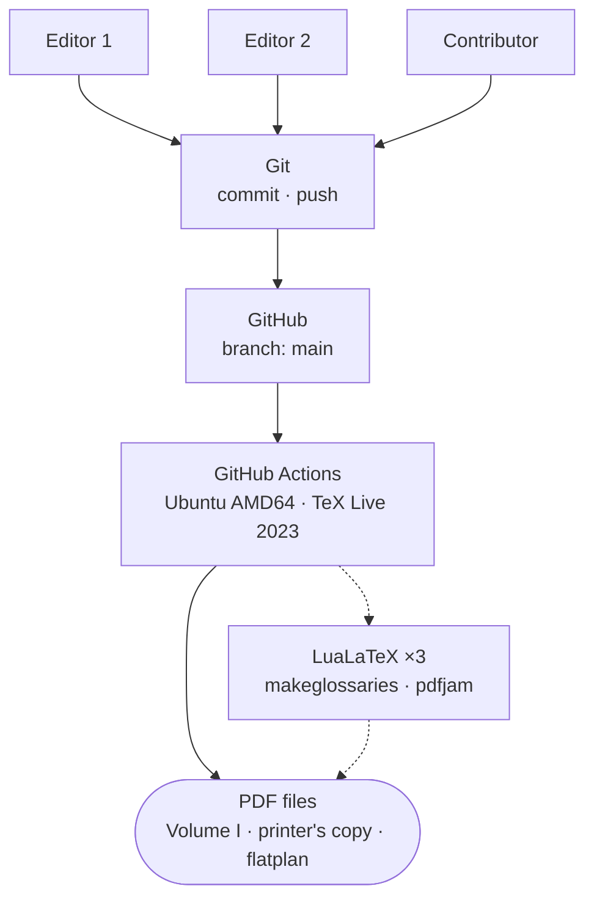

## The problem a CI pipeline solves

Running `make` locally is one thing. Guaranteeing that every contributor's push produces the same artifact — on a clean machine, with a pinned toolchain — is another.

Three people contributed to these volumes. Each had a local LaTeX installation at some version. Each made edits, committed, and pushed. Without a CI pipeline, the canonical PDF was whatever happened to come off whoever's machine happened to run the last build — a combination of their local TeX Live version, their installed fonts, and any local configuration drift that had accumulated since they last did a clean install.

With a CI pipeline, the canonical PDF is the output of a clean Ubuntu runner with TeX Live 2023, built deterministically from the commit. The contributors' local environments are for editing; the CI environment is for producing the artifact.

## The pipeline

Every push to `main` triggers this sequence:

The dotted arrows mark the build toolchain: the Actions runner calls the tools; the tools produce the PDFs. The solid path — commit, push, trigger, artifact — is what contributors see. They push; a PDF comes out.

## Why TeX Live 2023

The toolchain is pinned to TeX Live 2023, not the latest available. This is a deliberate choice, and the reasoning is exactly the same as pinning any other dependency.

LaTeX version differences can silently alter line breaks, hyphenation, and spacing — which shifts page counts and reflows layouts. These are not dramatic failures. They don't announce themselves with error messages. They surface when a page that looked right at 136 pages comes back from the print shop at 137, or when a chapter opening that sat cleanly on a right-hand page has migrated to a left-hand page.

Pinning to TeX Live 2023 means that every build — local, CI, reproduced six months later — uses the same hyphenation tables, the same font metrics, the same paragraph-breaking behaviour. The PDF that emerges from GitHub Actions is the PDF. Not a PDF that looks like it, or a PDF that's functionally equivalent — the same file, produced by the same toolchain from the same source.

## The print shop receives a known artifact

The practical consequence is that the file sent to the print shop has a known provenance. The colophon records the commit hash, the build hostname, the OS, and the LuaTeX version — everything needed to establish that the CI environment produced it. If the print shop needs a revised file, the CI pipeline produces it from the same environment.

This matters because print shops don't tolerate ambiguity. A PDF that shifts one page between the proof and the final file is a problem — not a catastrophic one, but a conversation, a delay, a potential recharge. A reproducible build eliminates that conversation: the file is the file, and the record of how it was produced is in the file itself.

## The discipline is not specific to books

Everything described here is standard practice for software artifacts: clean environments, pinned dependencies, deterministic builds, CI-produced outputs. The only novelty is the target format.

A LaTeX PDF is less familiar than a compiled binary or a Docker image, but the properties are the same. Source plus toolchain produces artifact. Vary the toolchain, vary the artifact. Pin the toolchain, stabilise the artifact.

For a book that will be handed to a print shop, that stability is not optional. For a documentation system that needs to be rebuilt at any future point, it's equally non-optional. The CI pipeline is just the mechanism that enforces the constraint automatically, on every push, without anyone having to remember to run the right commands in the right order on the right machine.

## What contributors actually experience

From a contributor's point of view, the workflow is: edit a `.tex` file, commit, push. The PDF appears in the Actions artifacts a few minutes later. If the build fails — a LaTeX error, a missing command, a broken cross-reference — the failure shows up in the Actions log with the full compiler output, attributable to the specific commit that broke it.

This is the same experience a software developer has with a test suite in CI: the failure is visible, attributed, and reproducible. It can be fixed by fixing the commit. There's no ambiguity about whose environment it failed on, or whether it would fail elsewhere.

That's the point. Automated builds aren't glamorous. They're the infrastructure that makes everything else reliable.
