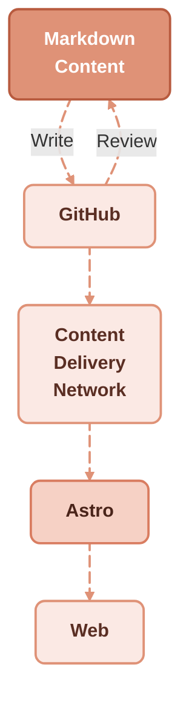

This blog has a history rooted in **DITA XML**. For years, it explored structured content management—sharing insights, tips, and reflections. Back then, DITA was the gold standard for large-scale technical documentation, but its complexity came at a cost: verbose XML syntax, specialized editors, and intricate publishing pipelines. Initially hosted on **WordPress**, the blog later moved to [**Sphinx**](https://www.sphinx-doc.org/) to experiment with alternatives like **reStructuredText**.

Today, the focus has shifted to **Markdown**.

Markdown is a **lightweight markup language**. Unlike XML, it’s human-readable, easy to write, and doesn’t require dedicated software. Yet it still allows technical writers to apply the **DITA philosophy of information typing**, structuring content into **concepts, tasks, and references**.

Instead of relying on heavy XML toolchains, writers can leverage **open, freely available tools**—including static site generators like [**Astro**](https://astro.build/) and its [**Starlight**](https://starlight.astro.build/) theme. Structured documentation is now accessible to a wider audience: individual writers, small teams, open-source contributors, and enterprise documentation teams alike. For a deeper look at how to apply DITA's information typing discipline in Markdown, see [strong information typing without the XML overhead](/blog/strong-information-typing-without-xml-overhead).

This blog is a **work in progress**. Most [legacy content remains in French](https://docs.redaction-technique.org/), but **new content will primarily be in English**. Over time, older posts may be translated or curated to align with this new focus.

The mission remains the same: providing practical insights to help technical communicators navigate the evolving landscape of documentation—now with an emphasis on **lightweight, open, and sustainable practices**.

Stay tuned for posts, tutorials, and experiments at the intersection of **structured writing, lightweight markup, and modern documentation workflows**. You may also enjoy reading about [managing content in files instead of databases](/blog/manage-content-in-files-not-databases), or the [journey from raw HTML editing to Git-based Markdown workflows](/blog/web-journey-html-to-git-markdown).

## External sources

- [DITA and information typing](https://en.wikipedia.org/wiki/Darwin_Information_Typing_Architecture)
- [Astro Starlight: lightweight docs alternative](https://starlight.astro.build/)
- [Markdown as the lightweight target](https://en.wikipedia.org/wiki/Markdown)
