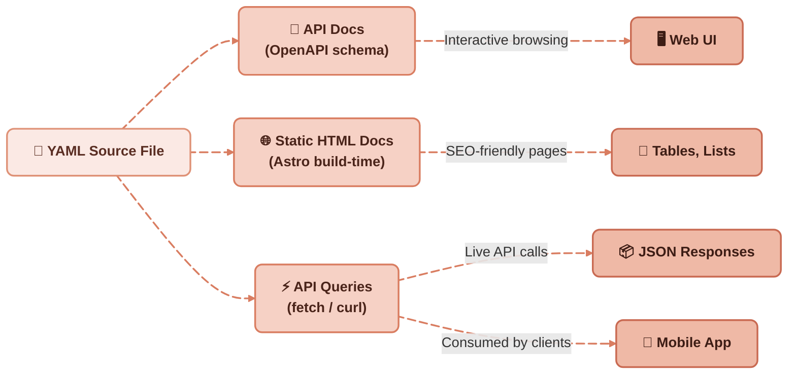

I’ve been experimenting with **self-documenting APIs in Astro**, and you can now [**browse the live API documentation**](https://redaction-technique.org/docs).


The real magic is that **everything comes from a single YAML file**.

By exposing structured reference information through an API generated from YAML, you can **reuse the same source of truth** across multiple contexts:

* Interactive API documentation
* Static HTML doc pages
* Mobile and desktop applications
* Build-time Astro components for SEO-friendly rendering

## One YAML File, Many Outputs

By keeping all reference information in **a single YAML file**, you gain a powerful distribution workflow.
From this one source of truth, the data can flow into **interactive API documentation**, **SEO-friendly HTML pages**, or be accessed directly via **API calls**. This approach is explored in depth in [scalable, maintainable technical docs with YAML](/blog/scalable-maintainable-technical-docs-with-yaml).


The diagram below shows how the same YAML powers multiple outputs without duplication or extra maintenance:




## Querying the API in Practice

You can query the API directly with JavaScript or from your terminal.

### Using fetch (JavaScript)

```ts
// Fetch all oil types
fetch("https://redaction-technique.org/api/oil-types")
  .then(res => res.json())
  .then(data => {
    console.log("All oil types:", data);
  });
```

### Using cURL (terminal)

```bash
# Get all oil types
curl https://redaction-technique.org/api/oil-types
```

## Example JSON Output

Here’s what you’ll see when calling the API:

### GET /api/oil-types

```json
{
  "id": "oil-types",
  "title": "Oil types",
  "shortdesc": "You will find below the recommended oil types.",
  "properties": {
    "headers": {
      "type": "Type",
      "value": "Brand",
      "description": "Use"
    },
    "rows": [
      {
        "type": "Primary oil",
        "value": "A1X",
        "description": "One-cylinder engines"
      },
      {
        "type": "Secondary oil",
        "value": "B2Z",
        "description": "Two-cylinder engines"
      }
    ]
  }
}
```

## Why YAML as the Source of Truth?

Instead of relying on a static JSON schema, the API specification is generated **directly from YAML**.

This approach ensures:

* **One source of truth** across APIs, docs, and apps
* **Automatic updates**—change the YAML, and all media refresh accordingly
* **Lower maintenance costs** by avoiding duplicated schemas or outdated docs

By centralizing reference information in YAML, you don’t just build an API—you build a **distribution engine for consistent, reusable documentation across every medium**. Storing that YAML in [plain files rather than a database](/blog/manage-content-in-files-not-databases) keeps the entire stack auditable and Git-friendly.

<blockquote>
As explained in [Strong Information Typing Without XML Overhead](https://redaction-technique.org/blog/strong-information-typing-without-xml-overhead), the same YAML file can also be consumed **at build time in Astro**.  
This lets you generate **static tables, lists, or components**—keeping pages fast, SEO-friendly, and always consistent with the live API.
</blockquote>

## External sources

- [OpenAPI specification](https://www.openapis.org/)
- [Astro: build-time rendering from YAML](https://astro.build/)
- [Swagger interactive API documentation](https://swagger.io/)
