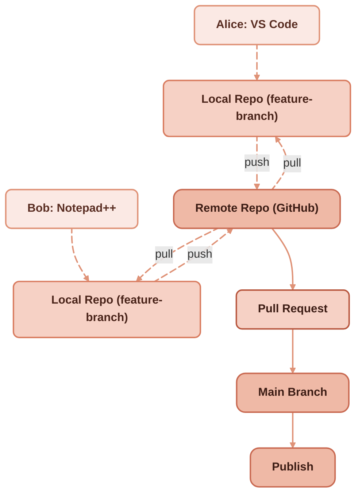
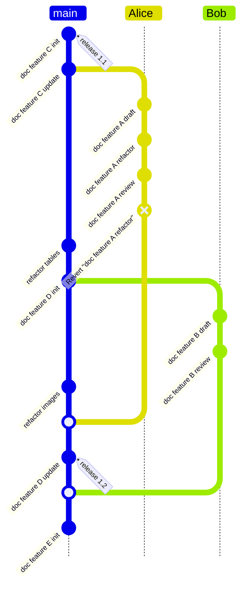

Managing site content in plain files (Markdown, HTML, etc.) is an approach that leans on a very old — and very sensible — UNIX idea: *everything is files*. For many projects this is not just nostalgic; it’s practical. Below I explain why files often win over databases for content management, and how to work with them effectively. This approach also works well with [YAML as a structured single source of truth](/blog/scalable-maintainable-technical-docs-with-yaml) for reference data.

## The Unix principle — everything is a file

When content lives as files, you treat each article, page or asset as a first-class file in a folder tree. Filenames often act as slugs (the URL path). If you need a different URL, you can override it with a **slug:** field in the frontmatter. That simple mapping keeps things explicit and easy to reason about.

Example frontmatter + filename:

```md
---
title: "How managing content in files is more efficient than in a database"
slug: "/files-vs-database"   # optional — filename can also be used
date: 2025-09-19
tags: [static-site, git, unix]
---

Your article body...
```

File: **content/posts/files-vs-database.md**

## Productivity & tooling: use the tools you already know

Because content is files, you can use standard, battle-tested tools:

* Unix/GNU tools: **sed**, **awk**, **grep**, regular expressions — for fast batch edits and transformations.
* Scripting: Python (or Node, Ruby, etc.) for more complex automation (generate indexes, convert formats, etc.).
* Any editor: vim, Emacs, VS Code, Notepad — pick what you love and you’re productive immediately.


These tools let you do bulk refactors, search-and-replace, or migrations in seconds — no complex admin UI needed.

## Version control with Git: track, revert, branch

Storing content in files means it sits naturally in Git:

* See exactly what changed with **git diff**.
* Revert a specific change even deep in history with **git checkout &lt;commit&gt; -- path/to/file**.
* Work in branches, open PRs, review diffs, merge — exactly the developer workflow you trust.
  These visibility and workflow features are either painful or impossible in many popular CMSes (WordPress, Drupal) where the “published” state is buried behind admin UIs and database rows.




## Feature Branch Workflow for Documentation



This Git workflow illustrates a documentation development process using feature branches. The main branch tracks official releases, while contributors create separate branches for their own work.

* Work on **feature C** begins on `main`, leading to release **1.1**.
* **Alice** creates a branch to draft and review document A before merging it back into `main`.
* **Bob** works in parallel on document B in his own branch, completing a draft and review cycle.
* Meanwhile, additional updates to **feature D** are developed on `main`, culminating in release **1.2** after merging Alice’s work.
* Finally, Bob’s branch is merged, and a new feature (**E**) is initialized.

This workflow highlights parallel development, isolation of work in branches, and structured integration into `main` for tagged releases.

## Security: fewer attack surfaces

No DB = no SQL injection. Plain files eliminate a class of vulnerabilities related to dynamic query building, mis-sanitized input, or poorly-configured database engines. There are still security considerations (XSS, server config, secret leakage), but the risk of a corrupted or malicious query is gone.

## Cost: free for small projects on modern CDNs

Static sites (generated from files) can be hosted for free or very cheap on platforms like Vercel, Netlify, GitHub Pages — perfect for blogs, documentation, marketing sites. No database server bills, no complex infrastructure to manage.

## Speed & SEO: ultra-fast delivery

When pre-built files are served from a CDN they’re delivered extremely quickly to users worldwide. Faster page loads improve user experience *and* SEO. Static assets are easy to cache and scale.

## Reliability: simpler platform than LAMP stacks

A static-file setup has fewer moving pieces than a LAMP/LEMP stack:

* No database engine to crash or become corrupted.
* Fewer software components to update and secure.
* Less surface for subtle runtime bugs (plugin incompatibilities, failed migrations, etc.).

Fewer components → fewer failure modes.

## More control over content changes

Git-based workflows let you:

* Preview diffs before publishing.
* Accept contributions via PRs (great for docs and community-driven sites).
* Automate deployments on merge (CI → build → CDN).

This creates an auditable chain from edit → review → publish.

## Caveats: when a database might still be right

Files are great for many use cases, but databases make sense when you need:

* Complex relational querying across large datasets.
* Real-time collaborative editing with conflict resolution.
* Advanced user-generated content workflows with fine-grained permissions out-of-the-box.

If your project needs those, a hybrid approach (files for the majority of content + database for the dynamic parts) also works well.

There’s one more cost that isn’t about querying at all: the people. The files approach quietly assumes contributors who are comfortable with Git, branches, and pull requests. For a developer that’s home turf; for a subject-matter expert who just wants to fix a sentence, a WordPress admin box can be genuinely easier than `git commit`. The flat-file model doesn’t remove the editing barrier, it relocates it — from a database admin UI to a command line. Whether that's a win depends entirely on who's editing. Teams that pair the files model with a browser-based editor and pull-request previews get most of the benefit without forcing every contributor through the terminal; teams that don't can find their "simpler" stack is simpler only for the people who built it.

## Quick practical checklist to get started

1. Keep each post/page as a Markdown file with YAML frontmatter.
2. Use filenames as slugs; override with **slug:** when necessary.
3. Put everything under Git and push to GitHub/GitLab.
4. Configure a static site generator (Hugo, Jekyll, Eleventy, Next.js, etc.).
5. Connect your repo to a CDN (Vercel/Netlify) for automatic builds on push.
6. Use **grep**, **sed**, **awk** or small Python scripts for bulk edits.
7. Review changes through PRs and **git diff** before deployment.

Managing content as files embraces simplicity, transparency and control. You gain powerful Unix tooling, Git-based workflows, better security against database-specific attacks, lower cost for small projects, and excellent performance when combined with CDNs — all reasons why files are often the more efficient choice over a database-driven CMS. This same Git-centric philosophy applies when [translating legacy Markdown documentation with AI tools](/blog/ai-translation-legacy-technical-docs), where granular diff review keeps quality in check. It also reflects a [broader evolution from HTML editing to Git-based Markdown workflows](/blog/web-journey-html-to-git-markdown).

---

**Reference:** The [version control systems](https://docs.redaction-technique.org/en/tech-writing-process/les-systemes-de-gestion-de-versions-rustiques-mais-fiables/) section of the legacy documentation site covers the foundations of Git-based documentation workflows in depth.

## External sources

- ['Everything is a file' lineage](https://en.wikipedia.org/wiki/Unix_philosophy)
- [Static-site approach to content](https://en.wikipedia.org/wiki/Static_site_generator)
- [Git-based content workflows](https://git-scm.com/)
