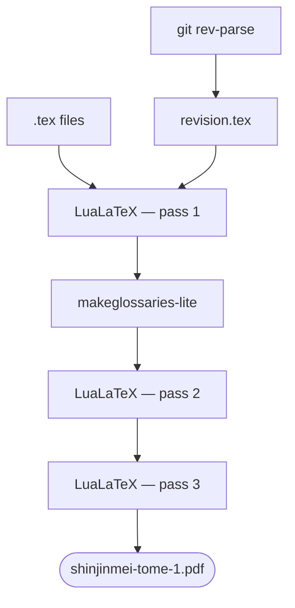

## The format is a render target, not a copy

Every format a publisher produces is a decision about what gets copied. InDesign has the "real" file; everything else is an export, a PDF flatten, a printed proof. Change the text in one and the others don't know about it. The person who last touched each file may not be the same person. Version numbers, if they exist at all, are manual.

The alternative is to have **one source** and many render targets. The text, the dates, the cross-references live once. The format is computed from that source on demand. There is no secondary copy to drift.

This is the same principle behind [a YAML single source of truth](https://redaction-technique.org/blog/scalable-maintainable-technical-docs-with-yaml) — only here the outputs are a perfect-bound book, a printer's press-ready file, and a screen layout instead of a table and an API spec.

## The target table

Seven `make` targets drive every deliverable from one LaTeX corpus:

| Build target | Output | Audience |
| --- | --- | --- |
| `make tome1 / tome2 / tome3` | A5 print PDF per volume | Readers buying individual volumes |
| `make whole` | Single-volume A5 PDF | Readers wanting the complete work |
| `make hirondelle-tome1` | Print PDF with crop/bleed marks | The print shop |
| `make sample` | 4-page preview | Stakeholder review before a full run |
| `make es-tome1` | Spanish Volume I | Spanish-speaking readers |
| `make md-tome1` | Markdown export | The web edition |

Nothing in this table is hand-assembled. Every target calls the same compilation sequence with different parameters — page geometry, font scale, language settings, margin crops. The corpus doesn't move; the renderer changes.

## What the compilation sequence looks like

Each target drives the same multi-step build:

The Git commit hash is injected first, then LuaLaTeX runs three times — the minimum needed for cross-references, glossary entries, and page numbers to stabilise. `makeglossaries-lite` runs between pass 1 and pass 2 to resolve glossary entries in the correct output order.

The three passes aren't a quirk of this project. They're how LaTeX works: the first pass generates auxiliary files, the second resolves them, the third cleans up any remaining forward references. A single-pass build will silently produce wrong cross-references. The Makefile enforces the correct sequence and abstracts it behind a single command.

## The Spanish target

The Spanish volume (`make es-tome1`) deserves a note. It's not a separate translation project — it's the same source corpus compiled with a different language parameter and a translation layer for fixed strings. The structure, the cross-references, the typographic parameters: all inherited from the primary build. Only the language-specific text differs, and that difference is isolated to a small set of files.

In a copy-based workflow, maintaining a Spanish edition means maintaining a second document — a document that can drift from the primary at any edit. In a single-source workflow, the Spanish edition is a target. Edit the primary; rebuild the target; the Spanish edition reflects the change.

## The cost of copying

The cost of a copy-based approach accumulates invisibly. A typo corrected in the French edition isn't corrected in the Spanish. A layout change applied to the A5 volume isn't applied to the single-volume edition. A QR code updated for a new recording URL is updated in whatever file was open at the time, in whatever format the editor knew how to work with.

By the time any of this surfaces, the source of truth is ambiguous — not definitively wrong, just uncertain. Which file is current? Which edition has the fix? Who touched what last?

A single LaTeX corpus with a Makefile answers all of those questions with one command: `make`. The output is either clean or it fails. There is no middle state where it looks right but isn't.

## Separation of content and presentation

The conceptual shift is separating what from how. The text is what; the format is how. When those two concerns live in the same file, every layout decision is also a content decision. When they're separated, layout decisions are render-time parameters — adjustable, composable, testable.

This is the same principle that makes CSS worth learning, that makes YAML config worth maintaining, that makes the docs-as-code discipline worth the setup cost. The source is the source. Everything else is a build target.
