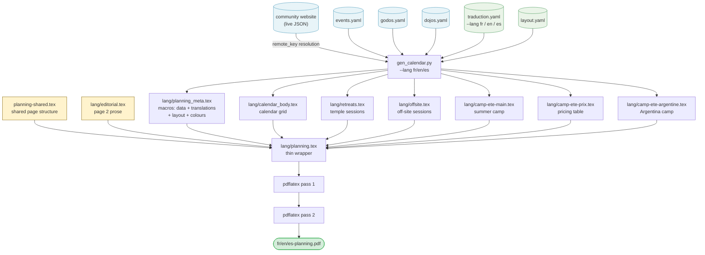

## Starting point: an InDesign file with 100% hardcoded values

The planning poster for the Kosen Sangha — a two-page A4 landscape document covering September to August — was originally produced each year in InDesign. Every value in it was hardcoded: a graphic designer opened last year's file and manually rebuilt it for the new season.

Page 1 alone concentrates most of the work. It holds a 12-month calendar grid — roughly 370 cells, each labelled with a day of the week. That alignment shifts every year: September 2025 opens on a Monday, September 2026 on a Tuesday. There is no carrying last year's grid forward. Every cell must be rechecked. For each of the dozen events on the calendar, the correct cells must then be filled with the right colour — preparation days in one shade, sesshin days (intensive silent retreats) in another, maintenance-work days in a third — and a label positioned by hand over the right week.

The event descriptions alongside the grid compound the problem. Each retreat lists: exact dates, the director's full name and title (monk, nun, or master), two prices (full rate and reduced rate), and occasionally special conditions. The same director's name appears in the event block, in the calendar label, and on page 2 in the certified-masters list. A name change — or a correction — has to be tracked down in all three places. The IBAN for bank transfers, the taxi company and price, the bus lines and timetables: all hardcoded text boxes, invisible to any find-and-replace that doesn't know where to look.

The failure mode is quiet. A price updated in the session block but missed in the summer camp pricing table. A director listed correctly in the event description but still carrying last year's title in the calendar label. An IBAN corrected in the registration section, intact in the transport section. The document looks finished. The errors are real.

The [LaTeX-based pipeline](https://redaction-technique.org/blog/books-as-code-spoken-teachings-latex-ai) that replaced InDesign applies separation of concerns: data, language, typographic values, and form each live in their own layer; a Python generator mediates between them; every fact has exactly one home. What makes the case worth examining is not the principle — it is the artifact it is applied to.

---

## Five layers, one architecture

The planning enforces separation of concerns across five layers. Each layer has a single job and no overlap with the others.

| Layer | Files | Role |
|---|---|---|
| **Data** | `events.yaml`, `godos.yaml`, `dojos.yaml` | All factual information: dates, prices, directors, venues, contacts. Pure YAML, no LaTeX, no language-specific strings. |
| **Language** | `traduction.yaml` | All translatable display strings: month names, day abbreviations, section headings, price labels. Pure YAML, no facts. |
| **Typography** | `layout.yaml` | All typographic constants: font sizes, leading, column widths, spacing, tabular parameters. Pure YAML, no LaTeX. |
| **Generation** | `gen_calendar.py` | Three-class Python script: `EventLoader` (data loading and remote resolution), `CalendarGrid` (calendar colouring), `LatexEmitter` (LaTeX output) — each independently readable, testable, and modifiable. Run with `--lang fr`, `--lang en`, or `--lang es`. |
| **Form** | `planning-shared.tex` | Shared page structure (page 1 layout, page 2 skeleton). Contains no hardcoded data, text, colours, or measurements — all values are macros defined in `lang/planning_meta.tex`. |
|  | `fr/planning.tex`, `en/planning.tex`, `es/planning.tex` | 5-line wrappers: set `\babellang` and `\input{../planning-shared}`. Never need editing for a year change or layout adjustment. |
|  | `fr/editorial.tex`, `en/editorial.tex`, `es/editorial.tex` | Per-language page 2 prose: practical information, directions, prices narrative. |

Because data, language, typographic values, and colours are all in separate YAML files, the same `events.yaml` produces French, English, and Spanish PDFs without alteration. `planning-shared.tex` calls macros such as `\planningyear`, `\inscriptioniban`, `\taxicompagnie`, `\eventfontformat`, `\caldaysetup`, `\headertitlefont`, `\caldayfont`, `\colsidewidth`, `\calresizewidth`, `\pagetwobasefont` — all resolved at build time from the generated macro file, including `\definecolor` commands for the full colour palette. If a value doesn't exist in YAML, it doesn't appear in the PDF. If a value changes in YAML, it changes everywhere in every language edition simultaneously.

---

## How the build flows

The generator (`gen_calendar.py`) runs first, reading five YAML files — three for factual data, one for language strings, one for typographic constants and colours — and optionally fetching live retreat data from the community website. Everything it produces is consumed by `planning-shared.tex` via thin per-language wrappers through standard LaTeX `\input{}` directives.



The generated `.tex` fragments are committed to the repository alongside the sources, so `planning-shared.tex` compiles without running the Python script at every LaTeX pass. The script only needs to run when data changes.

---

## What lives in each layer

**Data layer.** Three YAML files, each with a single responsibility:

- `events.yaml` — all retreat events for the year: dates, venue, retreat director(s), prices, and an optional `remote_key` field that resolves the date against the live community website.
- `godos.yaml` — a reference list of retreat directors: full name, status (`master` / `monk` / `nun`), gender.
- `dojos.yaml` — a reference list of practice venues: name, type, country, address, website, email, phone.

No LaTeX anywhere in these files. No language-specific strings either: a director's name is a name, not a label, and is rendered as-is in all editions.

**Language layer.** `traduction.yaml` holds every string that changes by language: month names (`January` / `Janvier` / `Enero`), day abbreviations (`M T W` / `L M M`), section headings, date connectors, price labels, Zen vocabulary, footer notes. Nothing in this file is factual — no dates, prices, or proper names. Nothing in the data files is language-specific. The generator resolves label lookups at build time using the `--lang` flag; switching from `--lang fr` to `--lang en` or `--lang es` re-runs the generator against the same data files and produces the English or Spanish edition.

**Typography layer.** `layout.yaml` holds every typographic constant and the full colour palette: font sizes and leading for each block, vertical spacing, calendar column widths, column dimensions, tabular parameters, and all colours under a `colors:` key. The generator reads these values and exports them into `lang/planning_meta.tex` as LaTeX macros (`\eventfontformat`, `\prixtabcolsep`, `\headertitlefont`, `\caldayfont`, `\colsidewidth`, `\calresizewidth`, `\pagetwobasefont`, …) and as `\definecolor` commands for every colour — so `planning-shared.tex` contains no hardcoded typographic or colour values. Change a font size or a colour in `layout.yaml` and all three language editions rebuild with the new value. Like `traduction.yaml`, this file is year-independent: it changes only when typographic or colour choices change, not when the programme does.

**Generation layer.** `gen_calendar.py` was originally a ~995-line flat script mixing data loading, remote fetch, date resolution, calendar colouring, and LaTeX emission in a single file. The refactor introduces three classes — one per concern — so each piece can be read, tested, and modified in isolation, with identical LaTeX output. Separation of concerns applies inside the script for the same reason it applies across the file architecture: a change to calendar colouring logic should not require understanding the LaTeX emitter, and vice versa.

- **`EventLoader`** — loads all YAML sources, fetches live retreat data from the community website (5-second timeout; gracefully skipped if unavailable), resolves `remote_key` date fields against the live data, and exposes translation helpers and event filters to the other classes.
- **`CalendarGrid`** — builds the day-colour and label maps in three priority passes (external sesshins → temple events → summer camp), then writes `lang/calendar_body.tex`.
- **`LatexEmitter`** — formats all data as LaTeX and writes `lang/planning_meta.tex` (data, translation, and layout macros, plus `\definecolor` commands for the full colour palette) and the five content fragments (`retreats.tex`, `offsite.tex`, `camp-ete-main.tex`, `camp-ete-prix.tex`, `camp-ete-argentine.tex`).

The script writes all output into the language subdirectory to avoid collisions when building multiple editions sequentially:
- `lang/planning_meta.tex` — one `\def` per data point, translated string, typographic constant, and `\definecolor` command for every colour, giving `planning-shared.tex` a named handle for every value.
- `lang/calendar_body.tex` — the colour-coded calendar grid, generated cell by cell from the event list.
- Five content fragments per language edition: temple sessions (`lang/retreats.tex`), off-site sessions (`lang/offsite.tex`), summer camp details (`lang/camp-ete-main.tex`), pricing table (`lang/camp-ete-prix.tex`), and Argentina camp (`lang/camp-ete-argentine.tex`).

Two of those outputs are worth unpacking.

**Calendar grid.** The 12-month grid — the visual centrepiece of page 1 — is generated entirely by the script. For each month, it calculates the weekday of the first day, then walks through the event list and assigns each day a colour class: preparation, session, or maintenance-work. The result is `calendar_body.tex`, a LaTeX table body of roughly 370 cells, with event labels placed on the correct week spans. Change the event dates in YAML, re-run the generator, the grid redraws itself. There is nothing to manually recheck.

**Remote key resolution.** Some events in `events.yaml` carry a `remote_key` field instead of hardcoded dates. When the generator runs, it fetches the live programme JSON from the community website (5-second timeout; gracefully skipped if unavailable) and substitutes those dates. The YAML holds the key; the website holds the authoritative value. This keeps the PDF in sync with the online programme without duplicating dates in two places — one source, two surfaces.

To make this concrete: here is one event from `events.yaml` — a two-day retreat with one director and two prices.

```yaml
- title: Sesshin du Sud
  date: 2025-10-04
  to: 2025-10-05
  type: sesshin
  dojo: temple Yujo Nyusanji
  godo:
    - Geneviève Sen Gyo Perrier
  prix:
    normal: 110
    reduit: 85
```

The generator reads it and writes this block into `retreats_block.tex`:

```latex
\sub{Sesshin du Sud}
4 to 5 October 2025\\
led by Geneviève Sen Gyo Perrier\\
\textbf{110\,\texteuro{} or 85\,\texteuro{}*}
```

Global facts follow a different path. The IBAN in `events.yaml`:

```yaml
inscriptions:
  iban: "FR76 4255 9100 0008 0035 9417 710"
```

becomes a named macro in `planning_meta.tex`:

```latex
\def\inscriptioniban{FR76 4255 9100 0008 0035 9417 710}
```

`planning-shared.tex` calls `\inscriptioniban` wherever the IBAN appears. The YAML is the single source; the macro is the interface; the shared template never sees the value directly.

The generator is also where data validation lives. If an event in `events.yaml` names a director who has no entry in `godos.yaml`, the build stops immediately and reports the unknown name — not a rendering glitch discovered when someone pages through the finished PDF.

**Form layer.** Three file types, each with a distinct scope:

- `planning-shared.tex` — the single source of page structure for all three editions. It defines the two-page A4 landscape skeleton, references the macro file, and `\input{}`s the generated fragments. Contains no hardcoded data, text, colours, or measurements.
- `fr/planning.tex`, `en/planning.tex`, `es/planning.tex` — 5-line wrappers that set `\babellang{french|english|spanish}` and `\input{../planning-shared}`. They are never edited.
- `fr/editorial.tex`, `en/editorial.tex`, `es/editorial.tex` — the per-language prose for page 2: descriptions of the practice, directions to the temple, registration instructions. This is the only part of the form layer that differs by language and that a non-developer might touch — and only to rework the prose, never for a year change.

---

## Updating for a new year

The payoff is in the update cycle. To produce next year's planning:

1. Edit `events.yaml`: set `annee` to the new year range, update the event list.
2. Edit `godos.yaml` or `dojos.yaml` only if directors or venues have changed.
3. Run `make planning` (French), `make planning-en` (English), or `make planning-es` (Spanish). Each target accepts `SAISON=25-26` to force a specific season.

`traduction.yaml` and `layout.yaml` are outside this cycle — they change only when display labels are reworded or typographic choices change, neither of which happens annually.

You may end up editing one YAML file, two, or all three data files, depending on what changed. The point is not the number of files — it is that each individual fact has exactly one home. A director's name lives in `godos.yaml` and nowhere else. An IBAN lives in `events.yaml` and nowhere else. When either changes, there is one place to update and zero places to forget.

`planning-shared.tex` and the thin wrappers are never touched. The layout — the part that takes effort to get right — stays exactly as it was, for all three language editions simultaneously.

> **The principle at work:** each fact lives in exactly one place. Not "one file per update" — one location per fact. The three data files are three categories of fact, not three copies of the same information.

---

## Familiar principle, unusual artifact

Separation of concerns — keeping data, display strings, typographic values, and form strictly apart — is not a new idea. It is MVC. It is XML/XSLT and DocBook. It is every static site generator ever built, and the founding premise of the docs-as-code movement. The [YAML single source of truth](https://redaction-technique.org/blog/scalable-maintainable-technical-docs-with-yaml) pattern applies the same logic to API reference tables. Anyone working in structured documentation knows this cold.

What is less common is seeing it applied to a design-heavy annual print poster — a document that, in most organisations, lives in a designer's InDesign file and gets rebuilt by hand each year. Almost all docs-as-code writing assumes HTML output. The discipline rarely reaches a two-page A4 poster with a custom colour palette, a generated 12-month calendar grid, and an annual recurrence that makes the internal cross-referencing problem structural rather than incidental.

The books-as-code pipeline for the Shinjinmei volumes uses the same LaTeX infrastructure; the planning poster extends it with a data layer designed to absorb exactly this kind of yearly churn. The pattern works on a poster for the same reason it works on a web page: the problem was never about the output format.

That is the test worth applying to any document that gets updated regularly: if a factual value changes, how many places in the source encode it? If the answer is more than one, each of those copies is a potential inconsistency waiting to diverge.

---

## TL;DR

- The planning poster is produced from five YAML files — three for factual data, one for language strings, one for typographic constants — a Python generator, and per-language LaTeX form templates with no hardcoded values.
- Facts, display strings, and typographic values are strictly separate: `events.yaml` holds no labels or measurements; `traduction.yaml` holds no facts; `layout.yaml` holds no content. The same data files produce French, English, and Spanish editions unchanged.
- Updating for a new year means editing YAML only — the three form templates are never touched.
- The generator acts as an explicit interface between source and output: every data point, translated string, and typographic constant becomes a named LaTeX macro.
- This is the same separation-of-concerns principle that makes [YAML-driven documentation](https://redaction-technique.org/blog/scalable-maintainable-technical-docs-with-yaml) maintainable — applied here to a multilingual print artifact rather than a web page.
