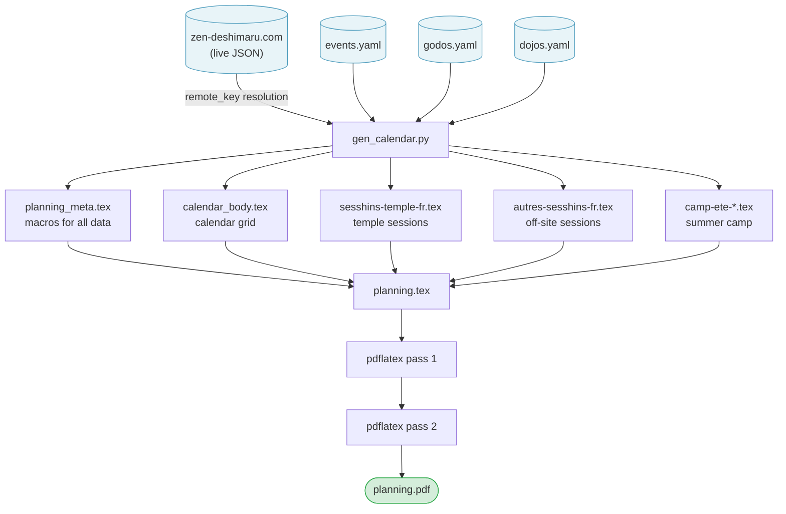

## Starting point: an InDesign file with 100% hardcoded values

The planning poster for the Kosen Sangha — a two-page A4 landscape document covering September to August — was originally produced each year in InDesign. Every value in it was hardcoded: a graphic designer opened last year's file and manually rebuilt it for the new season.

Page 1 alone concentrates most of the work. It holds a 12-month calendar grid — roughly 370 cells, each labelled with a day of the week. That alignment shifts every year: September 2025 opens on a Monday, September 2026 on a Tuesday. There is no carrying last year's grid forward. Every cell must be rechecked. For each of the dozen events on the calendar, the correct cells must then be filled with the right colour — preparation days in one shade, session days in another, maintenance-work days in a third — and a label positioned by hand over the right week.

The event descriptions alongside the grid compound the problem. Each retreat lists: exact dates, the director's full name and title (monk, nun, or master), two prices (full rate and reduced rate), and occasionally special conditions. The same director's name appears in the event block, in the calendar label, and on page 2 in the certified-masters list. A name change — or a correction — has to be tracked down in all three places. The IBAN for bank transfers, the taxi company and price, the bus lines and timetables: all hardcoded text boxes, invisible to any find-and-replace that doesn't know where to look.

The failure mode is quiet. A price updated in the session block but missed in the summer camp pricing table. A director listed correctly in the event description but still carrying last year's title in the calendar label. An IBAN corrected in the registration section, intact in the transport section. The document looks finished. The errors are real.

The [LaTeX-based pipeline](https://redaction-technique.org/blog/books-as-code-spoken-teachings-latex-ai) that replaced InDesign solved this with a rule so strict it sounds simple: **the layout file contains no hardcoded factual data**. Not a single date, price, name, or address.

---

## Three layers, one output

The planning is built on a three-layer architecture. Each layer has a single job and no overlap with the others.

| Layer | Files | Role |
|---|---|---|
| **Data** | `events.yaml`, `godos.yaml`, `dojos.yaml` | All factual information: dates, prices, directors, venues, contacts. Pure YAML, no LaTeX. |
| **Generation** | `gen_calendar.py` | Reads the YAML files; produces LaTeX fragments and a macro file exposing every data point as a named LaTeX macro. |
| **Layout** | `planning.tex` | Page structure, colours, fonts, and fixed editorial text. Calls macros for all data. Contains no factual values. |

The layout layer calls macros such as `\planningyear`, `\sanghasite`, `\kosenrang`, `\templenom`, `\dojoemail`, `\taxicompagnie`, `\inscriptioniban` — all resolved at build time from the generated macro file. If a value doesn't exist in YAML, it doesn't appear in the PDF. If a value changes in YAML, it changes everywhere in the PDF simultaneously.

---

## How the build flows

The generator (`gen_calendar.py`) runs first, reading three YAML files and — optionally — fetching live retreat data from the community website to resolve date fields that reference the online programme. Everything it produces is then consumed by `planning.tex` through standard LaTeX `\input{}` directives.

The generated `.tex` fragments are committed to the repository alongside the sources, so `planning.tex` compiles without running the Python script at every LaTeX pass. The script only needs to run when data changes.

---

## What lives in each layer

**Data layer.** Three YAML files, each with a single responsibility:

- `events.yaml` — all retreat events for the year: dates, venue, retreat director(s), prices, and an optional `remote_key` field that resolves the date against the live community website.
- `godos.yaml` — a reference list of retreat directors: full name, status (`master` / `monk` / `nun`), gender.
- `dojos.yaml` — a reference list of practice venues: name, type, country, address, website, email, phone.

No LaTeX anywhere in these files. A non-technical editor can update them in any text editor.

**Generation layer.** A single Python script that reads the three YAML files and writes:
- `planning_meta.tex` — one `\newcommand` per data point, giving `planning.tex` a named handle for every value.
- `calendar_body.tex` — the colour-coded calendar grid, generated cell by cell from the event list.
- Five content fragments covering temple sessions, off-site sessions, and summer camp blocks.

The generator is also where data validation lives: mismatched venue references, missing prices, or ambiguous director names fail here, not silently in the PDF.

**Layout layer.** `planning.tex` is a stable file. It defines the two-page A4 landscape structure, the colour palette, the font stack, and the fixed editorial text — descriptions of the practice, directions to the temple, registration instructions. None of that changes year to year. What changes — dates, prices, names — is not in this file.

---

## Updating for a new year

The payoff is in the update cycle. To produce next year's planning:

1. Edit `events.yaml`: set `annee` to the new year range, update the event list.
2. Edit `godos.yaml` or `dojos.yaml` only if directors or venues have changed.
3. Run `make planning`.

`planning.tex` is never touched. The layout — the part that takes effort to get right — stays exactly as it was. The data — the part that changes every year — lives in a place designed for change.

> **The principle at work:** isolate what changes from what doesn't. Data changes annually. Layout changes rarely. Generation is the glue between them. Keep each layer unaware of the others' internals.

---

## Why this is a docs-as-code problem

A print poster looks nothing like a documentation system, but the underlying tension is identical: how do you maintain factual accuracy across a document that presents the same information in multiple places, in multiple forms?

The [YAML single source of truth](https://redaction-technique.org/blog/scalable-maintainable-technical-docs-with-yaml) pattern that works for API reference tables works here too — because the problem is the same. Content that appears in multiple places must live in exactly one place and be rendered everywhere else.

The books-as-code pipeline for the Shinjinmei volumes uses the same LaTeX infrastructure. The planning poster extends it by adding a data layer thick enough to absorb an entire year's worth of factual change without touching a single line of layout code.

That's the test worth applying to any document that gets updated regularly: if a factual value changes, how many files have to change? If the answer is more than one, the layers are not yet clean.

---

## TL;DR

- The planning poster is produced from three YAML files, a Python generator, and a LaTeX layout file with no hardcoded data.
- Updating for a new year means editing YAML only — `planning.tex` is never touched.
- The generator acts as an explicit interface between data and layout: every data point becomes a named LaTeX macro.
- This is the same separation-of-concerns principle that makes [YAML-driven documentation](https://redaction-technique.org/blog/scalable-maintainable-technical-docs-with-yaml) maintainable — applied here to a print artifact rather than a web page.
