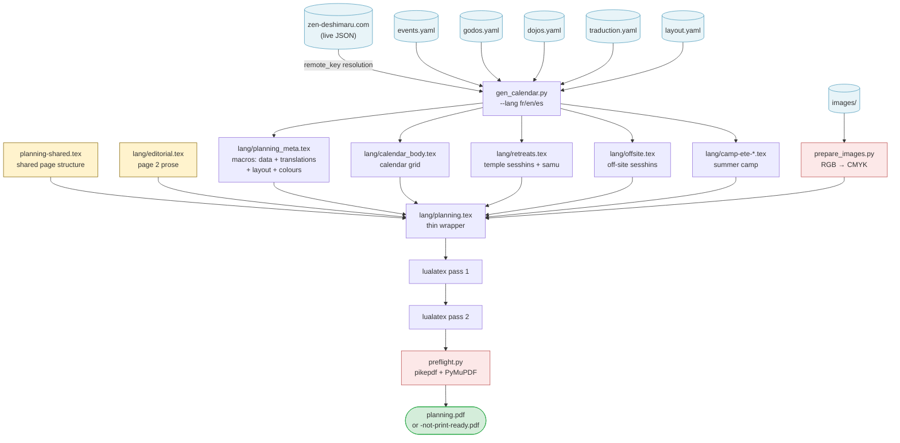

## Starting point: an InDesign file with 100% hardcoded values

The planning poster for the Kosen Sangha — a two-page A3 landscape document covering September to August — was originally produced each year in InDesign. Every value in it was hardcoded: a graphic designer opened last year's file and manually rebuilt it for the new season.

Page 1 alone concentrates most of the work. It holds a 12-month calendar grid — roughly 370 cells, each labelled with a day of the week. That alignment shifts every year: September 2025 opens on a Monday, September 2026 on a Tuesday. There is no carrying last year's grid forward. Every cell must be rechecked. For each of the dozen events on the calendar, the correct cells must then be filled with the right colour — preparation days in one shade, sesshin days (intensive silent retreats) in another, maintenance-work days in a third — and a label positioned by hand over the right week.

The event descriptions alongside the grid compound the problem. Each retreat lists: exact dates, the director's full name and title (monk, nun, or master), two prices (full rate and reduced rate), and occasionally special conditions. The same director's name appears in the event block, in the calendar label, and on page 2 in the certified-masters list. A name change — or a correction — has to be tracked down in all three places. The IBAN for bank transfers, the taxi company and price, the bus lines and timetables: all hardcoded text boxes, invisible to any find-and-replace that doesn't know where to look.

The failure mode is quiet. A price updated in the session block but missed in the summer camp pricing table. A director listed correctly in the event description but still carrying last year's title in the calendar label. An IBAN corrected in the registration section, intact in the transport section. The document looks finished. The errors are real.

The [LaTeX-based pipeline](https://redaction-technique.org/blog/books-as-code-spoken-teachings-latex-ai) that replaced InDesign applies separation of concerns: data, language, typographic values, and form each live in their own layer; a Python generator mediates between them; every fact has exactly one home. What makes the case worth examining is not the principle — it is the artifact it is applied to.

---

## Five layers, one architecture

The planning enforces separation of concerns across five layers. Each layer has a single job and no overlap with the others.

| Layer | Files | Role |
|---|---|---|
| **Data** | `events.yaml`, `godos.yaml`, `dojos.yaml` | All factual information: dates, prices, directors, venues, contacts. Pure YAML, no LaTeX, no language-specific strings. |
| **Language** | `traduction.yaml` | All translatable display strings: month names, day abbreviations, section headings, price labels. Pure YAML, no facts. |
| **Typography** | `layout.yaml` | All typographic constants: font sizes, leading, column widths, spacing, tabular parameters. Pure YAML, no LaTeX. |
| **Generation** | `gen_calendar.py` | Three-class Python script: `EventLoader` (data loading and remote resolution), `CalendarGrid` (calendar colouring), `LatexEmitter` (LaTeX output) — each independently readable, testable, and modifiable. Run with `--lang fr`, `--lang en`, or `--lang es`. |
| **Form** | `planning-shared.tex` | Shared page structure (page 1 layout, page 2 skeleton). Contains no hardcoded data, text, colours, or measurements — all values are macros defined in `lang/planning_meta.tex`. |
|  | `fr/planning.tex`, `en/planning.tex`, `es/planning.tex` | 5-line wrappers: set `\babellang` and `\input{../planning-shared}`. Never need editing for a year change or layout adjustment. |
|  | `fr/editorial.tex`, `en/editorial.tex`, `es/editorial.tex` | Per-language page 2 prose: practical information, directions, prices narrative. |

Because data, language, typographic values, and colours are all in separate YAML files, the same `events.yaml` produces French, English, and Spanish PDFs without alteration. `planning-shared.tex` calls macros such as `\planningyear`, `\inscriptioniban`, `\taxicompagnie`, `\eventfontformat`, `\caldaysetup`, `\headertitlefont`, `\caldayfont`, `\colsidewidth`, `\calresizewidth`, `\pagetwobasefont` — all resolved at build time from the generated macro file, including `\definecolor` commands for the full colour palette. If a value doesn't exist in YAML, it doesn't appear in the PDF. If a value changes in YAML, it changes everywhere in every language edition simultaneously.

---

## How the build flows

The generator (`gen_calendar.py`) runs first, reading five YAML files — three for factual data, one for language strings, one for typographic constants and colours — and optionally fetching live retreat data from the community website. Everything it produces is consumed by `planning-shared.tex` via thin per-language wrappers through standard LaTeX `\input{}` directives.



The generated `.tex` fragments are committed to the repository alongside the sources, so `planning-shared.tex` compiles without running the Python script at every LaTeX pass. The script only needs to run when data changes.

---

## Print-ready output

The pipeline produces a PDF/X-4 file ready for commercial printing — no Ghostscript, no manual export dialog. The implementation is Python + LuaLaTeX only, with a non-blocking preflight that enforces the following specifications.

| Specification | Value |
|---|---|
| Trim size (TrimBox) | A3 landscape — 420 × 297 mm |
| Bleed | 2 mm on each side → BleedBox = MediaBox = 424 × 301 mm = 1201.89 × 853.23 pt |
| TrimBox in points | `[5.669  5.669  1196.22  847.56]` (A3 centred, 2 mm inset) |
| PDF standard | PDF/X-4 (PDF 1.6) |
| Colour space | CMYK throughout — images converted upstream, vector colours defined as `cmyk` in `layout.yaml` |
| Colour profile | FOGRA39 ICC v2, OutputIntent embedded by `pdfx` |
| Images | 300 ppi minimum at placed size, CMYK |
| Fonts | Embedded and subsetted (LuaLaTeX default) |
| Metadata | XMP declared in `planning.xmpdata`: title, author, keywords |
| Restrictions | No encryption, no JavaScript |

The build follows one rule: **it always produces a PDF**. If all six preflight checks pass, the file keeps its name. If any check fails, the file is renamed to `planning-not-print-ready.pdf` and a report is written alongside it. Nothing ever aborts.

### Step 1 — converting images to CMYK

Before LaTeX runs, `prepare_images.py` converts every source image from RGB to CMYK using the FOGRA39 ICC profile via Pillow + LittleCMS. Resolution is checked but never faked: an image below 300 ppi is flagged as a preflight defect, not upscaled.

```python
from pathlib import Path
from PIL import Image, ImageCms

INTENT = {
    "relative":   ImageCms.Intent.RELATIVE_COLORIMETRIC,
    "perceptual": ImageCms.Intent.PERCEPTUAL,
    "absolute":   ImageCms.Intent.ABSOLUTE_COLORIMETRIC,
    "saturation": ImageCms.Intent.SATURATION,
}

def prepare_images(
    src_dir: Path,
    out_dir: Path,
    icc_path: Path,
    intent: str = "relative",
) -> list[dict]:
    rgb_profile  = ImageCms.createProfile("sRGB")
    cmyk_profile = ImageCms.getOpenProfile(str(icc_path))
    xform = ImageCms.buildTransform(
        rgb_profile, cmyk_profile, "RGB", "CMYK",
        renderingIntent=INTENT[intent],
        flags=ImageCms.FLAGS["BLACKPOINTCOMPENSATION"],
    )
    issues: list[dict] = []
    out_dir.mkdir(parents=True, exist_ok=True)
    for src in sorted(src_dir.iterdir()):
        if src.suffix.lower() not in {".jpg", ".jpeg", ".tif", ".tiff", ".png"}:
            continue
        with Image.open(src) as img:
            dpi = img.info.get("dpi", (72, 72))
            ppi = min(dpi)
            if ppi < 300:
                issues.append({"file": src.name, "check": "resolution",
                               "detail": f"{ppi:.0f} ppi < 300 required"})
            cmyk = (ImageCms.applyTransform(img.convert("RGB"), xform)
                    if img.mode != "CMYK" else img.copy())
            cmyk.save(out_dir / src.name, dpi=dpi,
                      icc_profile=cmyk_profile.tobytes())
    return issues
```

The function returns defects rather than raising. The orchestrator collects them alongside the post-build preflight results and decides at the end whether the PDF qualifies as print-ready.

### Step 2 — PDF/X-4 output from LuaLaTeX

The `pdfx` package, loaded with the `x-4` option, attaches the OutputIntent, embeds the FOGRA39 profile, and enforces the PDF/X-4 constraints that LuaLaTeX cannot enforce on its own. It reads XMP metadata from a companion file with the same base name and a `.xmpdata` extension. TrimBox and BleedBox are set via the LuaLaTeX primitive `\pdfextension pageattr` (the equivalent of pdfLaTeX's `\pdfpageattr`).

```latex
\usepackage[x-4]{pdfx}   % reads planning.xmpdata

% A3 landscape + 2 mm bleed
% BleedBox = MediaBox = 424 × 301 mm = 1201.89 × 853.23 pt
% TrimBox  = A3 inset 2 mm → 5.669 pt each side
\pdfextension pageattr{%
  /TrimBox  [5.669 5.669 1196.22 847.56]%
  /BleedBox [0     0     1201.89 853.23]%
}
```

`planning.xmpdata` sits alongside `planning-shared.tex`:

```
\Title{Planning Kosen Sangha 2025--2026}
\Author{Kosen Sangha}
\Copyright{Kosen Sangha}
\Keywords{planning\sep calendrier\sep retraites}
\Publisher{Kosen Sangha}
```

All colours in `planning-shared.tex` call macros defined as `cmyk` tuples in `layout.yaml` — no `DeviceRGB` reaches the PDF. The `pdfx` package handles OutputIntent embedding; it does not convert colours. Conversion is entirely upstream: images in Python before the build, vector values in YAML before code generation.

### Step 3 — non-blocking preflight

`preflight.py` runs six checks against the compiled PDF using `pikepdf` and `PyMuPDF`. No check can abort the build — every result is recorded and the function always returns.

```python
import pikepdf, fitz
from pathlib import Path

MM_TO_PT = 72 / 25.4

def run_preflight(pdf_path: Path) -> list[dict]:
    results = []

    def record(check, ok, detail=""):
        results.append({"check": check, "ok": ok, "detail": detail})

    with pikepdf.open(pdf_path) as pdf:
        # [1] Box geometry: BleedBox 424×301 mm, TrimBox A3 420×297 mm
        for i, page in enumerate(pdf.pages):
            mb = [float(v) for v in page.mediabox]
            tb = [float(v) for v in page.get("/TrimBox", page.mediabox)]
            w_mb, h_mb = mb[2] - mb[0], mb[3] - mb[1]
            w_tb, h_tb = tb[2] - tb[0], tb[3] - tb[1]
            ok = (abs(w_mb - 424 * MM_TO_PT) < 1 and abs(h_mb - 301 * MM_TO_PT) < 1
                  and abs(w_tb - 420 * MM_TO_PT) < 1 and abs(h_tb - 297 * MM_TO_PT) < 1)
            record("boxes", ok,
                   f"p{i+1}: MediaBox {w_mb:.1f}x{h_mb:.1f} pt  "
                   f"TrimBox {w_tb:.1f}x{h_tb:.1f} pt")

        # [2] Font embedding
        for i, page in enumerate(pdf.pages):
            for name, font in page.get("/Resources", {}).get("/Font", {}).items():
                fd  = font.get("/FontDescriptor", {})
                emb = fd.get("/FontFile") or fd.get("/FontFile2") or fd.get("/FontFile3")
                record("fonts", bool(emb),
                       f"p{i+1}: {name} {'embedded' if emb else 'NOT embedded'}")

        # [5] OutputIntent
        oi = pdf.Root.get("/OutputIntents")
        record("output_intent", bool(oi),
               "present" if oi else "missing — check FOGRA39 path in pdfx options")

        # [6] PDF version 1.6, no encryption, no JavaScript
        record("version",    pdf.pdf_version == "1.6", pdf.pdf_version)
        record("encryption", not pdf.is_encrypted, "")
        record("javascript",
               not any(k in pdf.Root for k in {"/JS", "/JavaScript"}), "")

    # [3, 4] Colour space and resolution via PyMuPDF
    doc = fitz.open(str(pdf_path))
    for page in doc:
        for img_info in page.get_images(full=True):
            xref = img_info[0]
            pix  = fitz.Pixmap(doc, xref)
            cs   = pix.colorspace.name if pix.colorspace else "unknown"
            record("colorspace", "CMYK" in cs or pix.n == 4,
                   f"xref {xref}: {cs}")
            rects = page.get_image_rects(xref)
            if rects:
                r   = rects[0]
                ppi = (min(pix.width  / (r.width  / 72),
                           pix.height / (r.height / 72))
                       if r.width and r.height else 0)
                record("resolution", ppi >= 300, f"xref {xref}: {ppi:.0f} ppi")

    return results
```

The six checks mirror exactly what a printer's preflight tool will verify: box dimensions, font embedding, colour space, image resolution, OutputIntent, and PDF validity. A failure produces a labelled entry with enough detail — file name, xref, measured value — to locate and fix the specific defect without paging through the PDF.

### Orchestrating the build

`build_print.py` drives the full pipeline: image preparation, two LuaLaTeX passes, preflight, and file naming.

```python
#!/usr/bin/env python3
"""
python build_print.py [--images SRC] [--icc ICC] [--intent INTENT]
                      [--base NAME] [--strict]
"""
import argparse, subprocess, sys
from pathlib import Path
from prepare_images import prepare_images
from preflight import run_preflight

def build(args):
    base    = Path(args.base)
    out_pdf = base.with_suffix(".pdf")

    # 1. Convert images to CMYK
    img_issues = (prepare_images(Path(args.images), Path("images-cmyk"),
                                 Path(args.icc), args.intent)
                  if args.images else [])

    # 2. Two LuaLaTeX passes — LaTeX error is the one hard stop
    for _ in range(2):
        r = subprocess.run(
            ["lualatex", "--interaction=nonstopmode",
             str(base.with_suffix(".tex"))],
            capture_output=True, text=True,
        )
        if r.returncode != 0:
            print(r.stdout[-3000:])
            sys.exit(1)

    # 3. Preflight
    checks     = run_preflight(out_pdf)
    all_issues = img_issues + [c for c in checks if not c["ok"]]

    for c in checks:
        mark = "OK" if c["ok"] else "FAIL"
        print(f"  [{mark}]  {c['check']:<16}  {c['detail']}")

    # 4. Name the output
    if all_issues:
        final  = base.parent / (base.name + "-not-print-ready.pdf")
        report = base.parent / (base.name + "-preflight.txt")
        out_pdf.rename(final)
        report.write_text("\n".join(
            f"[FAIL] {i.get('check','')}  {i.get('detail','')}"
            for i in all_issues
        ))
        print(f"\n  [FAIL]  PDF not print-ready -> {final.name}")
        print(f"          Report             -> {report.name}")
        return 1 if args.strict else 0

    print(f"\n  [OK]  All checks passed -> {out_pdf.name}")
    return 0

if __name__ == "__main__":
    ap = argparse.ArgumentParser()
    ap.add_argument("--images",  default="")
    ap.add_argument("--icc",     default="FOGRA39.icc")
    ap.add_argument("--intent",  default="relative",
                    choices=["relative","perceptual","absolute","saturation"])
    ap.add_argument("--base",    default="planning")
    ap.add_argument("--strict",  action="store_true",
                    help="exit non-zero when PDF is not print-ready (CI use)")
    sys.exit(build(ap.parse_args()))
```

A LaTeX compilation failure is the one hard stop — no PDF, nothing to rename. Every other defect is soft: the PDF is produced, renamed if needed, and a report written. `--strict` converts soft failures into a non-zero exit code for CI pipelines without changing the naming behaviour.

```
python build_print.py \
    --images  src/images \
    --icc     FOGRA39.icc \
    --intent  relative \
    --base    planning \
    --strict
```

> **Extension point:** `run_preflight()` returns a plain list of dicts. Plugging veraPDF in later means appending to the same list — the naming and reporting logic is unchanged.

---

## What lives in each layer

**Data layer.** Three YAML files, each with a single responsibility:

- `events.yaml` — all retreat events for the year: dates, venue, retreat director(s), prices, and an optional `remote_key` field that resolves the date against the live community website.
- `godos.yaml` — a reference list of retreat directors: full name, status (`master` / `monk` / `nun`), gender.
- `dojos.yaml` — a reference list of practice venues: name, type, country, address, website, email, phone.

No LaTeX anywhere in these files. No language-specific strings either: a director's name is a name, not a label, and is rendered as-is in all editions.

**Language layer.** `traduction.yaml` holds every string that changes by language: month names (`January` / `Janvier` / `Enero`), day abbreviations (`M T W` / `L M M`), section headings, date connectors, price labels, Zen vocabulary, footer notes. Nothing in this file is factual — no dates, prices, or proper names. Nothing in the data files is language-specific. The generator resolves label lookups at build time using the `--lang` flag; switching from `--lang fr` to `--lang en` or `--lang es` re-runs the generator against the same data files and produces the English or Spanish edition.

**Typography layer.** `layout.yaml` holds every typographic constant and the full colour palette: font sizes and leading for each block, vertical spacing, calendar column widths, column dimensions, tabular parameters, and all colours under a `colors:` key. The generator reads these values and exports them into `lang/planning_meta.tex` as LaTeX macros (`\eventfontformat`, `\prixtabcolsep`, `\headertitlefont`, `\caldayfont`, `\colsidewidth`, `\calresizewidth`, `\pagetwobasefont`, …) and as `\definecolor` commands for every colour — so `planning-shared.tex` contains no hardcoded typographic or colour values. Change a font size or a colour in `layout.yaml` and all three language editions rebuild with the new value. Like `traduction.yaml`, this file is year-independent: it changes only when typographic or colour choices change, not when the programme does.

**Generation layer.** `gen_calendar.py` was originally a ~995-line flat script mixing data loading, remote fetch, date resolution, calendar colouring, and LaTeX emission in a single file. The refactor introduces three classes — one per concern — so each piece can be read, tested, and modified in isolation, with identical LaTeX output. Separation of concerns applies inside the script for the same reason it applies across the file architecture: a change to calendar colouring logic should not require understanding the LaTeX emitter, and vice versa.

- **`EventLoader`** — loads all YAML sources, fetches live retreat data from the community website (5-second timeout; gracefully skipped if unavailable), resolves `remote_key` date fields against the live data, and exposes translation helpers and event filters to the other classes.
- **`CalendarGrid`** — builds the day-colour and label maps in three priority passes (external sesshins → temple events → summer camp), then writes `lang/calendar_body.tex`.
- **`LatexEmitter`** — formats all data as LaTeX and writes `lang/planning_meta.tex` (data, translation, and layout macros, plus `\definecolor` commands for the full colour palette) and the five content fragments (`retreats.tex`, `offsite.tex`, `camp-ete-main.tex`, `camp-ete-prix.tex`, `camp-ete-argentine.tex`).

The script writes all output into the language subdirectory to avoid collisions when building multiple editions sequentially:
- `lang/planning_meta.tex` — one `\def` per data point, translated string, typographic constant, and `\definecolor` command for every colour, giving `planning-shared.tex` a named handle for every value.
- `lang/calendar_body.tex` — the colour-coded calendar grid, generated cell by cell from the event list.
- Five content fragments per language edition: temple sessions (`lang/retreats.tex`), off-site sessions (`lang/offsite.tex`), summer camp details (`lang/camp-ete-main.tex`), pricing table (`lang/camp-ete-prix.tex`), and Argentina camp (`lang/camp-ete-argentine.tex`).

Two of those outputs are worth unpacking.

**Calendar grid.** The 12-month grid — the visual centrepiece of page 1 — is generated entirely by the script. For each month, it calculates the weekday of the first day, then walks through the event list and assigns each day a colour class: preparation, session, or maintenance-work. The result is `calendar_body.tex`, a LaTeX table body of roughly 370 cells, with event labels placed on the correct week spans. Change the event dates in YAML, re-run the generator, the grid redraws itself. There is nothing to manually recheck.

**Remote key resolution.** Some events in `events.yaml` carry a `remote_key` field instead of hardcoded dates. When the generator runs, it fetches the live programme JSON from the community website (5-second timeout; gracefully skipped if unavailable) and substitutes those dates. The YAML holds the key; the website holds the authoritative value. This keeps the PDF in sync with the online programme without duplicating dates in two places — one source, two surfaces.

To make this concrete: here is one event from `events.yaml` — a two-day retreat with one director and two prices.

```yaml
- title: Sesshin du Sud
  date: 2025-10-04
  to: 2025-10-05
  type: sesshin
  dojo: temple Yujo Nyusanji
  godo:
    - Geneviève Sen Gyo Perrier
  prix:
    normal: 110
    reduit: 85
```

The generator reads it and writes this block into `retreats_block.tex`:

```latex
\sub{Sesshin du Sud}
4 to 5 October 2025\\
led by Geneviève Sen Gyo Perrier\\
\textbf{110\,\texteuro{} or 85\,\texteuro{}*}
```

Global facts follow a different path. The IBAN in `events.yaml`:

```yaml
inscriptions:
  iban: "FR76 4255 9100 0008 0035 9417 710"
```

becomes a named macro in `planning_meta.tex`:

```latex
\def\inscriptioniban{FR76 4255 9100 0008 0035 9417 710}
```

`planning-shared.tex` calls `\inscriptioniban` wherever the IBAN appears. The YAML is the single source; the macro is the interface; the shared template never sees the value directly.

The generator is also where data validation lives. If an event in `events.yaml` names a director who has no entry in `godos.yaml`, the build stops immediately and reports the unknown name — not a rendering glitch discovered when someone pages through the finished PDF.

**Form layer.** Three file types, each with a distinct scope:

- `planning-shared.tex` — the single source of page structure for all three editions. It defines the two-page A3 landscape skeleton, references the macro file, and `\input{}`s the generated fragments. Contains no hardcoded data, text, colours, or measurements.
- `fr/planning.tex`, `en/planning.tex`, `es/planning.tex` — 5-line wrappers that set `\babellang{french|english|spanish}` and `\input{../planning-shared}`. They are never edited.
- `fr/editorial.tex`, `en/editorial.tex`, `es/editorial.tex` — the per-language prose for page 2: descriptions of the practice, directions to the temple, registration instructions. This is the only part of the form layer that differs by language and that a non-developer might touch — and only to rework the prose, never for a year change.

---

## Updating for a new year

The only file that changes each year is `events.yaml`. The entire workflow runs on GitHub — no LaTeX, no Python, no local tools required.

### Open a new season block

Open `planning/events.yaml` on GitHub.com and click **Edit**. Copy the previous season block and update three fields:

```yaml
- saison: "27-28"           # unique key
  annee: "2027--2028"       # displayed on the poster (LaTeX em-dash)
  temple: temple Yujo Nyusanji
```

### Update the events

For each event, three fields change every year:

| Field | Description |
|---|---|
| `date` | Start date (`YYYY-MM-DD`) |
| `to` | End date (`YYYY-MM-DD`) |
| `godo` | Director name(s) |

Events fall into three types: `samu` (no price), `sesshin` (fields `normal` / `reduit`), and `camp` (fields `session_normal`, `session_reduit`, `sesshin_normal`, `sesshin_reduit`).

Most events recur each season and carry a `trad_key` that ties them to translated labels in `traduction.yaml`:

| `trad_key` | Event |
|---|---|
| `samu_hivernage` | Garden winterisation (Nov.) |
| `samu_printemps` | Spring samu (May) |
| `samu_camp_ete` | Samu before/after summer camp |
| `camp_automne` | Autumn camp (Nov.) |
| `camp_hiver` | Winter camp (Dec.–Jan.) |
| `sesshin_fin_hiver` | Late-winter sesshin (Feb.) |
| `camp_paques` | Easter camp (Mar.–Apr.) |
| `camp_printemps` | Spring camp (May) |
| `sesshin_kesa` | Kesa sesshin (Jun.) |
| `zazoom` | Zazoom 24h (Sep.) |
| `sesshin_dijon` | Dijon sesshin (Feb.) |
| `sesshin_lyon` | Lyon sesshin (Mar.) |
| `sesshin_suede` | Göteborg sesshin (Oct.) |
| `sesshin_amsterdam` | Amsterdam sesshin(s) |
| `sesshin_barcelona` | Barcelona sesshin(s) |

A second group is optional — present in some seasons, absent in others:

| `trad_key` / title | Event |
|---|---|
| `samu_juin` | June temple samu |
| `sesshin_clermont` | Clermont-Ferrand sesshin |
| `sesshin_kesa_amsterdam` | Amsterdam kesa sesshin |
| `sesshin_sud` | Sesshin du Sud |
| `session_chili` | Zen y Pacífico — Chile |
| `session_mexique` | Mexico session |
| `Zen y playa` | Zen y playa — Barcelona (Aug.) |
| `Québec` | Quebec sesshin |

### Update the summer camp

```yaml
camp_ete:
  lieu: temple Yujo Nyusanji
  permanents_price: ???        # full-season rate for residents (€)
  jeunes_price: ???            # youth rate per session (€)
  jeunes_age_min: 18
  jeunes_age_max: 26
  prep_duree: { min: 4, max: 6 }
  permanent_retard: ???        # late-arrival / early-departure penalty (€/day)
  intersession_nuit: ???       # inter-session overnight rate (€)
  intersession_repas: ???      # inter-session meal rate (€)
  ordination_moine: ???        # monk/nun ordination supplement (€)
  ordination_bodhi: ???        # bodhisattva ordination supplement (€)
  ordination_session: 3        # session number that includes ordinations
  sessions:
    - id: camp-ete-session-1-20XX
      date: 20XX-07-??
      to:   20XX-07-??
      preparation: 6
      decoupage: { preparation: 5, repos: 1, sesshin: "2,5" }
      godo: [Pierre Soko Leroux]
      prix:
        session_normal: ???    session_reduit: ???
        sesshin_normal: ???    sesshin_reduit: ???
```

### Update the Argentina camp

```yaml
camp_ete_argentina:
  lieu: "temple Shobogenji"
  lieu_es: "templo Shobogenji"
  pays_key: pays_argentine
  sessions:
    - date: 20XX-01-??   to: 20XX-01-??   godo: [Toshiro Taïgen Yamauchi]
    - date: 20XX-01-??   to: 20XX-01-??   feminine: true   godo: [Paula Reikiku Femenias]
    - date: 20XX-01-??   to: 20XX-02-??   feminine: true   godo: [Ariadna Doseï Labbate]
  contact: zen-deshimaru.com.ar
```

### Check global data (rarely changes)

| Section | Field | Description |
|---|---|---|
| `inscriptions` | `iban`, `bic` | Bank account details |
| `inscriptions` | `cotisation` | Annual ABZD membership fee (€) |
| `transport` | `taxi_prix`, `taxi_compagnie`, `taxi_telephone` | Taxi details |
| `samu` | `sejour.price` | Samu stay rate (€/day) |
| `sangha` | `kosen_rang` | Kosen's patriarchal rank |
| `sangha` | `maitres` | Certified masters list |

### Open a pull request

With the edits committed on a branch, open a Pull Request. The CI diff job immediately posts a comment listing every changed date, price, and event compared with the previous season — the same comparison `make diff-saison` runs locally, but automatic.

Review the comment. Push a correction if anything looks wrong — the comment updates on every push. When the diff looks right, merge.

The build job then produces six press-ready PDFs — French, English, and Spanish editions of both the current season and the upcoming one — downloadable as artefacts from the Actions tab.

`traduction.yaml` and `layout.yaml` are outside this cycle — they change only when display labels are reworded or typographic choices change, neither of which happens annually. `planning-shared.tex` and the thin wrappers are never touched. The layout stays exactly as it was, for all three language editions simultaneously.

> **A considered alternative:** A Google Sheet with an Apps Script button could commit an updated `events.yaml` directly via the GitHub API, triggering CI automatically — or trigger `workflow_dispatch` with a sheet URL that the workflow fetches via the Sheets API. The tradeoff: the sheet's column structure must stay in sync with the YAML schema, and you need a GitHub token stored in Apps Script (or a Sheets API key in Actions secrets) — two external credentials to manage instead of zero. Given that the current setup already lets non-technical users edit `events.yaml` on GitHub.com with PR diff comments catching mistakes before merge, the added complexity is only worth it if users are genuinely blocked by editing YAML. They are not.

> **The principle at work:** each fact lives in exactly one place. Not "one file per update" — one location per fact. The three data files are three categories of fact, not three copies of the same information.

---

## Familiar principle, unusual artifact

Separation of concerns — keeping data, display strings, typographic values, and form strictly apart — is not a new idea. It is MVC. It is XML/XSLT and DocBook. It is every static site generator ever built, and the founding premise of the docs-as-code movement. The [YAML single source of truth](https://redaction-technique.org/blog/scalable-maintainable-technical-docs-with-yaml) pattern applies the same logic to API reference tables. Anyone working in structured documentation knows this cold.

What is less common is seeing it applied to a design-heavy annual print poster — a document that, in most organisations, lives in a designer's InDesign file and gets rebuilt by hand each year. Almost all docs-as-code writing assumes HTML output. The discipline rarely reaches a two-page A3 landscape poster with a custom colour palette, a generated 12-month calendar grid, and an annual recurrence that makes the internal cross-referencing problem structural rather than incidental.

The books-as-code pipeline for the Shinjinmei volumes uses the same LaTeX infrastructure; the planning poster extends it with a data layer designed to absorb exactly this kind of yearly churn. The pattern works on a poster for the same reason it works on a web page: the problem was never about the output format.

That is the test worth applying to any document that gets updated regularly: if a factual value changes, how many places in the source encode it? If the answer is more than one, each of those copies is a potential inconsistency waiting to diverge.

---

## TL;DR

- The planning poster is produced from five YAML files — three for factual data, one for language strings, one for typographic constants — a Python generator, and per-language LaTeX form templates with no hardcoded values.
- Facts, display strings, and typographic values are strictly separate: `events.yaml` holds no labels or measurements; `traduction.yaml` holds no facts; `layout.yaml` holds no content. The same data files produce French, English, and Spanish editions unchanged.
- Updating for a new year means editing YAML only — the three form templates are never touched.
- The generator acts as an explicit interface between source and output: every data point, translated string, and typographic constant becomes a named LaTeX macro.
- This is the same separation-of-concerns principle that makes [YAML-driven documentation](https://redaction-technique.org/blog/scalable-maintainable-technical-docs-with-yaml) maintainable — applied here to a multilingual print artifact rather than a web page.
