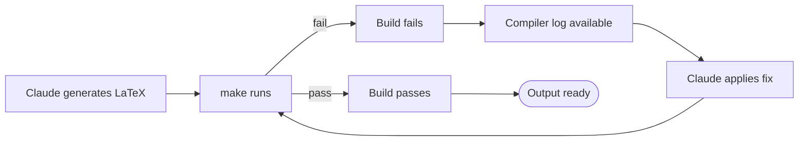

## The problem with one-shot AI workflows

If you give Claude a LaTeX generation task and take the output as final, you'll hit a predictable failure mode: the generated LaTeX often doesn't compile. Not always — but often enough that a one-shot workflow makes AI-assisted LaTeX generation unreliable as a production tool.

The naive response is to prompt better, to add more context, to request that Claude check its own output. These help at the margins. They don't eliminate the fundamental issue: LaTeX is an enormous, inconsistent, decades-old system with a complex package ecosystem and subtle interaction effects. Generating valid, idiomatic, compiling LaTeX from a natural-language description is genuinely difficult. The first attempt will sometimes be wrong.

The better response is to close the feedback loop.

## What the Claude Code CLI enables

Running Claude through the Claude Code CLI — rather than through a chat interface or a bare API call — changes what's possible. The CLI can call tools directly in the same session. For a LaTeX project, the relevant tool is `make`.

The workflow becomes:

1. Claude generates LaTeX
2. `make` runs
3. If the build fails, the compiler log is available in the session
4. Claude reads the log and applies a correction
5. `make` runs again

This loop runs without human intervention. Claude doesn't need someone to copy the error message and paste it back into a chat window. It calls `make`, reads the output, identifies the failure, and fixes it in the same session.

## The diagnostic insight: reliability vs. latency

The reframe is this: Claude's LaTeX generation is not unreliable. It's *iterative*. The first output is a strong draft that will likely need one or two corrections. Given a tight feedback loop, those corrections happen quickly, automatically, and at machine speed. Given no feedback loop, they become a manual debugging task that blocks progress and makes AI assistance feel more expensive than it's worth.

**What looked like a reliability problem turned out to be a latency problem.** The build errors were real. But the time between error and fix — in a tight CLI loop — was measured in seconds. The manual work was not high; the iteration count was.

The distinction matters because it changes what you optimize for. A reliability problem calls for better prompting, more context, more careful task specification. A latency problem calls for a faster feedback loop. Misdiagnosing the problem leads to the wrong solution.

## What this requires in practice

Running Claude through the CLI for LaTeX generation requires a project structure where `make` is callable without side effects, and where the compiler log is legible enough to act on. Both are true of a standard LaTeX project: `make` is idempotent, and LuaLaTeX produces structured error output that identifies the offending line.

It also requires that the task be well-specified enough for Claude to identify what a correct solution looks like. For LaTeX, this typically means: the document compiles cleanly, produces no overfull/underfull boxes above a specified threshold, and renders the intended structural element in the intended position. These are verifiable criteria, and Claude can check them.

The approach is not universally applicable. For tasks where correctness criteria are subjective or hard to automate, the feedback loop requires human input at each iteration. But for compile-or-fail tasks — LaTeX builds, type-checked code, test suites — the pattern transfers directly.

## The broader lesson

AI assistance compounds with tooling. A model that can only generate output is less capable than a model that can generate output, test it, and correct it in the same session. The difference is not the model's intrinsic capability — it's what the model has access to.

The LaTeX case is particularly clear because the feedback signal is so explicit: the document either compiles or it doesn't, and the error log says exactly where. But the pattern applies anywhere the success criterion is checkable at machine speed: API responses, database queries, shell scripts, test suites. Give the model the tool and the loop closes. Don't, and every failure becomes a manual debugging task.
