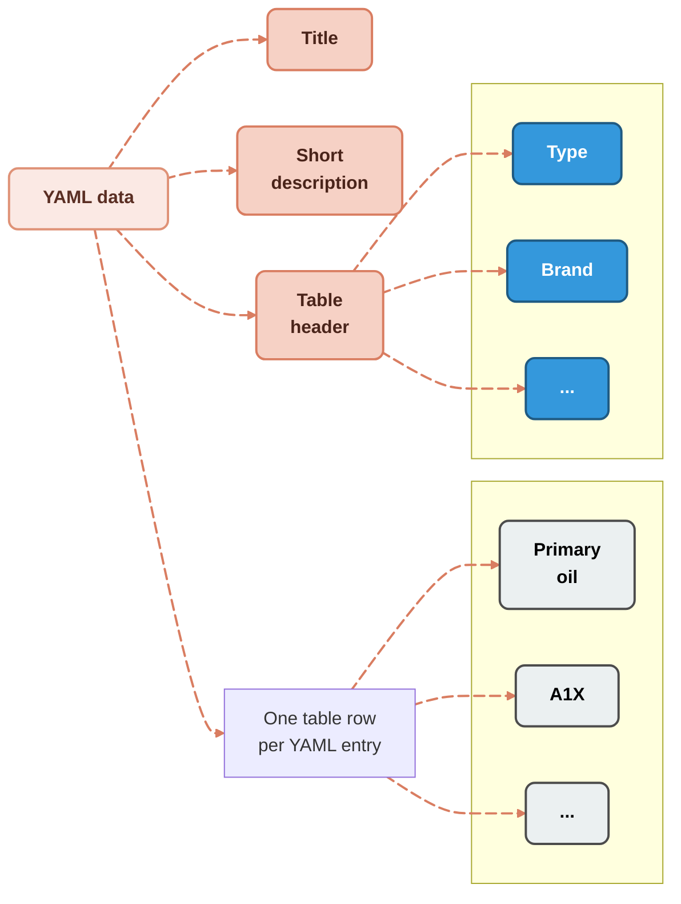

import ToolsList from '../../components/ToolsList.astro'
import ToolsTable from '../../components/ToolsTable.astro'
import ToolsTableFourCols from '../../components/ToolsTableFourCols.astro';
import yamlRaw from '../../data/oil-types.yaml?raw';

YAML is a lightweight, human-readable data format that simplifies configuration files and data exchange. Its clarity, flexibility, and efficiency make it increasingly popular among developers, often outperforming XML, Markdown, and some database solutions in modern applications.

You can also leverage YAML for structured documentation. By [storing content in plain files rather than a database](/blog/manage-content-in-files-not-databases), you keep your YAML source under full Git version control—making diffs readable and collaboration straightforward.

## Imaginary Scenario: Choosing the Right Engine Oil

Imagine you’re an engine oil manufacturer. Every day, customers ask you which oil is best for their engines. Some have one-cylinder engines, others have multi-cylinder setups. Price, viscosity, and compatibility all matter—but helping them make the right choice isn’t just about knowing your products. It’s about **how you store and present that information**.

At first, it might seem simple. You could create a quick reference table:

| Oil Type      | Brand | Use                  | Price | Viscosity Grade |
| ------------- | ----- | -------------------- | ----- | --------------- |
| Primary oil   | A1X   | One-cylinder engines | 15    | 0W-20           |
| Secondary oil | B2Z   | Two-cylinder engines | 17    | 5W-30           |

Looks neat, right? But as your product line grows, so does the complexity. Adding new oils, updating prices, or including extra metadata like cylinder count or warranty quickly turns into a maintenance nightmare.


### The XML temptation

Some teams start with **DITA reference XML**, thinking structure solves the problem:

<article class="prose">
  <blockquote>
    <details>
      <summary>DITA reference XML</summary>
```xml
<reference id="oil-types">
  <title>Oil types</title>
  <shortdesc>You will find below the recommended oil types.</shortdesc>
  <refbody>
    <section>
      <title>Primary oil</title>
      <ul>
        <li>Brand: A1X</li>
        <li>Use: One-cylinder engines</li>
        <li>Price: 15</li>
        <li>Viscosity grade: 0W-20</li>
      </ul>
    </section>
    <section>
      <title>Secondary oil</title>
      <ul>
        <li>Brand: B2Z</li>
        <li>Use: Two-cylinder engines</li>
        <li>Price: 17</li>
        <li>Viscosity grade: 5W-30</li>
      </ul>
    </section>
  </refbody>
</reference>
```
    </details>
  </blockquote>
</article>

It seems neat at first. Each oil has a dedicated section. But the moment prices change, new products are added, or you want to track extra attributes, the XML becomes cumbersome.

| Issue                                      | Description                                                                                |
| ------------------------------------------ | ------------------------------------------------------------------------------------------ |
| **Hardcoded Values**                       | Every data point is embedded in XML. Updates require manual changes, which is error-prone. |
| **Mixing Data and Presentation**           | `<ul>` and `<li>` combine field names and values, making automated processing difficult.   |
| **Poor Scalability**                       | Adding oils or metadata requires repeating XML structures.                                 |
| **Lack of Unique Identifiers**             | Sections are distinguished by titles only, risking breakage in workflows if names change.  |
| **Limited Reusability**                    | Copying sections across documents increases the risk of inconsistencies.                   |
| **Ambiguous Values**                       | `<li>Price: 15</li>` lacks units or currency.                                              |
| **No Validation for Consistent Structure** | Missing fields reduce data quality over time.                                              |

Hardcoded XML works for tiny lists—but it quickly becomes brittle as content grows.

---

### Markdown tables: simple but limiting

Markdown tables are easier to read:

```markdown
| Oil Type      | Brand | Use                  | Price | Viscosity Grade |
| ------------- | ----- | -------------------- | ----- | --------------- |
| Primary oil   | A1X   | One-cylinder engines | 15    | 0W-20           |
| Secondary oil | B2Z   | Two-cylinder engines | 17    | 5W-30           |
```

They render nicely and are human-friendly—but they carry hidden maintainability problems:

| Issue                          | Description                                                                         |
| ------------------------------ | ----------------------------------------------------------------------------------- |
| **Hardcoded Data**             | Manual updates are required for any change, which is error-prone.                   |
| **Lack of Semantic Structure** | Field names and values are not machine-readable, making automation difficult.       |
| **Poor Scalability**           | Adding new oils or metadata requires editing the table structure.                   |
| **No Unique Identifiers**      | Rows are identified only by “Oil Type,” making programmatic referencing unreliable. |
| **Ambiguities**                | Values like `Price: 15` lack units, which can cause misinterpretation.              |
| **Limited Reusability**        | Tables are hard to reuse across multiple documents, creating redundancy.            |

<article class="prose">
  <blockquote>
    <details>
      <summary> **The limits of Markdown tables**</summary>
Markdown was designed so that the *source* should be almost as human-readable as the *output*, whether rendered as HTML, PDF, or another format. But tables are an exception: they introduce several challenges.

Long lines quickly become a nightmare to read and edit, as text editors wrap them and make it hard to distinguish one row from another. The visual benefit of tables for readers—having columns neatly aligned on the same vertical lines—turns into a problem for authors.

```markdown
| Oil Type | Brand | Use  | Price | Viscosity Grade |
| - | - | - | - | - |
| Primary oil | A1X | One-cylinder engines | 15 | 0W-20 |
| Secondary oil | B2Z | Two-cylinder engines | 17 | 5W-30 |
```
**Markdown source table**

Some text editors can automatically realign table columns when you edit a cell, but this triggers a full table refactor. The result? A very noisy Git diff, where Git flags entire lines as changed even though only a few whitespace characters were adjusted. Conversely, if you avoid reformatting and keep column widths fixed, the table becomes hard for humans to parse and maintain.
</details>
  </blockquote>
</article>

Markdown is fine for static pages—but as your documentation grows, you need a better approach.

---

### Databases: flexible but costly

Databases offer structured storage and queries, but repeated queries can create performance issues:

| Issue                         | Description                                                      |
| ----------------------------- | ---------------------------------------------------------------- |
| **Performance Overhead**      | Each query consumes resources; repeated queries slow the system. |
| **Increased Network Traffic** | Multiple queries generate unnecessary load.                      |
| **Higher Costs**              | Cloud usage costs rise with frequent queries.                    |
| **Data Consistency Issues**   | Data changes between queries can produce inconsistent results.   |
| **Scalability Problems**      | Heavy query repetition strains the database.                     |
| **Redundant Computation**     | Expensive operations are repeated unnecessarily.                 |
| **Increased Latency**         | Users notice slower response times for each query.               |

Mitigation strategies like **caching, batching, materialized views, and optimized indexing** help—but they add complexity.

---

### YAML: readable, structured, and scalable

This is where **YAML** shines. It’s human-readable, hierarchical, and structured, making it ideal for documentation that needs to scale.

```yaml
id: oil-types
title: Oil types
shortdesc: Recommended oil types
properties:
  headers:
    type: Type
    value: Brand
    usage: Use
  rows:
    - type: Primary oil
      value: A1X
      usage: One-cylinder engines
    - type: Secondary oil
      value: B2Z
      usage: Two-cylinder engines
```

Rendered in Markdown, it produces a clean table:

| Oil type      | Oil brand | Use                  |
| ------------- | --------- | -------------------- |
| Primary oil   | A1X       | One-cylinder engines |
| Secondary oil | B2Z       | Two-cylinder engines |

### Benefits of YAML

| Feature                                      | Details                                                                              |
| -------------------------------------------- | ------------------------------------------------------------------------------------ |
| **Separation of Data and Presentation**      | Data can be reused in tables, lists, APIs, or UIs without touching formatting.       |
| **Structured and Predictable**               | Consistent schema reduces human error and simplifies automation.                     |
| **Easy to Extend**                           | Add new oils or metadata without redesigning the structure.                          |
| **Supports Automation**                      | Scripts or static site generators can consume YAML directly.                         |
| **Unique Identifiers**                       | Top-level `id` allows reliable referencing across documents.                         |
| **Improved Readability and Maintainability** | Keys are self-explanatory, easier to understand than inline XML or Markdown tables.  |
| **Scalable for Large Datasets**              | Works equally well for 5 or 500 rows; updates and validation remain straightforward. |

---

## YAML versatility: one source, multiple output formats

One of the key advantages of using structured data formats like YAML is **versatility**. The same dataset can be rendered in multiple ways—lists, tables, or even more complex layouts—without changing the source file.

<article class="prose">
  <blockquote>
    <details>
      <summary>Example: Display your data as a **simple list**</summary>
      <ToolsList />
    </details>
  </blockquote>
</article>

Or you can present it as a **styled two-column table on desktop (that automatically collapses into individual labeled rows inside cards on mobile)**:

<article class="prose">
  <blockquote>
    <details>
      <summary>Example: Display your data as a **styled two-column table**</summary>
      <ToolsTable />
    </details>
  </blockquote>
</article>

If you need a richer display, you can even switch to a **five-column table on desktop (that automatically stacks into a single-column card view on mobile)**—all without editing the source YAML.



**Processing Oil Data: From YAML Import to Dynamic HTML Table**

<article class="prose">
  <blockquote>
    <details>
      <summary>Example: Display your data as a **dynamic HTML table**</summary>
      <ToolsTableFourCols />
    </details>
  </blockquote>
</article>

This flexibility allows your documentation to adapt to different contexts—whether it’s a quick reference list for users, a detailed table for technical readers, or a complex component in a UI. By separating content from presentation, you can maintain a single source of truth while offering multiple ways to consume the data.

---

## Easier diffs and cleaner version control

One hidden drawback of Markdown tables is how poorly they behave in version control. If you remove or reorder a column, Git compares the file line by line—producing a messy, unreadable diff where every row appears changed.

<article class="prose">
  <blockquote>
    <details>
      <summary> Git diff</summary>
```diff
diff --git a/src/content/blog/scalable-maintainable-technical-docs-with-yaml.mdx b/src/content/blog/scalable-maintainable-technical-docs-with-yaml.mdx
index 61dadd8..0f70057 100644
--- a/src/content/blog/scalable-maintainable-technical-docs-with-yaml.mdx
+++ b/src/content/blog/scalable-maintainable-technical-docs-with-yaml.mdx
@@ -26,10 +26,10 @@ Imagine you’re an engine oil manufacturer. Every day, customers ask you which

 At first, it might seem simple. You could create a quick reference table:

-| Oil Type      | Brand | Use                  | Price | Viscosity Grade |
-| ------------- | ----- | -------------------- | ----- | --------------- |
-| Primary oil   | A1X   | One-cylinder engines | 15    | 0W-20           |
-| Secondary oil | B2Z   | Two-cylinder engines | 17    | 5W-30           |
+| Oil Type      | Use                  | Price | Viscosity Grade |
+|---------------|----------------------|-------|-----------------|
+| Primary oil   | One-cylinder engines | 15    | 0W-20           |
+| Secondary oil | Two-cylinder engines | 17    | 5W-30           |
```

    </details>
  </blockquote>
</article>

<article class="prose">
  <blockquote>
    <details>
      <summary> **Tip: Mitigate the issue with third-party tools**</summary>

	To partially improve the readability of table diffs, you can use tools like **GitHub Desktop** or **git diff --word-diff**, or define a custom diff driver in **.gitattributes**.

	These approaches make diffs more palatable to human readers, but under the hood, Git still considers entire lines as changed.

	

	GitHub Desktop and the command line highlight deletions in green, reflecting Git’s line-based diffing: it sees entire lines as modified, even if the change was only a deletion.
    </details>
  </blockquote>
</article>

By contrast, when tables are generated from a YAML source, all you need to do is remove the corresponding key-value pairs in the YAML file.

<article class="prose">
  <blockquote>
    <details>
      <summary> Git diff</summary>
```diff
diff --git a/src/data/oil-types.yaml b/src/data/oil-types.yaml
index 11eef57..87c04df 100644
--- a/src/data/oil-types.yaml
+++ b/src/data/oil-types.yaml
@@ -5,24 +5,20 @@ shortdesc: You will find below the recommended oil types.
 properties:
   headers:
     type: Type
-    name: Brand
     usage: Use
   row_schema:
     type: str
-    name: str
     price: float
     cylinders: int
     viscosity_grade: str
   rows:
     - type: Primary oil
-      name: A1X
       price: 15.0
       cylinders: 1
       viscosity_grade: 0W-20
     - type: Secondary oil
-      name: B2Z
       price: 17.0
       cylinders: 2
       viscosity_grade: 5W-30
```
    </details>
  </blockquote>
</article>

That change is perfectly legible in a Git diff.

An even better approach is to edit the **script that generates the table**: often just a few lines of code, producing a simple, human-readable change that’s easier to review, merge, and revert.

<article class="prose">
  <blockquote>
    <details>
      <summary> Git diff</summary>
```diff
diff --git a/src/components/table.astro b/src/components/table.astro
index c05af99..d594203 100644
--- a/src/components/table.astro
+++ b/src/components/table.astro
@@ -3,7 +3,6 @@ import data from "../data/oil-types.yaml";
 type OilRow = {
   type: string;
-  name: string;
   usage: string;
   viscosity_grade: string;
   price: number;
@@ -34,7 +33,6 @@ const wordsToNumber: Record<string, number> = Object.fromEntries(
     <thead>
       <tr>
         <th data-key="type" data-type="text">Type <span class="arrow">▲▼</span></th>
-        <th data-key="name" data-type="text">Brand <span class="arrow">▲▼</span></th>
         <th data-key="cylinders" data-type="cylinders">Cylinders <span class="arrow">▲▼</span></th>
         <th data-key="viscosity_grade" data-type="text">Viscosity grade <span class="arrow">▲▼</span></th>
         <th data-key="price" data-type="number">Price <span class="arrow">▲▼</span></th>
@@ -44,7 +42,6 @@ const wordsToNumber: Record<string, number> = Object.fromEntries(
       {rows.map((row) => (
         <tr>
           <td data-label="Type">{row.type}</td>
-          <td data-label="Brand">{row.name}</td>
           <td data-label="Cylinders">{numberToWords(row.cylinders)}-cylinder engines</td>
           <td data-label="Viscosity grade">{row.viscosity_grade}</td>
           <td data-label="Price">${row.price.toFixed(2)}</td>
```
    </details>
  </blockquote>
</article>

---

### Growing with your YAML

Our **oil-types.yaml** started as a simple table but evolved into a **single source of truth**:

* Reusable DITA reference topics
* OpenAPI JSON endpoints
* UI components for apps

By enforcing **strong typing**—numbers for prices, integers for cylinder count—data stays consistent. A **central schema** ensures DRY (Don’t Repeat Yourself) principles and enables automated validation.

---

## Why a structured source is better than embedded tables

Tables are a convenient way to present structured data in a familiar and scannable layout for users. However, generating user-facing tables directly from Markdown embedded in source files is not the most efficient approach.

A stronger alternative is to **extract data at build time from a structured source**, such as a YAML single source of truth. This approach allows you to **render the same information in multiple ways**, each tailored to the target medium and the specific needs of your audience—whether that’s a Markdown table in documentation, a JSON payload for an API, or a dynamic HTML component in a UI. See [how Astro exposes YAML data through a live API](/blog/experimental-astro-api-docs) for a working example of this distribution pattern.

By decoupling data from presentation, you gain maintainability, consistency, and flexibility as your content grows.

## Where YAML wins — and where it doesn't

The title of this post is deliberately bold, so it's worth scoping the claim honestly: YAML outperforms the alternatives *for a specific job* — structured reference data, modest in size, that builds into a site or feeds an API. Stretch it past that job and the comparison flips, because the alternatives weren't strawmen; each is strong where YAML is weak.

A **database** wins the moment data is large, queried in arbitrary ways, written concurrently by many users, or has to change between builds. The performance "issues" tabled above describe a database pressed into being a static lookup it never needed to be; used as a query engine over relational data, it's YAML that falls apart — there is no `JOIN` across flat files, and a 50,000-row YAML file is a parsing problem, not a source of truth. **Markdown** wins for prose: once content is paragraphs rather than fields, a schema is overhead and Markdown's readability is the whole point. **XML/DITA** still wins where you need *enforced* structure across a large team — schema validation, controlled vocabularies, and specialization are real capabilities that YAML conventions only approximate. And YAML has its own sharp edges a fair comparison shouldn't omit: indentation sensitivity, the `no`/`yes`/`on` boolean traps, and no native schema unless you bolt on JSON Schema or a validator.

The honest version of the claim is narrower and more useful than the headline: for small-to-medium structured reference data you want under Git and rendered many ways, YAML is the best-fit source of truth. That's a common case — common enough to earn a bold title — but it's a lane, not a universal verdict.

---

<blockquote>
Learn more about [getting the benefits of DITA XML without its complexity](https://redaction-technique.org/blog/strong-information-typing-without-xml-overhead). Modern docs-as-code workflows let technical writers structure information using lightweight, open tools—no XML headaches required.
</blockquote>  

## External sources

- [YAML language reference](https://yaml.org/)
- [Schema-based validation / strong typing](https://json-schema.org/)
- [OpenAPI: YAML as an API source of truth](https://www.openapis.org/)
