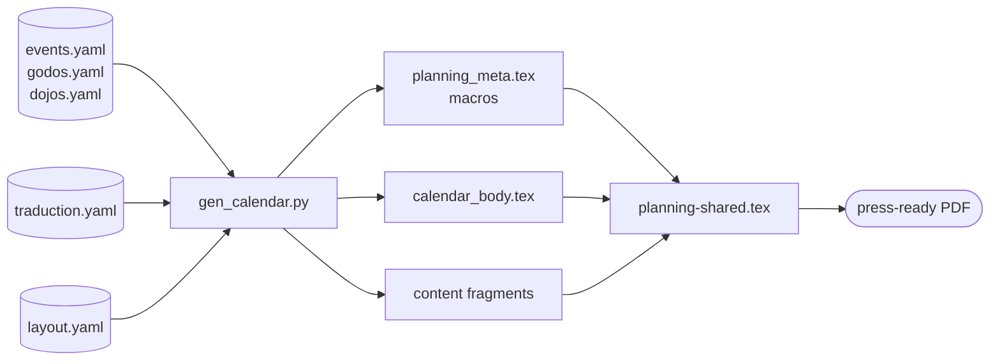

## The principle and the problem

Separation of concerns is a principle with a clear statement and a persistent application problem. Most discussions of it stay abstract — "keep your data separate from your presentation" — or are illustrated with examples that don't transfer to the domain at hand. MVC examples assume a web application. DocBook examples assume XML toolchains. Static site generator examples assume HTML output.

A print pipeline is different enough to need its own illustration. The constraints are different: CMYK colour management, PDF/X compliance, bleed geometry, typographic precision that screen rendering never demands. The concerns are the same — data, display strings, styling, generation logic, form — but where they live and how they stay separated requires concrete choices.

The planning poster makes those choices explicit across five layers. No layer does another layer's job. The separation is maintained as a design constraint, not a convention.

## The five layers

| Layer | Files | Single responsibility |
|---|---|---|
| **Data** | `events.yaml`, `godos.yaml`, `dojos.yaml` | All factual information: dates, prices, directors, venues, contacts. Pure YAML, no LaTeX, no display strings. |
| **Language** | `traduction.yaml` | All translatable display strings: month names, day abbreviations, section headings, price labels. Pure YAML, no facts. |
| **Typography** | `layout.yaml` | All typographic constants and colour palette: font sizes, leading, column widths, CMYK colour tuples. Pure YAML, no content. |
| **Generation** | `gen_calendar.py` | Reads all YAML layers, resolves remote keys, validates data, emits LaTeX macros and content fragments. Python only — no hardcoded facts or display strings. |
| **Form** | `planning-shared.tex` + per-language wrappers | Page structure and template. Contains no hardcoded data, text, colours, or measurements — all values come from macros. |

Each layer has a definition: not just "this is where X lives" but "this is the only thing that lives here, and X cannot live anywhere else."

## What the constraints prevent

The data constraint — data files contain no display strings, display-string files contain no facts — prevents a specific failure mode: facts and labels getting mixed into the same file and then drifting independently.

In the planning poster, a director's name is a fact: it appears identically in all three language editions, unchanged. A label like "led by" or "dirigé par" or "dirigido por" is a display string: it varies by language. If both lived in the same file, a change to the language layer could accidentally affect a fact, or a new language edition could require touching the data layer. The constraint prevents either.

The typography constraint — typographic values live in YAML, not in LaTeX — prevents a different failure mode: layout changes requiring archaeology through LaTeX source. If a font size is `10pt` in a `\setkomafont` call buried in a shared template, finding and changing it requires knowing where to look. If it's `pagetwobasefont: "10pt"` in `layout.yaml`, it's findable, changeable, and the change propagates to all three language editions on the next build.

The form constraint — `planning-shared.tex` contains no hardcoded values — is the strongest one. It means the template is stable. Once the page structure is designed, the template is never touched for a year change, a price update, a colour adjustment, or a new language edition. It calls macros; the macros change; the template is unchanged.

## How the layers connect

The generator (`gen_calendar.py`) is the only component that crosses layer boundaries. It reads all the YAML layers and writes all the LaTeX fragments. Everything else stays within its layer.

The generator is the interface between data and form. The form never sees raw YAML values. The data never contains LaTeX. The generator translates between them, and the macro file it produces is the contract: every value that the form needs is defined as a named macro before the template runs.

This is the [generator-as-interface pattern](https://redaction-technique.org/blog/generator-as-interface-yaml-to-latex-macros) at architecture scale. The IBAN in `events.yaml` becomes `\inscriptioniban`. The font size in `layout.yaml` becomes `\pagetwobasefont`. The sesshin colour in `layout.yaml` becomes `\definecolor{sesshin}{cmyk}{...}`. The form calls names; the generator provides values; neither needs to know how the other works.

## The books pipeline: a simpler illustration

The three-volume books pipeline illustrates the same principle at smaller scale. There is no separate language layer (the source is French), and typography lives in LaTeX rather than YAML. But the core separation holds: content in `.tex` source files, build configuration in the `Makefile`, output format as a render target.

The `make` target table is the books pipeline's version of the five-layer separation:

| Target | Output |
|---|---|
| `make tome1 / tome2 / tome3` | A5 PDF per volume |
| `make whole` | Single-volume A5 PDF |
| `make hirondelle-tome1` | Print-ready with crop marks |
| `make sample` | 4-page preview |
| `make es-tome1` | Spanish edition |
| `make md-tome1` | Markdown export |

Seven outputs from one corpus. The source doesn't change; the render target changes. This is the books pipeline's separation of content from presentation. It's less structured than the five-layer planning pipeline — the books pipeline doesn't enforce that typographic values live in a separate file — but the core principle is the same.

The planning poster's architecture is more developed because the document is more complex: annual recurrence, multiple languages, CMYK print requirements, non-technical editors. Those additional constraints forced the additional layers into existence.

## What stays stable, what changes

The five-layer separation determines the change surface for different actors:

- **Retreat organiser updating annual dates** → touches `events.yaml` only
- **Translator adding an English edition** → touches `traduction.yaml` only (assuming `en` entries exist)
- **Designer adjusting a font size** → touches `layout.yaml` only
- **Developer adding a new content fragment** → touches `gen_calendar.py` and adds a new LaTeX fragment; `planning-shared.tex` gets one new `\input` line
- **Layout redesign** → touches `planning-shared.tex` and the thin wrappers; data and language layers are untouched

In each case, the person making the change touches exactly the layer they need to touch and no others. They don't need to understand how the other layers work. The interface between layers — the named macros — stays stable across all of these changes.

This is what separation of concerns means in practice: not that the layers exist, but that changes to one layer don't propagate to the others. The boundary holds under change, not just under inspection.
