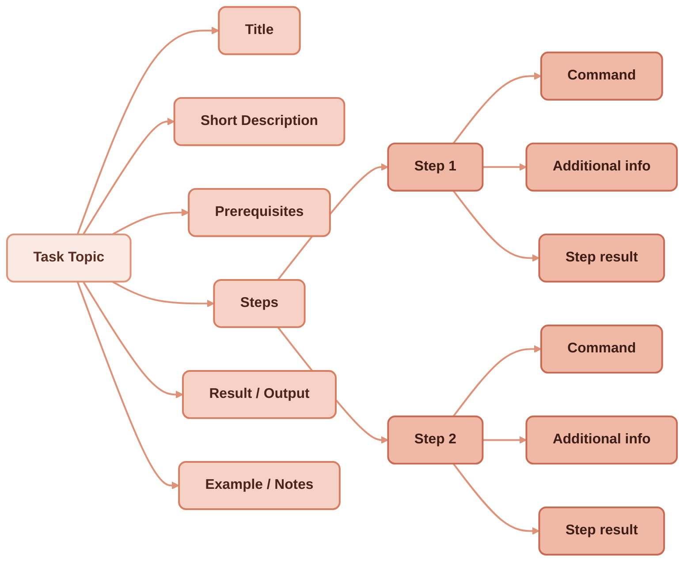

If you’ve spent years working daily with the DITA XML platform, you know that DITA is more than a markup language. It’s a way of thinking about information design. Writing tasks, concepts, and references in DITA teaches you to break down content into consistent building blocks, which makes documentation easier to navigate, maintain, and reuse. For background on how this blog migrated from DITA XML to Markdown while keeping those principles intact, see [From DITA XML to Markdown: lightweight information typing](/blog/dita-xml-to-markdown-lightweight-information-typing).


The good news is: you don’t need an XML editor or a DITA-OT pipeline to keep practicing those principles. With Markdown and modern docs-as-code workflows, you can implement DITA’s information typing philosophy in a lightweight, flexible way.

## The DITA mindset

DITA trains you to ask:

* **Is this a task?** → A sequence of steps that helps the reader achieve a goal.
* **Is this a concept?** → A piece of explanatory content that builds understanding.
* **Is this a reference?** → A structured lookup table or fact sheet.

Once you’ve internalized this mindset, it becomes natural to apply it even outside XML. Markdown pages, Git-based workflows, and static site generators all benefit when you keep these categories clear.

## DITA-like task pages

DITA task topics have strict rules: short context, prerequisites, ordered steps, results. The official [OASIS example](https://docs.oasis-open.org/dita/v1.2/os/spec/langref/step.html) is as follows:

---
<details>
  <summary><strong>DITA Task Example</strong></summary>
```xml
<task id="sqlj">
<title>Creating an SQLJ file</title>
<taskbody>
<context>Once you have set up SQLJ, you need to create a new SQLJ file.</context>
<steps>
<step>
 <cmd>Select <menucascade><uicontrol>File</uicontrol>
 <uicontrol>New</uicontrol></menucascade>.</cmd>
 <info>New files are created with default values based on a standard template.</info>
</step>
</steps>
</taskbody>
</task>
```
</details>
---



**Hierarchy of Elements in a DITA Task Topic (Steps, Commands, Information, and Metadata)**


You can recreate this in Markdown easily:

```markdown
# Creating an SQLJ file

Once you have set up SQLJ, you need to create a new SQLJ file.

1. Select **File** > **New**

   New files are created with default values based on a standard template.
```

This keeps the procedural content focused and predictable, just like in DITA.

## DITA-like concept pages

Concepts explain “what” and “why” rather than “how.” The official [OASIS example](https://docs.oasis-open.org/dita/v1.2/os/spec/langref/concept.html) is as follows:

```xml
<concept id="concept">
 <title>Introduction to Bird Calling</title>
 <shortdesc>If you wish to attract more birds to your Acme Bird Feeder,
learn the art of bird calling. Bird calling is an efficient way
to alert more birds to the presence of your bird feeder.</shortdesc>
 <conbody>
   <p>Bird calling requires learning:</p>
   <ul>
    <li>Popular and classical bird songs</li>
    <li>How to whistle like a bird</li>
   </ul>
 </conbody>
</concept>
```

In Markdown, you can still signal that you’re writing a concept by structuring around definition and explanation.

```markdown
# Introduction to Bird Calling

If you wish to attract more birds to your Acme Bird Feeder, learn the art of
bird calling. Bird calling is an efficient way to alert more birds to the
presence of your bird feeder.

Bird calling requires learning:

- Popular and classical bird songs
- How to whistle like a bird
```

The structure shows it’s an explanatory page, not a step-by-step guide.

## Why DITA information typing still matters in Markdown docs

DITA XML can feel heavy to implement in modern docs pipelines. But the discipline you develop with years of daily practice doesn’t vanish when you move to Markdown. Instead, it becomes a superpower.

By bringing DITA’s principles into lightweight environments, you:

* Keep content modular and reusable.
* Reduce ambiguity for readers.
* Simplify onboarding for new writers.
* Make your documentation friendlier to automation and AI-assisted tools.

There is one thing the move loses, and it's worth saying plainly rather than discovering it later. DITA didn't just *encourage* information typing — its schema *enforced* it. A task topic that lacked steps wouldn't validate; the structure was machine-checkable. Markdown enforces nothing: it will render a "task" with no steps, a "reference" with no table, a "concept" that's secretly a procedure, and never complain. So what you carry across is the discipline, not the guarantee. For a small team that internalised the typing mindset, that's usually enough. For a larger or changing team, the discipline drifts unless you rebuild a lighter version of the guardrail — a front-matter `type:` field, page templates per type, a linter or CI check that flags a task topic missing its steps. The mindset is portable; the enforcement has to be re-earned, cheaply, on the new stack.

DITA taught us to think in types, not just topics. Markdown lets us practice that thinking with less overhead, using tools that integrate smoothly into today’s development workflows. [YAML as a single source of truth](/blog/scalable-maintainable-technical-docs-with-yaml) is one powerful complement to this approach—bringing the same structured rigour to reference data.

If you’ve worked in DITA for years, don’t see that experience as “outdated.” It’s the foundation for building smarter, cleaner, and more maintainable docs-as-code content today.

<blockquote>
  You can also query the same YAML that powers build-time tables in Astro <strong>via a live API</strong>, with [interactive documentation](https://redaction-technique.org/blog/experimental-astro-api-docs) available on Swagger Docs.
</blockquote>

---

**Reference:** The [modular documentation architecture](https://docs.redaction-technique.org/en/formats/du-document-a-la-base-documentaire-modulaire/) section of the legacy site covers the foundational DITA concepts behind this approach in depth.
