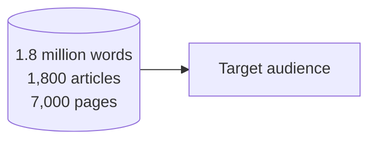
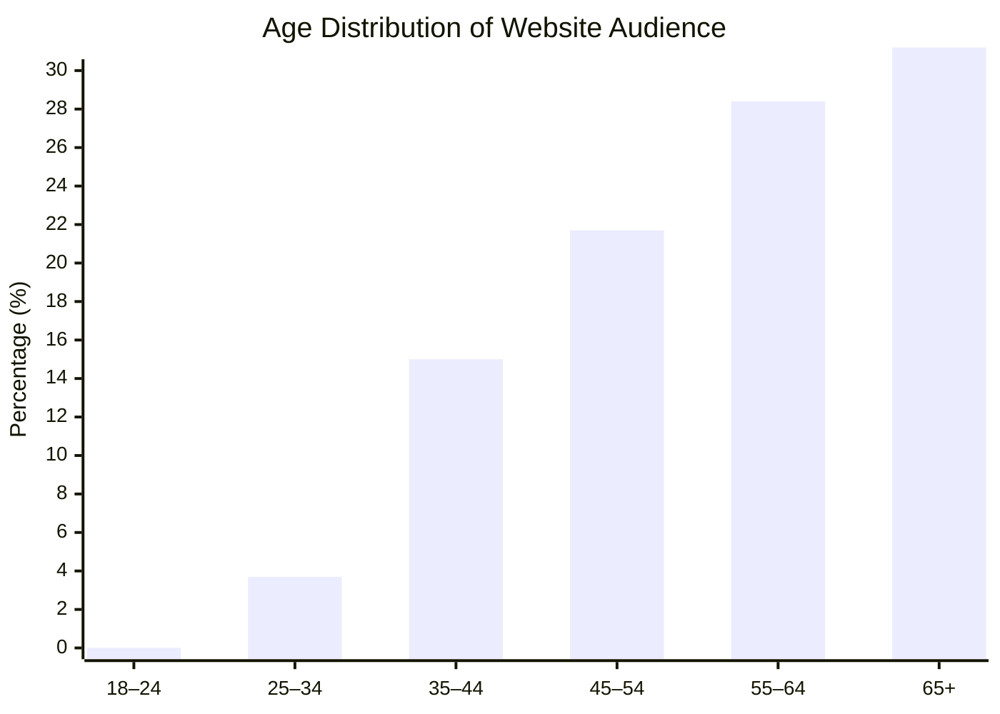
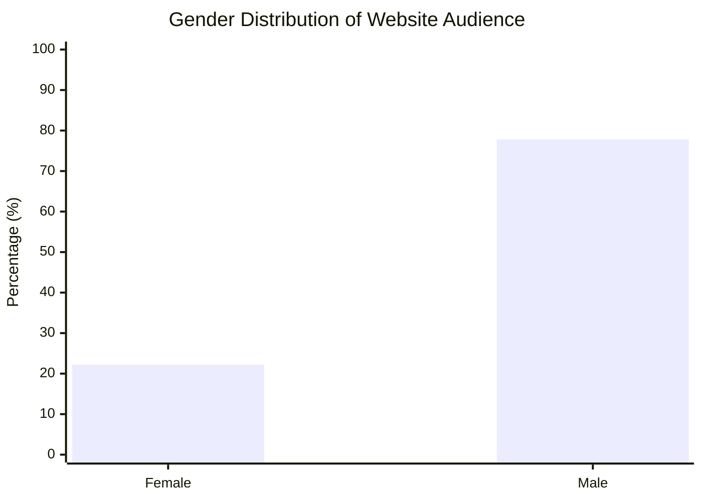
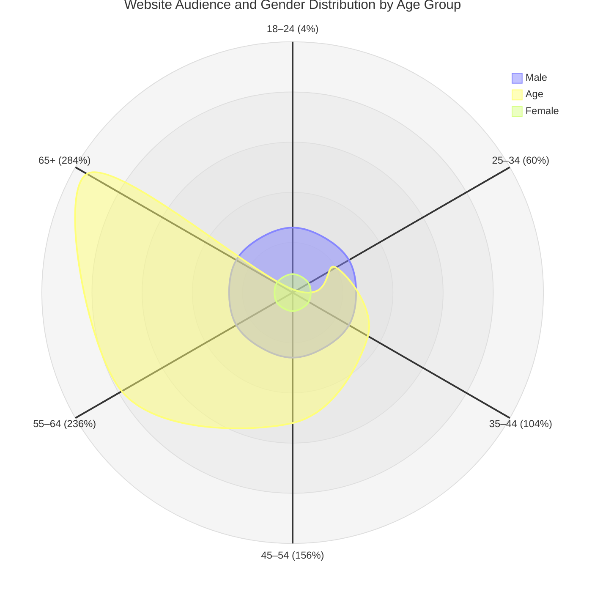
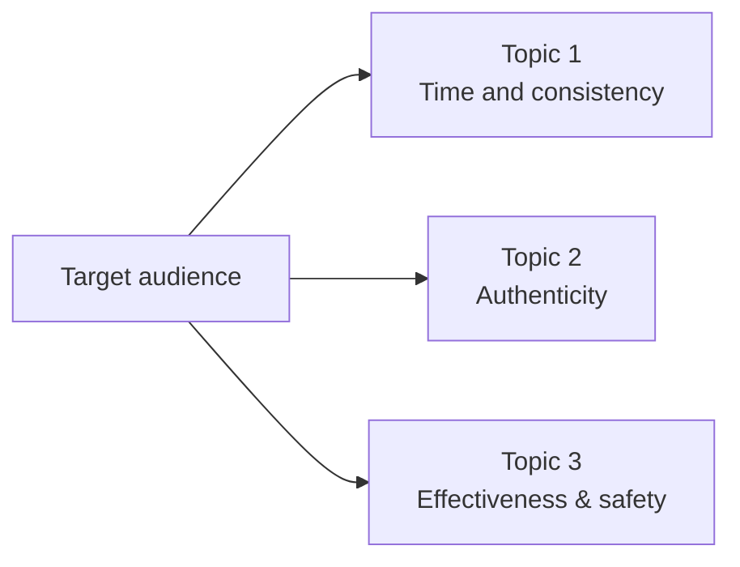
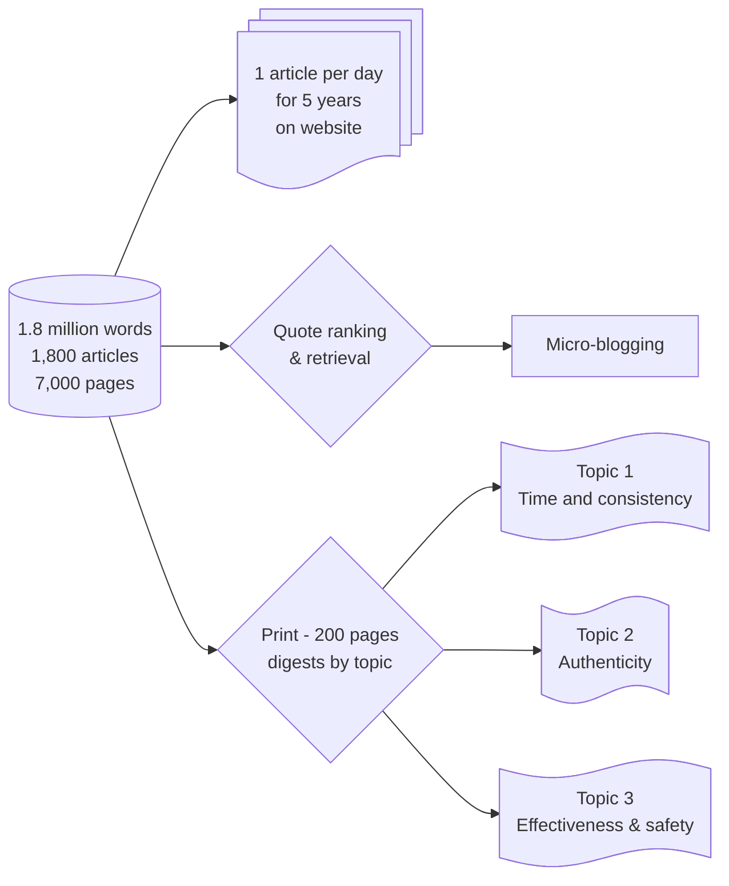

## From 7,000 Pages to Daily Insights

How can a non-profit turn 7,000 pages of articles—a vast sea of text—into content that is alive, readable, and meaningful every day?

This project extends a broader effort to **leverage a massive corpus—1,800 articles, 1.8 million words, 7,000 pages—into a discovery system** that makes exploration smarter, more meaningful, and deeply human.
Instead of letting a monumental archive gather digital dust, the goal is to let it *speak again*—one insight, one quote, one topic at a time. The technical workflow behind building this corpus is described in [converting Word files to SEO-optimized web pages with AI](/blog/turn-word-files-seo-optimized-web-pages-ai).

---

## Closing the audience gap with AI-curated content

Analytics from the non-profit’s website show a clear pattern: the audience is **predominantly aging and male**.

While loyal and deeply engaged, this profile highlights a **challenge for the organization’s future**—its reach remains limited, leaving out younger visitors and potential readers whose interests, language, and expectations differ.

To ensure greater inclusivity and enable a **renewal of generations**, the non-profit’s communication now aims to **better engage women and people aged 25 to 35**, fostering a more balanced and sustainable community over time.

To bridge this gap, the corpus of 1,800 articles is being used not only as a knowledge base but also as a **dialogue tool**.
By aligning the content’s depth with the audience’s real concerns, the project aims to make long-form wisdom resonate with new generations of readers.

As a first step, we asked an automated system to **scan public forums, discussion boards, and thematic websites**, gathering the **ten most common questions** this audience expresses about the non-profit’s field of activity.
These questions become **entry points**—bridges between lived curiosity and archival insight.

The next phase involves:
- Mapping each question to related articles and quotes in the corpus.
- Creating thematic digests or short reading paths that directly answer these questions.
- Measuring engagement shifts across age and gender segments to evaluate accessibility and impact.

*This radar chart shows the website audience across six age groups, alongside gender distribution. Each axis displays the* **Website Audience ratio** *relative to the general population and the corresponding* **male and female percentages**. *Values above 100% indicate that the website has proportionally more visitors than the general population in that age group.*

Through this approach, the archive evolves from a static collection into a **responsive, audience-aware ecosystem**—one that listens as much as it speaks.

## Exploring Audience Concerns Through Q/A Sessions

To better understand the interests and hesitations of different audience segments, we ran **Q/A sessions with ChatGPT**.
These sessions helped highlight real concerns and questions from readers, which can guide content curation and engagement strategies.

For example, when asking:

**“What are 25- to 35-year-olds most concerned about when it comes to mindfulness?”**

The responses revealed three main areas of concern:

1. **Time and consistency** — many feel too busy to practice regularly.
2. **Authenticity** — skepticism about mindfulness being over-commercialized or shallow.
3. **Effectiveness and safety** — worry that mindfulness might not work or could bring up difficult emotions.

The non-profit operates with a very limited budget and cannot afford to hire a consulting group or conduct formal market research. To make the best possible well-informed, data-driven decisions, it relies on ChatGPT as a **cost-effective tool** for exploring audience concerns, identifying trends, and guiding content strategy based on publicly available information.

Insights like these allow the non-profit to **tailor its content and digests**, ensuring the corpus of articles speaks directly to the needs and questions of younger audiences, while also informing social media and micro-blogging strategies.

## Curating Content and Quotes from Identified Topics

Once the system had identified key topics within the corpus, the next step was to **leverage those insights for discovery and engagement**.

For each topic, the workflow involved:

* **Querying the corpus** to surface the most relevant articles.
* **Curating these articles** to make them more visible on the website and to compile them into **themed digests** for deeper reading.
* **Extracting quotes** from these articles that resonate strongly with each topic, ready to be shared **daily on micro-blogging platforms**.

This process transforms the archive from a static repository into a **living, thematic ecosystem**, where content is both discoverable and shareable.
Readers can explore topics in depth, while daily quotes keep the conversation active and ongoing, bridging the gap between long-form articles and real-time engagement.

## From Files to Flow

All articles, thousands of them, form the foundation: **the corpus**.
From there, three parallel processes begin:

- **Web publishing** – one article per day, creating a rhythm of daily discovery.
- **Quote retrieval** – extracting and ranking key quotes by interest, to surface the most resonant insights.
- **Score checks and digests** – grouping content into **200-page thematic selections**, ready for print or deep reading.

Before any automated processing can help, the data must be **clean and consistent**: duplicates removed, formats standardized, and terminology aligned.
This ensures a **high-quality foundation** for metadata generation, indexing, and content enrichment.

---

## Scoring, Metadata, and Thematic Discovery

Metadata transforms the corpus into a **discoverable and analyzable knowledge base**.
Automated workflows assist in reading each article, identifying **topics, tags, and relevance scores**, and maintaining consistency across the entire collection. For a detailed look at how AI scores and tags individual Markdown articles, see [transforming meditation class transcripts into an AI-powered discovery service](/blog/transforming-meditation-classes-ai-discovery).

- **Topic categorization** – automatically labeling content by domain or focus.
- **Scoring and ranking** – assigning *interest scores* to highlight resonance and contextual depth.
- **Content enrichment** – adding summaries, cross-references, and definitions for practice-related terms.

A Python-based workflow evaluates every article, assigning **semantic scores** that reflect each topic’s presence and intensity.
The result is a **harmonized dataset**, where every page carries structured metadata—ready for discovery, filtering, or print curation.

A note on what these numbers are and aren't, because the rest of this post leans on them. An `interest_score` of 10 is a model's judgment, produced in the confident register models always use — it is not a measurement, and it has had no contact with an actual reader's interest. The same holds for the "ten most common questions" scanned from forums and the resonance ranking on quotes: useful heuristics for *where to look first*, not evidence of what the audience actually wants. They're a way to triage 7,000 pages no human could read in full, which is genuinely valuable — but triage, not truth. Treated as a starting point for human editorial judgment, they save enormous time. Treated as the judgment itself, they quietly hand the decision of what's worth surfacing from a teacher's life work to a scoring function. For a corpus where the point is fidelity to meaning, that's the line to hold: let the model sort the pile, let a person who knows the material decide what rises from it.

---

## From AI-scored digests to thematic discovery dimensions

Once scored and organized, the corpus is ready to be **recomposed** into focused digests—each a lens for re-seeing the same field of knowledge from new angles.

These digests reveal different dimensions of the corpus, guiding readers to explore content thoughtfully and meaningfully.

---

## From Quotes to Conversations

The best quotes don’t stay confined to pages—they move.
Through **micro-blogging**, daily publishing, and social curation, the project opens channels for dialogue: the corpus becomes a conversation.

Each quote, ranked by resonance and context, is shared not as static text but as a **living signal**—bridging the long-form archive and the fast-moving web.
Automated systems support this process by identifying patterns, key sentences, and recurring motifs, ensuring the most meaningful insights circulate outward.

---

## Toward a living, AI-powered knowledge archive

This is more than content recycling; it’s **content renewal**.
A living editorial process transforms static archives into **intelligent, evolving knowledge**.

Readers can:
- **Discover** articles by topic, relevance, or context.
- **Explore** cross-linked insights through search or guidance.
- **Read** beautifully designed print anthologies—curated 200-page digests generated from the same dataset.

The goal remains human: to **distill clarity**, **preserve depth**, and **foster presence**.
Automation serves as an instrument for attention, not distraction—a tool to bring the archive to life again.

---

What emerges when archives breathe again isn’t noise—it’s continuity.
A flow of attention, insight, and care that transforms reading into renewal.

## External sources

- [Working with a large text corpus](https://en.wikipedia.org/wiki/Text_corpus)
- [Curation as the editorial layer](https://en.wikipedia.org/wiki/Content_curation)
- [The LLM doing scoring and Q/A](https://platform.openai.com/docs)
