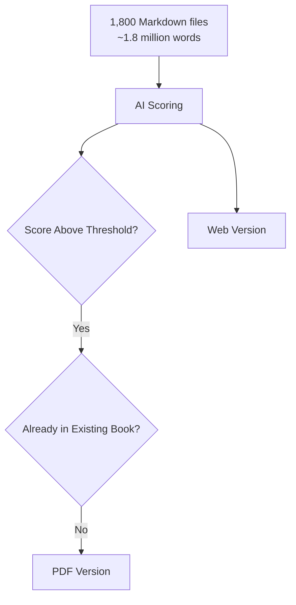

We’ll explore how to **leverage a corpus of 1,800 articles (~1.8 million words — comparable to *A Song of Ice and Fire*)** to build an **AI-driven discovery platform** that makes reading and exploration smarter and more meaningful.

---

## From Word 97 lecture transcripts to structured Markdown

These articles were originally transcripts of lectures recorded since the early 2000s. For years, they existed only as 37 separate Word files — some created in Word 97 — each identified only by its date. They were never published online, but gathered once a year into printed booklets, directly exported from Word, with minimal formatting and uneven layout.

Using a custom Python script and Pandoc, the collection was converted into individual Markdown files, one per lecture. An AI system then analyzed each text to create meaningful titles, add intermediate headings, and generate concise SEO descriptions — transforming a chronological archive into a structured, readable, and accessible body of work. The full workflow for converting Word files into SEO-optimized web pages is described in [turn Word files into SEO-optimized web pages with AI](/blog/turn-word-files-seo-optimized-web-pages-ai).

---

## Objective: building an AI-enabled knowledge platform from 1,800 articles

The goal is to transform a vast, heterogeneous collection of articles into a **structured, AI-enabled knowledge platform**. This system should:

* Organize the corpus systematically for human and machine readability.
* Enrich the content with **metadata, themes, and scores** for improved discoverability.
* Enable **fast search and thematic navigation** across thousands of articles.
* Provide an **interactive AI layer** that guides users, answers questions, and contextualizes the articles.


The ultimate aim is to make articles **more discoverable, approachable, and meaningful**, without losing the depth and subtlety of the original articles.

---

## Analysis and Cleaning

Before AI can meaningfully process the corpus, the data must be **clean and consistent**:

* **Deduplication:** Identify repeated articles and remove redundant content.
* **Formatting normalization:** Standardize headers, timestamps, and text encoding.
* **Quality checks:** Flag incomplete or corrupted articles for review.
* **Consistency enforcement:** Align style, terminology, and structure for AI readability.


This step ensures a **high-quality foundation**, which is critical for metadata generation, indexing, and AI interaction.

---

## Metadata and Tagging

Metadata transforms a large corpus into a **discoverable and analyzable knowledge base**:

* **SEO metadata:** Generate titles, descriptions, and keywords to support web-based exploration.
* **Theme categorization:** Automatically assign thematic labels such as meditation, karma, lineage, practice, and daily life.
* **Scoring and ranking:** Assign interest scores or relevance indicators based on user or expert priorities.
* **Content enrichment:** Insert cross-references, summaries, or abbreviations for practice-related terms to improve clarity and searchability.

**AI can assist here** by reading each article and suggesting thematic tags or highlights while maintaining consistency across the corpus.

---

## Indexing and Search

A robust indexing system enables **fast, accurate retrieval**:

* **Full-text search:** Index content to allow keyword-based queries.
* **Thematic navigation:** Enable filtering by topics, scores, or temporal context.
* **Semantic search:** Use embeddings or vector search to capture meaning beyond exact keywords, letting users find related concepts even if phrased differently.
* **Cross-linking:** Automatically connect related articles to create a **web of knowledge** that mirrors article interconnections.

This ensures that users can **explore the corpus efficiently**, whether seeking a specific lesson or discovering related concepts.

---

## Interactive AI Layer

The AI layer transforms static content into an **intelligent, interactive discovery platform**:

* **Personalized recommendations:** Suggest articles or themes based on user interests or previous interactions.
* **Contextual explanations:** Summarize complex articles or provide background on terminology and lineage.
* **Conversational exploration:** Allow users to ask questions, clarify concepts, or explore articles dynamically.
* **Content insights:** Generate summaries, highlight patterns, or identify frequently referenced masters or concepts.

This layer **bridges the gap between static text and dynamic understanding**, making the articles more accessible to practitioners and researchers alike.

---

## Deploying the AI discovery platform for web and API access

Finally, the platform should be **easily accessible**:

* **Web interface:** User-friendly dashboards for browsing, filtering, and exploring articles.
* **API access:** Allow other applications or AI systems to query the corpus programmatically.
* **Scalability:** Ensure smooth operation even as new articles or supplementary materials are added.
* **Preservation of integrity:** Maintain original text alongside enriched metadata to honor the authenticity of the articles.

---

## Automated Thematic Scoring of Markdown Files with GPT

We can use a Python script to automate the evaluation and enrichment of Markdown files by assigning a **semantic score** related to any theme, for instance, *daily life*

It works in three stages:

1. **AI-based Evaluation**
   Each **.md** file is read and sent to an OpenAI model. The model assigns a raw score from **1 to 10**, estimating how strongly the text relates to the target theme.
   
*Distribution of articles across combined scores, shown as a Gaussian curve*


2. **Gaussian Normalization**
   To ensure a smooth and realistic distribution of results, the raw scores are rebalanced using a **Gaussian (normal) curve**, spreading the final values evenly across the 1–10 range. This avoids clusters of identical scores and makes large-scale data more insightful.

   This step is worth a second look, because it's a presentation choice dressed as a correction. There's no law that thematic relevance is normally distributed — for a corpus built around a few core themes, it may genuinely be bimodal (strongly on-topic or not) or heavily skewed. Forcing those raw scores onto a bell curve spreads them out and makes ranking cleaner, but it also manufactures gradations that may not exist in the underlying material and flattens real clusters that do. It's a reasonable move *if* the goal is "rank everything relative to everything else for browsing"; it's the wrong move if the goal is "find the genuinely on-theme articles," where the raw clustering was the signal, not noise to be smoothed away. Normalize for presentation, but keep the raw score too — the shape of the raw distribution is telling you something about the corpus that the normalized one hides.


    **AI-Generated Metadata Example**

    *The metadata for this article was generated from an AI-assisted analysis of hundreds of articles. By identifying recurring themes of awareness, balance, and mindful attention, the AI distilled key insights into how stillness can nurture clarity and calm in everyday life.*

    ```yaml
    title: The Power of Stillness – Deepening Awareness Through Mindful Sitting
    sourceLanguage: en
    description: Explore how mindful sitting cultivates presence, clarity, and balance in everyday life through sustained attention and inner calm.
    lastUpdated: 2009-10-31T11:00:00Z
    wordCount: 1586
    keywords:
    - Mindfulness
    - Meditation
    - Awareness
    - Focus
    - Presence
    - Inner Calm
    - Clarity
    - Balance
    - Attention
    - Well-being
    interest_score: 10
    daily_life: 8
    mindful_posture: 8
    intentional_action: 7
    continuity_of_practice: 10
    ```

3. **Frontmatter Update**
   The script then writes the final score back into each file’s **YAML frontmatter** as a new or updated field.

The result: a harmonized dataset of Markdown texts, each carrying a consistent, AI-generated metric of thematic relevance — ready for visualization, filtering, or content analytics.

---

## From Markdown to LaTeX: Automating the Creation of Various Anthologies

No one could realistically read 1.8 million words of articles in print — even a skilled reader would need **about 120 hours**, or roughly **two full weeks of reading**, to get through them all. Since the full corpus of 1,800 articles is already available online, the real challenge is curation: selecting and assembling themed anthologies that present readers with beautifully printed excerpts tailored to their interests.



Yet another Python script can automate the **conversion and assembly of Markdown articles into a single, beautifully formatted LaTeX book** — ready to compile with *XeLaTeX* or *LuaLaTeX* on Overleaf.

It performs the entire workflow in a few elegant steps:

1. **Markdown Cleaning and Conversion**
   Given a Markdown file, the script:

   * extracts its title from the YAML frontmatter,
   * removes HTML markup and Markdown links,
   * converts the text into **LaTeX** using *Pandoc*.

   Each **.md** file becomes a clean, self-contained **.tex** chapter with a proper <strong>&bsol;chapter&#123;Title&#125;</strong> heading.


*The pages below are an excerpt from the automatically generated LaTeX PDF of an IA-curated list of articles. They illustrate the output of an AI pipeline designed to analyze large collections of mindfulness writings, extract thematic patterns, and produce well-structured, print-ready documents. The layout demonstrates how semantic analysis and automated typesetting can work together to transform raw text data into readable, publication-quality material.*

<iframe
  src="/excerpt.pdf"
  width="100%"
  height="600"
  style={{ border: "none" }}
/>

2. **Chapter Management**
   Every generated chapter file is recorded in a hidden list (**.chapters_list.txt**).
   This ensures that chapters are automatically tracked and appear in the correct order when the book is rebuilt.

3. **Book Assembly**
   The script then reconstructs a master file, **main.tex**, combining:

   * a custom-themed LaTeX preamble (Garamond typography, A5 format, glossary of practice-related terms),
   * **\input{}** references for each chapter,
   * and a closing section with a glossary of key words.

   The result is a complete, typeset-ready LaTeX book automatically regenerated each time a new article is added.

This script bridges editorial workflow and craftsmanship: it transforms hundreds of Markdown articles into a unified anthology.

---

## Outcome: a scalable AI-powered publishing platform for deep reading

The result is a **scalable AI-powered publishing platform** where users can:

* Discover articles by **theme, author, or relevance score**.
* Explore the corpus through **search, thematic navigation, and AI-assisted reading**.
* Access **curated printed anthologies**, automatically typeset in LaTeX and designed for **book publication**.
* Experience **layered insights** without losing the **depth, coherence, and tone** of the original writings.

Readers are offered a way to **rediscover meaningful content** through both **digital exploration and carefully crafted print editions**—bridging technology and editorial quality. To see how this same corpus becomes a living daily knowledge flow, read [transforming a corpus of 7,000 pages into living knowledge](/blog/transforming-corpus-ai-living-knowledge).

## External sources

- [Pandoc: Word->Markdown->LaTeX conversion](https://pandoc.org/)
- [Embedding-based discovery](https://en.wikipedia.org/wiki/Semantic_search)
- [Vector search beyond keywords](https://en.wikipedia.org/wiki/Word_embedding)
