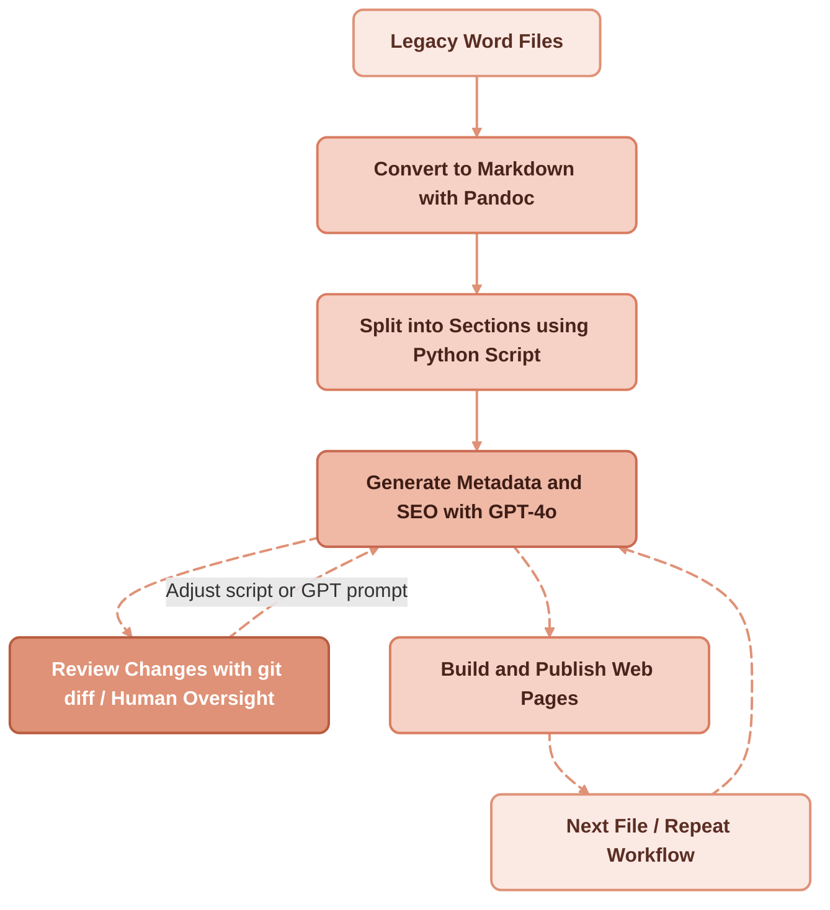

## Preserving a legacy of conferences

A non-profit organization holds a unique archive: decades of conference transcripts stored in **Microsoft Word 97/2000 files**.

They were rich in content but poor in structure—long documents without proper titles, headings, or metadata. Making them available online, searchable, and SEO-friendly required a modern, scalable solution.

This post explains how we achieved that transformation with a mix of **Markdown, Pandoc, and GPT-powered automation**, at a total cost of about **$30**.

## Structuring legacy content

The first challenge was to add structure to the old Word files:

- **Applied properly styled titles** to the previously unstructured transcripts.
- **Converted Word to Markdown** using [Pandoc](https://pandoc.org), ensuring a clean, flexible format for web publication.

## Splitting content into sections

Instead of publishing massive files, we needed **one Markdown file per conference section**.
ChatGPT generated a custom **Python script** that split Markdown files into multiple smaller files based on titles.

This step alone transformed chaotic transcripts into readable, accessible documents.

## Enriching metadata with GPT-4o

To optimize for browsing and search, we asked GPT-4o to analyze each section and:

- **Extract keywords** for thematic browsing and SEO.
- **Generate frontmatter** for Astro, including:
  - **title** (Google title)
  - **description** (Google SEO description)
- **Assign dates** by parsing the human-readable dates embedded in the original file titles.
- **Suggest intermediary titles** to improve readability and flow.

## Iterative workflow

Automation at scale required care. The process looked like this:

1. **Iteratively ran the script** on all Markdown files in a directory.
2. **Reviewed changes** with **git diff** to verify metadata and titles.
3. **Stopped the script and tuned the GPT prompt** whenever adjustments were needed.
4. Once results were solid, **reran the process on all 1,500 files** in batch mode.

This balance of **AI automation with human oversight** ensured quality and consistency. A similar iterative loop—using Git diffs to selectively accept or reject AI-generated changes—is at the heart of [AI-based translation of legacy Markdown documentation](/blog/ai-translation-legacy-technical-docs).

## The scale of the project

- **2,500 web pages generated**
- **1.8 million words processed**
- **6 million GPT-4 tokens consumed**, the energy equivalent of a **300 km car journey**
- **About $30 total cost** for GPT processing
- **Automatic daily publication until 2032**
- **Immediate access** to the full archive for authorized members via password
- **Classification by date and theme**
- **Keyword-based search** for easy navigation

## A living digital archive

Thanks to this workflow, the non-profit now has a **self-sustaining publication pipeline** built on [plain Markdown files stored under Git](/blog/manage-content-in-files-not-databases):

- A steady stream of daily conference publications extending into the next decade
- A browsable, SEO-friendly archive that will continue to attract readers and researchers
- A digital preservation strategy that respects tradition while embracing modern tools

This project shows how **AI-assisted automation** can help even resource-limited organizations bring their cultural heritage online.

## Lessons learned converting Word archives to web pages with AI

* **Cost control is possible**: By running scripts iteratively, reviewing diffs, and only scaling once satisfied, we kept the entire project under **\$30**.
* **Human-in-the-loop matters**: Automated metadata generation is powerful, but occasional prompt tuning and git-based review were essential for accuracy.
* **User expertise is crucial**: The person guiding the AI must have some knowledge of what they want it to do. For example, explicitly asking GPT to use the [**Python BeautifulSoup library**](https://pypi.org/project/beautifulsoup4/) ensured proper handling of embedded HTML fragments within Markdown content.
* **Environmental awareness is key**: Processing 6 million tokens had a measurable carbon footprint. Future work should explore greener infrastructure and ways to minimize energy use.
* **AI is a collaborator, not a replacement**: The best results came from combining GPT automation with careful human validation.

## Next steps for the digital archive and AI content pipeline

The next steps include:

- Adding **cross-linking** between related conferences.
- Exploring **multilingual summaries** for international reach.
- **Populating pages with AI-indexed images** to create a richer browsing experience.
- Evaluating **sustainability practices** to further minimize the environmental impact of large-scale AI processing.

While the Python script querying GPT-4o was carefully **tuned to minimize hallucinations**, there is no way to guarantee complete accuracy. To ensure quality, the outputs are being **slowly reviewed and compared** by members of the non-profit. Future improvements could include leveraging **LangChain** or similar frameworks to have a **local AI process the large volume of text**, split it into manageable chunks, and **automatically compare input and output** to flag discrepancies, further reducing manual verification effort.

With a bit of Python, a lot of Markdown, and the power of AI, what began as static Word files has become a **dynamic web archive—accessible, searchable, and preserved for the future.**

The conferences will start being published daily on the non-profit’s website to maximize Google reach while avoiding overwhelming the site with too much content at once. This approach ensures steady visibility, improved SEO, and gradual access for readers.

## External sources

- [Pandoc: legacy Word -> Markdown](https://pandoc.org/)
- [BeautifulSoup for embedded HTML handling](https://www.crummy.com/software/BeautifulSoup/)
- [GPT-4o for metadata and SEO generation](https://platform.openai.com/docs)
