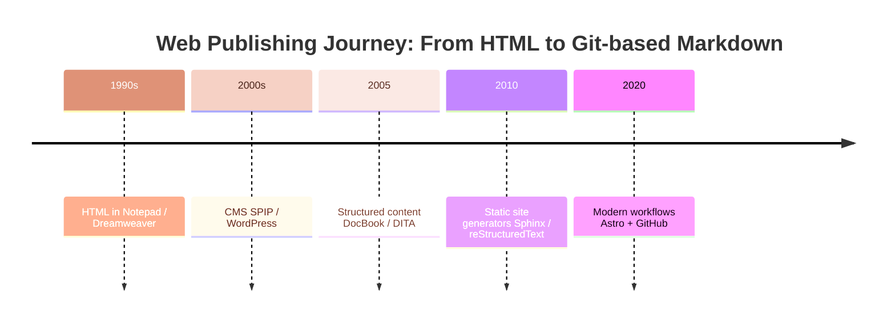

My journey with the web spans over two decades, reflecting the evolution of publishing technologies and workflows. Here’s a technical look back at the tools, formats, and lessons learned.

## Early days: HTML in Notepad and generators

Back in the late 20th century, my company tasked me with creating their first website. I learned HTML from scratch and wrote pages directly in **Windows Notepad**. Before moving to CMS-based approaches, I experimented with **HTML generators such as Dreamweaver**. While these tools allowed for visual editing, I quickly found them **clumsy and difficult to use for tracking changes**, especially when multiple versions or edits were involved.

The site was eventually published in a **frames-based version**, a common approach at the time despite usability limitations. Knowing the nitty-gritty details of **HTML and HTTP requests** laid the foundation for making informed technical decisions later — including using modern AI-assisted tools wisely to maximize performance and efficiency.

## Enter CMS: SPIP and WordPress

For personal projects, I used **[SPIP](https://www.spip.net/en_rubrique25.html)** to manage blog posts. Later, I built multiple sites — both personal and for non-profits — using **WordPress**. Its flexibility, plugin ecosystem, and ease of collaboration made it ideal for small teams or organizations with limited technical resources.

## Structured content: DocBook and DITA

In professional settings, I shifted from general web pages to **structured content**. I first published **DocBook** content, then moved to **DITA**, using the **DITA-OT toolkit** to generate web output. Later, I used the **[Oxygen XML Editor](https://www.oxygenxml.com/)** to manage and publish structured content. Structured authoring separates content, presentation, and metadata, enabling more consistent, maintainable documentation. The DITA principles that survive this transition are explored in [DITA XML to Markdown: lightweight information typing](/blog/dita-xml-to-markdown-lightweight-information-typing).

## Static site generators and lightweight markup languages

At another company, I published documentation websites using **Python Sphinx**, generating static HTML from **reStructuredText** sources.

Currently, at **Unity**, I use **Markdown**, edited either in **Visual Studio Code** or **Emacs**, which is then rendered into HTML pages. Moving away from CMSes, using **version control systems such as Subversion and later Git** was critical for managing changes, enabling collaboration, and maintaining a reliable history of content. This workflow emphasizes simplicity, version control, and maintainability while giving full control over the final output.

## Modern web workflows: Beyond CMS

When advising a non-profit considering a move from **Drupal** to a **Symfony-based custom site**, I recommended downgrading to **WordPress** to maximize collaboration. Later, a developer suggested a **headless CMS** approach with **Astro + WordPress**. I proposed going further: abandoning the CMS entirely and relying on **Markdown + GitHub + Astro**, a lightweight, modern, and fully controllable workflow. The case for [managing content in plain files rather than databases](/blog/manage-content-in-files-not-databases) lays out exactly why this choice pays off long-term.

## Lessons learned from two decades of web publishing evolution

Looking back, my web journey mirrors broader trends in web publishing:

1. **From raw HTML and generators to CMS** – simplifying publishing for non-technical users.
2. **From unstructured to structured content** – improving maintainability and scalability.
3. **From dynamic to static sites** – emphasizing performance, version control, and simplicity.
4. **From CMS dependence to Git-based workflows** – empowering collaboration without unnecessary complexity.
5. **Understanding low-level details matters** – knowing HTML, HTTP, and site mechanics allows better decisions, smarter use of AI tools, and maximum performance.
6. **Version control is critical** – using Subversion and Git ensures content history, safe collaboration, and structured workflows outside CMSes.

## Takeaways for solo content developers and small teams

* **Master the basics:** Understanding HTML, HTTP, and static vs. dynamic workflows helps you make better technical choices.
* **Keep it simple:** Markdown + Git-based workflows often outperform complex CMS setups for small to medium projects.
* **Use AI wisely:** Automation and AI tools can accelerate content creation and optimization, but knowing underlying mechanics ensures they enhance performance rather than introduce inefficiencies.
* **Focus on collaboration:** Choose tools and workflows that allow multiple contributors to work effectively without bottlenecks.
* **Plan for maintainability:** Structured content, static site generators, and version-controlled workflows all contribute to long-term sustainability.

## External sources

- [The static-site end state](https://en.wikipedia.org/wiki/Static_site_generator)
- [Sphinx/reStructuredText era of the journey](https://www.sphinx-doc.org/)
- [Git as the workflow backbone](https://git-scm.com/)
