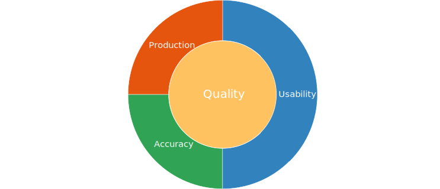

Assessing the quality of technical documentation is a challenging task. Often, quality is treated as an abstract concept or a matter of opinion. But with the right framework, it becomes possible to measure and track it using well-chosen metrics. Radar charts, in particular, offer a visual and intuitive way to evaluate and compare multiple quality criteria over time.

## The three pillars of documentation quality

Documentation quality typically revolves around three primary areas:

* **Production**: Are the documentation processes efficient, scalable, and well-integrated into development workflows?
* **Usability**: How easily can users find, understand, and apply the information they need?
* **Accuracy**: Does the documentation reflect the product truthfully and completely?

These areas can be broken down further into eight measurable aspects:

1. Modularity
2. Change Tracking
3. Information Typing
4. Minimalism
5. Style Guide Compliance
6. Audience Segmentation
7. Technical Accuracy
8. Functional Scope

## Visualizing quality with radar charts

Radar charts allow teams to visualize how well documentation performs across these aspects. Each axis of the chart represents one dimension of quality. Over time, these charts help track improvements, identify regressions, and make informed trade-offs.

Sometimes, improving one aspect may reduce another. For instance, boosting functional scope might complicate minimalism. These trade-offs are normal. What matters is maintaining a chart shape that reflects the organization's priorities and user needs.

## interpreting the shapes

Not all radar charts should be symmetrical. A well-balanced chart doesn't necessarily mean "perfect" documentation. Instead, the chart should reflect strategic decisions:

* Should we invest more in technical accuracy or audience targeting?
* Are we willing to sacrifice completeness for simplicity?

We might find that documentation for Product A (written by developers) looks vastly different from that of Product B (written by technical writers), especially if communication between both roles is limited. These patterns can reveal deeper process or collaboration issues.

## the role of the Technical Writer

At the core of technical documentation are four key actors:

* The **product**
* The **manufacturer** or Subject Matter Expert (SME)
* The **customer**
* The **writer**

The writer bridges the gap between the product’s complexity and the customer’s needs. This involves interviewing SMEs, testing the product, and curating information into structured, user-friendly formats.

## Drilling down: Sub-charts and specialized metrics

Each axis of the main radar chart can be further expanded into its own detailed chart. For example:

* A spider chart can track how well the 11 minimalist principles from Van der Meij are applied.
* A separate chart can focus on audience segmentation based on the number of personas addressed.

This layered approach allows teams to conduct both high-level assessments and deep dives.

## Deep dive: Key aspects explained

### Modularity

Modular documentation breaks complex information into smaller, self-contained units. Especially in a "docs-as-code" approach, modularity reduces merge conflicts and promotes reuse across products and platforms.

### Change tracking

Change tracking ensures documentation evolves alongside the product. Integrated version control systems like Git help maintain historical context and accountability.

### Information typing

Just like variables in programming, chunks of documentation can be typed: procedures, references, conceptual overviews, etc. Structuring documentation based on information type improves navigation and user comprehension.

### Minimalism

Users don't read documentation for fun—they want quick, actionable answers. Minimalism reduces cognitive load by removing unnecessary content.

Van der Meij's research suggests minimalist documentation:

* Is 1/3 shorter
* Takes 1/3 less time to use
* Is 1/3 more effective

Measuring minimalism might include tracking adherence to these outcomes or evaluating how well the 11 minimalist principles are implemented.

### Style guide compliance

A consistent writing style boosts clarity and professionalism. Tools like Acrolinx can enforce style rules and offer real-time feedback, turning style into a measurable dimension.

### Audience segmentation

Technical documentation must address multiple user profiles. Personas—fictional user archetypes—help ensure content is tailored to different user needs, tasks, and contexts. Metrics might include the number of personas addressed or the volume of conditional content.

### Functional scope

How much of the product's functionality is actually documented? This metric helps identify coverage gaps. It should also reflect real usage: not all features are equally important to all users.

### Technical accuracy

Even the most user-friendly documentation fails if it’s wrong. But accuracy alone isn't enough—it must coexist with usability and findability. Accuracy should be validated through SME reviews and tracked systematically.

## Making trade-offs

Not all quality metrics can be maximized at once. For example, achieving both high minimalism and high functional scope might be unrealistic. Instead, documentation teams should define which areas are most critical and allocate resources accordingly.

By comparing radar charts over time or between teams, product lines, or documentation types, organizations can make informed strategic decisions.

## Challenges and considerations

Two central challenges remain:

1. What metrics are we able to track?
2. How do we assess the current state accurately?

Remember that documentation metrics, unlike those in physics, are inherently imperfect. They provide guidance, not absolute truths. Still, they are vastly more useful than relying solely on gut feeling or the vague notion of "good enough."

## Conclusion

Technical documentation quality is a multifaceted concept. With structured metrics and visual tools like radar charts, we can move from intuition to informed decision-making. While quality will always be partly subjective, the goal is to make it as objective and actionable as possible.

And even a rough, metrics-based approach is a major improvement over the status quo in many organizations—where quality is still assessed by little more than rule of thumb.
