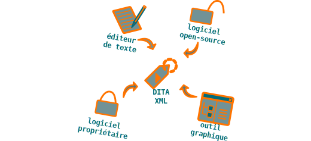

La documentation technique, c'est comme une ampoule : une ampoule basse
consommation demande un investissement plus important en début de cycle
de vie, mais a rapidement un coût plus faible.

Comme une ampoule basse consommation, un processus de rédaction
technique industriel diminue les coûts. Il réduit également le *time to
market*. À coût initial légèrement supérieur ou égal, il améliore
également la qualité.

Coût moindre

-   moins de volume à créer
-   suppression des mises à jour répétitives
-   moins de volume à traduire

*Time to market* réduit

-   réutilisation maximale du contenu
-   risque zéro de perte de données

Qualité améliorée

-   briques d'information facilement optimisables
    -   cohérence parfaite du contenu d'entreprise

Une documentation industrielle repose sur :

-   un format documentaire modulaire,
-   un format de rédaction structurée,
-   une chaîne de production et de publication documentaire fiable.

Si la chaîne de création et de publication choisie repose sur des
logiciels *open-source*, le coût de mise en place et d'apprentissage
peut même être compensé par l'économie sur les licences de logiciels.
En tout état de cause, de trop nombreuses sociétés de haute technologie
ont industrialisé leurs processus métier, mais laissent en friche la
création, la gestion et la publication de leur contenu d'entreprise.
Les coûts cachés (rédaction par des ingénieurs et non par un rédacteur
technique compétent, mauvaise exploitation du capital immatériel,
diminution de la satisfaction client, augmentation des coûts de support,
etc.) peuvent être considérables. Pourtant, les solutions et les
compétences existent.

## De la rédaction à la communication technique

Le but de la est de transformer les prospects en clients satisfaits. Le
rédacteur technique fournit au marché l'information dont il a besoin
pour sélectionner, évaluer et utiliser une solution de haute
technologie. Au sein de l'entreprise, il est l'interface entre les
services R&D et marketing. À l'extérieur, il crée le dialogue entre
l'entreprise et ses différents publics.

La est souvent réduite à la rédaction technique. La rédaction technique
est destinée à fournir la documentation des produits, et intervient en
aval de la vente. La communication technique intervient dès l'amont du
processus de vente et accompagne le produit tout au long de son cycle de
vie. Destinée autant au grand public, aux journalistes et aux prospects
qu'aux clients, elle dépasse et englobe la rédaction technique,
destinée uniquement aux utilisateurs.

La communication technique a pour but de montrer l'adéquation d'un
produit aux besoins de sa cible. Elle recourt pour cela à différents
supports, plus ou moins adaptés au niveau d'expertise de son public et
à son statut par rapport à l'entreprise (grand public, journalistes,
prospects, clients...). Le rédacteur technique doit adapter son message
à chaque public. Utilisant toutes les ressources de la communication
(rédaction, illustrations, films, animations...) il prend constamment en
compte la dimension marketing. Pour augmenter les ventes, tout support
de communication doit être un outil marketing.

Mais peut-on être à la fois logique et créatif ? C'est nécessaire dans
les domaines de la composition musicale, de l'architecture et du
développement informatique. C'est également le cas pour un rédacteur
technique.

Ceci nécessite :

-   une étude de l'adéquation entre les besoins du public et les moyens
    de l'entreprise,
-   une bonne capacité de création et de rédaction,
-   une gestion de projet rigoureuse,
-   un processus industriel de production et de valorisation du contenu.

Ce blog présente quelques exemples de supports de communication
technique, leur intérêt marketing, leur adéquation au public et les
modalités de leur valorisation.

Valoriser un contenu signifie :

-   produire un contenu de qualité adapté à sa cible,
-   conserver tout le contenu existant, dans ses différentes versions,
-   réutiliser ou recycler à bon escient le contenu existant.

## Les trois niveaux de la documentation technique

Si l'on compare la documentation technique à un jardin, on peut la
classifier selon les niveaux suivants :

Friche

- Pas d'utilisation de processus documentaire.
- Création de la documentation par des équipes non dédiées.
- Utilisation de formats non adaptés ou utilisation incohérente de
  formats adaptés.

Jardin à l'anglaise

- Utilisation de processus documentaires fiables.
- Création de la documentation par des équipes dédiées.
- Utilisation cohérente de formats adaptés, mais non structurés.

Jardin à la française

- Utilisation de processus documentaires fiables.
- Création de la documentation par des équipes dédiées.
- Utilisation cohérente de formats structurés.

Les formats non adaptés à la rédaction technique sont par exemple les
formats de traitement de texte, qui ne dissocient pas suffisamment la
mise en page du contenu.

Les formats adaptés sont les formats de type FrameMaker, qui dissocient
(relativement) la mise en page du contenu, mais ne sont pas sémantiques.

Les formats structurés sont les formats sémantiques de type DocBook ou
DITA XML.

Le stade du jardin à l'anglaise est déjà très satisfaisant et garantit
qu'une information de qualité est fournie à l'utilisateur. Celui du
jardin à la française permet en outre à l'entreprise de mieux maîtriser
son contenu et de réduire les coûts de production.

À elle seule, la présence d'une des trois composantes (processus,
équipe dédiée et format adapté) ne peut garantir un résultat
satisfaisant. Confiez par exemple des outils permettant de générer du
contenu au format DITA XML à des collaborateurs dont la n'est pas le
métier ou sans mettre en place de processus de gestion du cycle de vie
de la documentation technique, et vous obtiendrez des résultats
décevants. Seule la présence conjointe de ces trois éléments fournira un
résultat optimal.

## Principe de simplicité KISS

Le principe KISS (Keep it simple stupid), n'est pas spécifique à la rédaction technique. Il s'agit
d'un principe général d'ingénierie, qui postule que tout objet
matériel ou virtuel construit par l'homme est plus fiable et plus
facile à maintenir et à faire évoluer si sa complexité est
volontairement réduite. C'est le principe mis en exergue par antiphrase
par les Shadocks : *Pourquoi faire simple quand on peut faire
compliqué* ?

C'est ce principe qui a prévalu à la conception des montres *Swatch*,
dont le cahier des charges stipulait qu'elles devaient embarquer deux
fois moins de pièces que leurs consœurs. Résultat : des montres moins
chères, plus fiables et disponibles en versions sans cesse renouvelées.

Ce qui a spectaculairement fonctionné pour des montres peut être
appliqué avec le même succès à la documentation technique. Quel que soit
le format utilisé, le rédacteur technique peut tout aussi bien
construire un document élégamment architecturé, qu'une usine à gaz.
Avec DITA XML, il lui suffit de ne pas centraliser les *conref* ou de
les imbriquer exagérément. Sous FrameMaker, c'est encore plus simple,
peu de garde-fous étant posés : la multiplication des styles et des
*overrides* peut rapidement rendre ingérable n'importe quel document.

De même, dans la formulation de ses phrases, le rédacteur technique doit
toujours avoir le principe KISS à l'esprit. Il est facile de construire
des phrases alambiquées qui dénotent plus une mécompréhension du sujet
qu'un raffinement de l'écriture. Construire une phrase simple
demande un effort de compréhension de son sujet. La rédaction du contenu
et son appréhension par son destinataire deviennent alors aisées. C'est
un aspect fondamental du métier de rédacteur technique. Le rédacteur
technique apporte ainsi une véritable valeur ajoutée au produit qu'il
documente.

## Formats et outils

Lorsqu'une entreprise décide d'industrialiser la rédaction technique,
elle se pose d'emblée la question des outils. Or, plutôt que les
outils, ce sont les formats sous-jacents qui sont le point essentiel.

La plupart des éditeurs, afin de disposer d'un marché captif obligé de
régulièrement payer des mises à jour de leurs produits, ont en effet
développé des formats propriétaires que seuls leurs logiciels sont à
même de modifier. Un fichier MS Word ou un fichier FrameMaker ne peuvent
ainsi être modifiés que *via* les outils éponymes. Choisir un tel format
risque donc de limiter les choix ultérieurs de l'entreprise et de se
révéler coûteux : il faut une licence par utilisateur, qu'il soit
rédacteur technique, contributeur occasionnel ou traducteur.

Si l'on réfléchit en termes de formats, en revanche, il est possible de
mettre en place des solutions évolutives. Un format ouvert tel que
[OpenDocument](http://fr.wikipedia.org/wiki/OpenDocument) ou DITA
XML, par exemple (seul le second étant un format industriel de rédaction
technique), n'est pas lié à un outil donné. Il est donc possible de le
modifier et de le manipuler à l'aide de différents logiciels. Les
formats structurés de type DocBook et DITA XML liés à un schéma XSD
normalisée peuvent notamment être facilement gérés, de la création à la
publication, à l'aide de toute une panoplie d'outils, de l'éditeur de
texte libre à la suite logicielle propriétaire et graphique.
